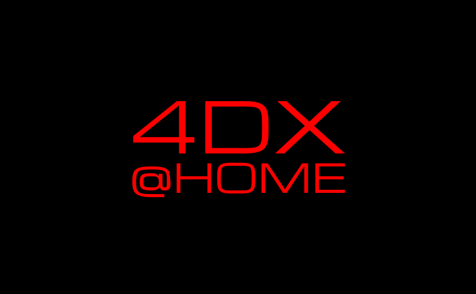

# 4DX@HOME - あなたの世界で「最高の映像」が「最強の体験」へ。

## 🌐 Live Demo
**フロントエンドアプリ**: https://kz-2504.onrender.com/ (フロントのみ稼働)

  

## 製品概要
### 背景(製品開発のきっかけ、課題等）
スマートフォンでの動画視聴が主流になる中、小さい画面では得にくい「没入感」が課題となっています。映画館の4DXのような体感型エンターテインメントは大掛かりな機材が必要で、自宅での視聴体験は画一的なものにとどまっていました。

### 製品説明（具体的な製品の説明）
4DX@HOMEは、スマートフォンでの動画視聴に「触覚」「香り」などの物理フィードバックを加えることで、「観る」から「体感する」へと視聴体験を革新するシステムです。WebSocketによるリアルタイム通信で動画と物理デバイスを高精度に同期させ、手のひらサイズの4DXシアターを実現します。

**主要機能：**
- **AI動画解析** (GPT-4o-mini Vision): 任意のMP4動画を自動解析し、4DX効果のタイムラインJSONを生成
- **リアルタイム同期再生**: 動画再生と同期してデバイスを制御
- **多様な効果対応**: 振動（3モード）、光（3モード）、風（2モード）、水（瞬間噴射）、色（RGB）

**システム構成：**
- **動画解析エンジン** (Python + OpenCV + GPT-4o-mini): 動画からタイムラインJSON自動生成
- **Webアプリ** (React 18.3.1 + TypeScript 5.9.3): 動画再生とセッション管理、WebSocketリアルタイム通信
- **サーバー** (FastAPI 0.104.1 + WebSocket): RESTful API、セッション管理、リアルタイム同期処理
- **デバイスハブ** (Raspberry Pi 4): TCP/WebSocket通信、タイムライン管理、デバイス制御
- **アクチュエーター** (Arduino Uno x3-4台): 振動・光・風・水・色の5種類物理効果制御

### 特長

#### 1. AI自動タイムライン生成
GPT-4o-mini Visionによる映像解析で、任意のMP4動画から4DX効果タイムラインを自動生成。爆発、衝突、咆哮などのシーンを自動検出し、振動・光・風・水・色の効果を適切なタイミングで発動させるJSONを生成します。

#### 2. ミリ秒単位のリアルタイム同期
WebSocketを用いたリアルタイム通信により、動画再生と物理デバイスを±50ms以内の高精度で同期。TCP/WebSocket経由でRaspberry Piに送信されたタイムスタンプに基づき、並列処理でアクチュエーターを制御します。

#### 3. 手軽なペアリング
セッションコード（6桁）を入力するだけで、WebアプリとRaspberry Piデバイスハブが自動ペアリング。FastAPI経由でデバイス登録が完了し、複雑な設定は不要で、誰でも簡単に体験を開始できます。

#### 4. コンパクト設計
150mm × 100mm × 80mmの手のひらサイズデバイスで4DXシアター体験を再現。5V/12V電源系統、IP54相当の防水機能を備え、場所を取らず、自室で手軽に没入型エンターテインメントを楽しめます。

### 解決出来ること
- スマホの小さい画面では得にくい「没入感」を物理フィードバックで補完
- **どんな動画でも4DX化可能** - AIが自動解析するため、専用コンテンツ不要
- コンテンツごとに最適化された体験を提供し、作品の価値を最大化
- 大掛かりな機材が置けない環境でも、Bluetoothイヤホンのような手軽さで導入可能

### 今後の展望
- **AI精度向上**: より高精度な映像解析で、細かな演出まで検出
- **多体験対応**: 温度制御（ペルチェ素子）、香り拡散（多種アロマカートリッジ）、触覚拡張（エアバッグ）の追加
- **技術的改善**: リアルタイムOS導入による確定的レスポンス、予測制御による遅延補償
- **安全性強化**: 冗長化システム、IoTセンサー統合、デバイス認証機能
- **クラウド化**: スケーラブルクラウドデプロイ、オンライン動画解析サービス提供

### 注力したこと（こだわり等）
* **AI動画解析の効率化**: GPT-4o-mini Visionのバッチ処理（15枚同時解析）により、API呼び出しを1/15に削減し、コストと処理時間を大幅に短縮
* **インテリジェント効果判定**: 爆発・衝突・咆哮などの瞬間を正確に検出し、最小継続時間制御によりチラつきを防止
* **リアルタイム同期精度**: WebSocketによる双方向通信、ThreadPoolExecutorを用いた並列処理、継続的なタイムスタンプ送信により、動画とデバイスの同期ズレを最小化
* **ユーザビリティ**: React Router DOMによるSPA設計、レスポンシブUI（モバイル・デスクトップ両対応）、セッションコードによる簡単ペアリングで、技術に詳しくないユーザーでも迷わず使える体験を実現

## 📋 技術仕様書

詳細な技術仕様については、以下の専門仕様書をご参照ください：

- **[📱 フロントエンド仕様書](./docs/frontend-specification.md)** - React + TypeScript Webアプリケーション
- **[🔧 バックエンド仕様書](./docs/backend-specification.md)** - FastAPI WebサーバーとAPI
- **[⚙️ ハードウェア仕様書](./docs/hardware-specification.md)** - Raspberry Pi + Arduino 物理制御システム
- **[🎬 AI動画解析システム](./tools/sync-generator/README.md)** - GPT-4o-mini Visionによる4DXタイムライン自動生成
- **[📖 総合仕様書](./docs/README.md)** - システム全体概要とセットアップガイド

## 開発技術
### 活用した技術
#### API・データ
* **OpenAI GPT-4o-mini (Vision API)** - マルチモーダルAIによる映像解析とシーン理解
* **WebSocket (WSS)** - リアルタイム双方向通信
* **JSON形式の同期データ** - 動画タイムスタンプとアクチュエーター制御パラメータのマッピング

#### フレームワーク・ライブラリ・モジュール
* **AI・動画処理**: OpenCV (opencv-python), requests (OpenAI API通信)
* **バックエンド**: FastAPI 0.104.1, Uvicorn 0.24.0, websockets 11.0.3, Pydantic 2.5.0, aiofiles 25.1.0
* **フロントエンド**: React 18.3.1, TypeScript 5.9.3, Vite 7.1.9, React Router DOM 6.30.1, Tailwind CSS 4.1.14
* **デバイス**: Python 3.9+ (Raspberry Pi), pyserial 3.5, paho-mqtt-client, RPi.GPIO 0.7.1, Arduino (C++)

#### デバイス
* **Raspberry Pi 4 Model B (4GB RAM)** - デバイスハブとして、TCP/WebSocket通信、タイムライン管理、Arduino制御を担当
* **Arduino Uno R3 (3-4台)** - シリアル通信/MQTT経由で各アクチュエーターを個別制御
* **振動モーター** - MQTT経由制御、映像に合わせた触覚フィードバック（3モード: 弱い振動、強い衝撃、ドキドキ）
* **RGB LED + 高輝度LED** - PWM制御による光の演出（3モード: ストロボ、閃光、照明）+ 色表現（RGB 256段階）
* **DCファン** - 風生成装置（2モード: 瞬間風、持続風）
* **小型ポンプ** - 水噴射装置（瞬間噴射、安全制限付き）
* **香り拡散器 (予定)** - ペルチェ素子加熱式、シーンに応じた香りの演出

#### 対応効果
* **振動（vibration）**: 弱い振動（long）、強い衝撃（strong）、ドキドキ（heartbeat） - MQTT制御
* **光（flash）**: ストロボ（strobe）、閃光（burst）、照明（steady） - シリアル制御、PWM調光
* **風（wind）**: 一瞬の風（burst）、長い風（long） - シリアル制御、DCファン可変速
* **水（water）**: 水しぶき（burst）※shot型一度きり発動 - シリアル制御、安全制限付き
* **色（color）**: 赤（red）、緑（green）、青（blue） - シリアル制御、RGB各色256段階

### 独自技術
#### ハッカソンで開発した独自機能・技術
* **AI動画解析エンジン**: GPT-4o-mini Visionのバッチ処理（15枚同時）による効率的な映像解析と、ルールベース判定による高精度な効果タイムライン生成
* **最小継続時間制御システム**: 効果のチラつき防止のため、各効果に最小継続時間を設定し、安定した体験を提供
* **セッションコード方式ペアリング**: FastAPI + Pydanticによる6桁コード管理、自動デバイス登録システム
* **高精度リアルタイム同期**: WebSocket双方向通信 + ThreadPoolExecutor並列処理による±50ms以内同期
* **ハイブリッド通信アーキテクチャ**: WebSocket（同期制御）+ シリアル通信（Arduino制御）+ MQTT（振動制御）の統合システム
* **タイムライン管理システム**: 継続効果・瞬間効果を区別し、最適なタイミングでアクチュエーター制御を実行