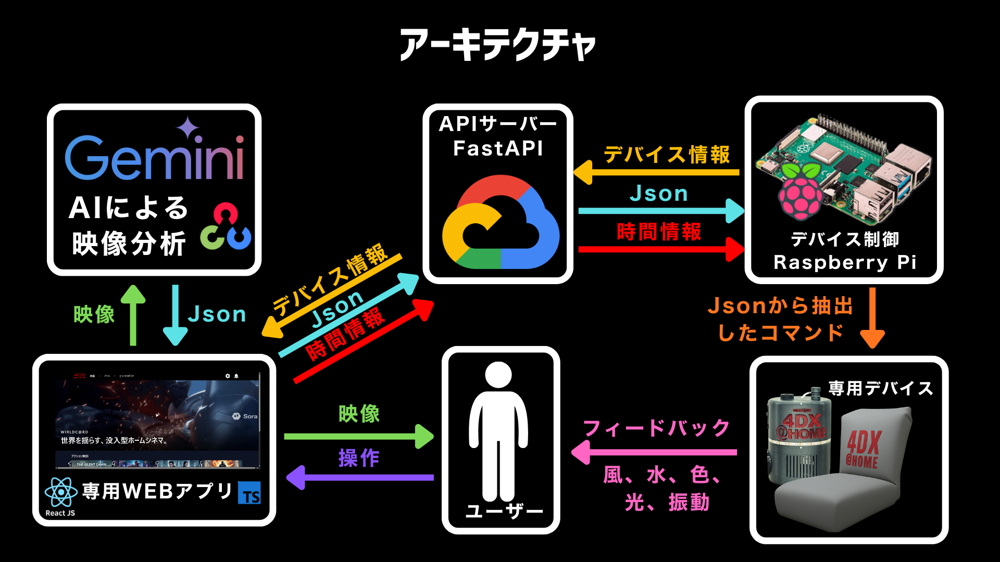

# ※Award Day時点での内容です

# 4DX@HOME - あなたのおうちで「最高の映像」が「最強の体験」へ。

  
  
  **クリックして動画を再生**
  
  

  ---

  ### クイックリンク
  
  
  

  ---

  
  
  
  )
  )
  
  ## 🎉 JPHACKS 2025 受賞結果 🎉
  ### **🏆 Hack Day (金沢会場)**
  **🥇 Best Hackday Award**  
  **🎯 Award Day Finalist**

  ---
  ### **🏆 Award Day**
  **🏅 審査委員特別賞**    **💡 Innovator認定** 
  **🎁 企業賞3社受賞**  
  ULSコンサルティング株式会社賞  
  株式会社PLAY賞  
  株式会社東海理化賞

---

## 目次

- [Live Demo](#-live-demo)
- [製品概要](#製品概要)
  - [背景（製品開発のきっかけ・課題など）](#背景製品開発のきっかけ課題など)
  - [製品説明](#製品説明具体的な製品の説明)
  - [システム構成](#システム構成)
  - [特長](#特長)
  - [解決出来ること](#解決出来ること)
  - [今後の展望](#今後の展望)
  - [注力したこと](#注力したことこだわり等)
- [技術仕様書](#技術仕様書)
- [ギャラリー](#-ギャラリー)
- [開発技術](#開発技術)
  - [活用した技術](#活用した技術)
  - [独自技術](#独自技術)
- [参考文献](#参考文献)

---

## Live Demo
**Webアプリ**: https://kz-2504.onrender.com

## 製品概要

### 背景（製品開発のきっかけ・課題など）

本プロジェクトは、「**没入体験の格差**」を解消することを目的としています。

#### **解決すべき3つの格差**

1. **身体的格差**  
全世界の5人〜6人に1人が視覚、聴覚、歩行のいずれかに重い困難を抱えており、既存の4DXシアターでは利用制限が存在します。

2. **地域の格差**  
地方では映画館の閉館が進行しています。例えば石川県は人口あたりの映画館数が日本一ですが、すべて金沢市近辺に集中しており、珠洲市から金沢市までは片道2時間半を要します。

3. **趣味・コンテンツの格差**  
既存の特殊シアターは「アクション」や「人気IPコンテンツ」など特定ジャンルに偏りがちであり、上映期間も限られています。

#### **市場動向と需要**

**モバイル視聴の定着と慣れ**  
スマートフォンでの動画視聴は、今や生活の一部となり、特に10〜20代では**1日6時間以上視聴**する人も少なくありません[1](#ref1)。こうした習慣の中で、場所や時間を問わず気軽に楽しめる一方、**「慣れ」によって体験そのものへの満足度が薄れている**傾向も見られます。

**"感じる体験"への関心の高まり**  
映画館の4DX上映が、**通常より50％以上高い料金でも支持されている**ように[2](#ref2)、人々は映像を"見る"だけでなく"体感する"価値に強い関心を示しています。つまり、**視聴そのものをより深く味わいたい**という潜在的な欲求が存在しています。

**家庭内エンタメの進化**  
世界の没入型エンターテインメント市場は**年率20％を超える勢い**で拡大しており[3](#ref3)、家庭での高品質な体験への投資も進んでいます。ドルビー社の調査では、**77％の人がより良い音や映像のために追加料金を払う**と回答しており[4](#ref4)、体験価値への支出意欲が高いことが分かります。

こうした「**慣れによる物足りなさ**」「**より深く感じたい**」という気持ちと、「**没入体験の格差**」の両方を解決するため、「**4DX@HOME**」は生まれました。

### 製品説明（具体的な製品の説明）

> **映像体験 × Tech：お家で4DX**

**4DX@HOME**は、従来の「観る」体験を「体感する」次元へと押し上げるシステムです。WebアプリケーションをベースにしたシンプルなUIで、動画視聴に「振動」「水しぶき」「風」「光」「色彩」の5種類の物理フィードバックを融合させ、リビングを本格的な**4DXシアター**に変貌させます。
Google Cloud Run上のFastAPI + WebSocketによる**ミリ秒精度のリアルタイム通信**で動画と物理デバイスが完璧に同期し、あなたの**おうち時間を非日常の体験**へと導きます。

**主要機能：**
- **AI動画解析** (Gemini 2.5 Pro Vision): 任意のMP4動画を自動解析し、4DX効果のタイムラインJSONを生成
  - 4FPS（1秒間に4フレーム）で静止画抽出
  - 1度の処理で120枚の静止画を分析
  - 0.数秒で映像の意味を理解し、24種類のアクションから最適な組み合わせを選択
- **リアルタイム同期再生**: 200ms間隔の高精度WebSocket同期で動画再生とデバイスを制御
- **多様な効果対応**: 振動（16パターン）、光（3モード）、風（2モード）、水（瞬間噴射）、色彩（RGB）
- **完全無線制御**: Raspberry Pi Hub経由でWi-Fi + MQTTによる無線デバイス制御

### システム構成

| コンポーネント | 技術スタック | 役割 |
|:--|:--|:--|
| **動画解析エンジン** | Python + OpenCV + Gemini 2.5 Pro | 動画からタイムラインJSON自動生成 |
| **Webアプリ** | React 18.3.1 + TypeScript 5.9.3 | 動画再生・セッション管理・WebSocket通信 |
| **Cloud Run API** | FastAPI 0.104.1 + WebSocket | RESTful API・セッション管理・リアルタイム同期 |
| **デバイスハブ** | Raspberry Pi 3 Model B | WebSocket通信・タイムライン管理・MQTT Broker |
| **アクチュエーター** | ESP-12E × 4台 | 振動・光・風・水・色の5種類物理効果 |

**3層アーキテクチャ：**

### 特長

#### 1. **どんな動画も、あなただけの4DXシアターに**
お気に入りのYouTube動画、映画、アニメ。今まで「見るだけ」だったコンテンツが、AIの力で自動的に**触れる・感じる体験**へと生まれ変わります。爆発シーンでの衝撃、雨のシーンでの水しぶき、緊迫シーンでのドキドキ感——まるで**画面の中に入り込んだような感覚**を味わえます。

#### 2. **一瞬の遅れもない、完璧な同期体験**
映像と物理効果の**ズレは±100ms以内**。キャラクターが転んだ瞬間に振動が走り、稲妻が光った瞬間にLEDが閃く。この**絶妙なタイミング**が、現実と虚構の境界を曖昧にし、これまでにない**没入感**を生み出します。

#### 3. **誰でも3ステップで始められる手軽さ**
複雑な設定は一切不要。以下の3ステップで**すぐに4DX体験がスタート**。
1. **クッションに座り、卓上デバイスをセット**（コンセント接続）
2. **専用Webアプリを開き、好きな動画を選択**
3. **デバイス登録画面で接続すると、動画再生と共に自動同期開始**

#### 4. **リビングが特別な空間に変わる**
卓上サイズのコンパクトデバイスとクッション型振動デバイスが、**いつものリビングを非日常空間**に変身させます。大掛かりな工事も、専用の部屋も不要。**家族や友人と一緒に**、新しいエンターテインメントの形を楽しめます。

### 解決出来ること
- 自宅では得にくい「没入感」を物理フィードバックで補完
- **どんな動画でも4DX化可能** - AIが自動解析するため、専用コンテンツ不要
- コンテンツごとに最適化された体験を提供し、作品の価値を最大化
- コンパクトな統合システムで、リビングに設置可能な4DX体験を実現
- **全映像作品に対応** - ジャンルや年代を問わず、プロによる事前設定不要

### 今後の展望

#### もっと賢く、もっと便利に
- **AIの進化**: シーンの理解精度を高め、より「ちょうどいい」タイミングで効果を発動
- **お気に入り動画に対応**: 自分の持っている動画をアップロードして4DX化
- **あなた好みに調整**: 効果の強さや種類を自分好みにカスタマイズ

#### もっと速く、もっと正確に
- **ラグの解消**: 映像と効果のズレをさらに小さく、違和感のない体験へ
- **AI学習の改善**: 爆発・雨・風などのシーンをより正確に判別
- **あなた専用の最適化**: 使うほどにあなたの好みを学習し、ベストな体験を提案

#### 音と連動する新体験
- **音楽に合わせて振動**: ライブ映像やMVで、ビートに合わせた振動体験
- **効果音で臨場感UP**: 雷鳴で光り、銃声で振動、風の音で風が吹く
- **立体的な音の演出**: 音の方向に合わせた効果で、360度の没入感

#### 身につける4DX
- **ネックバンド型**: 首元にひんやり感や振動を伝えるウェアラブルデバイス
- **リストバンド型**: 手首で感じる心臓のドキドキや温度変化
- **体の反応と連携**: あなたの心拍数に合わせて、緊張シーンをさらに盛り上げ

#### 五感すべてで感じる未来
- **香りの演出**: 森のシーンで木の香り、カフェのシーンでコーヒーの香り
- **温度の変化**: 雪山で冷たさ、砂漠で暖かさを肌で感じる
- **みんなで一緒に**: 離れた場所にいる友人・家族と同じ体験を共有
- **VR/ARとの融合**: 仮想現実の世界で、本物の風や振動を感じる次世代体験
- **体験イベントの開催**: 展示会やイベントで、より多くの人に4DX@HOMEを届ける

### 注力したこと（こだわり等）
* **AI動画解析の効率化**: Gemini 2.5 Proによる高精度映像解析（4FPS、120枚同時分析）により、0.数秒で映像の意味を理解し、5種類のエフェクト、24種類のアクションから最適な組み合わせを自動選択
* **エンドツーエンド連携の完全実装**: 
  - デバイス認証システム（製品コードDH001/DH002/DH003）の統合
  - タイムラインJSON動的送信（`POST /api/preparation/upload-timeline/{session_id}`）
  - 200ms間隔の高精度時間同期制御（`VITE_SYNC_INTERVAL_MS`）
  - ストップ処理実装（`POST /api/playback/stop/{session_id}` + WebSocket `stop_signal`）
* **ハードウェア完全無線化**: Arduino全廃、ESP-12E × 4台統一によるWi-Fi + MQTT完全無線制御システム
* **物理設計のこだわり**: 3Dプリンターで2種類の専用筐体を完全カスタム設計
  - **EffectStation**（環境エフェクトデバイス）: 風・水・光・色の4種類エフェクト、卓上サイズ（約29cm）
  - **ActionDrive**（振動フィードバックデバイス）: 8つの偏心モーター搭載、16種類の振動パターン、1人/2人利用モード対応
* **3層アーキテクチャの構築**: Frontend (Render) ↔ Cloud Run API (asia-northeast1) ↔ Raspberry Pi Hub ↔ ESP-12E Devices
* **UIのデザイン**: React Router DOMによるSPA設計、4画面構成（Home → Login → Select → Prepare → Player）、レスポンシブUI（モバイル・デスクトップ両対応）
* **リアルタイム同期処理**: WebSocketによる双方向通信、200ms間隔連続同期メッセージ送信により、動画とデバイスの同期ズレを最小化

## 技術仕様書

詳細な技術仕様については、以下の専門仕様書をご参照ください：

### Award Day版 (Version 2.0.0) - 最新版
**対象イベント**: JPHACKS 2025 Award Day (2025年11月9日開催)

- **[総合仕様書](./docs/README.md)** - システム全体概要とAward Day変更履歴
- **[フロントエンド仕様書 (Award Day版)](./docs/frontend-specification-awardday.md)** - React + TypeScript Webアプリケーション (Render + Cloud Run統合版)
- **[バックエンド仕様書 (Award Day版)](./docs/backend-specification-awardday.md)** - FastAPI Cloud Run APIサーバー
- **[ハードウェア仕様書 (Award Day版)](./docs/hardware-specification-awardday.md)** - Raspberry Pi Hub + ESP-12E 物理制御システム (Cloud Run統合版)
- **[AI動画解析仕様書 (Award Day版)](./docs/ai-video-analysis-specification-awardday.md)** - Gemini 2.5 Pro タイムライン自動生成システム

### Hack Day版 (Version 1.0.0) - アーカイブ
**対象イベント**: JPHACKS 2025 Hack Day (2025年10月11-12日開催)

- [フロントエンド仕様書 (Hack Day版)](./docs/archive/hackday-2025/frontend-specification.md)
- [バックエンド仕様書 (Hack Day版)](./docs/archive/hackday-2025/backend-specification.md)
- [ハードウェア仕様書 (Hack Day版)](./docs/archive/hackday-2025/hardware-specification.md)

## ギャラリー

Award Dayでの受賞写真、デバイス写真、アプリ画面スクリーンショット、紹介動画などはギャラリーページをご覧ください。

**[ギャラリーページを見る](./docs/gallery.md)**

## 開発技術
### 活用した技術

#### API・データ

| 技術 | 用途 |
|:--|:--|
|  | マルチモーダルAIによる映像解析とシーン理解 |
|  | リアルタイム双方向通信 |
|  | 動画タイムスタンプとアクチュエーター制御パラメータのマッピング |

#### フレームワーク・ライブラリ

| カテゴリ | 技術スタック |
|:--|:--|
| **AI・動画処理** |   OpenCV, requests |
| **バックエンド** |   FastAPI, Uvicorn, websockets, Pydantic |
| **フロントエンド** |    React, TypeScript, Vite, Tailwind CSS |
| **デバイス** |   Python, Flask, paho-mqtt, Arduino IDE |

#### クラウド・ホスティング

| サービス | 用途 |
|:--|:--|
|  | バックエンドAPIホスティング（asia-northeast1） |
|  | フロントエンドWebアプリホスティング |

#### デバイス

| デバイス | 説明 |
|:--|:--|
|  | デバイスハブ: WebSocket通信、MQTT Broker、Wi-Fiアクセスポイント |
|  | 風・水・光・色・振動を無線制御（Wi-Fi + MQTT） |
|  | 偏心モーター × 8個、16種類の振動パターン |
|  | EffectStation（環境エフェクト）、ActionDrive（振動） |
|  | 光の演出（3モード）+ RGB色表現 |
|  | PWM可変速制御（2モード: 瞬間風、持続風） |
|  | サーボモーター制御による瞬間噴射 |

#### 通信プロトコル

| プロトコル | 用途 |
|:--|:--|
|  | Frontend ↔ Cloud Run API ↔ Raspberry Pi 間の双方向通信 |
|  | Raspberry Pi ↔ ESP-12E × 4台間の無線デバイス制御 |
|  | Raspberry Pi がアクセスポイント（SSID: PiMQTT-AP） |

#### 対応効果

| 効果 | 詳細 |
|:--|:--|
|  | カーチェイス、衝突、恐竜の足音など16種類 |
|  | ストロボ、閃光、照明（PWM調光） |
|  | 瞬間風、持続風（DCファンPWM制御） |
|  | 水しぶき（サーボモーター駆動） |
|  | 赤・緑・青（RGB LED） |

### 独自技術

本プロジェクトで開発・実装した独自技術の一覧です。

#### AI映像解析システム

| 技術 | 概要 | 仕様書 |
|:--|:--|:--|
| **Gemini 2.5 Pro映像解析** | 動画を4FPSでフレーム抽出し、100枚を一括でマルチモーダルAIに入力。シーンの文脈を理解し、5種類のエフェクト×24種類のアクションから最適な組み合わせを自動選択 | [AI動画解析仕様書](./docs/ai-video-analysis-specification-awardday.md#処理フロー) |
| **タイムラインJSON自動生成** | 映像解析結果を時系列イベントデータ（タイムスタンプ + エフェクト種別 + パラメータ）に変換。人手による設定なしで任意の動画を4DX化 | [AI動画解析仕様書](./docs/ai-video-analysis-specification-awardday.md#出力json形式) |
| **効果結合・最適化** | 隣接する同一効果の結合、最小継続時間の適用、チラつき防止処理を実装。安定した体験を提供 | [AI動画解析仕様書](./docs/ai-video-analysis-specification-awardday.md#効果の結合と最適化) |

#### リアルタイム同期システム

| 技術 | 概要 | 仕様書 |
|:--|:--|:--|
| **200ms間隔連続同期** | WebSocketで200ms間隔の同期メッセージを送信し、動画再生位置とデバイス動作を±100ms以内で同期 | [バックエンド仕様書](./docs/backend-specification-awardday.md#websocket通信) |
| **3層中継アーキテクチャ** | Frontend → Cloud Run API → Raspberry Pi Hub の3層構成により、インターネット経由でもローカルデバイスをリアルタイム制御 | [総合仕様書](./docs/README.md#システム構成) |
| **セッションコード方式ペアリング** | 6桁のセッションコードでWebアプリとデバイスを紐付け。複数セッションの同時運用に対応 | [フロントエンド仕様書](./docs/frontend-specification-awardday.md#セッションidデバイスid管理) |

#### カスタムハードウェア

| 技術 | 概要 | 仕様書 |
|:--|:--|:--|
| **EffectStation（環境エフェクト統合筐体）** | 風・水・光・色の4種類エフェクトを1台に統合した3Dプリント筐体（卓上サイズ約29cm）。100均霧吹き + サーボモーターによる独自水噴射機構 | [ハードウェア仕様書](./docs/hardware-specification-awardday.md#1-effectstation環境エフェクトデバイス) |
| **ActionDrive（振動フィードバック筐体）** | 偏心モーター8個を搭載したクッション型デバイス。背中4個 + お尻4個の配置で16種類の振動パターンを実現 | [ハードウェア仕様書](./docs/hardware-specification-awardday.md#2-actiondrive振動フィードバックデバイス) |
| **ESP-12E完全無線化** | Arduino廃止、ESP-12E × 4台に統一。Raspberry PiをMQTT Broker兼Wi-Fiアクセスポイントとして構成し、配線レス化 | [ハードウェア仕様書](./docs/hardware-specification-awardday.md#2-mqtt通信-raspberry-pi--esp-12e-devices) |

#### 通信・制御システム

| 技術 | 概要 | 仕様書 |
|:--|:--|:--|
| **タイムラインイベント実行エンジン** | 受信したタイムラインJSONをパースし、現在再生時刻に基づいて適切なタイミングでMQTTコマンドを発行 | [ハードウェア仕様書](./docs/hardware-specification-awardday.md#タイムライン処理) |
| **WebSocket自動再接続** | 指数バックオフアルゴリズムによる自動再接続。ネットワーク断からの自動復旧 | [総合仕様書](./docs/README.md#award-day-変更履歴-hack-day--award-day) |
| **Raspberry Pi自動起動** | systemdサービス化により、電源投入のみで全システムが自動起動。運用時のセットアップ不要 | [ハードウェア仕様書](./docs/hardware-specification-awardday.md#起動運用) |

#### 関連ファイル

クリックして展開

| カテゴリ | ファイル |
|:--|:--|
| AI映像解析 | [`analyze_video_gemini.py`](./connotation_tools/analyze_video_gemini.py), [`prompts.py`](./connotation_tools/prompts.py) |
| 同期システム | [`continuous_sync_service.py`](./backend/app/services/continuous_sync_service.py), [`PlayerPage.tsx`](./frontend/4dathome-app/src/pages/PlayerPage.tsx) |
| デバイス登録 | [`device_registration.py`](./backend/app/api/device_registration.py), [`VideoPreparationPage.tsx`](./frontend/4dathome-app/src/pages/VideoPreparationPage.tsx) |
| ハードウェア制御 | [`4DX_WATER_WIND.ino`](./hardware/actuators/4DX_WATER_WIND.ino), [`4DX_LIGHTS.ino`](./hardware/actuators/4DX_LIGHTS.ino), [`4DX_MOTOR_MQTT.ino`](./hardware/actuators/4DX_MOTOR_MQTT.ino) |
| タイムライン処理 | [`processor.py`](./hardware/rpi_server/src/timeline/processor.py), [`cache_manager.py`](./hardware/rpi_server/src/timeline/cache_manager.py) |
| 3Dモデル | [`4dx@home-stand.stl`](./hardware/3DModel/4dx@home-stand.stl), [`Motor-Case-Ver-2.stl`](./hardware/3DModel/Motor-Case-Ver-2.stl) |

---

## 参考文献

<a id="ref1">[1]</a> NTTドコモ モバイル社会研究所「2024年スマホ利用者動向調査」  
https://www.moba-ken.jp/project/lifestyle/20241021.html

<a id="ref2">[2]</a> シネマサンシャイン「4DXとは？」  
https://www.cinemasunshine.co.jp/theater/4dx/about/

<a id="ref3">[3]</a> Mordor Intelligence "Immersive Entertainment Market Size & Share Analysis"  
https://www.mordorintelligence.com/industry-reports/immersive-experiment-market

<a id="ref4">[4]</a> "Dolby Consumer Survey Reveals New Global Trends in Home Entertainment Consumption and Purchasing"  
https://audioxpress.com/news/dolby-consumer-survey-reveals-new-global-trends-in-home-entertainment-consumption-and-purchasing
