# 4DX@HOME - あなたのおうちで「最高の映像」が「最強の体験」へ。

  
  
  **👆 クリックして動画を再生 👆**
  
  

   

  
  
  
  )
  )
  
  ## 🎉 JPHACKS 2025 受賞結果 🎉
  ### **🏆 Hack Day (金沢会場)**
  **🥇 Best Hackday Award**  
  **🎯 Award Day Finalist**

  ---
  ### **🏆 Award Day**
  **🅠審査委員特別è³**    **💡 Innovator認定** 
  **🎁 企業賞3社受賞**  
  ULSコンサルティング株式会社賞  
  株式会社PLAY賞  
  株式会社東海理化賞

---

## 📑 目次

1. [Live Demo](#-live-demo)
2. [製品概要](#製品概要)
   - [背景（製品開発のきっかけ・課題など）](#背景製品開発のきっかけ課題など)
   - [製品説明](#製品説明具体的な製品の説明)
   - [特長](#特長)
   - [解決出来ること](#解決出来ること)
   - [今後の展望](#今後の展望)
   - [注力したこと](#注力したことこだわり等)
3. [技術仕様書](#技術仕様書)
4. [開発技術](#開発技術)
   - [活用した技術](#活用した技術)
   - [独自技術](#独自技術)
5. [参考文献](#参考文献)

---

## 🌐 Live Demo
**Webアプリ**: https://kz-2504.onrender.com

## 製品概要

### 背景（製品開発のきっかけ・課題など）

本プロジェクトは、「**没入体験の格差**」を解消することを目的としています。

#### **解決すべき3つの格差**

1. **身体的格差**  
全世界の5人〜6人に1人が視覚、聴覚、歩行のいずれかに重い困難を抱えており、既存の4DXシアターでは利用制限が存在します。

2. **地域の格差**  
地方では映画館の閉館が進行しています。例えば石川県は人口あたりの映画館数が日本一ですが、すべて金沢市近辺に集中しており、珠洲市から金沢市までは片道2時間半を要します。

3. **趣味・コンテンツの格差**  
既存の特殊シアターは「アクション」や「人気IPコンテンツ」など特定ジャンルに偏りがちであり、上映期間も限られています。

#### **市場動向と需要**

**モバイル視聴の定着と慣れ**  
スマートフォンでの動画視聴は、今や生活の一部となり、特に10〜20代では**1日6時間以上視聴**する人も少なくありません[1](#ref1)。こうした習慣の中で、場所や時間を問わず気軽に楽しめる一方、**「慣れ」によって体験そのものへの満足度が薄れている**傾向も見られます。

**"感じる体験"への関心の高まり**  
映画館の4DX上映が、**通常より50％以上高い料金でも支持されている**ように[2](#ref2)、人々は映像を"見る"だけでなく"体感する"価値に強い関心を示しています。つまり、**視聴そのものをより深く味わいたい**という潜在的な欲求が存在しています。

**家庭内エンタメの進化**  
世界の没入型エンターテインメント市場は**年率20％を超える勢い**で拡大しており[3](#ref3)、家庭での高品質な体験への投資も進んでいます。ドルビー社の調査では、**77％の人がより良い音や映像のために追加料金を払う**と回答しており[4](#ref4)、体験価値への支出意欲が高いことが分かります。

こうした「**慣れによる物足りなさ**」「**より深く感じたい**」という気持ちと、「**没入体験の格差**」の両方を解決するため、「**4DX@HOME**」は生まれました。

### 製品説明（具体的な製品の説明）

> **映像体験 × Tech：お家で4DX**

**4DX@HOME**は、従来の「観る」体験を「体感する」次元へと押し上げるシステムです。WebアプリケーションをベースにしたシンプルなUIで、動画視聴に「振動」「水しぶき」「風」「光」「色彩」の5種類の物理フィードバックを融合させ、リビングを本格的な**4DXシアター**に変貌させます。
Google Cloud Run上のFastAPI + WebSocketによる**ミリ秒精度のリアルタイム通信**で動画と物理デバイスが完璧に同期し、あなたの**おうち時間を非日常の体験**へと導きます。

**主要機能：**
- **AI動画解析** (Gemini 2.5 Pro Vision): 任意のMP4動画を自動解析し、4DX効果のタイムラインJSONを生成
  - 4FPS（1秒間に4フレーム）で静止画抽出
  - 1度の処理で120枚の静止画を分析
  - 0.数秒で映像の意味を理解し、24種類のアクションから最適な組み合わせを選択
- **リアルタイム同期再生**: 200ms間隔の高精度WebSocket同期で動画再生とデバイスを制御
- **多様な効果対応**: 振動（16パターン）、光（3モード）、風（2モード）、水（瞬間噴射）、色彩（RGB）
- **完全無線制御**: Raspberry Pi Hub経由でWi-Fi + MQTTによる無線デバイス制御

**システム構成：**
- **動画解析エンジン** (Python + OpenCV + Gemini 2.5 Pro): 動画からタイムラインJSON自動生成
- **Webアプリ** (React 18.3.1 + TypeScript 5.9.3): 動画再生とセッション管理、WebSocketリアルタイム通信
- **Cloud Run API** (FastAPI 0.104.1 + WebSocket): RESTful API、セッション管理、リアルタイム同期処理（Google Cloud Run on asia-northeast1）
- **デバイスハブ** (Raspberry Pi 3 Model B): Cloud Run WebSocket通信、タイムライン管理、MQTT Broker、Wi-Fiアクセスポイント
- **アクチュエーター** (ESP-12E × 4台): 振動・光・風・水・色の5種類物理効果を無線制御（Wi-Fi + MQTT）

**3層アーキテクチャ：**

```mermaid
flowchart LR
    subgraph Cloud["☁️ クラウド層"]
        A[🌐 Frontend<br/>React + TypeScript<br/>Render]
        B[⚡ Cloud Run API<br/>FastAPI + WebSocket<br/>asia-northeast1]
    end
    
    subgraph Local["🏠 ローカル層"]
        C[🍓 Raspberry Pi Hub<br/>MQTT Broker<br/>Wi-Fi AP]
    end
    
    subgraph Device["🎮 デバイス層"]
        D1[💨 ESP#1<br/>Wind & Water]
        D2[💡 ESP#2<br/>Flash & Color]
        D3[📳 ESP#3<br/>Motor1]
        D4[📳 ESP#4<br/>Motor2]
    end
    
    A <-->|WebSocket<br/>WSS| B
    B <-->|WebSocket<br/>WSS| C
    C <-->|MQTT<br/>Wi-Fi| D1
    C <-->|MQTT<br/>Wi-Fi| D2
    C <-->|MQTT<br/>Wi-Fi| D3
    C <-->|MQTT<br/>Wi-Fi| D4
```

### 特長

#### 1. **どんな動画も、あなただけの4DXシアターに**
お気に入りのYouTube動画、映画、アニメ。今まで「見るだけ」だったコンテンツが、AIの力で自動的に**触れる・感じる体験**へと生まれ変わります。爆発シーンでの衝撃、雨のシーンでの水しぶき、緊迫シーンでのドキドキ感——まるで**画面の中に入り込んだような感覚**を味わえます。

#### 2. **一瞬の遅れもない、完璧な同期体験**
映像と物理効果の**ズレは±100ms以内**。キャラクターが転んだ瞬間に振動が走り、稲妻が光った瞬間にLEDが閃く。この**絶妙なタイミング**が、現実と虚構の境界を曖昧にし、これまでにない**没入感**を生み出します。

#### 3. **誰でも3ステップで始められる手軽さ**
複雑な設定は一切不要。以下の3ステップで**すぐに4DX体験がスタート**。
1. **クッションに座り、卓上デバイスをセット**（コンセント接続）
2. **専用Webアプリを開き、好きな動画を選択**
3. **デバイス登録画面で接続すると、動画再生と共に自動同期開始**

#### 4. **リビングが特別な空間に変わる**
卓上サイズのコンパクトデバイスとクッション型振動デバイスが、**いつものリビングを非日常空間**に変身させます。大掛かりな工事も、専用の部屋も不要。**家族や友人と一緒に**、新しいエンターテインメントの形を楽しめます。

### 解決出来ること
- 自宅では得にくい「没入感」を物理フィードバックで補完
- **どんな動画でも4DX化可能** - AIが自動解析するため、専用コンテンツ不要
- コンテンツごとに最適化された体験を提供し、作品の価値を最大化
- コンパクトな統合システムで、リビングに設置可能な4DX体験を実現
- **全映像作品に対応** - ジャンルや年代を問わず、プロによる事前設定不要

### 今後の展望

#### 🚀 もっと賢く、もっと便利に
- **AIの進化**: シーンの理解精度を高め、より「ちょうどいい」タイミングで効果を発動
- **お気に入り動画に対応**: 自分の持っている動画をアップロードして4DX化
- **あなた好みに調整**: 効果の強さや種類を自分好みにカスタマイズ

#### ⚡ もっと速く、もっと正確に
- **ラグの解消**: 映像と効果のズレをさらに小さく、違和感のない体験へ
- **AI学習の改善**: 爆発・雨・風などのシーンをより正確に判別
- **あなた専用の最適化**: 使うほどにあなたの好みを学習し、ベストな体験を提案

#### 🎵 音と連動する新体験
- **音楽に合わせて振動**: ライブ映像やMVで、ビートに合わせた振動体験
- **効果音で臨場感UP**: 雷鳴で光り、銃声で振動、風の音で風が吹く
- **立体的な音の演出**: 音の方向に合わせた効果で、360度の没入感

#### ⌚ 身につける4DX
- **ネックバンド型**: 首元にひんやり感や振動を伝えるウェアラブルデバイス
- **リストバンド型**: 手首で感じる心臓のドキドキや温度変化
- **体の反応と連携**: あなたの心拍数に合わせて、緊張シーンをさらに盛り上げ

#### 🌟 五感すべてで感じる未来
- **香りの演出**: 森のシーンで木の香り、カフェのシーンでコーヒーの香り
- **温度の変化**: 雪山で冷たさ、砂漠で暖かさを肌で感じる
- **みんなで一緒に**: 離れた場所にいる友人・家族と同じ体験を共有
- **VR/ARとの融合**: 仮想現実の世界で、本物の風や振動を感じる次世代体験
- **体験イベントの開催**: 展示会やイベントで、より多くの人に4DX@HOMEを届ける

### 注力したこと（こだわり等）
* **AI動画解析の効率化**: Gemini 2.5 Proによる高精度映像解析（4FPS、120枚同時分析）により、0.数秒で映像の意味を理解し、5種類のエフェクト、24種類のアクションから最適な組み合わせを自動選択
* **エンドツーエンド連携の完全実装**: 
  - デバイス認証システム（製品コードDH001/DH002/DH003）の統合
  - タイムラインJSON動的送信（`POST /api/preparation/upload-timeline/{session_id}`）
  - 200ms間隔の高精度時間同期制御（`VITE_SYNC_INTERVAL_MS`）
  - ストップ処理実装（`POST /api/playback/stop/{session_id}` + WebSocket `stop_signal`）
* **ハードウェア完全無線化**: Arduino全廃、ESP-12E × 4台統一によるWi-Fi + MQTT完全無線制御システム
* **物理設計のこだわり**: 3Dプリンターで2種類の専用筐体を完全カスタム設計
  - **EffectStation**（環境エフェクトデバイス）: 風・水・光・色の4種類エフェクト、卓上サイズ（約29cm）
  - **ActionDrive**（振動フィードバックデバイス）: 8つの偏心モーター搭載、16種類の振動パターン、1人/2人利用モード対応
* **3層アーキテクチャの構築**: Frontend (Render) ↔ Cloud Run API (asia-northeast1) ↔ Raspberry Pi Hub ↔ ESP-12E Devices
* **UIのデザイン**: React Router DOMによるSPA設計、4画面構成（Home → Login → Select → Prepare → Player）、レスポンシブUI（モバイル・デスクトップ両対応）
* **リアルタイム同期処理**: WebSocketによる双方向通信、200ms間隔連続同期メッセージ送信により、動画とデバイスの同期ズレを最小化

## 技術仕様書

詳細な技術仕様については、以下の専門仕様書をご参照ください：

### 🆕 Award Day版 (Version 2.0.0) - 最新版
**対象イベント**: JPHACKS 2025 Award Day (2025年11月9日開催)

- **[総合仕様書](./docs/README.md)** - システム全体概要とAward Day変更履歴
- **[フロントエンド仕様書 (Award Day版)](./docs/frontend-specification-awardday.md)** - React + TypeScript Webアプリケーション (Render + Cloud Run統合版)
- **[バックエンド仕様書 (Award Day版)](./docs/backend-specification-awardday.md)** - FastAPI Cloud Run APIサーバー
- **[ハードウェア仕様書 (Award Day版)](./docs/hardware-specification-awardday.md)** - Raspberry Pi Hub + ESP-12E 物理制御システム (Cloud Run統合版)

### 📦 Hack Day版 (Version 1.0.0) - アーカイブ
**対象イベント**: JPHACKS 2025 Hack Day (2025年10月11-12日開催)

- [フロントエンド仕様書 (Hack Day版)](./docs/archive/hackday-2025/frontend-specification.md)
- [バックエンド仕様書 (Hack Day版)](./docs/archive/hackday-2025/backend-specification.md)
- [ハードウェア仕様書 (Hack Day版)](./docs/archive/hackday-2025/hardware-specification.md)

## 開発技術
### 活用した技術
#### API・データ
-  **Google Gemini 2.5 Pro (Vision API)** - マルチモーダルAIによる映像解析とシーン理解
-  **WebSocket (WSS)** - リアルタイム双方向通信
-  **JSON形式の同期データ** - 動画タイムスタンプとアクチュエーター制御パラメータのマッピング

#### フレームワーク・ライブラリ・モジュール
-   **AI・動画処理**: OpenCV (opencv-python), requests (Gemini API通信)
-   **バックエンド**: FastAPI 0.104.1, Uvicorn 0.24.0, websockets 11.0.3, Pydantic 2.5.0, aiofiles 25.1.0
-    **フロントエンド**: React 18.3.1, TypeScript 5.9.3, Vite 7.1.9, React Router DOM 6.30.1, Tailwind CSS 4.1.14
-   **デバイス**: Python 3.9+ (Raspberry Pi), Flask 3.0.0, websockets 12.0, paho-mqtt 1.6.1, ESP-12E (C++, Arduino IDE)

#### クラウド・ホスティング
-  **Google Cloud Run** - バックエンドAPIホスティング（asia-northeast1）
-  **Render** - フロントエンドWebアプリホスティング

#### デバイス
-  **Raspberry Pi 3 Model B** - デバイスハブとして、Cloud Run WebSocket通信、タイムライン管理、MQTT Broker、Wi-Fiアクセスポイント機能を担当
-  **ESP-12E × 4台** - Wi-Fi + MQTT経由で以下を無線制御
  - ESP#1: Wind & Water Control（風・水エフェクト統合）
  - ESP#2: Flash & LED Color Control（光・色エフェクト統合）
  - ESP#3: Motor1 Control（振動モーター4個・背中）
  - ESP#4: Motor2 Control（振動モーター4個・お尻）
-  **偏心モーター × 8個** - 強度別4ピン制御（STRONG, MEDIUM_STRONG, MEDIUM_WEAK, WEAK）、16種類の振動パターン
-  **3Dプリント専用筐体**
  - **設計ソフト**: Autodesk Fusion（3D CAD）
  - **素材**: PLAフィラメント（生分解性プラスチック）
  - **EffectStation**: 風・水・光・色の環境エフェクト統合筐体（卓上サイズ約29cm）
  - **ActionDrive**: 振動モーター8個収納筐体（Motor-Case-Ver-2）
-  **RGB LED + 高輝度LED** - PWM制御による光の演出（3モード: ストロボ、閃光、照明）+ 色表現（RGB）
-  **DCファン** - PWM可変速制御による風生成装置（2モード: 瞬間風、持続風）
-  **サーボモーター制御水噴射装置** - 100均霧吹きパーツと3Dプリント部品を組み合わせた独自機構、サーボモーター制御による瞬間噴射

#### 通信プロトコル
-  **WebSocket (WSS)** - Frontend ↔ Cloud Run API、Cloud Run API ↔ Raspberry Pi間のリアルタイム双方向通信
-  **MQTT over TCP/IP** - Raspberry Pi ↔ ESP-12E × 4台間の無線デバイス制御（Port 1883）
-  **Wi-Fi (802.11n)** - Raspberry Pi (SSID: PiMQTT-AP, IP: 192.168.4.1) がアクセスポイントとして機能

#### 対応効果
-  **振動（vibration）**: 16種類の振動パターン（カーチェイス、衝突、恐竜の足音〜咆哮グラデーションなど） - ESP-12E × 2台 MQTT制御
-  **光（flash）**: ストロボ（strobe）、閃光（burst）、照明（steady） - ESP-12E MQTT制御、PWM調光
-  **風（wind）**: 一瞬の風（burst）、長い風（long） - ESP-12E MQTT制御、DCファンPWM可変速
-  **水（water）**: 水しぶき（splash） - ESP-12E MQTT制御、サーボモーター駆動
-  **色（color）**: 赤（red）、緑（green）、青（blue） - ESP-12E MQTT制御、RGB LED

### 独自技術
#### ハッカソンで開発した独自機能・技術

**🆕 Award Day追加機能:**
* **エンドツーエンド連携の完全実装**:
  - デバイス認証システム（製品コードDH001/DH002/DH003認証）のフロントエンド統合  
    → [`frontend/4dathome-app/src/pages/VideoPreparationPage.tsx`](./frontend/4dathome-app/src/pages/VideoPreparationPage.tsx)
  - タイムラインJSON動的送信（`POST /api/preparation/upload-timeline/{session_id}`）  
    → [`backend/app/api/preparation.py`](./backend/app/api/preparation.py), [`frontend/4dathome-app/src/pages/VideoPreparationPage.tsx`](./frontend/4dathome-app/src/pages/VideoPreparationPage.tsx)
  - デバイステスト統合（VideoPreparationPageと連携）  
    → [`frontend/4dathome-app/src/pages/VideoPreparationPage.tsx`](./frontend/4dathome-app/src/pages/VideoPreparationPage.tsx), [`backend/app/api/preparation.py`](./backend/app/api/preparation.py)
  - 200ms間隔高精度時間同期制御（`VITE_SYNC_INTERVAL_MS`）  
    → [`frontend/4dathome-app/src/pages/PlayerPage.tsx`](./frontend/4dathome-app/src/pages/PlayerPage.tsx), [`backend/app/services/continuous_sync_service.py`](./backend/app/services/continuous_sync_service.py)
  - ストップ処理完全実装（`POST /api/playback/stop/{session_id}` + WebSocket `stop_signal`）  
    → [`backend/app/api/playback_control.py`](./backend/app/api/playback_control.py), [`frontend/4dathome-app/src/pages/PlayerPage.tsx`](./frontend/4dathome-app/src/pages/PlayerPage.tsx)

* **本番フロー画面実装**: 4画面構成の完全な体験フロー（Home → Login → Select → Prepare → Player）  
  → [`frontend/4dathome-app/src/pages/HomePage.tsx`](./frontend/4dathome-app/src/pages/HomePage.tsx), [`frontend/4dathome-app/src/pages/LoginPage.tsx`](./frontend/4dathome-app/src/pages/LoginPage.tsx), [`frontend/4dathome-app/src/pages/SelectPage.tsx`](./frontend/4dathome-app/src/pages/SelectPage.tsx), [`frontend/4dathome-app/src/pages/VideoPreparationPage.tsx`](./frontend/4dathome-app/src/pages/VideoPreparationPage.tsx), [`frontend/4dathome-app/src/pages/PlayerPage.tsx`](./frontend/4dathome-app/src/pages/PlayerPage.tsx)

* **ハードウェア完全無線化**: Arduino全廃、ESP-12E × 4台統一（Wi-Fi + MQTT）  
  → [`hardware/actuators/4DX_WATER_WIND.ino`](./hardware/actuators/4DX_WATER_WIND.ino), [`hardware/actuators/4DX_LIGHTS.ino`](./hardware/actuators/4DX_LIGHTS.ino), [`hardware/actuators/4DX_MOTOR_MQTT.ino`](./hardware/actuators/4DX_MOTOR_MQTT.ino)

* **Raspberry Pi自動起動システム**: systemdサービス化、電源投入で即座稼働  
  → [`hardware/rpi_server/main.py`](./hardware/rpi_server/main.py)

* **WebSocket自動再接続**: `CloudRunWebSocketClient`による指数バックオフ再接続  
  → [`hardware/rpi_server/src/api/websocket_client.py`](./hardware/rpi_server/src/api/websocket_client.py)

* **動的タイムライン処理**: JSON受信→パース→イベント実行パイプライン  
  → [`hardware/rpi_server/src/timeline/processor.py`](./hardware/rpi_server/src/timeline/processor.py), [`hardware/rpi_server/src/timeline/cache_manager.py`](./hardware/rpi_server/src/timeline/cache_manager.py)

* **通信ログシステム**: `CommunicationLogger`による全通信トレース  
  → [`hardware/rpi_server/src/utils/communication_logger.py`](./hardware/rpi_server/src/utils/communication_logger.py)

* **Flask監視ダッシュボード**: デバイス状態・通信履歴のリアルタイム表示（localhost:5000）  
  → [`hardware/rpi_server/src/server/app.py`](./hardware/rpi_server/src/server/app.py)

**Hack Day開発機能:**
* **AI動画解析エンジン**: Gemini 2.5 Proによる映像解析（4FPS、120枚同時分析）  
  → [`tools/sync-generator/analyze_video.py`](./tools/sync-generator/analyze_video.py), [`tools/sync-generator/generator.py`](./tools/sync-generator/generator.py)

* **3層アーキテクチャ構築**: Frontend (Render) ↔ Cloud Run API ↔ Raspberry Pi Hub  
  → [`backend/app/main.py`](./backend/app/main.py), [`hardware/rpi_server/main.py`](./hardware/rpi_server/main.py)

* **セッションコード方式ペアリング**: FastAPI + Pydanticによるセッションコード管理  
  → [`backend/app/api/device_registration.py`](./backend/app/api/device_registration.py), [`backend/app/models/device.py`](./backend/app/models/device.py)

* **高精度リアルタイム同期**: WebSocket双方向通信による±100ms以内同期  
  → [`backend/app/services/continuous_sync_service.py`](./backend/app/services/continuous_sync_service.py)

* **カスタムハードウェア設計**: 3Dプリンターによる2種類専用筐体設計（EffectStation、ActionDrive） ※事前開発  
  → [`hardware/3DModel/4dx@home-stand.stl`](./hardware/3DModel/4dx@home-stand.stl), [`hardware/3DModel/Motor-Case-Ver-2.stl`](./hardware/3DModel/Motor-Case-Ver-2.stl)

* **タイムライン管理システム**: 最適なタイミングでアクチュエーター制御を実行  
  → [`backend/app/services/sync_data_service.py`](./backend/app/services/sync_data_service.py), [`hardware/rpi_server/src/timeline/processor.py`](./hardware/rpi_server/src/timeline/processor.py)

---

## 参考文献

<a id="ref1">[1]</a> NTTドコモ モバイル社会研究所「2024年スマホ利用者動向調査」 
https://www.moba-ken.jp/project/lifestyle/20241021.html

<a id="ref2">[2]</a> シネマサンシャイン「4DXとは？」  
https://www.cinemasunshine.co.jp/theater/4dx/about/

<a id="ref3">[3]</a> Mordor Intelligence "Immersive Entertainment Market Size & Share Analysis"  
https://www.mordorintelligence.com/industry-reports/immersive-experiment-market

<a id="ref4">[4]</a> "Dolby Consumer Survey Reveals New Global Trends in Home Entertainment Consumption and Purchasing"  
https://audioxpress.com/news/dolby-consumer-survey-reveals-new-global-trends-in-home-entertainment-consumption-and-purchasing
