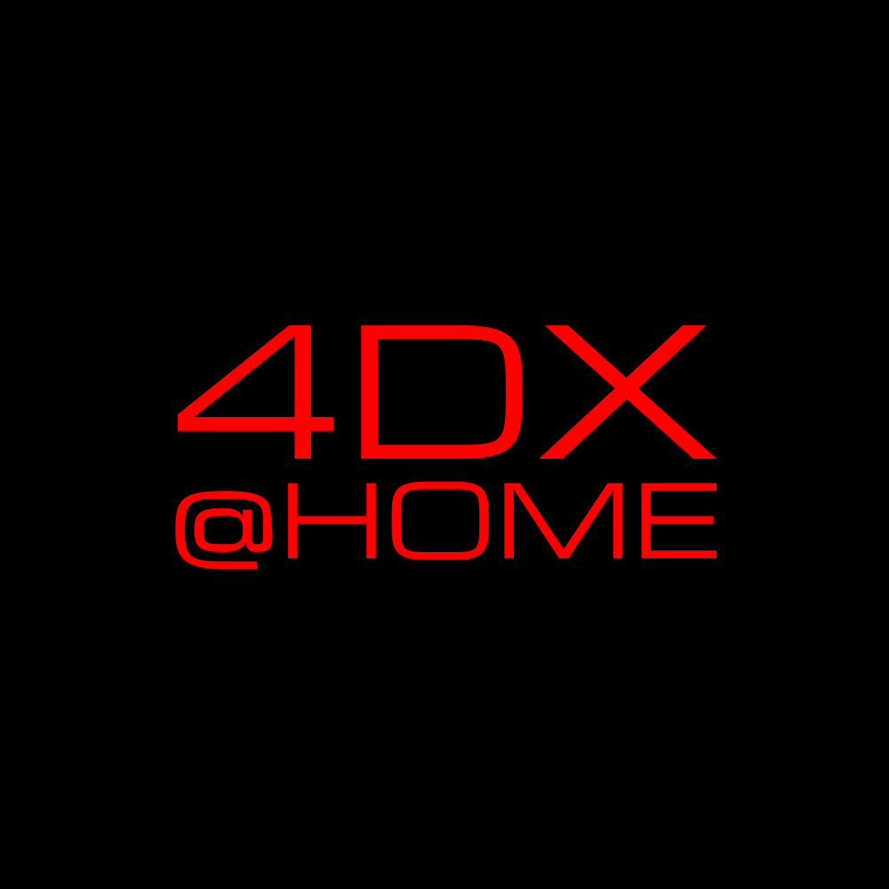
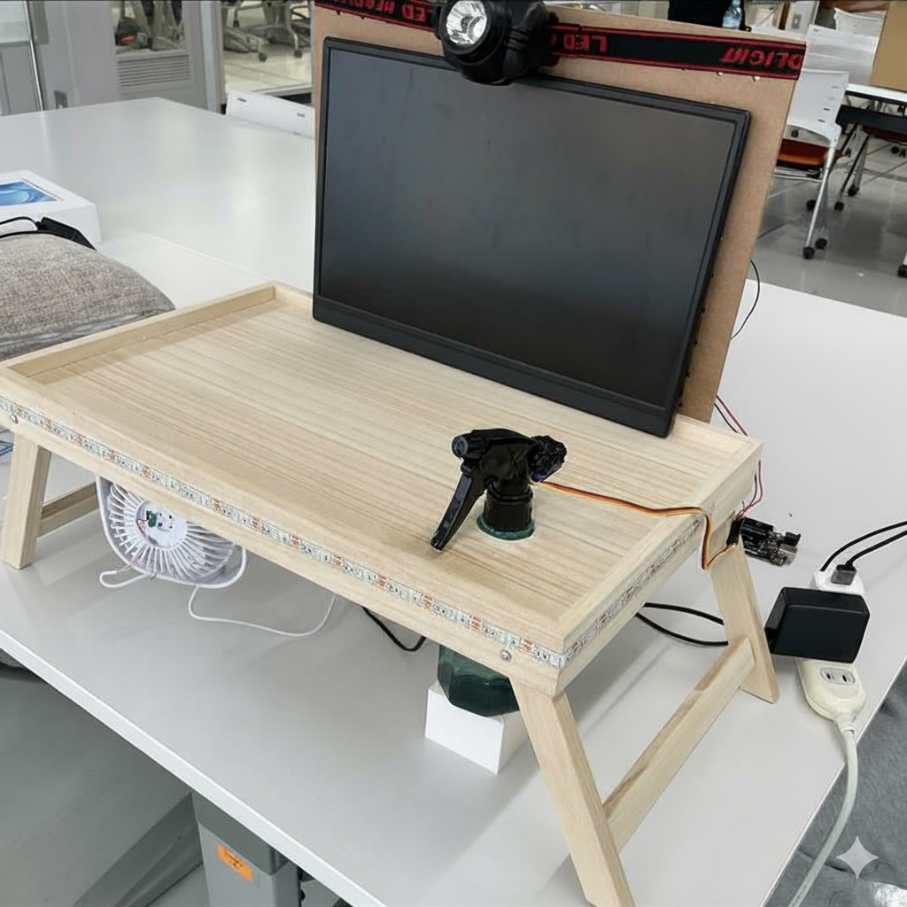

# ※Hack Day時点での内容です

# 4DX@HOME - あなたのおうちで「最高の映像」が「最強の体験」へ。

  
  

  

  🎉 **JPHacks2025 Hack Day (金沢会場)** 🎉 
  🥇 **「Best Hackday Award」受賞** 🥇

## 🌐 Live Demo
**Webアプリ**: デモのため、アクセス制限中 
**Yotube動画**: https://youtu.be/le1PPYY8JKY 

動画で使用しているPDFはこちら: [PDF](https://github.com/jphacks/kz_2504/blob/main/assets/images/4DX%40HOME_HackDay%E7%94%A8%E5%8B%95%E7%94%BB%E7%94%A8%E3%83%91%E3%83%AF%E3%83%9D.pdf)

## 製品概要

### 背景（製品開発のきっかけ・課題など）

#### **モバイル視聴の定着と慣れ**
スマートフォンでの動画視聴は、今や生活の一部となり、特に10〜20代では**1日6時間以上視聴**する人も少なくありません[1](#ref1)。こうした習慣の中で、場所や時間を問わず気軽に楽しめる一方、**「慣れ」によって体験そのものへの満足度が薄れている**傾向も見られます。

#### **"感じる体験"への関心の高まり**
映画館の4DX上映が、**通常より50％以上高い料金でも支持されている**ように[2](#ref2)、人々は映像を"見る"だけでなく"体感する"価値に強い関心を示しています。つまり、**視聴そのものをより深く味わいたい**という潜在的な欲求が存在しています。

#### **家庭内エンタメの進化**
世界の没入型エンターテインメント市場は**年率20％を超える勢い**で拡大しており[3](#ref3)、家庭での高品質な体験への投資も進んでいます。ドルビー社の調査では、**77％の人がより良い音や映像のために追加料金を払う**と回答しており[4](#ref4)、体験価値への支出意欲が高いことが分かります。

こうした「**慣れによる物足りなさ**」と「**より深く感じたい**」という両方の気持ちに応えるため、「**4DX@HOME**」は生まれました。

### 製品説明（具体的な製品の説明）

> **映像体験 × Tech**

**4DX@HOME**は、従来の「観る」体験を「体感する」次元へと押し上げるシステムです。スマートフォン・タブレットでの動画視聴に「振動」「水しぶき」などの物理フィードバックを融合させ、リビングを本格的な**4DXシアター**に変貌させます。
WebSocketによる**ミリ秒精度のリアルタイム通信**で動画と物理デバイスが完璧に同期し、あなたの**おうち時間を非日常の体験**へと導きます。

**主要機能：**
- **AI動画解析** (GPT-4o-mini Vision): 任意のMP4動画を自動解析し、4DX効果のタイムラインJSONを生成
- **リアルタイム同期再生**: 動画再生と同期してデバイスを制御
- **多様な効果対応**: 振動（3モード）、光（3モード）、風（2モード）、水（瞬間噴射）、色（RGB）

**システム構成：**
- **動画解析エンジン** (Python + OpenCV + GPT-4o-mini): 動画からタイムラインJSON自動生成
- **Webアプリ** (React 18.3.1 + TypeScript 5.9.3): 動画再生とセッション管理、WebSocketリアルタイム通信
- **サーバー** (FastAPI 0.104.1 + WebSocket): RESTful API、セッション管理、リアルタイム同期処理
- **デバイスハブ** (Raspberry Pi 3 Model B): TCP/WebSocket通信、タイムライン管理、デバイス制御
- **アクチュエーター** (Arduino Uno R3 x2台 + ESP-12E): 振動・光・風・水・色の5種類物理効果制御

### 特長

#### 1. **どんな動画も、あなただけの4DXシアターに**
お気に入りのYouTube動画、映画、アニメ。今まで「見るだけ」だったコンテンツが、AIの力で自動的に**触れる・感じる体験**へと生まれ変わります。爆発シーンでの衝撃、雨のシーンでの水しぶき、緊迫シーンでのドキドキ感——まるで**画面の中に入り込んだような感覚**を味わえます。

#### 2. **一瞬の遅れもない、完璧な同期体験**
映像と物理効果の**ズレは±50ms以内**。キャラクターが転んだ瞬間に振動が走り、稲妻が光った瞬間にLEDが閃く。この**絶妙なタイミング**が、現実と虚構の境界を曖昧にし、これまでにない**没入感**を生み出します。

#### 3. **誰でも3分で始められる手軽さ**
複雑な設定は一切不要。スマホでセッションコードを入力するだけで、**すぐに4DX体験がスタート**。デバイスをセットして、動画を再生するだけ。**Bluetoothイヤホンを繋ぐような感覚**で、特別な体験を始められます。

#### 4. **リビングが特別な空間に変わる**
木工製固定台にモバイルモニターやタブレットを設置し、その周りに配置されたデバイス群が、**いつものリビングを非日常空間**に変身させます。大掛かりな工事も、専用の部屋も不要。**家族や友人と一緒に**、新しいエンターテインメントの形を楽しめます。

### 解決出来ること
- 自宅では得にくい「没入感」を物理フィードバックで補完
- **どんな動画でも4DX化可能** - AIが自動解析するため、専用コンテンツ不要
- コンテンツごとに最適化された体験を提供し、作品の価値を最大化
- 木工製固定台によるコンパクトな統合システムで、リビングに設置可能な4DX体験を実現

### 今後の展望
- **リアルタイムAI分析**: 事前解析不要で動画再生中にリアルタイムAI解析を行い、瞬時に4DX効果を生成する完全自動システム
- **新感覚体験の追加**: 香り拡散（アロマカートリッジ）、温度制御（ペルチェ素子）、触覚拡張（エアバッグ）、音響表現（特定音の左右パン・立体音響制御）による多感覚4DX体験
- **多様なジャンル対応**: アクション映像の迫力体験だけでなく、恋愛映画・ドキュメンタリー等のしっとりした映像に適した繊細な体験制御（微細振動・環境音・香り・温度変化）
- **カスタマイズ可能な体験制御**: 再生前に振動・光・風・水・色の各効果のON/OFF設定、強度調整機能により、ユーザーの好みや状況に応じた個別最適化

### 注力したこと（こだわり等）
* **AI動画解析の効率化**: GPT-4o-mini Visionのバッチ処理（15枚同時解析）により、API呼び出しを1/15に削減し、コストと処理時間を大幅に短縮
* **最小継続時間制御**: 爆発・衝突・咆哮などの瞬間を正確に検出し、各効果に最小継続時間を設定することでチラつきを防止、安定した体験を提供
* **物理設計のこだわり**: 3Dプリンターでクッション用偏心モーターケースを完全カスタム設計、ケースごとクッション内に組み込み、自然な触覚体験を実現
* **ハードウェア統合**: 木工によって加工した固定台でデバイス群を安定配置、美観と機能性を両立した物理システム構築
* **UIのデザイン**: React Router DOMによるSPA設計、レスポンシブUI（モバイル・デスクトップ両対応）、セッションコードによる簡単ペアリングで、技術に詳しくないユーザーでも迷わず使える体験を実現
* **リアルタイム同期処理のための通信**: WebSocketによる双方向通信、継続的なタイムスタンプ送信により、動画とデバイスの同期ズレを最小化

## 技術仕様書

詳細な技術仕様については、以下の専門仕様書をご参照ください：

- **[フロントエンド仕様書](./docs/archive/hackday-2025/frontend-specification.md)** - React + TypeScript Webアプリケーション
- **[バックエンド仕様書](./docs/archive/hackday-2025/backend-specification.md)** - FastAPI WebサーバーとAPI
- **[ハードウェア仕様書](./docs/archive/hackday-2025/hardware-specification.md)** - Raspberry Pi + Arduino 物理制御システム
- **[AI動画解析システム](./tools/sync-generator/README.md)** - GPT-4o-mini Visionによる4DXタイムライン自動生成
- **[総合仕様書](./docs/archive/hackday-2025/README.md)** - システム全体概要とセットアップガイド

## 開発技術
### 活用した技術
#### API・データ
-  **OpenAI GPT-4o-mini (Vision API)** - マルチモーダルAIによる映像解析とシーン理解
-  **WebSocket (WSS)** - リアルタイム双方向通信
-  **JSON形式の同期データ** - 動画タイムスタンプとアクチュエーター制御パラメータのマッピング

#### フレームワーク・ライブラリ・モジュール
-   **AI・動画処理**: OpenCV (opencv-python), requests (OpenAI API通信)
-   **バックエンド**: FastAPI 0.104.1, Uvicorn 0.24.0, websockets 11.0.3, Pydantic 2.5.0, aiofiles 25.1.0
-    **フロントエンド**: React 18.3.1, TypeScript 5.9.3, Vite 7.1.9, React Router DOM 6.30.1, Tailwind CSS 4.1.14
-    **デバイス**: Python 3.9+ (Raspberry Pi), pyserial 3.5, paho-mqtt-client, RPi.GPIO 0.7.1, Arduino (C++), ESP-12E (C++)

#### デバイス
-  **Raspberry Pi 3 Model B** - デバイスハブとして、TCP/WebSocket通信、タイムライン管理、Arduino/ESP-12E制御を担当
-  **Arduino Uno R3 (2台)** - シリアル通信経由で光・風・水効果を個別制御
-  **ESP-12E** - Wi-Fi/MQTT経由で振動クッション制御、3Dプリントケース内偏心モーター駆動
-  **振動モーター** - ESP-12E経由MQTT制御、映像に合わせた触覚フィードバック（3モード: 弱い振動、強い衝撃、ドキドキ）
-  **3Dプリント振動ケース** - ESP-12E+偏心モーター用カスタムケース、クッション内組み込み型設計
-  **RGB LED + 高輝度LED** - PWM制御による光の演出（3モード: ストロボ、閃光、照明）+ 色表現（RGB 256段階）
-  **DCファン** - 風生成装置（2モード: 瞬間風、持続風）
-  **小型ポンプ** - 水噴射装置（瞬間噴射、安全制限付き）
-  **木工製固定台** - デバイス群を安定固定する木製土台、配線整理機能付き
-  **香り拡散器 (予定)** - ペルチェ素子加熱式、シーンに応じた香りの演出

#### 対応効果
-  **振動（vibration）**: 弱い振動（long）、強い衝撃（strong）、ドキドキ（heartbeat） - ESP-12E MQTT制御
-  **光（flash）**: ストロボ（strobe）、閃光（burst）、照明（steady） - シリアル制御、PWM調光
-  **風（wind）**: 一瞬の風（burst）、長い風（long） - シリアル制御、DCファン可変速
-  **水（water）**: 水しぶき（burst）※shot型一度きり発動 - シリアル制御、安全制限付き
-  **色（color）**: 赤（red）、緑（green）、青（blue） - シリアル制御、RGB各色256段階

### 独自技術
#### ハッカソンで開発した独自機能・技術
* **AI動画解析エンジン**: GPT-4o-mini Visionのバッチ処理（15枚同時）による効率的な映像解析と、ルールベース判定による高精度な効果タイムライン生成  
  → [`tools/sync-generator/analyze_video.py`](./tools/sync-generator/analyze_video.py), [`tools/sync-generator/generator.py`](./tools/sync-generator/generator.py)
* **最小継続時間制御システム**: 効果のチラつき防止のため、各効果に最小継続時間を設定し、安定した体験を提供  
  → [`tools/sync-generator/analyze_video.py`](./tools/sync-generator/analyze_video.py)
* **セッションコード方式ペアリング**: FastAPI + Pydanticによるセッションコード管理、自動デバイス登録システム  
  → [`backend/app/api/device_registration.py`](./backend/app/api/device_registration.py), [`backend/app/models/device.py`](./backend/app/models/device.py)
* **高精度リアルタイム同期**: WebSocket双方向通信による±50ms以内同期  
  → [`backend/app/services/continuous_sync_service.py`](./backend/app/services/continuous_sync_service.py)
* **ハイブリッド通信アーキテクチャ**: WebSocket（同期制御）+ シリアル通信（Arduino制御）+ MQTT（振動制御）の統合システム  
  → [`hardware/archive/raspberry_pi_client.py`](./hardware/archive/raspberry_pi_client.py), [`hardware/archive/hardware_server.py`](./hardware/archive/hardware_server.py), [`hardware/archive/vibration.ino`](./hardware/archive/vibration.ino)
* **カスタムハードウェア設計**: 3Dプリンターによる偏心モーター専用ケース設計、クッション内蔵型振動システム ※事前開発  
  → [`assets/images/Cushion_Motor_Case_3D_Model.png`](./assets/images/Cushion_Motor_Case_3D_Model.png), [`hardware/archive/vibration.ino`](./hardware/archive/vibration.ino)
* **物理デバイス統合**: 木工製固定台によるデバイス群の安定配置、配線管理とメンテナンス性を両立 ※木工部分は事前開発  
  → [`hardware/archive/lights.ino`](./hardware/archive/lights.ino), [`hardware/archive/water.ino`](./hardware/archive/water.ino), [`assets/images/Woodworking_Workbench.png`](./assets/images/Woodworking_Workbench.png)
* **タイムライン管理システム**: 最適なタイミングでアクチュエーター制御を実行  
  → [`backend/app/services/sync_data_service.py`](./backend/app/services/sync_data_service.py), [`hardware/archive/hardware_server.py`](./hardware/archive/hardware_server.py)

## 事前開発について

### 事前準備の範囲
本プロジェクトでは、ハッカソン開発期間を最大限に活用するため、以下の要素について事前開発を実施しました：

#### 企画・設計フェーズ
- **アイデア出し**: 4DX@HOMEの基本コンセプトとシステム構想
- **要件定義**: システム全体のアーキテクチャと技術選定の大枠

#### ハードウェア開発
-  **振動デバイス**: ESP-12E+偏心モーター構成、3Dプリントケース設計・製作
-  **ポンプシステム**: 小型ポンプによる水噴射機構の実装
-  **木工製固定台**: デバイス群を統合固定する木製土台の加工

#### AI解析システム
-  **AI動画解析エンジン**: GPT-4o-mini Visionによる基本動作確認のみ事前実装。効果的なタイムライン生成のためのプロンプトエンジニアリングとユーザー体験最適化はハッカソン期間中に実施

### 開発期間中の作業
事前開発により土台を構築した上で、ハッカソン期間中は以下に集中：

- **システム統合**: フロントエンド・バックエンド・ハードウェアの連携実装
- **リアルタイム同期**: WebSocket通信による高精度同期システム
- **ユーザーインターフェース**: React + TypeScriptによるWebアプリケーション
- **デバイス制御**: Raspberry Pi経由のデバイス統合制御
- **細部調整**: AIプロンプトの最適化、ハードウェア配置の微調整

### 事前開発の効果
この準備により、限られた開発時間の中で以下を実現：
- **完成度の高いプロトタイプ**: 物理デバイスとソフトウェアの完全統合
- **革新的な体験**: AI自動解析と物理フィードバックのシームレスな連携

**⚠️ 注記**: 事前開発は企画・基礎技術検証に留め、システム統合と主要機能実装は開発期間中に実施しています。

---

## 参考文献

<a id="ref1">[1]</a> NTTドコモ モバイル社会研究所「2024年スマホ利用者動向調査」  
https://www.moba-ken.jp/project/lifestyle/20241021.html

<a id="ref2">[2]</a> シネマサンシャイン「4DXとは？」  
https://www.cinemasunshine.co.jp/theater/4dx/about/

<a id="ref3">[3]</a> Mordor Intelligence "Immersive Entertainment Market Size & Share Analysis"  
https://www.mordorintelligence.com/industry-reports/immersive-experiment-market

<a id="ref4">[4]</a> "Dolby Consumer Survey Reveals New Global Trends in Home Entertainment Consumption and Purchasing"  
https://audioxpress.com/news/dolby-consumer-survey-reveals-new-global-trends-in-home-entertainment-consumption-and-purchasing
