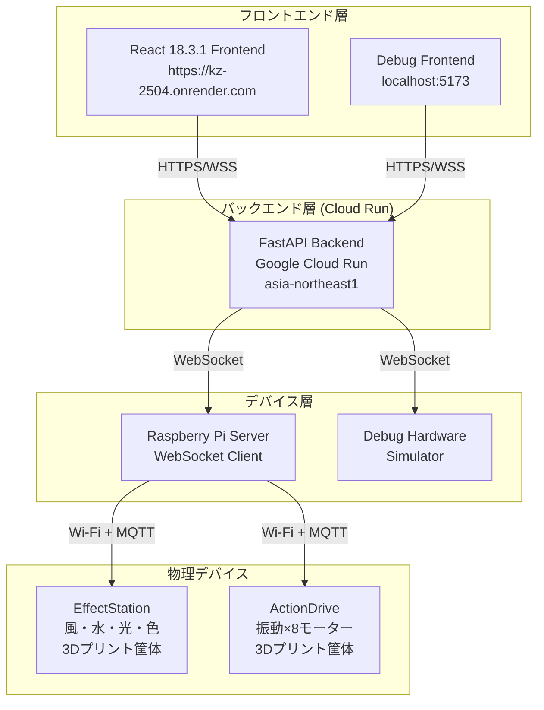
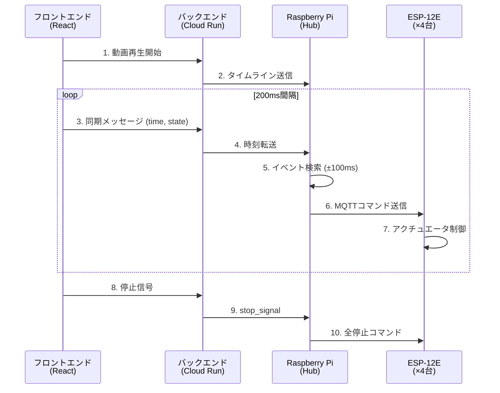
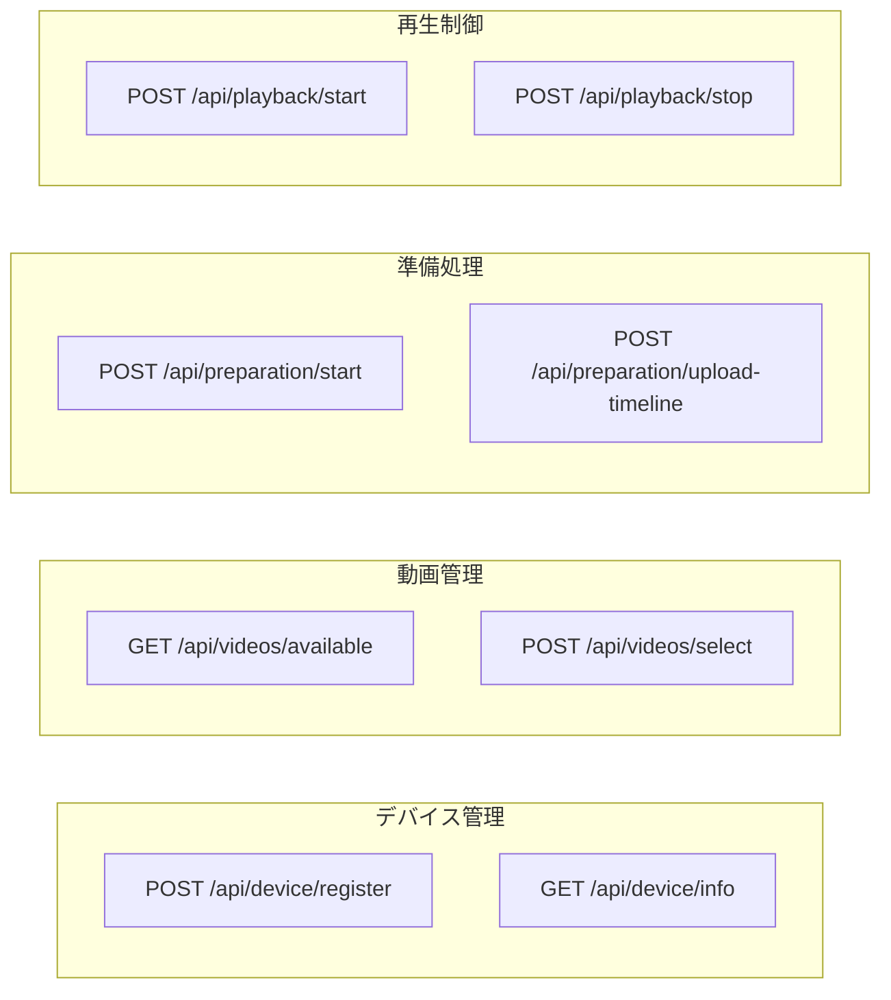
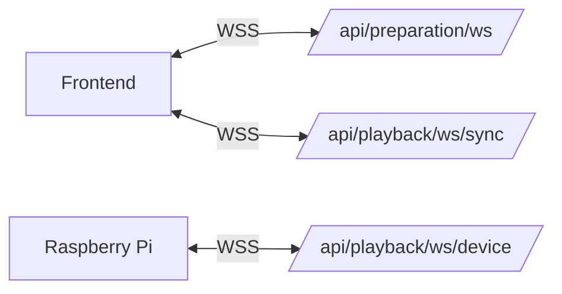
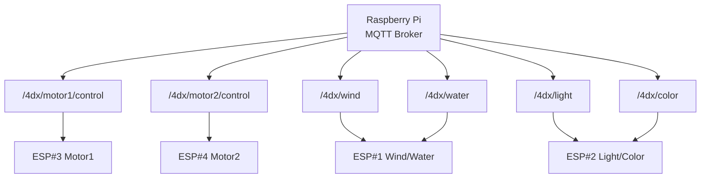
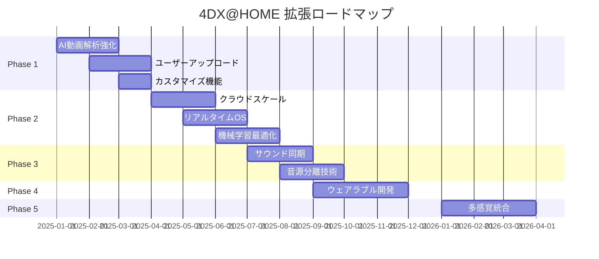

# 4DX@HOME システム仕様書

> **最終更新**: 2025年11月14日  
> **バージョン**: 2.0.0 (Award Day Updated Version)

## はじめに

4DX@HOMEは、AI動画解析とリアルタイム同期技術により、動画視聴に物理フィードバックを追加する革新的なシステムです。本仕様書では、**Award Day（2025年11月）時点の最新実装**に基づき、システムを構成する3つの主要コンポーネントの技術仕様を詳細に説明します。

### 🆕 Award Day版での主な変更点

> **前提**: Hack Day時点で既に3層構成（Frontend ↔ Cloud Run ↔ Raspberry Pi）とCloud Runデプロイは完了していました。ただし、セッションIDは決め打ち、タイムラインJSONはラズパイ側に固定配置、デバイス認証なし、スタート信号のみでタイミング制御はラズパイ任せという状態でした。

#### 🔌 エンドツーエンド連携の完全実装
- ✅ **デバイス認証システム**: 製品コード（DH001/DH002/DH003）による認証機能
  - Hack Day: デバイス登録APIは存在したが未連携
  - Award Day: フロントエンド画面統合、実動作確認完了
- ✅ **タイムラインJSON送信**: Cloud Run経由でRaspberry Piへ動的配信
  - Hack Day: タイムラインJSONはラズパイ側に事前配置
  - Award Day: `POST /api/preparation/upload-timeline/{session_id}` で動的送信
- ✅ **デバイステスト機能**: 5デバイス（Wind/Water/LED/Motor1/Motor2）の動作確認
  - Hack Day: APIは存在したが画面連携なし
  - Award Day: VideoPreparationPage統合、個別デバイステスト可能
- ✅ **時間同期制御**: フロントエンド→Cloud Run→Raspberry Pi間の高精度時刻同期
  - Hack Day: スタート信号のみ、ラズパイがローカルで時刻判断
  - Award Day: 200ms間隔同期メッセージ（VITE_SYNC_INTERVAL_MS）で連続同期
- ✅ **ストップ処理**: 一時停止・終了時の全アクチュエータ安全停止
  - Hack Day: 実装なし
  - Award Day: `POST /api/playback/stop/{session_id}` + WebSocket `stop_signal` 完全実装

#### 🎨 フロントエンド統合
- ✅ **本番フロー画面実装**: 3画面構成の完全な体験フロー
  - `VideoSelectionPage` → `VideoPreparationPage` → `VideoPlaybackPage`
  - 4ステップ準備プロセス（接続→読込→送信→テスト）
- ✅ **セッションID管理**: 製品コード（大文字）と動的セッションID（小文字）の分離管理
- ✅ **環境変数設定**: `VITE_SYNC_INTERVAL_MS`, `VITE_SEEK_SYNC_INTERVAL_MS` (デフォルト: 100ms)

#### ⚙️ ハードウェア強化
- ✅ **ハードウェア統一化**: Arduino全廃、ESP-12E × 4台に統一
  - Hack Day: Arduino Uno R3 × 2台 + ESP-12E × 1台（シリアル通信 + MQTT混在）
  - Award Day: ESP-12E × 4台（全てMQTT通信に統一、Wi-Fi制御）
- ✅ **機体刷新**: 3Dプリント筐体を新規設計・製作
  - EffectStation筐体（風・水・光・色）
  - ActionDrive筐体（振動×8モーター）
- ✅ **自動起動システム**: Raspberry Pi電源投入時にサーバー自動起動
  - systemdサービス化
  - 電源オンで即座に稼働可能
- ✅ **WebSocket自動再接続**: `CloudRunWebSocketClient` (指数バックオフ再接続)
- ✅ **動的タイムライン処理**: JSON受信→パース→イベント実行パイプライン
  - `TimelineCacheManager`: 動的キャッシュ管理
  - `TimelineProcessor`: リアルタイムイベント処理
- ✅ **モジュール構造化**: 5モジュール（api/, mqtt/, timeline/, server/, utils/）
- ✅ **通信ログシステム**: `CommunicationLogger` 全通信トレース
- ✅ **Flask監視ダッシュボード**: デバイス状態・通信履歴のリアルタイム表示 (localhost:5000)

#### 🛠️ バックエンドAPI拡張
- ✅ **新規エンドポイント追加**:
  - `POST /api/preparation/upload-timeline/{session_id}` - タイムライン動的送信
  - `POST /api/playback/stop/{session_id}` - 緊急停止
  - `POST /api/device/test` - デバイステスト
  - `GET /api/playback/debug/*` - 6デバッグルート（sessions, connections, timeline, actuators, sync-history, logs）
- ✅ **新サービスクラス**: `ContinuousSyncService`, `PreparationService`, `SyncDataService`, `VideoService`

### 📚 Hack Day版仕様書について

Hack Day（2025年10月11-12日）時点の旧仕様書は、`archive/hackday-2025/` ディレクトリに保存されています。

---

## システム概要

### アーキテクチャ図（最新版）



### 主要機能
- **AI動画解析**: GPT-4o-mini Visionによる自動4DX効果生成
- **リアルタイム同期**: ±50ms以内の高精度同期
- **多様な物理効果**: 振動・光・風・水・色の5種類
- **セッション管理**: 4桁コードによる簡単ペアリング

## 仕様書構成

### 🎯 最新版 (Award Day 2025) - Version 2.0.0

**対象イベント**: JPHACKS 2025 Award Day (2025年11月9日開催)

#### 📱 [フロントエンド仕様書 (Award Day版)](./frontend-specification-awardday.md)
**React + TypeScript Webアプリケーション (Render + Cloud Run統合版)**

- **デプロイ**: Render Static Site (https://kz-2504.onrender.com)
- **技術スタック**: React 18.3.1, TypeScript 5.0.0, Vite 5.0.0, Axios 1.6.0
- **主要機能**: 
  - 4画面構成 (Home → Pairing → Select → Player)
  - Cloud Run API統合 (REST + WebSocket)
  - 200ms間隔同期メッセージ送信（カスタマイズ可能）
  - ストップ処理統合 (一時停止・動画終了時)
- **アーキテクチャ**: SPA, React Router, WebSocket自動再接続
- **新機能**: セッションID分離管理、エラーハンドリング強化

#### 🔧 [バックエンド仕様書 (Award Day版)](./backend-specification-awardday.md)  
**FastAPI Cloud Run APIサーバー**

- **デプロイ**: Google Cloud Run (asia-northeast1)
- **URL**: https://fdx-home-backend-api-xxxxxxxxxxxx.asia-northeast1.run.app
- **技術スタック**: FastAPI 0.104.1, Uvicorn 0.24.0, WebSockets 11.0.3, Pydantic 2.5.0
- **主要機能**:
  - RESTful API (デバイス管理・動画管理・準備処理・再生制御)
  - WebSocket 3種類 (準備・デバイス・再生同期)
  - ストップ処理API (`POST /api/playback/stop/{session_id}`)
  - デバイステスト機能
- **アーキテクチャ**: 3層構成 (Frontend ↔ Cloud Run ↔ Raspberry Pi)
- **リソース**: 512Mi RAM, 1 vCPU, 300秒タイムアウト

#### ⚙️ [ハードウェア仕様書 (Award Day版)](./hardware-specification-awardday.md)
**Raspberry Pi Hub + ESP-12E 物理制御システム (Cloud Run統合版)**

- **技術スタック**: Python 3.9+, Flask 3.0.0, websockets 12.0, paho-mqtt 1.6.1
- **主要機能**:
  - Cloud Run WebSocket接続 (自動再接続)
  - MQTT経由ESP-12E制御 (5デバイス)
  - タイムライン処理エンジン (±100ms許容)
  - ストップ処理 (全アクチュエーター停止)
  - Flask監視ダッシュボード (localhost:5000)
- **アーキテクチャ**: Raspberry Pi Hub → MQTT Broker → ESP-12E Devices
- **物理デバイス**: Wind, Flash, LED Color, Motor1, Motor2

---

### 📦 Hack Day版 (Version 1.0.0) - アーカイブ

**対象イベント**: JPHACKS 2025 Hack Day (2025年10月11-12日開催)

Hack Day時点の仕様書は以下のディレクトリに保存されています:

- [バックエンド仕様書 (Hack Day版)](./archive/hackday-2025/backend-specification.md)
- [フロントエンド仕様書 (Hack Day版)](./archive/hackday-2025/frontend-specification.md)
- [ハードウェア仕様書 (Hack Day版)](./archive/hackday-2025/hardware-specification.md)

## 技術的特徴

### 🎯 リアルタイム同期
- **WebSocket双方向通信**による継続的時刻同期
- **マルチスレッド処理**によるノンブロッキング制御
- **予測補正**によるネットワーク遅延対応

### 🔄 データフロー



**処理概要**:
1. **フロントエンド**: 動画再生・タイムスタンプ送信
2. **バックエンド**: セッション管理・同期データ転送
3. **ハードウェア**: タイムライン処理・物理効果制御

### 🛡️ 安全・信頼性
- **入力検証**: Pydanticによる厳密な型チェック
- **エラー回復**: 自動再接続・フォールバック機能
- **物理安全**: 過熱保護・動作時間制限・緊急停止

## 開発・デプロイ

### 開発環境セットアップ
```bash
# フロントエンド
cd frontend/4dathome-app
npm install
npm run dev

# バックエンド  
cd backend
pip install -r requirements.txt
uvicorn app.main:app --reload

# ハードウェア
cd hardware
pip install -r device-hub/requirements.txt
python3 hardware_server.py
```

### システム要件
- **フロントエンド**: Node.js 18+, モダンブラウザ
- **バックエンド**: Python 3.9+, 512MB RAM
- **ハードウェア**: Raspberry Pi 3 Model B, ESP-12E × 4台, 3Dプリンター, 12V/5A電源

## API一覧

### RESTful API



- `POST /api/device/register` - デバイス登録
- `GET /api/videos/available` - 動画一覧取得
- `POST /api/videos/select` - 動画選択
- `POST /api/preparation/start/{session_id}` - 準備開始

### WebSocket



- `ws://server/api/preparation/ws/{session_id}` - 準備処理通信
- `ws://server/api/playback/ws/sync/{session_id}` - 再生同期通信
- `ws://server/api/playback/ws/device/{session_id}` - デバイス通信

### デバイス制御プロトコル (MQTT)



- **振動**: MQTT `/4dx/motor1/control`, `/4dx/motor2/control`
- **光**: MQTT `/4dx/light`, `/4dx/color`
- **風**: MQTT `/4dx/wind`
- **水**: MQTT `/4dx/water`
- **通信**: Wi-Fi (802.11n) + MQTT over TCP/IP

## パフォーマンス指標

| メトリクス | 目標値 | 用途 |
|-----------|--------|------|
| API応答時間 | < 100ms | ユーザビリティ |
| WebSocket遅延 | < 50ms | 同期精度 |
| 同期精度 | ±50ms | 体験品質 |
| 同時セッション | 100+ | スケーラビリティ |
| メモリ使用量 | < 512MB | リソース効率 |

## トラブルシューティング

### よくある問題
1. **同期ずれ**: ネットワーク環境・処理負荷確認
2. **WebSocket接続失敗**: ファイアウォール・CORS設定確認  
3. **デバイス無応答**: Wi-Fi接続・ESP-12E状態確認
4. **動画再生できない**: ブラウザ対応・コーデック確認

### ログ確認
```bash
# バックエンドログ
tail -f backend/logs/app.log

# ハードウェアログ  
journalctl -u 4dx-home.service -f

# フロントエンド
# ブラウザ開発者ツール Console
```

## 今後の拡張計画



### Phase 1: 機能拡張
- **AI動画解析**: GPT-4o-mini Vision API統合
- **多動画対応**: ユーザーアップロード機能
- **カスタマイズ**: ユーザー設定・プロファイル

### Phase 2: 技術向上
- **クラウド化**: スケーラブルクラウドデプロイ
- **リアルタイムOS**: 確定的レスポンス
- **機械学習**: 個人最適化・予測制御

### Phase 3: オーディオ連携強化
- **サウンド同期制御**: 音声波形解析によるリアルタイムアクション連動
- **音源分離技術**: BGM・環境音・セリフの自動分離とチャンネル別処理
- **空間音響**: 3D音場再現による方向感覚の演出
- **音響効果最適化**: 音圧・周波数帯域に応じた物理フィードバック強度調整

### Phase 4: ウェアラブル拡張
- **ネックバンド型デバイス**: 首元への局所的な温度変化・振動フィードバック
- **リストバンド型デバイス**: 手首での心拍・温度・触覚刺激による没入感向上
- **モジュラー設計**: 装着部位・刺激種類のカスタマイズ対応
- **生体情報連携**: 心拍数・体温などの生体データによる体験個別最適化

### Phase 5: 新体験
- **多感覚統合**: 温度・香り・触覚の追加と音響との同期制御
- **ソーシャル体験**: 複数人同時体験・感覚共有
- **VR/AR融合**: 仮想現実と物理フィードバックの統合

## まとめ

4DX@HOMEは、最新のWeb技術、リアルタイム通信、組み込みシステムを統合し、従来の動画視聴体験を革新する包括的なシステムです。各コンポーネントが独立して動作しながら、高精度な同期により統一された体験を提供します。

詳細な技術仕様については、各コンポーネントの専用仕様書をご参照ください。

---

## 📚 ドキュメント更新履歴

### Version 2.0.0 - Award Day 2025（2025年11月14日）
- ✅ **Award Day版仕様書作成** (3ファイル)
  - `backend-specification-awardday.md`
  - `frontend-specification-awardday.md`
  - `hardware-specification-awardday.md`
- ✅ **Cloud Runデプロイ情報追加**
  - URL: https://fdx-home-backend-api-xxxxxxxxxxxx.asia-northeast1.run.app
  - リソース設定: 512Mi RAM, 1 vCPU, 300秒タイムアウト
- ✅ **ストップ処理機能文書化**
  - REST API: `POST /api/playback/stop/{session_id}`
  - WebSocket: `stop_signal` メッセージタイプ
  - 全アクチュエーター停止処理
- ✅ **3層アーキテクチャ図追加**
  - Frontend ↔ Cloud Run API ↔ Raspberry Pi
- ✅ **Hack Day版のアーカイブ化**
  - 移動先: `archive/hackday-2025/`

### Version 1.0.0 - Hack Day（2025年10月11-12日）
- 初回仕様書作成
- 基本システムアーキテクチャ文書化
- 2層アーキテクチャ (Frontend ↔ Backend ↔ Hardware)

---

**初版作成日**: 2025年10月11日  
**最終更新日**: 2025年11月14日  
**バージョン**: 2.0.0 (Award Day Version)  
**対象**: 開発チーム・技術仕様確認

**関連ドキュメント**:
- [デプロイガイド](../backend/DEPLOYMENT_GUIDE.md)
- [本番フロー仕様](../debug_frontend/PRODUCTION_FLOW_SETUP.md)
- [ストップ処理仕様](../debug_frontend/STOP_SIGNAL_SPEC.md)
- [debug_hardware アーキテクチャ](../debug_hardware/ARCHITECTURE.md)
