# 4DX@HOME AI動画解析システム仕様書 (AwardDay版)

**バージョン**: 2.0.0  
**作成日**: 2025年12月15日  
**対象イベント**: JPHACKS 2025 Award Day (2025年11月9日開催)  
**システム**: Gemini 2.5 Pro統合版

---

## 目次

1. [概要](#概要)
2. [技術スタック](#技術スタック)
3. [Hack Day → Award Day 変更履歴](#hack-day--award-day-変更履歴)
4. [システム構成](#システム構成)
5. [ディレクトリ構造](#ディレクトリ構造)
6. [解析モード](#解析モード)
7. [視聴用再生モード](#視聴用再生モード)
8. [タイムラインJSON仕様](#タイムラインjson仕様)
9. [対応効果一覧](#対応効果一覧)
10. [プロンプトシステム](#プロンプトシステム)
11. [セットアップ](#セットアップ)
12. [使い方](#使い方)
13. [設定・カスタマイズ](#設定カスタマイズ)
14. [トラブルシューティング](#トラブルシューティング)
15. [今後の拡張予定](#今後の拡張予定)
16. [関連ドキュメント](#関連ドキュメント)
17. [実装例集](#実装例集)

---

## 概要

4DX@HOME AI動画解析システムは、任意のMP4動画を解析して4DX体験用のタイムラインJSONを自動生成するシステムです。Google Gemini 2.5 Proのマルチモーダル機能を活用し、映像から最適な物理エフェクトを判定します。

### 何ができるか

```
MP4動画 → AI解析（Gemini 2.5 Pro）→ タイムラインJSON → 4DX体験
```

### 特長

- **どんな動画でも4DX化可能** - 専用コンテンツ不要
- **AI自動判定** - 手動設定不要、シーンの文脈を理解
- **高精度サンプリング** - 0.25秒間隔（4FPS）でフレーム抽出
- **大量バッチ処理** - 100枚同時解析、並列実行（最大10リクエスト）
- **精密振動制御** - 背中/おしり別の16種類振動パターン
- **5種類のエフェクト** - 振動・光・風・水・色

---

## 技術スタック

### コアライブラリ

| カテゴリ | 技術 | 用途 |
|:--|:--|:--|
| **言語** | Python 3.7+ | メイン処理 |
| **AI** | Google Gemini 2.5 Pro | マルチモーダル映像解析 |
| **動画処理** | OpenCV 4.8.0+ | フレーム抽出・デコード |
| **画像処理** | Pillow | 画像リサイズ・変換 |
| **並列処理** | concurrent.futures | 並列API呼び出し |

### AI解析の比較

| 項目 | Gemini版（Award Day） | OpenAI版（Hack Day） |
|:--|:--|:--|
| **モデル** | Gemini 2.5 Pro | GPT-4o-mini |
| **サンプリング** | 0.25秒間隔（4FPS） | 0.5秒間隔（2FPS） |
| **バッチサイズ** | 100枚 | 15枚 |
| **並列処理** | 最大10リクエスト同時 | 逐次処理 |
| **振動制御** | 16種類（背中/おしり別） | 3種類（弱/強/ドキドキ） |
| **出力形式** | キャプション + 効果JSON | キャプションのみ |

---

## Hack Day → Award Day 変更履歴

### AIモデル変更

| 項目 | Hack Day | Award Day |
|:--|:--|:--|
| AIモデル | GPT-4o-mini | Gemini 2.5 Pro |
| API | OpenAI Vision API | Google Generative AI |
| 処理方式 | 逐次処理 | 並列処理（10リクエスト） |

### 精度向上

| 項目 | Hack Day | Award Day |
|:--|:--|:--|
| サンプリング間隔 | 0.5秒 | 0.25秒 |
| バッチサイズ | 15枚 | 100枚 |
| 振動パターン | 3種類 | 16種類 |

### 新機能

- **プロンプトシステム** (`prompts.py`) - 用途別プロンプト切り替え
- **4DX@HOME専用プロンプト** - 精密な振動制御用
- **効果の直接出力** - AIがキャプションと効果を同時に返す
- **最小継続時間制御** - 効果のチラつき防止

---

## システム構成

```mermaid
flowchart LR
    subgraph Input["ユーザー入力"]
        MP4[MP4動画ファイル]
    end
    
    subgraph Analyze["解析モード"]
        A1[1. 動画読み込み] --> A2[2. フレーム抽出] --> A3[3. リサイズ]
        A3 --> A4[4. バッチ処理] --> A5[5. 並列API] --> A6[6. Gemini解析]
        A6 --> A7[7. JSON生成] --> A8[8. 最小継続時間] --> A9[9. 出力]
    end
    
    subgraph Output["出力"]
        JSON["results/video_name_timeline.json"]
    end
    
    subgraph Playback["再生モード"]
        P1[動画+JSON] --> P2[再生] --> P3[同期] --> P4[表示] --> P5[制御]
    end
    
    MP4 --> A1
    A9 --> JSON
    JSON --> P1
```



---

## ディレクトリ構造

```
connotation_tools/
├── analyze_video_gemini.py  # Gemini版解析（Award Day）
├── analyze_video.py         # OpenAI版解析（Hack Day互換）
├── playback_video.py        # 視聴用再生
├── prompts.py               # プロンプト管理
├── requirements_gemini.txt  # Gemini版依存関係
├── requirements.txt         # OpenAI版依存関係
├── videos/                  # 入力動画配置
│   └── .gitkeep
├── results/                 # 出力JSON
│   └── .gitkeep
├── archive/                 # 旧バージョン（Hack Day版）
│   ├── deployment/
│   └── sync-generator/
├── JSON_SPECIFICATION.md    # JSON仕様書
├── TECH_STACK.md            # 技術スタック詳細
├── TIMING_GUIDE.md          # タイミング調整ガイド
├── PROMPT_GUIDE.md          # プロンプトガイド
├── JSON生成ガイド.md         # JSON生成ガイド
├── Gemini版使い方.md         # Gemini版ガイド
└── README.md                # 総合README
```

---

## 解析モード

### 処理フロー

```mermaid
flowchart LR
    A[MP4動画] --> B[OpenCV読み込み] --> C[フレーム抽出<br/>0.25秒間隔]
    C --> D[640pxリサイズ] --> E[バッチ分割<br/>100枚]
    E --> F[並列API<br/>最大10同時] --> G[Gemini 2.5 Pro]
    G --> H[キャプション+効果JSON] --> I[最小継続時間]
    I --> J[効果延長/削除] --> K[タイムラインJSON]
```



### 設定パラメータ

```python
SAMPLE_INTERVAL = 0.25       # 0.25秒ごとにサンプリング（4FPS）
BATCH_SIZE = 100             # 一度に処理するフレーム数
MODEL_NAME = "gemini-2.5-pro" # Geminiモデル名
TARGET_WIDTH = 640           # API負荷軽減の縮小幅
MAX_CONCURRENT_REQUESTS = 10 # 同時実行数の上限
PROMPT_NAME = "4dx_home"     # 使用するプロンプト名
```

### 出力例

**入力**: `videos/demo.mp4` (30秒動画)

**出力**: `results/demo_timeline_20251115_143022.json`

---

## 視聴用再生モード

### 機能

- **リアルタイム動画再生**: OpenCVによる動画表示
- **音声再生**: pygame + ffmpegによる音声同期
- **効果パネル表示**: 右側に現在の効果状態を表示
- **デバイス制御信号送信**: カスタマイズ可能

### キーボード操作

| キー | 動作 |
|:--|:--|
| `スペース` | 一時停止/再生 |
| `R` | 最初から再生 |
| `Q` / `ESC` | 終了 |

---

## タイムラインJSON仕様

### 基本構造

```json
{
  "events": [
    {
      "t": 0.0,
      "action": "caption",
      "text": "シーンの説明文"
    },
    {
      "t": 0.0,
      "action": "start",
      "effect": "vibration",
      "mode": "down_weak"
    },
    {
      "t": 1.5,
      "action": "stop",
      "effect": "vibration",
      "mode": "down_weak"
    }
  ]
}
```

### アクションタイプ

| action | 説明 | 必須フィールド |
|:--|:--|:--|
| `caption` | キャプション表示 | `t`, `text` |
| `start` | 効果開始 | `t`, `effect`, `mode` |
| `stop` | 効果停止 | `t`, `effect`, `mode` |
| `shot` | 一度きりの発射（水） | `t`, `effect`, `mode` |

### フィールド説明

| フィールド | 型 | 説明 |
|:--|:--|:--|
| `t` | float | 時刻（秒） |
| `action` | string | アクションタイプ |
| `effect` | string | 効果タイプ |
| `mode` | string | 効果モード |
| `text` | string | キャプションテキスト |

---

## 対応効果一覧

### 振動（vibration）- 16種類

#### 上（背中）のみ

| mode | 説明 | 使用シーン |
|:--|:--|:--|
| `up_weak` | 弱 | 多少の振動 |
| `up_mid_weak` | 中弱 | 多少の振動 |
| `up_mid_strong` | 中強 | 強烈なシーン |
| `up_strong` | 強 | 強烈なシーン |

#### 下（おしり）のみ

| mode | 説明 | 使用シーン |
|:--|:--|:--|
| `down_weak` | 弱 | 多少の振動 |
| `down_mid_weak` | 中弱 | 多少の振動 |
| `down_mid_strong` | 中強 | 強烈なシーン |
| `down_strong` | 強 | 強烈なシーン |

#### 上下同時（背中＆おしり）

| mode | 説明 | 使用シーン |
|:--|:--|:--|
| `up_down_weak` | 弱 | かなり強い |
| `up_down_mid_weak` | 中弱 | かなり強い |
| `up_down_mid_strong` | 中強 | かなり強い |
| `up_down_strong` | 強 | かなり強い |

#### 特殊

| mode | 説明 | 使用シーン |
|:--|:--|:--|
| `heartbeat` | ドキドキ | 緊張シーン |

### 光（flash）- 3種類

| mode | 説明 | 使用シーン |
|:--|:--|:--|
| `steady` | 点灯 | 継続的な光 |
| `slow_blink` | 遅い点滅 | ゆっくりチカチカ |
| `fast_blink` | 早い点滅 | 速くチカチカ |

**注意**: 通常シーンでは使わない。銃の火、閃光、爆発、雷など特別な光を表現する場合のみ使用。

### 風（wind）- 1種類

| mode | 説明 | 使用シーン |
|:--|:--|:--|
| `on` | 風を出す | 爆風、疾走 |

### 水（water）- 1種類

| mode | 説明 | 使用シーン |
|:--|:--|:--|
| `burst` | 水しぶき | 水・波・唾・汗 |

**注意**: `shot`アクションで一度だけ発射。`start`/`stop`は使用しない。

### 色（color）- 6種類

| mode | 説明 | 使用シーン |
|:--|:--|:--|
| `red` | 赤 | 炎・火・爆発・血 |
| `green` | 緑 | 森・草原・自然 |
| `blue` | 青 | 空・海・水 |
| `yellow` | 黄色 | 明るいシーン |
| `cyan` | シアン | 水・空 |
| `purple` | 紫 | 幻想的なシーン |

### 最小継続時間

| 効果 | 最小時間 |
|:--|:--|
| 振動全般 | 0.5秒 |
| 光（点灯/遅い点滅） | 2.0秒 |
| 光（早い点滅） | 1.0秒 |
| 色全般 | 2.0秒 |
| 風 | 1.0秒 |
| 水 | 0.5秒 |

---

## プロンプトシステム

### 概要

`prompts.py` で複数のプロンプトパターンを管理し、用途に応じて切り替え可能。

### 利用可能なプロンプト

| 名前 | 説明 |
|:--|:--|
| `default` | 標準プロンプト（キャプション重視） |
| `detailed` | 詳細モード（3-5文の詳細記述） |
| `simple` | 簡潔モード（1-2文） |
| `4dx_home` | 4DX@HOME専用（効果直接出力） |

### 使用例

```python
from prompts import get_prompt, list_prompts

# 利用可能なプロンプト一覧
print(list_prompts())

# プロンプト取得
prompt = get_prompt("4dx_home", num_frames=100)
```

---

## セットアップ

### 1. 依存パッケージのインストール

```bash
cd connotation_tools
pip install -r requirements_gemini.txt
```

必要なパッケージ:
- `opencv-python` - 動画処理
- `google-generativeai` - Gemini API
- `Pillow` - 画像処理

### 2. Gemini APIキーの取得

1. [Google AI Studio](https://makersuite.google.com/app/apikey) にアクセス
2. 「Create API Key」をクリック
3. APIキーをコピー

### 3. APIキーの設定

#### 方法1: コード内に設定（開発用）

`analyze_video_gemini.py` の64行目を編集:

```python
HARD_CODED_GEMINI_API_KEY = "AIza..."
```

#### 方法2: 環境変数に設定（推奨）

**Windows (PowerShell):**
```powershell
$env:GEMINI_API_KEY="AIza..."
```

**Linux/Mac:**
```bash
export GEMINI_API_KEY="AIza..."
```

### 4. 動画を配置

```
connotation_tools/
└── videos/
    └── your_video.mp4
```

---

## 使い方

### 基本フロー

```bash
# 1. 動画を videos/ に配置
videos/my_video.mp4

# 2. 解析（タイムラインJSON生成）
python analyze_video_gemini.py my_video.mp4

# 3. 視聴用再生（オプション）
python playback_video.py my_video.mp4
```

### コマンドラインオプション

```bash
# ファイル名のみ（videos/から自動検索）
python analyze_video_gemini.py demo.mp4

# フルパス指定
python analyze_video_gemini.py "C:\path\to\video.mp4"

# 利用可能なモデルを表示
python analyze_video_gemini.py --list-models

# 利用可能なプロンプトを表示
python analyze_video_gemini.py --list-prompts

# ヘルプ表示
python analyze_video_gemini.py
```

### Windows 簡易実行

```batch
setup.bat          # 初回のみ
run_analyze.bat    # 解析
run_playback.bat   # 再生
```

---

## 設定・カスタマイズ

### 解析パラメータ

`analyze_video_gemini.py` で設定可能:

```python
SAMPLE_INTERVAL = 0.25       # サンプリング間隔（秒）
BATCH_SIZE = 100             # バッチサイズ
MODEL_NAME = "gemini-2.5-pro" # モデル名
TARGET_WIDTH = 640           # 画像幅
MAX_CONCURRENT_REQUESTS = 10 # 並列数
PROMPT_NAME = "4dx_home"     # プロンプト名
```

### 最小継続時間

`analyze_video_gemini.py` の `MIN_DURATION` で設定:

```python
MIN_DURATION = {
    "vibration:up_weak": 0.5,
    "flash:steady": 2.0,
    "color:red": 2.0,
    # ...
}
```

---

## トラブルシューティング

### APIキーエラー

**症状**: `GEMINI_API_KEY が設定されていません`

**解決策**:
1. APIキーを取得済みか確認
2. 環境変数またはコード内に設定
3. スペルミスがないか確認

### 動画読み込みエラー

**症状**: `Could not open video file`

**解決策**:
1. ファイルパスが正しいか確認
2. MP4形式か確認
3. `videos/` ディレクトリに配置

### バッチ処理エラー

**症状**: `API rate limit exceeded`

**解決策**:
1. `MAX_CONCURRENT_REQUESTS` を下げる（5など）
2. `BATCH_SIZE` を下げる（50など）
3. 数分待ってから再実行

### メモリ不足

**症状**: `MemoryError` または処理が遅い

**解決策**:
1. `TARGET_WIDTH` を下げる（480など）
2. `BATCH_SIZE` を下げる
3. 短い動画で分割処理

---

## 今後の拡張予定

- [ ] ストリーミング動画対応（YouTube等）
- [ ] 音声解析の統合（BGM・効果音判定）
- [ ] WebUI化（ブラウザから解析実行）
- [ ] リアルタイム解析（ライブ配信対応）
- [ ] 学習機能（ユーザーフィードバック反映）

---

## 関連ドキュメント

- [フロントエンド仕様書](./frontend-specification-awardday.md)
- [バックエンド仕様書](./backend-specification-awardday.md)
- [ハードウェア仕様書](./hardware-specification-awardday.md)
- [JSON仕様書](../connotation_tools/JSON_SPECIFICATION.md)
- [技術スタック詳細](../connotation_tools/TECH_STACK.md)
- [タイミング調整ガイド](../connotation_tools/TIMING_GUIDE.md)
- [プロンプトガイド](../connotation_tools/PROMPT_GUIDE.md)

---

## 実装例集

以下は各機能の詳細な実装例です。

### フレーム抽出 実装例

```python
def extract_frames(video_path: str, interval: float = 0.25) -> List[Tuple[float, np.ndarray]]:
    """
    動画からフレームを抽出する
    
    Args:
        video_path: 動画ファイルパス
        interval: サンプリング間隔（秒）
    
    Returns:
        (タイムスタンプ, フレーム画像) のリスト
    """
    cap = cv2.VideoCapture(video_path)
    fps = cap.get(cv2.CAP_PROP_FPS)
    frame_interval = int(fps * interval)
    
    frames = []
    frame_count = 0
    
    while True:
        ret, frame = cap.read()
        if not ret:
            break
        
        if frame_count % frame_interval == 0:
            timestamp = frame_count / fps
            # 640px幅にリサイズ
            height, width = frame.shape[:2]
            new_width = 640
            new_height = int(height * new_width / width)
            resized = cv2.resize(frame, (new_width, new_height))
            frames.append((timestamp, resized))
        
        frame_count += 1
    
    cap.release()
    return frames
```

### Gemini API呼び出し 実装例

```python
import google.generativeai as genai
from concurrent.futures import ThreadPoolExecutor, as_completed

def analyze_batch_parallel(batches: List[List[Image]], prompt: str, max_workers: int = 10):
    """
    バッチを並列でGemini APIに送信
    
    Args:
        batches: 画像バッチのリスト
        prompt: 解析プロンプト
        max_workers: 最大並列数
    
    Returns:
        解析結果のリスト
    """
    model = genai.GenerativeModel(MODEL_NAME)
    results = [None] * len(batches)
    
    def process_batch(batch_idx: int, images: List[Image]) -> Tuple[int, dict]:
        """単一バッチを処理"""
        content = [prompt] + images
        response = model.generate_content(content)
        return batch_idx, parse_response(response.text)
    
    with ThreadPoolExecutor(max_workers=max_workers) as executor:
        futures = {
            executor.submit(process_batch, idx, batch): idx
            for idx, batch in enumerate(batches)
        }
        
        for future in as_completed(futures):
            batch_idx, result = future.result()
            results[batch_idx] = result
            print(f"✅ バッチ {batch_idx + 1}/{len(batches)} 完了")
    
    return results
```

### 効果判定 実装例

```python
def decide_effects(caption: str, effects_from_ai: dict) -> List[Tuple[str, str]]:
    """
    キャプションとAI出力から効果を決定
    
    Args:
        caption: シーンのキャプション
        effects_from_ai: AIが出力した効果情報
    
    Returns:
        (effect, mode) のリスト
    """
    effects = []
    
    # AIが直接出力した効果を優先
    if effects_from_ai:
        for effect_type, modes in effects_from_ai.items():
            for mode in modes:
                if mode in EFFECT_DOMAIN.get(effect_type, []):
                    effects.append((effect_type, mode))
    
    # ルールベースの補完判定
    caption_lower = caption.lower()
    
    # 乗り物搭乗中 → 弱い振動
    vehicle_keywords = ["乗っている", "運転中", "飛行中", "搭乗中"]
    if any(kw in caption for kw in vehicle_keywords):
        if ("vibration", "down_weak") not in effects:
            effects.append(("vibration", "down_weak"))
    
    # 爆発 → 強い振動 + 閃光 + 赤色
    if "爆発" in caption:
        effects.extend([
            ("vibration", "up_down_strong"),
            ("flash", "fast_blink"),
            ("color", "red")
        ])
    
    return list(set(effects))  # 重複除去
```

### 最小継続時間チェック 実装例

```python
def apply_min_duration(events: List[dict]) -> List[dict]:
    """
    最小継続時間を適用してイベントを調整
    
    Args:
        events: 元のイベントリスト
    
    Returns:
        調整後のイベントリスト
    """
    adjusted = []
    active_effects = {}  # {(effect, mode): start_time}
    
    for event in sorted(events, key=lambda x: x['t']):
        if event['action'] == 'start':
            key = (event['effect'], event['mode'])
            active_effects[key] = event['t']
            adjusted.append(event)
        
        elif event['action'] == 'stop':
            key = (event['effect'], event['mode'])
            if key in active_effects:
                start_time = active_effects[key]
                duration = event['t'] - start_time
                min_dur = MIN_DURATION.get(f"{key[0]}:{key[1]}", 0.5)
                
                if duration < min_dur:
                    # 最小継続時間まで延長
                    event['t'] = start_time + min_dur
                
                adjusted.append(event)
                del active_effects[key]
        
        elif event['action'] == 'shot':
            adjusted.append(event)
        
        elif event['action'] == 'caption':
            adjusted.append(event)
    
    return adjusted
```

### タイムラインJSON生成 実装例

```python
def generate_timeline_json(
    frames: List[Tuple[float, np.ndarray]],
    analysis_results: List[dict]
) -> dict:
    """
    解析結果からタイムラインJSONを生成
    
    Args:
        frames: (タイムスタンプ, フレーム) のリスト
        analysis_results: 各フレームの解析結果
    
    Returns:
        タイムラインJSON辞書
    """
    events = []
    prev_effects = set()
    
    for (timestamp, _), result in zip(frames, analysis_results):
        # キャプションイベント
        if result.get('caption'):
            events.append({
                "t": round(timestamp, 2),
                "action": "caption",
                "text": result['caption']
            })
        
        # 効果イベント
        current_effects = set(decide_effects(
            result.get('caption', ''),
            result.get('effects', {})
        ))
        
        # 新しく開始する効果
        for effect, mode in current_effects - prev_effects:
            if effect == 'water':
                events.append({
                    "t": round(timestamp, 2),
                    "action": "shot",
                    "effect": effect,
                    "mode": "burst"
                })
            else:
                events.append({
                    "t": round(timestamp, 2),
                    "action": "start",
                    "effect": effect,
                    "mode": mode
                })
        
        # 終了する効果
        for effect, mode in prev_effects - current_effects:
            if effect != 'water':  # waterはshot型なのでstop不要
                events.append({
                    "t": round(timestamp, 2),
                    "action": "stop",
                    "effect": effect,
                    "mode": mode
                })
        
        prev_effects = current_effects
    
    # 最小継続時間を適用
    events = apply_min_duration(events)
    
    return {"events": sorted(events, key=lambda x: x['t'])}
```

### プロンプト取得 実装例

```python
# prompts.py

PROMPTS = {
    "4dx_home": """
以下の{num_frames}枚の動画フレームを順番に解析してください。
4DX@HOME体感型エンターテインメント用です。

【出力形式】
各フレームについて、以下のJSON形式で出力してください:
{{
  "frames": [
    {{
      "caption": "シーンの説明（日本語2-3文）",
      "effects": {{
        "vibration": ["down_weak"],
        "flash": [],
        "wind": [],
        "water": [],
        "color": []
      }}
    }},
    ...
  ]
}}

【振動の判定基準】
- 乗り物搭乗中: down_weak（継続）
- 衝突・爆発の瞬間: up_down_strong（瞬間）
- 激しい動き: up_mid_weak または down_mid_weak
- 緊張シーン: heartbeat

【その他の効果】
- flash: 爆発・雷・閃光のみ（通常シーンでは使わない）
- color: シーンの雰囲気に合わせて（炎→red、自然→green）
- wind: 爆風・疾走時のみ
- water: 水しぶき・唾のみ（shot型）
""",
    # 他のプロンプト...
}

def get_prompt(name: str, num_frames: int) -> str:
    """プロンプトを取得"""
    template = PROMPTS.get(name, PROMPTS["default"])
    return template.format(num_frames=num_frames)

def list_prompts() -> List[str]:
    """利用可能なプロンプト名一覧"""
    return list(PROMPTS.keys())
```

### メイン処理 実装例

```python
def main(video_path: str):
    """
    メイン処理: 動画解析 → タイムラインJSON生成
    """
    print(f"🎬 動画解析開始: {video_path}")
    
    # 1. フレーム抽出
    print("📸 フレーム抽出中...")
    frames = extract_frames(video_path, SAMPLE_INTERVAL)
    print(f"   {len(frames)}フレーム抽出完了")
    
    # 2. バッチ分割
    batches = [
        frames[i:i+BATCH_SIZE]
        for i in range(0, len(frames), BATCH_SIZE)
    ]
    print(f"📦 {len(batches)}バッチに分割")
    
    # 3. 画像をPIL形式に変換
    image_batches = [
        [Image.fromarray(cv2.cvtColor(f[1], cv2.COLOR_BGR2RGB)) for f in batch]
        for batch in batches
    ]
    
    # 4. プロンプト取得
    prompt = get_prompt(PROMPT_NAME, BATCH_SIZE)
    
    # 5. 並列解析
    print("🤖 Gemini 2.5 Pro 解析中...")
    results = analyze_batch_parallel(image_batches, prompt, MAX_CONCURRENT_REQUESTS)
    
    # 6. 結果をフラット化
    all_results = []
    for batch_result in results:
        all_results.extend(batch_result.get('frames', []))
    
    # 7. タイムラインJSON生成
    print("📝 タイムラインJSON生成中...")
    timeline = generate_timeline_json(frames, all_results)
    
    # 8. ファイル出力
    video_name = Path(video_path).stem
    timestamp = datetime.now().strftime("%Y%m%d_%H%M%S")
    output_path = f"results/{video_name}_timeline_{timestamp}.json"
    
    with open(output_path, 'w', encoding='utf-8') as f:
        json.dump(timeline, f, ensure_ascii=False, indent=2)
    
    print(f"✅ 完了: {output_path}")
    print(f"   イベント数: {len(timeline['events'])}")
    
    return output_path

if __name__ == "__main__":
    if len(sys.argv) < 2:
        print("使い方: python analyze_video_gemini.py <video.mp4>")
        sys.exit(1)
    
    main(sys.argv[1])
```

---

**変更履歴**:

| 日付 | バージョン | 変更内容 |
|-----|----------|---------|
| 2025-12-15 | 2.0.0 | Award Day版仕様書作成（Gemini 2.5 Pro統合） |
