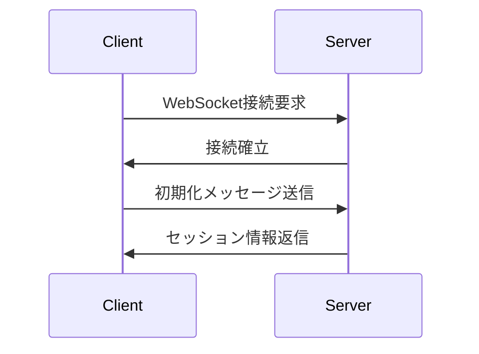

# 4DX@HOME API仕様書

## 1. API概要

### 1.1 基本情報
- **API種別**: WebSocket API (WSS)
- **ベースURL**: `wss://4dx-home.example.com/ws`
- **プロトコル**: WebSocket Secure (WSS)
- **データ形式**: JSON
- **文字エンコーディング**: UTF-8

### 1.2 認証方式
- **認証**: セッションコードベース（ユーザー認証なし）
- **セッション管理**: サーバー側で一意コード発行・管理
- **有効期限**: セッション開始から24時間

### 1.3 通信フロー概要
1. **デバイスハブ接続** → サーバーがセッションコード発行
2. **Webアプリ接続** → セッションコードでペアリング
3. **同期通信** → リアルタイムでの同期データ送信

## 2. WebSocket接続

### 2.1 接続エンドポイント
```
wss://4dx-home.example.com/ws
```

### 2.2 接続パラメータ
- **User-Agent**: クライアント識別用
- **Origin**: CORS対応（Webアプリのみ）

### 2.3 接続確立フロー


## 3. メッセージ形式

### 3.1 基本メッセージ構造
```json
{
  "event": "event_name",
  "data": {
    // イベント固有データ
  },
  "timestamp": "2025-10-11T10:30:00.123Z"
}
```

### 3.2 エラーレスポンス
```json
{
  "event": "error",
  "error": {
    "code": "ERROR_CODE",
    "message": "エラー詳細メッセージ",
    "details": {}
  },
  "timestamp": "2025-10-11T10:30:00.123Z"
}
```

## 4. デバイスハブAPI

### 4.1 ハブ登録
デバイスハブがサーバーに接続時に送信。

**送信メッセージ**:
```json
{
  "event": "device_register",
  "data": {
    "device_type": "hub",
    "device_id": "rpi_001",
    "capabilities": ["vibration", "scent"],
    "version": "1.0.0"
  }
}
```

**受信レスポンス**:
```json
{
  "event": "session_created",
  "data": {
    "session_code": "A4B7",
    "session_id": "ses_1234567890",
    "expires_at": "2025-10-12T10:30:00.123Z"
  }
}
```

### 4.2 ステータス更新
デバイスの状態変更を通知。

**送信メッセージ**:
```json
{
  "event": "device_status",
  "data": {
    "status": "ready", // ready, busy, error
    "actuators": {
      "vibration": "connected",
      "scent": "disconnected"
    },
    "system_info": {
      "cpu_usage": 15.2,
      "memory_usage": 45.8,
      "temperature": 42.1
    }
  }
}
```

### 4.3 制御コマンド受信
サーバーからの制御コマンドを受信。

**受信メッセージ**:
```json
{
  "event": "actuator_command",
  "data": {
    "action": "vibrate",
    "parameters": {
      "intensity": 0.8,
      "duration": 500,
      "pattern": "pulse"
    },
    "target": "vibration_motor_1"
  }
}
```

**応答メッセージ**:
```json
{
  "event": "command_ack",
  "data": {
    "command_id": "cmd_1234567890",
    "status": "executed", // executed, failed, ignored
    "execution_time": 523
  }
}
```

## 5. WebアプリAPI

### 5.1 セッション参加
ユーザーがセッションコードを入力してペアリング。

**送信メッセージ**:
```json
{
  "event": "session_join",
  "data": {
    "session_code": "A4B7",
    "user_settings": {
      "vibration": true,
      "scent": false,
      "volume": 0.7
    },
    "client_info": {
      "user_agent": "Mozilla/5.0...",
      "screen_size": "1920x1080"
    }
  }
}
```

**受信レスポンス**:
```json
{
  "event": "session_joined",
  "data": {
    "session_id": "ses_1234567890",
    "device_status": {
      "hub": "connected",
      "actuators": ["vibration"]
    },
    "available_experiences": ["vibration", "scent"],
    "video_info": {
      "url": "https://example.com/video.mp4",
      "duration": 180.5
    }
  }
}
```

### 5.2 セッション開始
動画再生開始を通知。

**送信メッセージ**:
```json
{
  "event": "session_start",
  "data": {
    "video_ready": true,
    "selected_experiences": {
      "vibration": true,
      "scent": false
    },
    "quality_settings": {
      "video_quality": "720p",
      "sync_precision": "high"
    }
  }
}
```

### 5.3 同期データ送信
動画再生中の継続的な同期データ。

**送信メッセージ**:
```json
{
  "event": "playback_sync",
  "data": {
    "current_time": 45.234,
    "playback_rate": 1.0,
    "state": "playing", // playing, paused, seeking
    "buffer_health": 0.95
  }
}
```

### 5.4 再生制御イベント
ユーザーの再生操作を通知。

**送信メッセージ**:
```json
{
  "event": "playback_control",
  "data": {
    "action": "play", // play, pause, seek
    "time": 30.5,
    "user_initiated": true
  }
}
```

## 6. サーバー内部処理

### 6.1 セッション管理

**セッション生成**:
```python
def create_session() -> dict:
    return {
        "session_id": generate_uuid(),
        "session_code": generate_code(4),  # A4B7形式
        "created_at": datetime.utcnow(),
        "expires_at": datetime.utcnow() + timedelta(hours=24),
        "hub_client": None,
        "webapp_client": None,
        "status": "waiting_for_webapp",
        "user_settings": {},
        "sync_data": load_sync_data()
    }
```

**ペアリング処理**:
```python
def pair_clients(session_code: str, webapp_client):
    session = sessions.get_by_code(session_code)
    if session and session.hub_client:
        session.webapp_client = webapp_client
        session.status = "paired"
        return True
    return False
```

### 6.2 同期処理

**同期イベント検索**:
```python
def find_sync_events(current_time: float, user_settings: dict) -> list:
    events = []
    for event in sync_data:
        if (event.time <= current_time < event.time + 0.1 and
            user_settings.get(event.type, False)):
            events.append(event)
    return events
```

**コマンド生成**:
```python
def create_actuator_command(event: SyncEvent) -> dict:
    return {
        "event": "actuator_command",
        "data": {
            "action": event.action,
            "parameters": {
                "intensity": event.intensity,
                "duration": event.duration
            }
        }
    }
```

## 7. エラーハンドリング

### 7.1 エラーコード一覧

| コード | 説明 | 対処法 |
|--------|------|--------|
| `SESSION_NOT_FOUND` | セッションコードが無効 | コードの再入力 |
| `SESSION_EXPIRED` | セッションが有効期限切れ | 新しいセッション作成 |
| `DEVICE_DISCONNECTED` | デバイスハブが切断 | デバイス再接続 |
| `INVALID_MESSAGE_FORMAT` | メッセージ形式エラー | メッセージ再送 |
| `SYNC_DATA_NOT_FOUND` | 同期データが見つからない | 動画の確認 |

### 7.2 エラーレスポンス例

**セッション不見当**:
```json
{
  "event": "error",
  "error": {
    "code": "SESSION_NOT_FOUND",
    "message": "指定されたセッションコードは存在しません",
    "details": {
      "session_code": "A4B7",
      "suggestion": "コードを確認して再入力してください"
    }
  }
}
```

## 8. レート制限

### 8.1 制限ポリシー
- **同期メッセージ**: 最大 10 msg/sec
- **制御コマンド**: 最大 5 cmd/sec  
- **ステータス更新**: 最大 1 msg/sec

### 8.2 制限超過時の動作
```json
{
  "event": "rate_limit_exceeded",
  "error": {
    "code": "RATE_LIMIT_EXCEEDED",
    "message": "送信レートが制限を超えています",
    "details": {
      "limit": "10/sec",
      "retry_after": 1000
    }
  }
}
```

## 9. 接続監視・ヘルスチェック

### 9.1 Pingメッセージ
定期的な接続確認用。

**送信**:
```json
{
  "event": "ping",
  "data": {
    "timestamp": "2025-10-11T10:30:00.123Z"
  }
}
```

**応答**:
```json
{
  "event": "pong",
  "data": {
    "timestamp": "2025-10-11T10:30:00.123Z",
    "server_time": "2025-10-11T10:30:00.125Z"
  }
}
```

### 9.2 接続状態監視
```json
{
  "event": "connection_status",
  "data": {
    "status": "connected", // connected, reconnecting, disconnected
    "quality": "good", // excellent, good, poor, critical
    "latency": 45,
    "packet_loss": 0.1
  }
}
```

## 10. セキュリティ

### 10.1 WSS通信
- **プロトコル**: TLS 1.3
- **証明書**: Let's Encrypt SSL証明書
- **CORS**: 許可されたオリジンのみ接続可能

### 10.2 データ検証
```python
def validate_message(message: dict) -> bool:
    # メッセージ形式検証
    required_fields = ["event", "data"]
    if not all(field in message for field in required_fields):
        return False
    
    # イベント名検証
    valid_events = ["session_join", "playback_sync", ...]
    if message["event"] not in valid_events:
        return False
        
    return True
```

---

**更新日**: 2025年10月11日  
**バージョン**: 1.0  
**API仕様策定者**: 4DX@HOME開発チーム