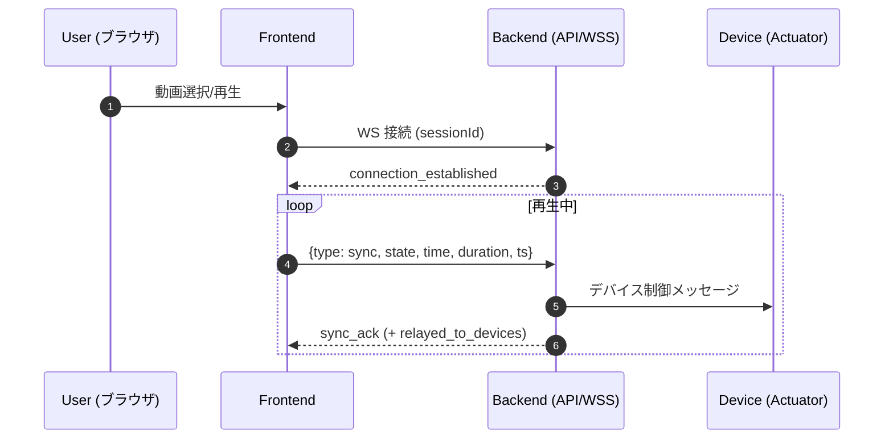

# 4DX@HOME フロントエンド仕様書

> **⚠️ Hack Day時点の仕様書**  
> この文書はJPHACKS 2025 Hack Day（2025年10月11-12日）時点の仕様です。  
> 最新の実装については以下を参照してください：
> - **最新フロントエンド実装**: `../../../frontend/4dathome-app/`
> - **本番デプロイ**: https://kz-2504.onrender.com (Render)
> - **デバッグ環境**: `../../../debug_frontend/`（Cloud Run API連携テスト用）
> - **本番フロー仕様**: `../../../debug_frontend/PRODUCTION_FLOW_SETUP.md`

## 1. 概要

4DX@HOME の Web フロントエンドは、動画の再生状態・時刻情報をリアルタイムに送信し、バックエンド経由で物理デバイスへ同期させることを目的としています。直感的な UI と軽量なクライアント構成（Vite）を採用しています。

* プロジェクト名: 4DX@HOME
* コンセプト: 映像解析で得た同期データをサーバ経由でデバイスへ配信し、動画と物理フィードバックをフレーム近傍で同期

### 1.1 デモ（UI のみ体験可）
- デモURL: https://kz-2504.onrender.com/
- 説明:
  - **ID 登録は実機デバイスが必要**です（セッションIDはデバイス同期用）。
  - デバイスがなくても、トップ画面の **Register** を押すと、**UI を見て操作するデモ**を体験できます（同期は行われません）。
  - 実機連携時は、表示されるセッションIDをデバイス側にも設定してください。

---

## 2. スクリーンショット & UI（各ページ）


| ページ                          | 説明                     | 画像例                               |
| ---------------------------- | ---------------------- | ---------------------------------- |
| ホーム (`HomePage`)             | キャッチコピー、開始導線           |        |
| セッション（ペアリング） (`PairingPage`) | セッションコード入力、接続状態        |  |
| 動画選択 (`SelectPage`)          | 一覧/カテゴリ/ランキング          |    |
| 動画視聴（プレイヤー） (`PlayerPage`)   | 再生/一時停止・シーク・音量・フルスクリーン |    |

---

## 3. 技術スタック

### 3.1 主要フレームワーク・ライブラリ

* React 18.3.1（UI）
* TypeScript 5.9.3（型安全）
* React Router DOM 6.30.1（SPA ルーティング）

### 3.2 開発・ビルドツール

* Vite 7.1.9（高速ビルド）
* PostCSS 8.5.6（CSS 処理）
* Tailwind CSS 4.1.14（ユーティリティファースト）

### 3.3 開発環境

* @vitejs/plugin-react 4.7.0
* @types/react, @types/react-dom

---

## 4. アーキテクチャ

### 4.1 ディレクトリ構造

```
frontend/4dathome-app/
├── index.html
├── package.json
├── tsconfig.json
├── vite.config.ts
├── postcss.config.(js|ts)
├── tailwind.config.ts
└── src/
    ├── App.tsx              # メインアプリ
    ├── main.tsx             # エントリポイント
    ├── components/          # 再利用 UI
    │   └── AppHeader.tsx
    ├── pages/
    │   ├── HomePage.tsx
    │   ├── PairingPage.tsx
    │   ├── SelectPage.tsx
    │   └── PlayerPage.tsx
    ├── hooks/
    ├── types/
    ├── utils/
    └── assets/
```

### 4.2 ルーティング構成

| パス            | コンポーネント       | 用途                   |
| ------------- | ------------- | -------------------- |
| `/`           | `HomePage`    | メインページ               |
| `/session`    | `PairingPage` | セッションコード入力・デバイスペアリング |
| `/selectpage` | `SelectPage`  | 動画選択・ランキング閲覧         |
| `/player`     | `PlayerPage`  | 動画再生・デバイス同期          |

---

## 5. 主要機能

### 5.1 セッション管理

* 6 桁コードによるペアリング
* デバイス接続状態の監視と UI 反映
* WebSocket の自動接続/再接続

### 5.2 動画管理

* 一覧/カテゴリ/ランキング表示
* メタデータ・サムネイル
* 選択 → プレイヤー遷移

### 5.3 動画再生制御

* HTML5 Video（ネイティブ）
* 再生/一時停止・シーク・音量
* フルスクリーン対応（モバイル/デスクトップ）
* タイムスタンプ送信による同期

### 5.4 WebSocket 通信

* 双方向リアルタイム通信（JSON）
* 接続断時の自動復旧
* 再生状態（`play/pause/seeking/seeked`）と時刻の共有

---

## 6. データフロー

1. セッション作成 → セッションコード生成 → デバイス待機
2. 動画選択 → メタデータ取得 → 4DX 効果データ準備
3. 再生開始 → WebSocket 接続 → リアルタイム同期開始
4. 再生制御 → タイムスタンプ送信 → デバイス効果発動

**シーケンス図（Mermaid）**



---

## 7. 今後の拡張予定

* ユーザー設定
* 視聴履歴・お気に入り
* レスポンシブ最適化
* ストリーム再生の実行

---

## 8. クイックスタート（ローカル）

```bash
# Node 18+ 推奨（Corepack 有効化）
corepack enable

# 1) 依存関係のインストール
pnpm install    # npm / yarn でも可

# 2) 環境変数の設定
cp .env.example .env   # 後述のキーを編集

# 3) 開発サーバ起動
pnpm dev
# http://localhost:5173 にアクセス
```

---

## 9. 環境変数（.env / .env.example）

```env
# バックエンドHTTP/HTTPSエンドポイント
VITE_API_ORIGIN=https://fourdk-backend-xxxxxxxxxx-asia-northeast1.run.app

# 再生同期WebSocket（末尾に /<session_id> を連結）
VITE_WS_SYNC_BASE=wss://fourdk-backend-xxxxxxxxxx-asia-northeast1.run.app/api/playback/ws/sync

# 既定のセッションID（デモ用・任意）
VITE_DEFAULT_SESSION_ID=demo_session
```

- `VITE_API_ORIGIN`: デバイス情報・制御APIのベースURL  
- `VITE_WS_SYNC_BASE`: 再生同期用WSのベースURL（クライアント側でセッションIDを連結）  
- `VITE_DEFAULT_SESSION_ID`: デモ接続で使う既定セッションID（任意）

---

## 10. スクリプト（package.json）

```json
{
  "scripts": {
    "dev": "vite",
    "build": "vite build",
    "preview": "vite preview --port 4173"
  }
}
```

---

## 11. 同期プロトコル（WebSocket）

### 11.1 Client → Server 例

```json
{
  "type": "sync",
  "state": "play",
  "time": 12.34,
  "duration": 123.45,
  "ts": 1730000000000
}
```

### 11.2 Server → Client 例

```json
{
  "type": "sync_ack",
  "session_id": "demo_session",
  "received_state": "play",
  "server_time": "2025-10-12T12:34:56.789Z",
  "relayed_to_devices": true
}
```

**備考**  
- `state`: `play | pause | seeking | seeked`  
- `time`: 現在の再生位置（秒）  
- `duration`: コンテンツ総尺（秒）  
- `ts`: クライアント送信時刻（ミリ秒・UNIX TIME）

---

## 12. デプロイ（Render / Static Sites）

本フロントエンドは **Render** の Static Site でのホスティングを想定しています。

- **Build Command**: `pnpm install && pnpm build`  
- **Publish Directory**: `dist`  
- **Routing（SPA）**: 404 時は `index.html` へフォールバック（Render の Redirects/Rewrites 設定）  
- **環境変数**: `VITE_` プレフィックスの値は **ビルド時** に注入されます（変更時は再ビルド）

> 既存デモ: https://kz-2504.onrender.com/

---

## 6. 今後の開発について

1. より簡単なデバイスとの接続
2. 動画再生の軽量化
3. パーソナライズされたランキングの作成
4. 評価機能の実装
5. 検索機能の実装
6. レスポンシブへの対応
7. 同期機能の改善
8. 倍速再生への対応

---
