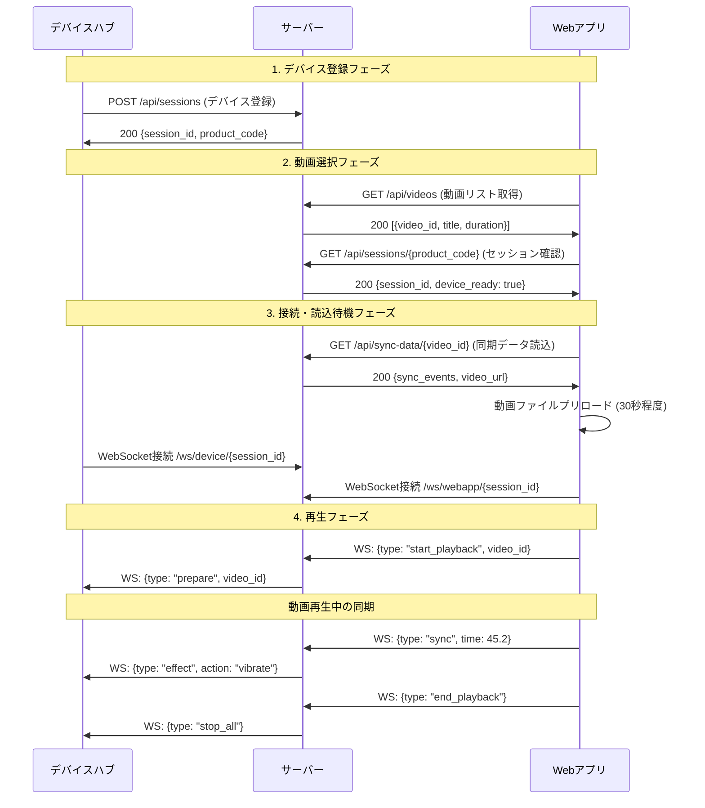

# 4DX@HOME バックエンド要件定義書

## 📋 **システム概要**

### **プロジェクト名**
4DX@HOME - WebSocket リアルタイム体験配信システム

### **目的・背景**
- 映画館の4DX体験を自宅で再現するための同期システム
- Raspberry Pi ベースのデバイスハブと Web アプリを WebSocket で接続
- ビデオコンテンツに同期した振動・香りなどの演出を提供

### **システム構成**
```
[Web App] ←→ [Backend Server] ←→ [Device Hub (RaspberryPi)]
   ↓              ↓                     ↓
 動画再生      WebSocket処理        アクチュエーター制御
```

---

## 🎯 **デモシナリオ機能要件**

### **デモフロー**: デバイス登録 → 動画選択 → 接続・読込待機 → 再生



### **1. 画面遷移対応API設計**

#### **1.1 フェーズ1: デバイス登録**
- **API**: `POST /api/sessions`
- **機能**: デバイスハブ起動時のセッション作成・製品コード登録
- **入力**: `{product_code: "DH001", capabilities: ["vibration"]}`
- **出力**: `{session_id: "ses_123", product_code: "DH001"}`

#### **1.2 フェーズ2: 動画選択**  
- **API**: `GET /api/videos`
- **機能**: 利用可能な動画リスト提供
- **出力**: `[{video_id: "demo_video", title: "サンプル動画", duration: 60}]`

- **API**: `GET /api/sessions/{product_code}`
- **機能**: 製品コードでセッション検索・デバイス状態確認
- **出力**: `{session_id: "ses_123", device_connected: true, status: "ready"}`

#### **1.3 フェーズ3: 接続・読込待機**
- **API**: `GET /api/sync-data/{video_id}`
- **機能**: 選択された動画の同期データ＋動画URL提供
- **出力**: `{video_id, duration, video_url, sync_events: [{time, action, intensity}]}`
- **Webアプリ処理**: 動画ファイルのプリロード実行（30秒程度のデモ動画）

#### **1.4 フェーズ4: 再生状態管理**
- **状態遷移**: `registered` → `video_selected` → `connected` → `playing` → `ended`
- **管理**: メモリ内辞書（製品コード→セッション情報マッピング）

### **2. デモ用通信設計（シンプル化）**

#### **2.1 使用プロトコル（2種類のみ）**

##### **HTTP REST API** (画面遷移サポート)
- `POST /api/sessions` - デバイス登録・セッション作成
- `GET /api/videos` - 動画リスト取得
- `GET /api/sessions/{product_code}` - セッション検索・状態確認  
- `GET /api/sync-data/{video_id}` - 同期データ取得

##### **WebSocket** (リアルタイム通信)
- `/ws/device/{session_id}` - デバイス制御チャネル
- `/ws/webapp/{session_id}` - Webアプリ同期チャネル

#### **2.2 デモ用メッセージ仕様**

##### **WebSocket メッセージ (デバイス)**
```json
// サーバー→デバイス (制御コマンド)
{
  "type": "effect_command",
  "action": "vibrate", 
  "intensity": 75,
  "duration": 1000
}

// デバイス→サーバー (状態報告)  
{
  "type": "status",
  "ready": true,
  "active_effects": ["vibration"]
}
```

##### **WebSocket メッセージ (Webアプリ)**
```json
// Webアプリ→サーバー (動画同期)
{
  "type": "playback_sync",
  "current_time": 45.234,
  "state": "playing"
}

// サーバー→Webアプリ (制御応答)
{
  "type": "sync_response", 
  "acknowledged": true
}
```

### **3. デバイスハブ API（画面遷移対応）**

#### **3.1 デバイス登録 (HTTP POST) - フェーズ1**
- **エンドポイント**: `POST /api/sessions`
- **タイミング**: デバイスハブ起動時
- **入力**:
  ```json
  {
    "product_code": "DH001",
    "capabilities": ["vibration"],
    "device_info": {
      "version": "1.0.0",
      "ip_address": "192.168.1.100"
    }
  }
  ```
- **出力**:
  ```json
  {
    "session_id": "ses_123",
    "product_code": "DH001",
    "status": "registered",
    "websocket_url": "/ws/device/ses_123"
  }
  ```

#### **3.2 リアルタイム制御 (WebSocket) - フェーズ3,4**
- **エンドポイント**: `/ws/device/{session_id}`
- **接続タイミング**: Webアプリが接続・読込待機画面に入った時

- **受信メッセージ** (サーバー→デバイス):
  ```json
  // 再生準備
  {
    "type": "prepare_playback",
    "video_id": "demo_video"
  }
  
  // エフェクト実行
  {
    "type": "effect_command",
    "action": "vibrate",
    "intensity": 75,
    "duration": 1000
  }
  ```

- **送信メッセージ** (デバイス→サーバー):
  ```json
  // 接続確認
  {
    "type": "device_connected"
  }
  
  // 準備完了
  {
    "type": "ready_for_playback"
  }
  ```

### **4. Web アプリ API（画面遷移対応）**

#### **4.1 動画リスト取得 (HTTP GET) - フェーズ2**
- **エンドポイント**: `GET /api/videos`
- **タイミング**: 動画選択画面表示時
- **出力**:
  ```json
  [
    {
      "video_id": "demo_video",
      "title": "デモ動画（30秒）",
      "duration": 30.0,
      "video_size": 15728640,
      "thumbnail": "/assets/thumbnails/demo_thumbnail.jpg"
    }
  ]
  ```

#### **4.2 セッション検索 (HTTP GET) - フェーズ2**
- **エンドポイント**: `GET /api/sessions/{product_code}`
- **タイミング**: 製品コード入力後
- **出力**:
  ```json
  {
    "session_id": "ses_123",
    "product_code": "DH001", 
    "device_connected": true,
    "status": "registered",
    "websocket_url": "/ws/webapp/ses_123"
  }
  ```

#### **4.3 同期データ・動画URL取得 (HTTP GET) - フェーズ3**  
- **エンドポイント**: `GET /api/sync-data/{video_id}`
- **タイミング**: 接続・読込待機画面で同期データ＋動画URL取得
- **Webアプリ処理**: レスポンス受信後、即座に動画プリロード開始
- **出力**:
  ```json
  {
    "video_id": "demo_video",
    "duration": 30.0,
    "video_url": "/assets/videos/demo_video.mp4",
    "video_size": 15728640,
    "sync_events": [
      {"time": 5.2, "action": "vibrate", "intensity": 50, "duration": 1000},
      {"time": 12.5, "action": "vibrate", "intensity": 80, "duration": 1500},
      {"time": 25.8, "action": "vibrate", "intensity": 60, "duration": 800}
    ]
  }
  ```
- **プリロード要件**: 
  - 動画ファイルサイズ: ~15MB (30秒、1080p想定)
  - プリロード完了まで: ~3-5秒 (通常回線)
  - プリロード状況をUI表示

#### **4.4 リアルタイム同期 (WebSocket) - フェーズ3,4**
- **エンドポイント**: `/ws/webapp/{session_id}`
- **接続タイミング**: 接続・読込待機画面

- **送信** (Webアプリ→サーバー):
  ```json
  // 再生開始
  {
    "type": "start_playback",
    "video_id": "demo_video"
  }
  
  // 時刻同期
  {
    "type": "playback_sync",
    "current_time": 45.234,
    "state": "playing"
  }
  
  // 再生終了
  {
    "type": "end_playback"
  }
  ```

- **受信** (サーバー→Webアプリ):
  ```json
  // デバイス準備完了通知
  {
    "type": "device_ready"
  }
  
  // 同期確認
  {
    "type": "sync_acknowledged"
  }
  ```

### **5. 同期処理エンジン（デモ簡素版）**

#### **5.1 動画・同期データ管理**
- **動画リストファイル**: `videos.json` (静的ファイル)
  ```json
  [
    {
      "video_id": "demo_video",
      "title": "デモ動画（30秒）",
      "duration": 30.0,
      "video_url": "/assets/videos/demo_video.mp4",
      "video_size": 15728640,
      "sync_file": "demo_video_sync.json",
      "thumbnail": "demo_thumbnail.jpg"
    }
  ]
  ```

- **同期データファイル**: `{video_id}_sync.json`
  ```json
  {
    "video_id": "demo_video",
    "duration": 30.0,
    "video_url": "/assets/videos/demo_video.mp4",
    "video_size": 15728640,
    "sync_events": [
      {"time": 5.2, "action": "vibrate", "intensity": 50, "duration": 1000},
      {"time": 12.5, "action": "vibrate", "intensity": 80, "duration": 1500},
      {"time": 25.8, "action": "vibrate", "intensity": 60, "duration": 800}
    ]
  }
  ```

- **動画ファイル配置**: `assets/videos/`
  - `demo_video.mp4` (30秒、1080p、~15MB)
  - H.264 エンコード、Web最適化済み
  - Cloud Storage での配信対応

#### **5.2 リアルタイム同期処理**
- **機能**: 動画時間に基づくイベント検索・配信
- **処理ロジック**:
  ```python
  def find_sync_events(video_id: str, current_time: float, tolerance=0.5):
      sync_data = get_sync_data(video_id)
      events = []
      for event in sync_data["sync_events"]:
          if abs(event["time"] - current_time) <= tolerance:
              events.append(event)
      return events
  ```

#### **5.3 セッション状態管理**
- **製品コード→セッション辞書**: `{product_code: session_info}`
- **セッション情報**:
  ```python
  {
    "session_id": "ses_123",
    "product_code": "DH001", 
    "status": "registered|connected|playing|ended",
    "current_video": None,
    "device_ws": None,
    "webapp_ws": None,
    "created_at": datetime
  }
  ```
- **状態遷移管理**: フェーズごとの状態更新

---

## 🛠️ **技術要件**

### **1. パフォーマンス要件**

#### **1.1 デモ用パフォーマンス要件**
- **HTTP API**: < 500ms (デモ許容範囲)
- **WebSocket 同期**: < 100ms (体感可能範囲)
- **同期イベント検索**: < 50ms 
- **JSON ファイル読み込み**: < 1秒 (起動時のみ)
- **動画プリロード**: < 10秒 (30秒・15MB動画)
- **Cloud Storage配信**: CDN活用で高速配信

#### **1.2 デモ用接続要件**
- **最大同時セッション**: 5セッション (デモ用)
- **セッション当たり接続**: 2 (WebApp + DeviceHub)

#### **1.3 デモ用同期精度**
- **動画同期誤差**: ±500ms 以内 (デモ体感レベル)
- **同期データ検索**: ±500ms 範囲でイベント検出

### **2. セキュリティ要件**

#### **2.1 通信暗号化**
- プロトコル: WSS (WebSocket Secure)
- TLS バージョン: 1.3 以上
- 証明書: Let's Encrypt 自動更新

#### **2.2 入力検証**
- **HTTP API**: Pydantic による自動バリデーション
- **WebSocket**: カスタムメッセージバリデーター
- **SSE**: 接続認証・セッション検証
- **製品コード**: DH001-DH999 形式チェック
- **レート制限**: 
  - HTTP API: 100req/min/IP
  - WebSocket: 50msg/sec/session
  - SSE: 10conn/IP

#### **2.3 エラーハンドリング**
- 詳細エラー情報の非表示
- ログ記録とモニタリング
- 適切なHTTPステータスコード

### **3. 運用要件**

#### **3.1 ログ・監視**
- 構造化ログ (JSON形式)
- メトリクス収集 (Prometheus互換)
- ヘルスチェックエンドポイント

#### **3.2 デプロイメント**
- Docker コンテナ化
- Google Cloud Run 対応
- Google Cloud Storage (静的サイト)
- Google Cloud Load Balancer
- CI/CD パイプライン

### **4. フロントエンド統合要件**

#### **4.1 アーキテクチャ構成**
- **フロントエンド**: GCP Cloud Storage (静的サイトホスティング)
- **バックエンド**: GCP Cloud Run (FastAPI WebSocketサーバー)
- **ルーティング**: GCP Load Balancer による統合ルーティング
- **ドメイン**: 単一ドメインでの統合サービス提供

#### **4.2 デモ用ルーティング設計**
```
https://4dx-home.example.com/
├── /                    → Cloud Storage (React SPA)
├── /assets/             → Cloud Storage (静的リソース)
│   ├── /videos/         → Cloud Storage (動画ファイル)
│   └── /thumbnails/     → Cloud Storage (サムネイル)
├── /api/sessions        → Cloud Run (HTTP API)
├── /api/videos          → Cloud Run (HTTP API)  
├── /api/sync-data/      → Cloud Run (HTTP API)
├── /ws/                 → Cloud Run (WebSocket)
└── /health              → Cloud Run (ヘルスチェック)
```

#### **4.3 CORS・セキュリティ**
- **同一ドメイン**: CORS設定不要
- **HTTPS強制**: Let's Encrypt SSL証明書
- **CSP設定**: Content Security Policy適用

---

## 📊 **データモデル**

### **1. セッション (Session)**
```python
@dataclass
class Session:
    session_id: str          # UUID
    product_code: str        # デバイス製品コード (DH001, DH002等)
    created_at: datetime
    expires_at: datetime
    status: SessionStatus    # waiting_for_webapp | paired | active | expired
    hub_client: Optional[WebSocket]
    webapp_client: Optional[WebSocket]
    user_settings: dict
    sync_data: dict
```

### **2. デバイス情報 (DeviceInfo)**
```python
@dataclass
class DeviceInfo:
    product_code: str        # デバイス製品コード (DH001, DH002等)
    device_type: str         # "hub"
    capabilities: List[str]   # ["vibration", "scent"]
    version: str
    last_seen: datetime
    status: DeviceStatus     # connected | disconnected | error
```

### **3. 同期イベント (SyncEvent)**
```python
@dataclass 
class SyncEvent:
    timestamp: float         # 動画時間 (秒)
    action: str             # "vibration" | "scent"
    intensity: int          # 0-100
    duration: float         # 効果継続時間
    device_filter: Optional[List[str]]  # 対象デバイス
```

---

## 🔧 **デモ実装優先度（最小構成）**

### **Phase 1: 画面遷移サポートAPI（HTTP）** ⭐⭐⭐ **必須**
1. **フェーズ1: デバイス登録API**
   - `POST /api/sessions` - デバイス登録・セッション作成

2. **フェーズ2: 動画選択API** 
   - `GET /api/videos` - 動画リスト取得
   - `GET /api/sessions/{product_code}` - セッション検索・状態確認

3. **フェーズ3: 読込API**
   - `GET /api/sync-data/{video_id}` - 同期データ＋動画URL取得
   - 動画プリロード処理（Webアプリ側で実行）

### **Phase 2: リアルタイム通信（WebSocket）** ⭐⭐⭐ **必須**
4. **WebSocket接続管理**
   - `/ws/device/{session_id}` - デバイス制御チャネル（フェーズ3で接続）
   - `/ws/webapp/{session_id}` - Webアプリ同期チャネル（フェーズ3で接続）

5. **画面遷移対応メッセージング**
   - 接続・読込待機: `device_connected`, `ready_for_playback`
   - 再生制御: `start_playback`, `playback_sync`, `effect_command`
   - 終了処理: `end_playback`, `stop_all`

### **Phase 3: 同期・状態管理** ⭐⭐⭐ **必須**
6. **ファイルベースデータ管理**
   - 動画リスト読み込み（`videos.json`）
   - 同期データ読み込み（`{video_id}_sync.json`）
   - 動画ファイル配信（Cloud Storage）
   - 製品コード→セッション辞書管理

### **🚫 デモでは実装しない機能**
- ❌ Server-Sent Events (SSE)
- ❌ HTTP/2 Push
- ❌ 複雑な認証システム  
- ❌ データベース永続化
- ❌ 詳細エラーハンドリング
- ❌ レート制限
- ❌ 監視・ログ機能
- ❌ 設定変更API

### **🎯 デモ成功基準（画面遷移対応）**

#### **フェーズ1: デバイス登録**
1. ✅ デバイスハブ起動 → `POST /api/sessions` → セッション作成・製品コード登録

#### **フェーズ2: 動画選択** 
2. ✅ Webアプリ起動 → `GET /api/videos` → 動画リスト表示
3. ✅ 製品コード入力 → `GET /api/sessions/{product_code}` → デバイス確認

#### **フェーズ3: 接続・読込待機**
4. ✅ 動画選択 → `GET /api/sync-data/{video_id}` → 同期データ＋動画URL取得
5. ✅ 動画プリロード開始 → 30秒動画ファイル読込（~15MB）
6. ✅ WebSocket接続確立 → デバイス・Webアプリ双方接続
7. ✅ 動画プリロード完了 ＋ `device_connected` → `ready_for_playback` → 準備完了

#### **フェーズ4: 再生**
7. ✅ `start_playback` → 再生開始
8. ✅ `playback_sync` → `effect_command` → リアルタイム同期制御
9. ✅ `end_playback` → 全停止・セッション終了

---

## 🌐 **GCP統合アーキテクチャ詳細**

### **1. インフラストラクチャ構成**

#### **1.1 サービス構成図**
```
Internet
    ↓
[Cloud Load Balancer]
    ↓
┌─────────────────────────────────┐
│  https://4dx-home.example.com   │
├─────────────────────────────────┤
│ /          → Cloud Storage      │ (React SPA)
│ /assets/*  → Cloud Storage      │ (CSS, JS, 画像)
│ /api/*     → Cloud Run         │ (REST API)
│ /ws/*      → Cloud Run         │ (WebSocket)
│ /health    → Cloud Run         │ (ヘルスチェック)
└─────────────────────────────────┘
```

#### **1.2 技術スタック詳細**
- **Frontend**: React SPA → Cloud Storage (静的ホスティング)
- **Backend**: FastAPI → Cloud Run (コンテナ)
- **Load Balancer**: Google Cloud Load Balancer
- **SSL**: Google-managed SSL certificates
- **Domain**: Cloud DNS

### **2. ルーティング設定要件**

#### **2.1 パスベースルーティング**
```yaml
# Cloud Load Balancer 設定
backend:
  - pathMatcher: "api-matcher"
    paths: 
      - "/api/*"
      - "/ws/*" 
      - "/health"
    service: "cloud-run-backend"
    
frontend:
  - pathMatcher: "spa-matcher"
    paths: 
      - "/*"
    service: "cloud-storage-bucket"
    defaultRouteAction:
      urlRewrite: "/index.html"  # SPA対応
```

#### **2.2 SPA履歴API対応**
- **課題**: React Router の history API 対応
- **解決**: 全未知パスを `/index.html` にリダイレクト
- **設定**: Cloud Storage バケットの `404.html` → `index.html`

### **3. バックエンド追加実装要件**

#### **3.1 静的ファイル配信機能**
```python
# FastAPI での静的ファイル fallback
from fastapi.staticfiles import StaticFiles

app.mount("/", StaticFiles(directory="static", html=True), name="static")
```

#### **3.2 CORS設定不要化**
- **理由**: 同一ドメインのため CORS 不要
- **簡素化**: WebSocket 接続設定の簡略化
- **セキュリティ**: Origin 検証の追加設定

#### **3.3 ヘルスチェック拡張**
```python
@app.get("/health")
async def health_check():
    return {
        "status": "healthy",
        "timestamp": datetime.utcnow(),
        "version": "1.0.0",
        "services": {
            "websocket": "active",
            "session_manager": "active"
        }
    }
```

### **4. デプロイメント戦略**

#### **4.1 CI/CD パイプライン**
```yaml
# GitHub Actions 例
deploy:
  frontend:
    - build: "npm run build"
    - deploy: "gsutil rsync -r -d dist/ gs://4dx-home-frontend/"
    - cdn: "gcloud compute url-maps invalidate-cdn-cache"
  
  backend:
    - build: "docker build -t gcr.io/project/4dx-backend ."
    - deploy: "gcloud run deploy --image gcr.io/project/4dx-backend"
```

#### **4.2 環境分離**
- **Development**: `dev-4dx-home.example.com`
- **Staging**: `staging-4dx-home.example.com`
- **Production**: `4dx-home.example.com`

---

## 💻 **開発者向け通信仕様**

### **1. フロントエンド開発者向け（React + TypeScript）**

#### **1.1 HTTP API 呼び出し**

##### **動画リスト取得**
```typescript
// /api/videos - 動画リスト取得
interface Video {
  video_id: string;
  title: string;
  duration: number;
  video_size: number;
  thumbnail: string;
}

const getVideos = async (): Promise<Video[]> => {
  const response = await fetch('/api/videos');
  if (!response.ok) throw new Error(`HTTP ${response.status}`);
  return await response.json();
};
```

##### **セッション検索（製品コード入力後）**
```typescript
// /api/sessions/{product_code} - デバイス存在確認
interface SessionInfo {
  session_id: string;
  product_code: string;
  device_connected: boolean;
  status: string;
  websocket_url: string;
}

const findSession = async (productCode: string): Promise<SessionInfo> => {
  const response = await fetch(`/api/sessions/${productCode}`);
  if (!response.ok) throw new Error(`Session not found: ${productCode}`);
  return await response.json();
};
```

##### **同期データ・動画URL取得**
```typescript
// /api/sync-data/{video_id} - 同期データ + 動画URL取得
interface SyncData {
  video_id: string;
  duration: number;
  video_url: string;
  video_size: number;
  sync_events: Array<{
    time: number;
    action: string;
    intensity: number;
    duration: number;
  }>;
}

const getSyncData = async (videoId: string): Promise<SyncData> => {
  const response = await fetch(`/api/sync-data/${videoId}`);
  if (!response.ok) throw new Error(`Sync data not found: ${videoId}`);
  return await response.json();
};
```

#### **1.2 動画プリロード処理**
```typescript
// 動画プリロード（30秒・15MB動画）
const preloadVideo = async (videoUrl: string): Promise<HTMLVideoElement> => {
  return new Promise((resolve, reject) => {
    const video = document.createElement('video');
    video.preload = 'auto';
    video.crossOrigin = 'anonymous';
    
    const onLoadedData = () => {
      video.removeEventListener('loadeddata', onLoadedData);
      video.removeEventListener('error', onError);
      resolve(video);
    };
    
    const onError = () => {
      video.removeEventListener('loadeddata', onLoadedData);
      video.removeEventListener('error', onError);
      reject(new Error('Video preload failed'));
    };
    
    video.addEventListener('loadeddata', onLoadedData);
    video.addEventListener('error', onError);
    video.src = videoUrl;
  });
};
```

#### **1.3 WebSocket 通信**

##### **接続・メッセージハンドラー**
```typescript
// WebSocket接続（接続・読込待機フェーズで実行）
interface WebSocketMessage {
  type: string;
  [key: string]: any;
}

class FourDXWebSocket {
  private ws: WebSocket | null = null;
  private sessionId: string;
  
  constructor(sessionId: string) {
    this.sessionId = sessionId;
  }
  
  connect(): Promise<void> {
    return new Promise((resolve, reject) => {
      this.ws = new WebSocket(`wss://4dx-home.example.com/ws/webapp/${this.sessionId}`);
      
      this.ws.onopen = () => resolve();
      this.ws.onerror = (error) => reject(error);
      
      this.ws.onmessage = (event) => {
        const message: WebSocketMessage = JSON.parse(event.data);
        this.handleMessage(message);
      };
    });
  }
  
  private handleMessage(message: WebSocketMessage) {
    switch (message.type) {
      case 'device_ready':
        console.log('デバイス準備完了');
        // UI更新: 再生ボタン有効化
        break;
      case 'sync_acknowledged':
        console.log('同期確認済み');
        break;
    }
  }
  
  // 再生開始コマンド
  startPlayback(videoId: string) {
    this.send({
      type: 'start_playback',
      video_id: videoId
    });
  }
  
  // 時刻同期コマンド（動画再生中に定期実行）
  syncPlayback(currentTime: number, state: string = 'playing') {
    this.send({
      type: 'playback_sync',
      current_time: currentTime,
      state: state
    });
  }
  
  // 再生終了コマンド
  endPlayback() {
    this.send({
      type: 'end_playback'
    });
  }
  
  private send(message: WebSocketMessage) {
    if (this.ws?.readyState === WebSocket.OPEN) {
      this.ws.send(JSON.stringify(message));
    }
  }
}
```

##### **使用例（画面遷移フロー）**
```typescript
// フロントエンド画面遷移実装例
class FourDXApp {
  private ws: FourDXWebSocket | null = null;
  
  // フェーズ2: 動画選択画面
  async initVideoSelection() {
    const videos = await getVideos();
    // 動画リスト表示
  }
  
  // フェーズ2: 製品コード入力処理
  async connectToDevice(productCode: string) {
    const sessionInfo = await findSession(productCode);
    if (!sessionInfo.device_connected) {
      throw new Error('デバイスが接続されていません');
    }
    return sessionInfo;
  }
  
  // フェーズ3: 接続・読込待機処理
  async preparePlayback(sessionInfo: SessionInfo, videoId: string) {
    // 1. 同期データ取得
    const syncData = await getSyncData(videoId);
    
    // 2. 動画プリロード開始
    const videoElement = await preloadVideo(syncData.video_url);
    
    // 3. WebSocket接続
    this.ws = new FourDXWebSocket(sessionInfo.session_id);
    await this.ws.connect();
    
    // 4. プリロード完了 + デバイス準備完了を待機
    // UI: 「準備完了」表示 → 再生ボタン有効化
  }
  
  // フェーズ4: 再生処理
  startDemo(videoId: string, videoElement: HTMLVideoElement) {
    // 再生開始コマンド送信
    this.ws?.startPlayback(videoId);
    
    // 動画再生開始
    videoElement.play();
    
    // 同期タイマー開始（100ms間隔）
    const syncTimer = setInterval(() => {
      this.ws?.syncPlayback(videoElement.currentTime);
    }, 100);
    
    // 再生終了処理
    videoElement.onended = () => {
      clearInterval(syncTimer);
      this.ws?.endPlayback();
    };
  }
}
```

### **2. デバイスハブ開発者向け（RaspberryPi + Python）**

#### **2.1 HTTP API 呼び出し（デバイス登録）**

##### **セッション作成（起動時実行）**
```python
# デバイスハブ起動時のセッション登録
import requests
import json
from typing import Dict, Any

class FourDXDevice:
    def __init__(self, product_code: str = "DH001"):
        self.product_code = product_code
        self.session_id = None
        self.server_url = "https://4dx-home.example.com"
    
    def register_device(self) -> Dict[str, Any]:
        """フェーズ1: デバイス登録"""
        registration_data = {
            "product_code": self.product_code,
            "capabilities": ["vibration"],
            "device_info": {
                "version": "1.0.0",
                "ip_address": self.get_local_ip()
            }
        }
        
        response = requests.post(
            f"{self.server_url}/api/sessions",
            json=registration_data,
            timeout=10
        )
        
        if response.status_code != 200:
            raise Exception(f"Registration failed: {response.status_code}")
        
        session_info = response.json()
        self.session_id = session_info["session_id"]
        print(f"Device registered: {self.product_code} -> {self.session_id}")
        return session_info
    
    def get_local_ip(self) -> str:
        import socket
        s = socket.socket(socket.AF_INET, socket.SOCK_DGRAM)
        try:
            s.connect(('8.8.8.8', 80))
            ip = s.getsockname()[0]
        finally:
            s.close()
        return ip
```

#### **2.2 WebSocket 通信**

##### **接続・メッセージハンドラー**
```python
# WebSocket通信（フェーズ3で接続開始）
import asyncio
import websockets
import json
from typing import Dict, Any

class FourDXWebSocket:
    def __init__(self, session_id: str, server_url: str = "wss://4dx-home.example.com"):
        self.session_id = session_id
        self.ws_url = f"{server_url}/ws/device/{session_id}"
        self.websocket = None
        self.vibration_controller = VibrationController()
    
    async def connect(self):
        """WebSocket接続開始"""
        self.websocket = await websockets.connect(self.ws_url)
        print(f"Connected to WebSocket: {self.ws_url}")
        
        # 接続通知送信
        await self.send_message({
            "type": "device_connected"
        })
        
        # メッセージ受信ループ開始
        await self.message_loop()
    
    async def message_loop(self):
        """メッセージ受信・処理ループ"""
        async for message in self.websocket:
            try:
                data = json.loads(message)
                await self.handle_message(data)
            except Exception as e:
                print(f"Message handling error: {e}")
    
    async def handle_message(self, message: Dict[str, Any]):
        """受信メッセージ処理"""
        msg_type = message.get("type")
        
        if msg_type == "prepare_playback":
            video_id = message.get("video_id")
            print(f"Prepare for playback: {video_id}")
            
            # デバイス準備処理
            await self.prepare_actuators()
            
            # 準備完了通知
            await self.send_message({
                "type": "ready_for_playback"
            })
            
        elif msg_type == "effect_command":
            # エフェクト実行コマンド
            action = message.get("action")
            intensity = message.get("intensity", 50)
            duration = message.get("duration", 1000)
            
            if action == "vibrate":
                await self.execute_vibration(intensity, duration)
    
    async def execute_vibration(self, intensity: int, duration: int):
        """振動エフェクト実行"""
        print(f"Vibration: intensity={intensity}, duration={duration}ms")
        self.vibration_controller.start_vibration(intensity)
        
        # 指定時間後に停止
        await asyncio.sleep(duration / 1000.0)
        self.vibration_controller.stop_vibration()
    
    async def prepare_actuators(self):
        """アクチュエーター準備処理"""
        # 振動モーター初期化
        self.vibration_controller.initialize()
        print("Actuators prepared")
    
    async def send_message(self, message: Dict[str, Any]):
        """メッセージ送信"""
        if self.websocket:
            await self.websocket.send(json.dumps(message))
```

#### **2.3 アクチュエーター制御（振動モーター）**
```python
# 振動モーター制御クラス
import RPi.GPIO as GPIO
import time
from typing import Optional

class VibrationController:
    def __init__(self, pin: int = 18):
        self.pin = pin
        self.pwm: Optional[GPIO.PWM] = None
        self.is_initialized = False
    
    def initialize(self):
        """GPIO初期化"""
        if not self.is_initialized:
            GPIO.setmode(GPIO.BCM)
            GPIO.setup(self.pin, GPIO.OUT)
            self.pwm = GPIO.PWM(self.pin, 1000)  # 1kHz PWM
            self.is_initialized = True
    
    def start_vibration(self, intensity: int):
        """振動開始（intensity: 0-100）"""
        if self.pwm:
            duty_cycle = max(0, min(100, intensity))
            self.pwm.start(duty_cycle)
            print(f"Vibration started: {intensity}%")
    
    def stop_vibration(self):
        """振動停止"""
        if self.pwm:
            self.pwm.stop()
            print("Vibration stopped")
    
    def cleanup(self):
        """GPIO クリーンアップ"""
        if self.is_initialized:
            self.stop_vibration()
            GPIO.cleanup()
```

#### **2.4 デバイスハブメイン処理**
```python
# デバイスハブメイン処理（main.py）
import asyncio
import signal
import sys

async def main():
    device = FourDXDevice("DH001")
    
    try:
        # フェーズ1: デバイス登録
        session_info = device.register_device()
        
        # フェーズ3: WebSocket接続開始（Webアプリ接続待ち）
        print("Waiting for WebApp connection...")
        websocket_client = FourDXWebSocket(device.session_id)
        
        # WebSocket接続・メッセージループ開始
        await websocket_client.connect()
        
    except KeyboardInterrupt:
        print("Shutting down device...")
    except Exception as e:
        print(f"Error: {e}")
    finally:
        # クリーンアップ
        if 'websocket_client' in locals():
            websocket_client.vibration_controller.cleanup()

def signal_handler(sig, frame):
    print('Interrupt received, shutting down...')
    sys.exit(0)

if __name__ == "__main__":
    signal.signal(signal.SIGINT, signal_handler)
    asyncio.run(main())
```

#### **2.5 必要なPythonパッケージ**
```bash
# requirements.txt
requests==2.31.0
websockets==11.0.3
RPi.GPIO==0.7.1  # Raspberry Pi のみ
asyncio  # 標準ライブラリ
```

#### **2.6 デバイスハブ実行手順**
```bash
# 1. 依存関係インストール
pip install -r requirements.txt

# 2. デバイスハブ起動
python main.py

# 実行ログ例：
# Device registered: DH001 -> ses_123
# Waiting for WebApp connection...
# Connected to WebSocket: wss://4dx-home.example.com/ws/device/ses_123
# Prepare for playback: demo_video
# Actuators prepared
# Vibration: intensity=50, duration=1000ms
```

### **3. 通信フロー総合例**

#### **3.1 デモ実行シーケンス**
```
【デバイスハブ側】           【サーバー】              【Webアプリ側】
      |                        |                        |
1. python main.py              |                        |
2. POST /api/sessions -------> |                        |
3.     <----- 200 OK          |                        |
   {session_id: "ses_123"}     |                        |
4. WebSocket接続待機           |                        |
      |                        |                        |
                               |    5. ユーザーがアプリ起動
                               |    6. GET /api/videos ---->
                               |    7. <---- 200 OK        
                               |       [{video_id: "demo"}]
                               |    8. 製品コード入力: DH001
                               |    9. GET /api/sessions/DH001 -->
                               |   10. <---- 200 OK
                               |       {device_connected: true}
                               |   11. GET /api/sync-data/demo -->
                               |   12. <---- 200 OK
                               |       {video_url, sync_events}
                               |   13. 動画プリロード開始
                               |   14. WebSocket接続: /ws/webapp/ses_123
      |                        |                        |
15. WebSocket接続確立 <--------|--------> WebSocket接続確立
16. {type: "device_connected"} |                        |
17.    <----- {type: "prepare_playback"}               |
18. アクチュエーター準備        |                        |
19. {type: "ready_for_playback"} ---> {type: "device_ready"}
      |                        |                        |
                               |   20. 再生ボタン押下
                               |   21. {type: "start_playback"} -->
22. <----- {type: "prepare"}   |                        |
      |                        |   22. 動画再生開始
      |                        |   23. {type: "playback_sync"} -->
24. <-- {type: "effect_command"}|                        |
25. 振動実行 (intensity=50)     |                        |
      |                        |   26. 同期継続...
      |                        |   27. {type: "end_playback"} -->
28. <----- {type: "stop_all"}  |                        |
29. 全エフェクト停止           |                        |
```

---

## 🧪 **テスト要件**

### **1. 単体テスト**
- セッション管理機能
- WebSocket メッセージハンドリング
- 同期イベント検索アルゴリズム

### **2. 統合テスト**  
- WebSocket 接続・切断テスト
- セッションライフサイクルテスト
- エラーケーステスト

### **3. パフォーマンステスト**
- 同時接続負荷テスト
- 同期精度テスト  
- レスポンス時間測定

### **4. インフラ統合テスト**
- Load Balancer ルーティング確認
- 静的ファイル配信テスト
- SSL証明書・HTTPS接続テスト
- SPA履歴API動作確認

---

## 📈 **非機能要件**

### **1. 可用性**
- 稼働率: 99.0% 以上
- 平均復旧時間 (MTTR): 30分以内

### **2. 拡張性**
- 水平スケール対応設計
- ステートレスアーキテクチャ
- 外部状態管理 (Redis等) 対応準備

### **3. 保守性**
- 明確なコード構造・命名規則
- 包括的なドキュメント
- 自動テスト・CI/CD

---

## 📝 **開発ガイドライン**

### **1. コーディング規約**
- PEP 8 準拠
- Type Hints 必須
- Docstring 記述

### **2. Git ワークフロー**
- Feature ブランチ戦略
- Pull Request レビュー
- 自動テスト必須

### **3. ドキュメント**
- README.md 更新
- API仕様書同期
- 運用手順書作成

---

**作成日**: 2025年1月6日  
**バージョン**: 1.0  
**作成者**: 4DX@HOME 開発チーム