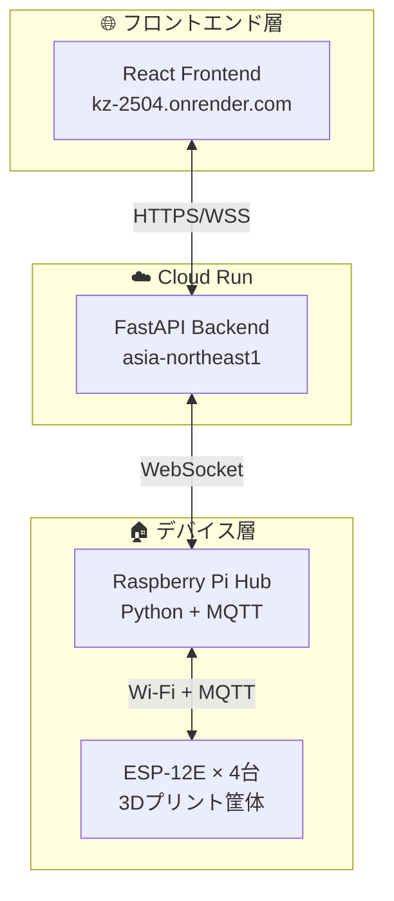
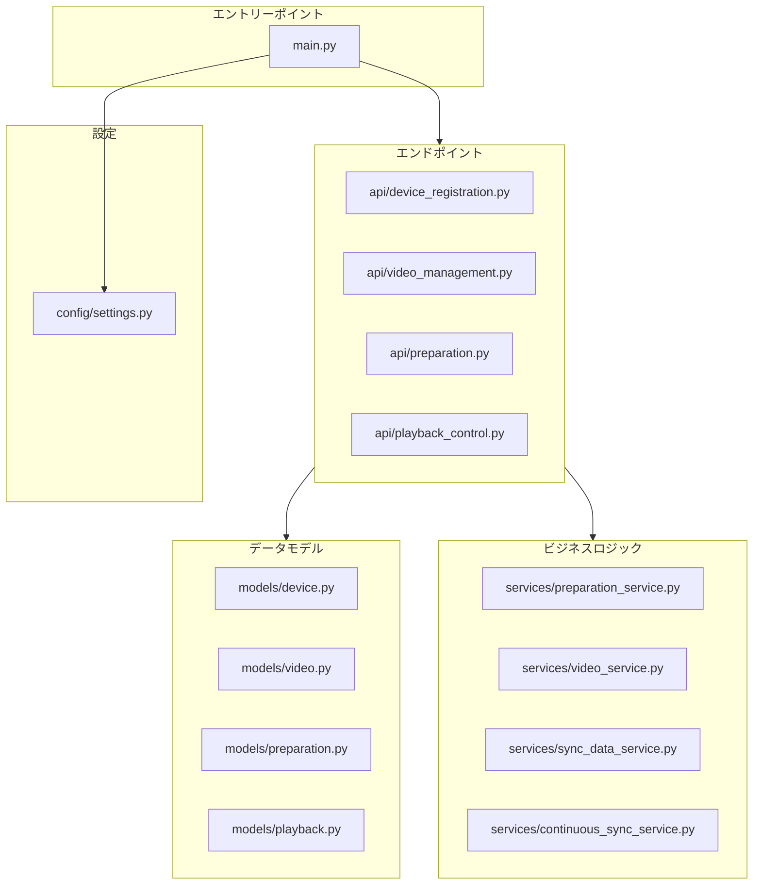
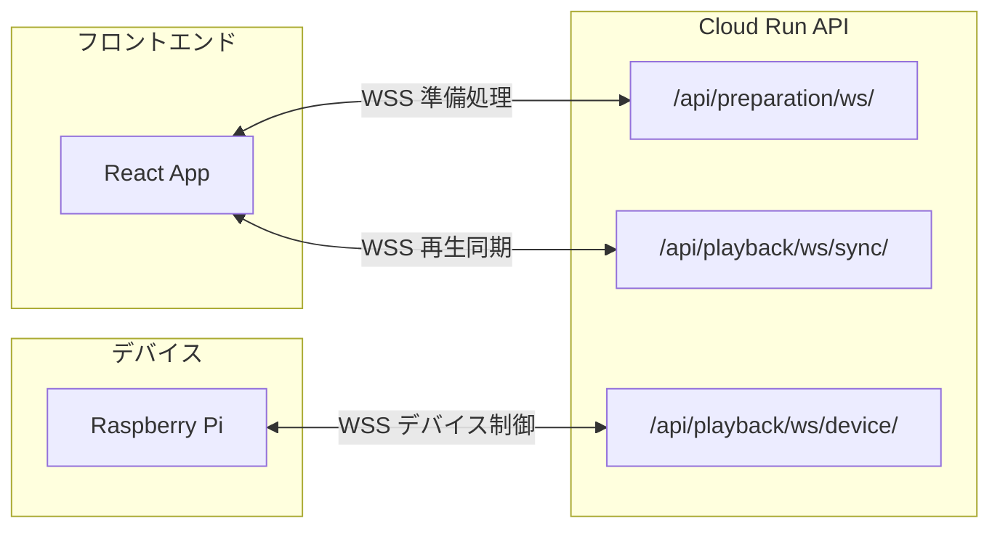
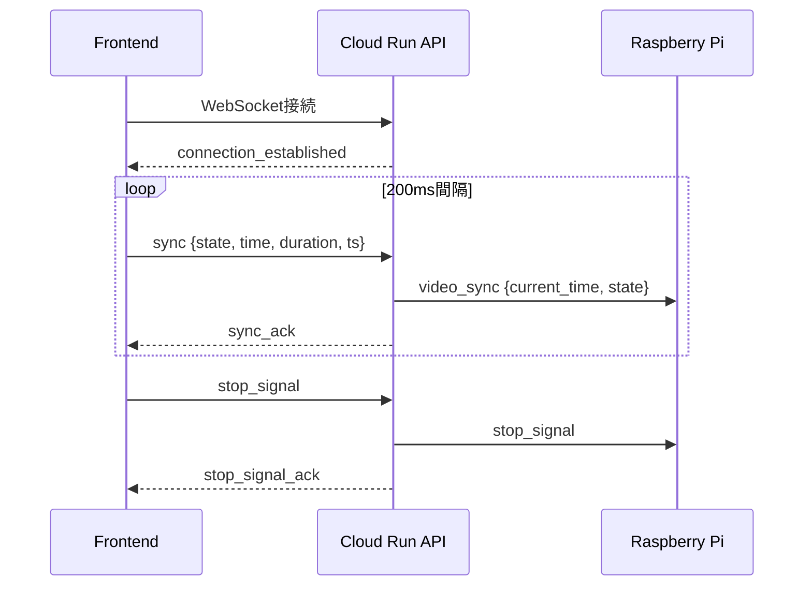
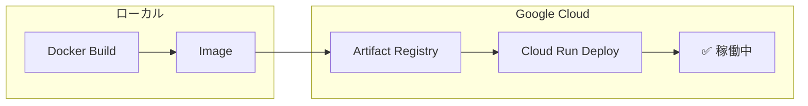

# 4DX@HOME バックエンド仕様書 (AwardDay版)

**バージョン**: 2.0.0  
**作成日**: 2025年11月14日  
**対象イベント**: JPHACKS 2025 Award Day (2025年11月9日開催)  
**システム**: Cloud Run統合版

---

## 概要

4DX@HOME バックエンドは、Google Cloud Run上で稼働するFastAPIベースの3層アーキテクチャAPIサーバーです。フロントエンド（React）とRaspberry Piデバイスハブの中継役として、WebSocketリアルタイム通信と完全なREST APIを提供します。

### システム構成



---

## 技術スタック

### コアフレームワーク
- **FastAPI** 0.104.1 - 高性能非同期Webフレームワーク
- **Uvicorn** 0.24.0 - ASGI サーバー
- **WebSockets** 11.0.3 - リアルタイム双方向通信
- **Pydantic** 2.5.0 - データバリデーション

### HTTP・非同期処理
- **httpx** 0.25.2 - 非同期HTTPクライアント
- **aiohttp** 3.9.1 - 非同期HTTP処理
- **aiofiles** 25.1.0 - 非同期ファイルIO

### 設定・ログ
- **pydantic-settings** 2.1.0 - 環境変数管理
- **python-json-logger** 2.0.7 - 構造化ログ
- **python-multipart** 0.0.6 - マルチパート対応

### テスト
- **pytest** 7.4.3 - テストフレームワーク
- **pytest-asyncio** 0.21.1 - 非同期テスト

---

## Hack Day → Award Day 変更履歴

### 前提: Hack Day時点の状態

- **アーキテクチャ**: 3層構成（Frontend ↔ Cloud Run ↔ Raspberry Pi）完成
- **Cloud Runデプロイ**: 完了済み
- **制約**:
  - セッションID決め打ち
  - デバイス登録APIは存在したが画面連携なし
  - タイムライン送信APIなし（ラズパイ側固定配置）
  - デバイステストAPIは存在したが画面連携なし
  - スタート信号のみ（連続同期なし）
  - ストップ処理なし

### Award Dayでの主要変更

#### 1. エンドツーエンド連携の完全実装
- ✅ **デバイス認証システム**: 製品コード認証をフロントエンド統合
- ✅ **タイムラインJSON送信**: `POST /api/preparation/upload-timeline/{session_id}` 新規実装
- ✅ **デバイステスト統合**: VideoPreparationPageと連携
- ✅ **時間同期制御**: 200ms間隔連続同期メッセージ処理
- ✅ **ストップ処理**: `POST /api/playback/stop/{session_id}` + WebSocket `stop_signal` 実装

#### 2. 新規エンドポイント追加
- ✅ `POST /api/preparation/upload-timeline/{session_id}` - タイムライン動的送信
- ✅ `POST /api/playback/stop/{session_id}` - 緊急停止
- ✅ `POST /api/device/test` - デバイステスト
- ✅ `GET /api/playback/debug/*` - 6デバッグルート

#### 3. 新サービスクラス追加
- ✅ `ContinuousSyncService` - 連続同期処理
- ✅ `PreparationService` - 準備処理管理
- ✅ `SyncDataService` - 同期データ管理
- ✅ `VideoService` - 動画管理

---

## デプロイ情報

### Cloud Run構成

```yaml
サービス名: fdx-home-backend-api
リージョン: asia-northeast1 (東京)
プロジェクトID: fourdk-home-2024
レポジトリ: my-fastapi-repo

URL: https://fdx-home-backend-api-xxxxxxxxxxxx.asia-northeast1.run.app
```

### リソース設定

```yaml
メモリ: 512Mi
CPU: 1 vCPU
タイムアウト: 300秒 (WebSocket長時間接続対応)
並列度: 80 (同時リクエスト数/インスタンス)
最大インスタンス: 20
最小インスタンス: 0 (スケールゼロ対応)
認証: 未認証アクセス許可 (--allow-unauthenticated)
```

### 環境変数

```env
# === アプリケーション設定 ===
APP_NAME="4DX@HOME Backend"
APP_VERSION="1.0.0"
ENVIRONMENT="production"
DEBUG=false

# === サーバー設定 ===
HOST="0.0.0.0"
PORT=8080
RELOAD=true
WORKERS=1
LOG_LEVEL="INFO"

# === CORS設定 ===
CORS_ORIGINS="http://localhost:3000,http://localhost:5173,http://127.0.0.1:3000,http://127.0.0.1:5173,http://localhost:8000,http://127.0.0.1:8000,https://fdx-home-backend-api-xxxxxxxxxxxx.asia-northeast1.run.app"

# === セキュリティ ===
SECRET_KEY="<機密情報・環境変数で設定>"
API_KEY=""

# === WebSocket設定 ===
WEBSOCKET_TIMEOUT=300
MAX_CONNECTIONS=100
PING_INTERVAL=30

# === ファイルパス設定 ===
DATA_PATH="./data"
ASSETS_PATH="../assets"
LOGS_PATH="./logs"
VIDEO_ASSETS_PATH="../assets/videos"
SYNC_DATA_PATH="../assets/sync-data"

# === Cloud Run / GCP設定 ===
CLOUD_PROJECT_ID="fourdk-home-2024"
CLOUD_REGION="asia-northeast1"
BACKEND_API_URL="https://fdx-home-backend-api-xxxxxxxxxxxx.asia-northeast1.run.app"
BACKEND_WS_URL="wss://fdx-home-backend-api-xxxxxxxxxxxx.asia-northeast1.run.app"

# === パフォーマンス設定 ===
REQUEST_TIMEOUT=30
MAX_REQUEST_SIZE=16777216
```

---

## ディレクトリ構造

### モジュール関係図



### ファイル構造

```
backend/
├── app/
│   ├── main.py                      # FastAPIエントリポイント
│   ├── __init__.py
│   │
│   ├── config/
│   │   └── settings.py              # Pydantic環境変数管理
│   │
│   ├── api/                         # REST & WebSocketエンドポイント
│   │   ├── device_registration.py  # デバイス登録API
│   │   ├── video_management.py     # 動画管理API
│   │   ├── preparation.py          # 準備処理API
│   │   ├── playback_control.py     # 再生制御API (NEW)
│   │   └── __init__.py
│   │
│   ├── models/                      # Pydanticモデル
│   │   ├── device.py
│   │   ├── video.py
│   │   ├── preparation.py
│   │   └── playback.py             # (NEW)
│   │
│   └── services/                    # ビジネスロジック
│       ├── preparation_service.py
│       ├── video_service.py
│       ├── sync_data_service.py
│       └── continuous_sync_service.py
│
├── data/                            # データファイル
│   ├── devices.json
│   └── videos/
│
├── assets/                          # 静的アセット
│   ├── thumbnails/
│   └── videos/
│
├── logs/                            # ログファイル
├── requirements.txt                 # Python依存関係
├── Dockerfile.cloudrun              # Cloud Run用Dockerfile
├── env-vars.yaml                    # 環境変数定義
└── DEPLOYMENT_GUIDE.md              # デプロイ手順書
```

---

## API エンドポイント

### システム情報

#### `GET /`
ルートエンドポイント - システム状態確認

**レスポンス**:
```json
{
  "service": "4DX@HOME Backend",
  "version": "1.0.0",
  "environment": "production",
  "status": "running",
  "timestamp": "2025-11-14T12:00:00Z"
}
```

#### `GET /health`
詳細ヘルスチェック

**レスポンス**:
```json
{
  "service": "4DX@HOME Backend",
  "status": "healthy",
  "timestamp": "2025-11-14T12:00:00Z",
  "environment": "production",
  "debug": false,
  "components": {
    "api": "ready",
    "websocket": "ready",
    "cors": "3 origins configured"
  }
}
```

#### `GET /api/version`
APIバージョン・エンドポイント一覧

**レスポンス**:
```json
{
  "api_version": "1.0.0",
  "environment": "production",
  "supported_endpoints": [
    "/",
    "/health",
    "/api/version",
    "/api/device/register",
    "/api/device/info/{product_code}",
    "/api/device/capabilities",
    "/api/videos/available",
    "/api/videos/{video_id}",
    "/api/videos/select",
    "/api/videos/categories/list",
    "/api/preparation/start/{session_id}",
    "/api/preparation/status/{session_id}",
    "/api/preparation/stop/{session_id}",
    "/api/preparation/ws/{session_id}",
    "/api/preparation/health",
    "/api/playback/start/{session_id}",
    "/api/playback/stop/{session_id}",
    "/api/playback/status",
    "/api/playback/connections",
    "/api/playback/ws/sync/{session_id}",
    "/api/playback/ws/device/{session_id}"
  ],
  "documentation": "/docs"
}
```

---

### デバイス管理 (`/api/device/`)

#### `POST /api/device/register`
デバイス登録

**リクエスト**:
```json
{
  "product_code": "DH001"
}
```

**レスポンス**:
```json
{
  "device_id": "device_12345678",
  "device_name": "4DX Home Basic",
  "capabilities": ["VIBRATION", "WIND", "WATER"],
  "status": "registered",
  "registered_at": "2025-11-14T12:00:00Z",
  "session_timeout": 60
}
```

**プロダクトコード一覧**:
- `DH001`: Basic (振動・風・水)
- `DH002`: Standard (Basic + フラッシュ)
- `DH003`: Premium (Standard + カラーLED)

#### `GET /api/device/info/{product_code}`
デバイス詳細情報取得

#### `GET /api/device/capabilities`
対応エフェクト一覧取得

---

### 動画管理 (`/api/videos/`)

#### `GET /api/videos/available`
利用可能動画一覧取得

**レスポンス**:
```json
{
  "videos": [
    {
      "video_id": "demo1",
      "title": "Demo Video 1",
      "description": "First demonstration video",
      "duration": 120,
      "thumbnail": "/assets/thumbnails/demo1.jpg",
      "category": "demo",
      "effects_available": true
    }
  ],
  "categories": ["demo", "action", "adventure"]
}
```

#### `GET /api/videos/{video_id}`
動画詳細取得

#### `POST /api/videos/select`
動画選択・セッション作成

**リクエスト**:
```json
{
  "video_id": "demo1",
  "device_id": "device_12345678"
}
```

**レスポンス**:
```json
{
  "session_id": "session_20251114_120000_demo1",
  "video_url": "/assets/videos/demo1.mp4",
  "sync_data_url": "/assets/sync-data/demo1.json",
  "preparation_started": true,
  "estimated_preparation_time": 30
}
```

---

### 準備処理 (`/api/preparation/`)

#### `POST /api/preparation/start/{session_id}`
準備処理開始

**レスポンス**:
```json
{
  "success": true,
  "message": "Preparation started",
  "session_id": "demo1",
  "websocket_url": "wss://fdx-home-backend-api-xxxxxxxxxxxx.asia-northeast1.run.app/api/preparation/ws/demo1"
}
```

#### `GET /api/preparation/status/{session_id}`
準備状態確認

**レスポンス**:
```json
{
  "session_id": "demo1",
  "status": "ready",
  "device_connected": true,
  "video_selected": true,
  "sync_data_loaded": true
}
```

#### `DELETE /api/preparation/stop/{session_id}`
準備処理停止

#### `POST /api/preparation/upload-timeline/{session_id}` **[NEW]**
タイムラインJSON送信

**リクエスト**:
```json
{
  "video_id": "demo1",
  "timeline_data": {
    "video_id": "demo1",
    "duration": 120.0,
    "events": [
      {
        "t": 5.0,
        "type": "wind",
        "mode": "short",
        "intensity": 80,
        "duration_ms": 2000
      }
    ]
  }
}
```

**レスポンス**:
```json
{
  "success": true,
  "message": "タイムラインを送信しました",
  "session_id": "demo1",
  "video_id": "demo1",
  "size_kb": 2.5,
  "events_count": 15,
  "devices_notified": 2,
  "transmission_time_ms": 120
}
```

#### `GET /api/preparation/health`
準備処理ヘルスチェック

---

### 再生制御 (`/api/playback/`) **[NEW - AwardDay追加]**

#### `POST /api/playback/start/{session_id}`
再生開始通知

**レスポンス**:
```json
{
  "success": true,
  "message": "再生開始信号を送信しました",
  "session_id": "demo1",
  "sent_to_devices": 2
}
```

#### `POST /api/playback/stop/{session_id}` **[NEW]**
再生停止・全アクチュエーター停止

**レスポンス**:
```json
{
  "success": true,
  "message": "ストップ信号を2台のデバイスに送信しました",
  "session_id": "demo1",
  "sent_to_devices": 2,
  "signal_data": {
    "type": "stop_signal",
    "session_id": "demo1",
    "timestamp": 1731571200.000,
    "message": "stop_all_actuators",
    "action": "stop_all"
  }
}
```

**用途**: 
- 動画一時停止時
- 動画終了時
- 緊急停止時

**効果**: 
- 全振動モーター停止
- 全風エフェクト停止
- 全水エフェクト停止
- 全光エフェクト停止
- LED色をREDに戻す（完全OFFにはしない）

#### `GET /api/playback/status`
再生状態取得

#### `GET /api/playback/connections`
WebSocket接続状態取得

---

## WebSocket通信

### エンドポイント構成



#### 1. 準備処理WebSocket
```
WSS /api/preparation/ws/{session_id}
```
**用途**: フロントエンド ↔ Cloud Run API (準備進捗通知・デバイステスト)

#### 2. 再生同期WebSocket
```
WSS /api/playback/ws/sync/{session_id}
```
**用途**: フロントエンド ↔ Cloud Run API (100ms間隔同期)
**クエリパラメータ**: `?hub={hubId}` (オプション: デバイスハブID)

#### 3. デバイス接続WebSocket
```
WSS /api/playback/ws/device/{session_id}
```
**用途**: Cloud Run API ↔ Raspberry Pi Hub (双方向制御・タイムライン送信)

---

### メッセージタイプ一覧

#### 準備処理用

**進捗更新 (Server → Client)**:
```json
{
  "type": "progress_update",
  "data": {
    "component": "video_preparation",
    "progress": 75,
    "status": "preparing",
    "message": "動画データ読み込み中...",
    "timestamp": "2025-11-14T12:00:00Z"
  }
}
```

**状態更新 (Server → Client)**:
```json
{
  "type": "status_update",
  "data": {
    "overall_status": "ready",
    "overall_progress": 100,
    "ready_for_playback": true
  }
}
```

#### 再生同期用 **[NEW]**



**同期メッセージ (Client → Server)**:
```json
{
  "type": "sync",
  "state": "play",
  "time": 45.2,
  "duration": 120.0,
  "ts": 1731571200000
}
```

**送信間隔**: 100ms (環境変数 `VITE_SYNC_INTERVAL_MS` で設定可能)
**state値**: `"play"` | `"pause"` | `"seeking"` | `"seeked"`

**同期ACK (Server → Client)**:
```json
{
  "type": "sync_ack",
  "session_id": "demo1",
  "received_time": 45.2,
  "received_state": "play",
  "server_time": "2025-11-14T12:00:00.789Z",
  "relayed_to_devices": true
}
```

**接続確認 (Server → Client)**:
```json
{
  "type": "connection_established",
  "connection_id": "frontend_demo1_120000",
  "session_id": "demo1",
  "server_time": "2025-11-14T12:00:00Z",
  "message": "WebSocket接続が確立されました"
}
```

**識別メッセージ (Client → Server)** **[NEW]**:
```json
{
  "type": "identify",
  "hub_id": "demo1"
}
```

**ストップ信号 (Client → Server)** **[NEW]**:
```json
{
  "type": "stop_signal",
  "session_id": "demo1",
  "timestamp": 1731571200000
}
```

**ストップACK (Server → Client)** **[NEW]**:
```json
{
  "type": "stop_signal_ack",
  "session_id": "demo1",
  "success": true,
  "sent_to_devices": 2,
  "message": "ストップ信号を2台のデバイスに送信しました"
}
```

#### デバイス制御用 **[NEW]**

**デバイス接続 (Raspberry Pi → Server)**:
```json
{
  "type": "device_connected",
  "device_hub_id": "FDX001",
  "session_id": "demo1",
  "timestamp": "2025-11-14T12:00:00Z"
}
```

**タイムライン送信 (Server → Raspberry Pi)**:
```json
{
  "type": "timeline",
  "session_id": "demo1",
  "timeline": {
    "video_id": "demo1",
    "duration": 120.0,
    "events": [
      {
        "t": 15.5,
        "action": "start",
        "effect": "vibration",
        "mode": "strong",
        "intensity": 0.8
      }
    ]
  }
}
```

**動画同期 (Server → Raspberry Pi)**:
```json
{
  "type": "video_sync",
  "session_id": "demo1",
  "video_time": 45.2,
  "video_state": "play",
  "video_duration": 120.0,
  "client_timestamp": 1731571200000,
  "server_timestamp": 1731571200120
}
```

**デバイステスト (Server → Raspberry Pi)**:
```json
{
  "type": "device_test",
  "session_id": "demo1",
  "test_type": "basic"
}
```

**デバイステスト結果 (Raspberry Pi → Server)**:
```json
{
  "type": "device_test_result",
  "session_id": "demo1",
  "success": true,
  "results": {
    "VIBRATION": "OK",
    "WIND": "OK",
    "WATER": "OK",
    "FLASH": "OK",
    "COLOR": "OK"
  }
}
```

**ストップ信号 (Server → Raspberry Pi)** **[NEW]**:
```json
{
  "type": "stop_signal",
  "session_id": "demo1",
  "timestamp": 1731571200.000,
  "message": "stop_all_actuators",
  "action": "stop_all",
  "source": "websocket"
}
```

---

## Pydanticモデル

### 再生制御関連 (playback.py)

```python
from pydantic import BaseModel, Field
from datetime import datetime

class SyncMessage(BaseModel):
    """フロントエンド同期メッセージ"""
    type: str = "sync"
    state: str = Field(..., description="再生状態 (play, pause, seeking, seeked)")
    time: float = Field(ge=0.0, description="動画再生時刻（秒）")
    duration: float = Field(ge=0.0, description="動画総再生時間（秒）") 
    ts: Optional[int] = Field(None, description="クライアント送信タイムスタンプ（ミリ秒）")

class ConnectionEstablished(BaseModel):
    """WebSocket接続確立応答"""
    type: str = "connection_established"
    connection_id: str
    session_id: str
    server_time: str = Field(default_factory=lambda: datetime.now().isoformat())
    message: str = "WebSocket接続が確立されました"

class SyncAcknowledge(BaseModel):
    """同期確認応答"""
    type: str = "sync_ack"
    session_id: str
    received_time: float
    received_state: str
    server_time: str = Field(default_factory=lambda: datetime.now().isoformat())
    relayed_to_devices: bool = False

class DeviceStatus(BaseModel):
    """デバイス状態情報"""
    type: str = "device_status"
    device_id: str
    status: str = Field(..., description="ready, busy, error, offline")
    json_loaded: bool = Field(False, description="タイムライン読み込み状態")
```

### 準備処理関連 (preparation.py)

```python
from enum import Enum

class ActuatorType(str, Enum):
    """アクチュエータタイプ"""
    VIBRATION = "VIBRATION"  # 振動クッション
    WATER = "WATER"          # 水しぶきスプレー
    WIND = "WIND"            # 風ファン
    FLASH = "FLASH"          # フラッシュライト
    COLOR = "COLOR"          # 色ライト

class PreparationStatus(str, Enum):
    """準備処理状況"""
    NOT_STARTED = "not_started"
    INITIALIZING = "initializing"
    IN_PROGRESS = "in_progress"
    TESTING = "testing"
    COMPLETED = "completed"
    FAILED = "failed"
    TIMEOUT = "timeout"

class ActuatorTestStatus(str, Enum):
    """アクチュエーターテスト状況"""
    PENDING = "pending"
    TESTING = "testing"
    READY = "ready"
    FAILED = "failed"
    TIMEOUT = "timeout"
    UNAVAILABLE = "unavailable"

class ActuatorTestResult(BaseModel):
    """アクチュエーターテスト結果"""
    actuator_type: ActuatorType
    status: ActuatorTestStatus
    response_time_ms: Optional[int]
    test_intensity: Optional[float]
    error_message: Optional[str]
    tested_at: Optional[datetime]

class PreparationState(BaseModel):
    """準備処理統合状態"""
    session_id: str
    overall_status: PreparationStatus
    overall_progress: int  # 0-100
    video_preparation: VideoPreparationInfo
    sync_data_preparation: SyncDataPreparationInfo
    device_communication: DeviceCommunicationInfo
    ready_for_playback: bool
    min_required_actuators_ready: bool
    all_actuators_ready: bool
```

---

## セキュリティ

### CORS設定

```python
app.add_middleware(
    CORSMiddleware,
    allow_origins=settings.get_cors_origins(),
    allow_credentials=True,
    allow_methods=["*"],
    allow_headers=["*"],
)
```

**許可オリジン**:
- `http://localhost:3000` - 開発環境 (React)
- `http://localhost:5173` - Vite開発サーバー
- `http://127.0.0.1:3000` - ローカルホスト (React)
- `http://127.0.0.1:5173` - ローカルホスト (Vite)
- `http://localhost:8000` - デバッグ用
- `http://127.0.0.1:8000` - デバッグ用
- `https://fdx-home-backend-api-xxxxxxxxxxxx.asia-northeast1.run.app` - Cloud Run自身
- `https://kz-2504.onrender.com` - 本番フロントエンド (Render)

### 入力バリデーション

- **Pydantic**: 全リクエストボディを自動検証
- **Path/Query Parameters**: FastAPIの型ヒントで検証
- **WebSocket**: メッセージタイプ・構造を検証

### エラーハンドリング

```python
@app.exception_handler(Exception)
async def global_exception_handler(request, exc):
    logger.error(f"Unhandled exception: {exc}")
    return JSONResponse(
        status_code=500,
        content={
            "error": "internal_server_error",
            "message": "予期しないエラーが発生しました" if settings.is_production() else str(exc)
        }
    )
```

---

## パフォーマンス

### WebSocket接続管理

**実装クラス**: `SimpleWebSocketManager` (playback_control.py)

**主要機能**:
- **接続管理**: `active_connections` (Dict[str, WebSocket])
- **セッション管理**: `session_connections` (Dict[str, Set[str]])
- **並列送信**: `send_to_session()` で全接続に並列メッセージ配信
- **エラーハンドリング**: 送信失敗時の自動クリーンアップ
- **タイムアウト**: 1.5秒で並列送信タイムアウト

### 応答時間目標

- **REST API**: < 100ms (95th percentile)
- **WebSocket同期**: < 50ms (メッセージ処理)
- **並列送信**: 1.5秒タイムアウト
- **Cloud Run → Raspberry Pi**: < 200ms

### 同期精度

- **フロントエンド送信間隔**: 100ms (デフォルト、環境変数で変更可能)
- **Cloud Run処理遅延**: < 50ms
- **Raspberry Pi処理遅延**: ±100ms許容
- **合計同期精度**: ±150ms以内
- **並列送信**: セッション内の全接続に並列メッセージ送信（1.5秒タイムアウト）

### リソース制限

- **メモリ**: 512Mi (Cloud Run設定)
- **CPU**: 1 vCPU
- **タイムアウト**: 300秒 (WebSocket長時間接続)
- **並列度**: 80リクエスト/インスタンス

---

## デプロイ手順



### 1. Dockerイメージビルド

```powershell
cd backend
docker build -f Dockerfile.cloudrun `
  -t asia-northeast1-docker.pkg.dev/fourdk-home-2024/my-fastapi-repo/fdx-home-backend-api:latest `
  .
```

### 2. Artifact Registryプッシュ

```powershell
docker push asia-northeast1-docker.pkg.dev/fourdk-home-2024/my-fastapi-repo/fdx-home-backend-api:latest
```

### 3. Cloud Runデプロイ

```powershell
gcloud run deploy fdx-home-backend-api `
  --image=asia-northeast1-docker.pkg.dev/fourdk-home-2024/my-fastapi-repo/fdx-home-backend-api:latest `
  --region=asia-northeast1 `
  --port=8080 `
  --memory=512Mi `
  --cpu=1 `
  --timeout=300s `
  --concurrency=80 `
  --max-instances=20 `
  --allow-unauthenticated
```

### 4. 環境変数更新

```powershell
gcloud run services update fdx-home-backend-api `
  --region=asia-northeast1 `
  --set-env-vars="ENVIRONMENT=production,DEBUG=false"
```

---

## 開発・テスト

### ローカル実行

```bash
cd backend
pip install -r requirements.txt
python -m app.main
```

**アクセス**: `http://localhost:8080`

### APIドキュメント

- **Swagger UI**: `/docs` (開発環境のみ)
- **ReDoc**: `/redoc` (開発環境のみ)

### ログ確認

```bash
# Cloud Runログ
gcloud run services logs read fdx-home-backend-api \
  --region=asia-northeast1 \
  --limit=50
```

---

## デバッグツール

### debug_frontend

**URL**: http://localhost:5173  
**用途**: Cloud Run API動作確認・WebSocketテスト

**主要機能**:
- デバイス登録テスト
- タイムライン送信テスト
- デバイステスト実行
- 再生同期テスト

### debug_hardware

**URL**: http://localhost:5000  
**用途**: Raspberry Pi動作シミュレーション

**主要機能**:
- WebSocket接続監視
- タイムライン処理確認
- 通信ログ記録

---

## トラブルシューティング

### デプロイエラー

**症状**: イメージプッシュ失敗  
**原因**: Artifact Registryリポジトリ未作成  
**解決策**:
```bash
gcloud artifacts repositories create my-fastapi-repo \
  --repository-format=docker \
  --location=asia-northeast1
```

### WebSocket接続失敗

**症状**: タイムアウトエラー  
**原因**: タイムアウト設定不足  
**解決策**: `--timeout=300s` でデプロイ

### CORS エラー

**症状**: ブラウザでCORSエラー  
**原因**: オリジン未登録  
**解決策**: `.env`の`CORS_ORIGINS`に追加

---

## Award Day以降の変更点

### 追加機能

1. **ストップ処理API** (`POST /api/playback/stop/{session_id}`)
   - 全アクチュエーター即座停止
   - 一時停止・動画終了時に使用
   - REST APIとWebSocketの二重送信対応

2. **タイムラインアップロードAPI** (`POST /api/preparation/upload-timeline/{session_id}`)
   - JSONタイムラインの直接送信
   - デバイス通知と検証機能
   - 送信サイズ・イベント数のレポート

3. **デバイスWebSocket** (`/api/playback/ws/device/{session_id}`)
   - Raspberry Pi専用WebSocket
   - 双方向リアルタイム通信
   - タイムライン自動中継

4. **再生同期WebSocket** (`/api/playback/ws/sync/{session_id}`)
   - フロントエンド→Cloud Run→Raspberry Pi中継
   - 100ms間隔同期 (環境変数で調整可能)
   - ハブID識別機能 (`?hub={hubId}`)
   - 並列メッセージ送信 (1.5秒タイムアウト)

5. **SimpleWebSocketManager**
   - 並列送信による高速配信
   - 自動エラー検出とクリーンアップ
   - セッション単位の接続管理

6. **詳細ログ機能**
   - 構造化JSON出力
   - Cloud Loggingエクスプローラー対応
   - WebSocket接続・切断の詳細ログ

### 改善点

- **WebSocketタイムアウト**: 60秒 → 300秒
- **並列度**: 10 → 80リクエスト/インスタンス
- **メモリ**: 256Mi → 512Mi (WebSocket接続増加対応)
- **同期間隔**: カスタマイズ可能（デフォルト200ms）
- **CORS設定**: 3オリジン → 8オリジン (開発環境拡充)
- **並列送信**: asyncio.gather()による全接続同時配信

---

## 今後の拡張予定

- [ ] Redis統合 (セッション管理)
- [ ] Pub/Sub (スケーラブル通信)
- [ ] Cloud SQL (永続化)
- [ ] 認証・認可 (JWT)
- [ ] レート制限 (API保護)
- [ ] メトリクス収集 (Prometheus)

---

## 関連ドキュメント

- [デプロイガイド](../backend/DEPLOYMENT_GUIDE.md)
- [フロントエンド仕様書](./frontend-specification-awardday.md)
- [ハードウェア仕様書](./hardware-specification-awardday.md)
- [ストップ処理仕様](../debug_frontend/STOP_SIGNAL_SPEC.md)

---

**変更履歴**:

| 日付 | バージョン | 変更内容 |
|-----|----------|---------|
| 2025-11-14 | 2.0.0 | Award Day後の実装を反映した仕様書作成 |
