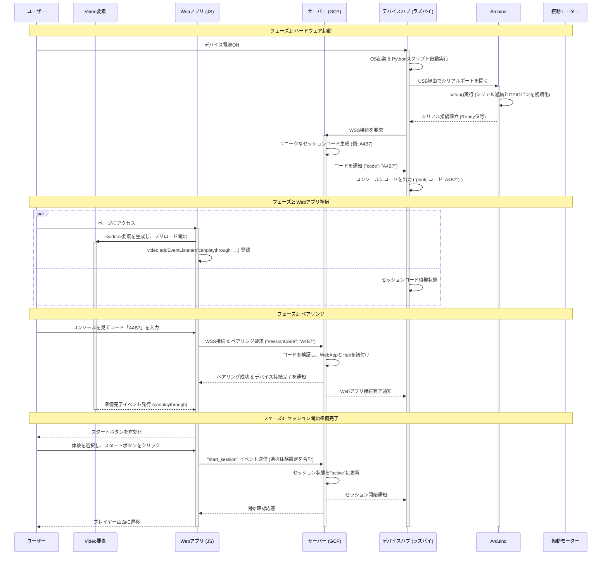
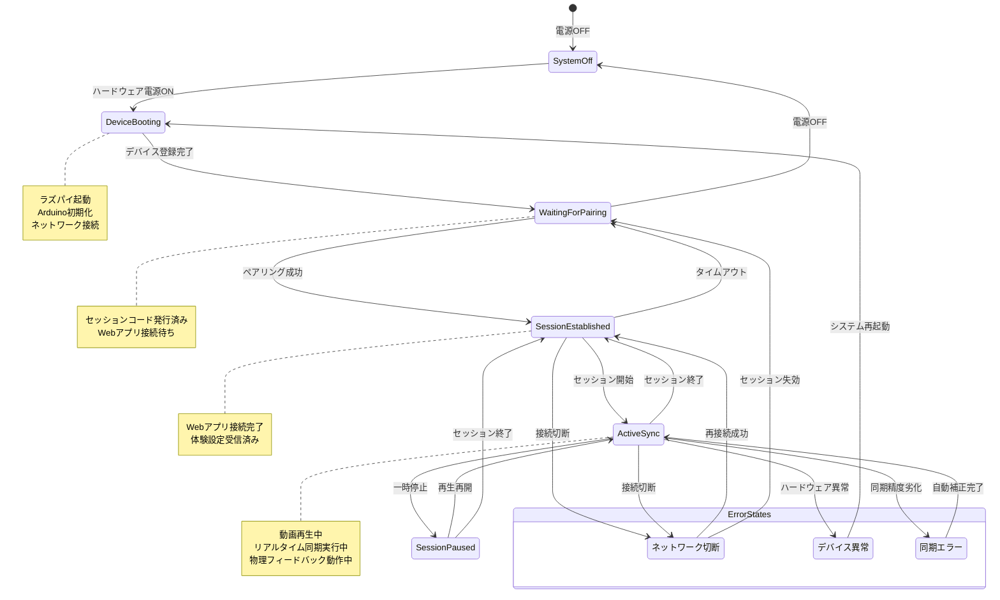
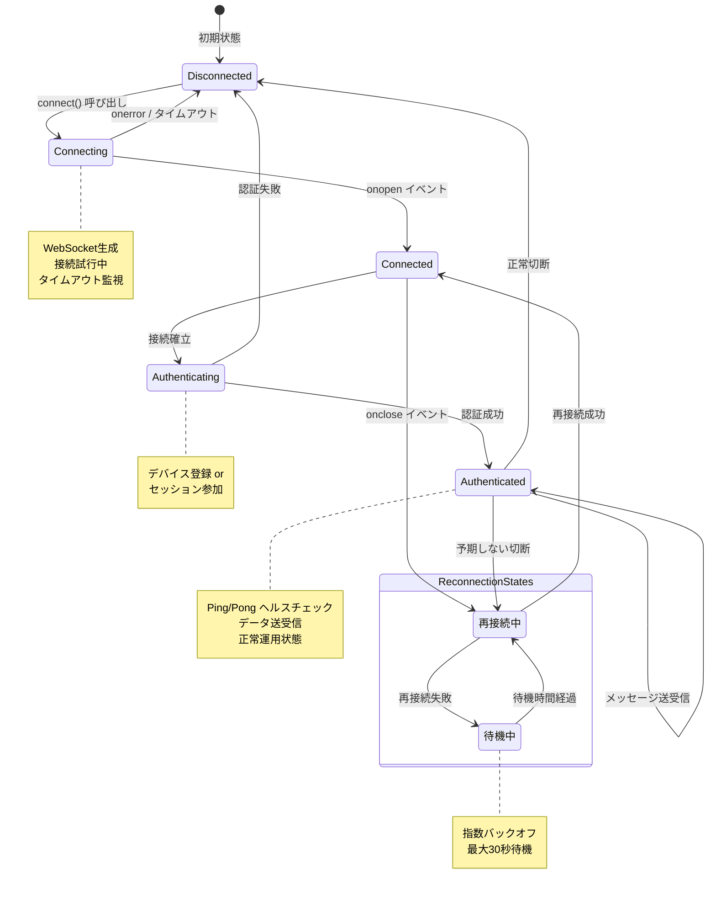
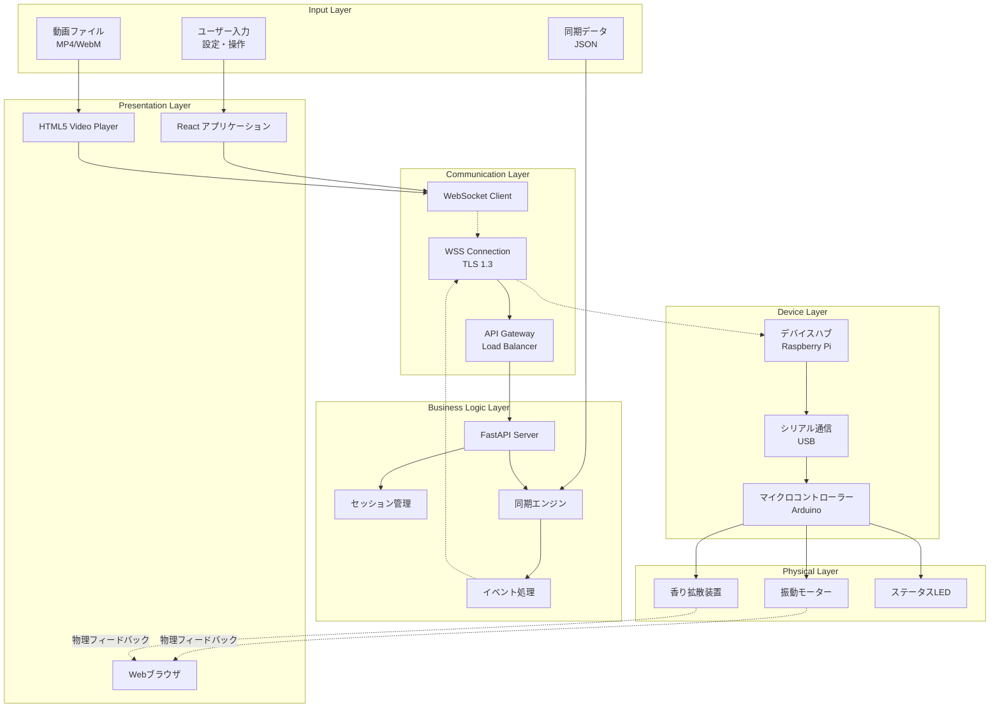
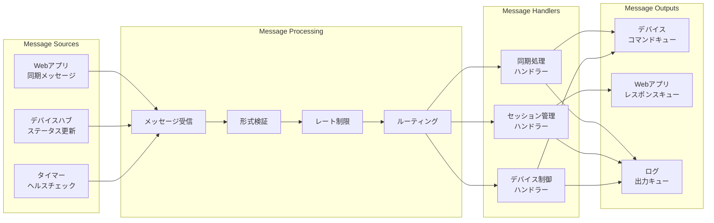
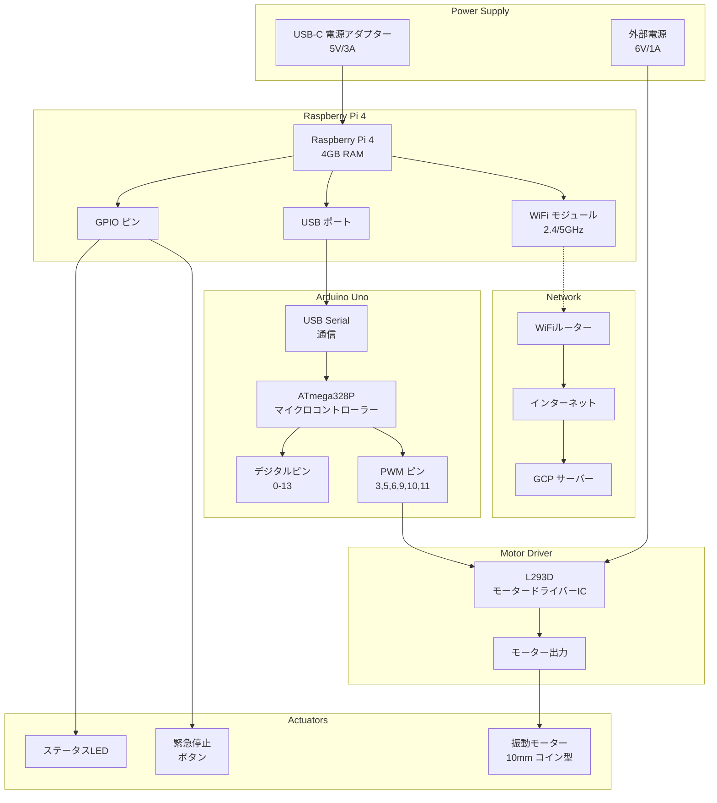
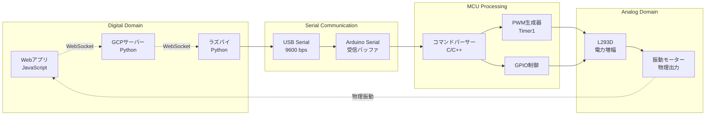

# 4DX@HOME システム設計図・シーケンス図詳細

## 1. 詳細シーケンス図集

### 1.1 完全システム初期化シーケンス



### 1.2 動画再生中のリアルタイム同期詳細

```mermaid
sequenceDiagram
    participant Timer as JS Timer (100ms)
    participant W as Webアプリ (player.js)
    participant S as サーバー (main.py)
    participant H as ハブ (hub.py)
    participant A as Arduino (actuator.ino)
    participant M as 振動モーター
    
    Note over Timer, M: 継続的同期処理 (100ms間隔)
    
    loop 動画再生中の同期ループ
        Timer->>W: setInterval callback実行
        W->>W: video.currentTime取得 (例: 10.484秒)
        W->>S: ws.send('{"event":"playback_sync", "data":{"current_time":10.484}}')
        
        activate S
        S->>S: セッション特定 & 同期データ照合
        S->>S: check_sync_events(time=10.484)
        
        Note right of S: 10.5秒地点の振動イベント発見<br/>if event and user_settings["vibration"]:
        
        alt 同期イベント発見 & ユーザー設定有効
            S->>H: ws.send('{"event":"actuator_command", "data":{"action":"vibrate", "intensity":0.8, "duration":500}}')
            deactivate S
            
            activate H
            H->>H: data = json.loads(message)
            H->>H: action = data["data"]["action"] # "vibrate"
            H->>H: intensity = int(data["data"]["intensity"] * 100) # 80
            H->>H: duration = data["data"]["duration"] # 500
            H->>H: command = f"{action[0]},{intensity},{duration}\n" # "v,80,500\n"
            
            H->>A: serial.write(command.encode('utf-8'))
            deactivate H
            
            activate A
            Note over A: loop()内で Serial.available() > 0 検知
            A->>A: commandString = Serial.readStringUntil('\n') # "v,80,500"
            A->>A: sscanf(commandString, "v,%d,%d", &intensity, &duration)
            A->>A: pwmValue = map(intensity, 0, 100, 0, 255) # 204
            A->>A: vibrationStartTime = millis()
            A->>A: motorActive = true
            
            A->>M: analogWrite(MOTOR_PIN, pwmValue)
            activate M
            M-->>A: 振動開始
            
            Note over A, M: duration (500ms) 経過まで継続
            
            loop モーター制御ループ
                A->>A: if (millis() - vibrationStartTime >= duration)
                alt 時間経過
                    A->>M: analogWrite(MOTOR_PIN, 0)
                    deactivate M
                    A->>A: motorActive = false
                else 継続中
                    Note right of A: 振動継続
                end
            end
            deactivate A
            
        else 同期イベントなし
            Note right of S: 何も送信しない
            deactivate S
        end
        
        Note over Timer, M: 100ms待機後、次の同期処理へ
    end
```

### 1.3 エラー発生・復旧シーケンス

```mermaid
sequenceDiagram
    participant W as Webアプリ
    participant S as サーバー
    participant H as ラズパイ
    participant N as ネットワーク
    
    Note over W, N: 正常運用中
    
    W->>S: 同期データ送信
    S->>H: 制御コマンド
    H-->>S: 実行確認
    S-->>W: ステータス応答
    
    Note over W, N: ❌ ネットワーク障害発生
    
    W-xN: 接続断
    S-xN: 接続断
    
    Note over W, N: エラー検知・処理
    
    par Webアプリ側
        W->>W: WebSocket.onclose イベント発火
        W->>W: connectionState = 'disconnected'
        W->>W: showConnectionError() 実行
        W->>W: 自動再接続タイマー開始 (3秒)
        
        loop 再接続ループ
            Note right of W: 3秒後
            W->>N: WebSocket再接続試行
            alt 接続成功
                N->>S: 接続確立
                S-->>W: 接続完了
                W->>S: セッション復旧要求
                S->>S: セッション状態確認
                alt セッション有効
                    S-->>W: セッション復旧完了
                    W->>W: hideConnectionError()
                    W->>W: 正常状態復帰
                else セッション無効
                    S-->>W: セッション無効通知
                    W->>W: 初期画面に戻る
                end
            else 接続失敗
                W->>W: 3秒待機 → リトライ
            end
        end
        
    and ラズパイ側
        H->>H: WebSocket.onclose イベント発火
        H->>H: connection_lost = True
        H->>H: LED点滅でエラー状態表示
        
        loop 再接続ループ
            Note right H: 3秒後
            H->>N: WebSocket再接続試行
            alt 接続成功
                N->>S: 接続確立
                S-->>H: 接続完了
                H->>S: デバイス再登録要求
                S->>S: デバイス情報復旧
                S-->>H: 登録完了 + セッション情報
                H->>H: connection_lost = False
                H->>H: 正常LED表示復帰
            else 接続失敗
                H->>H: 3秒待機 → リトライ
            end
        end
    end
    
    Note over W, N: ✅ 双方向復旧完了
    
    S-->>W: device_reconnected 通知
    S-->>H: webapp_reconnected 通知
    
    Note over W, N: 正常運用再開
    
    W->>S: 同期データ送信再開
    S->>H: 制御コマンド再開
```

## 2. システム状態遷移図

### 2.1 システム全体状態遷移



### 2.2 WebSocket接続状態詳細



## 3. データフロー・アーキテクチャ図

### 3.1 システム全体データフロー



### 3.2 メッセージキューイングシステム



## 4. 物理アーキテクチャ図

### 4.1 ハードウェア接続図



### 4.2 信号フロー図



---

**更新日**: 2025年10月11日  
**バージョン**: 1.0  
**システム設計詳細策定者**: 4DX@HOME開発チーム