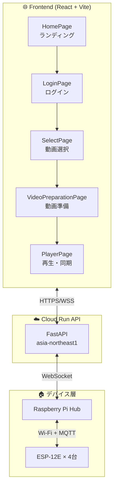
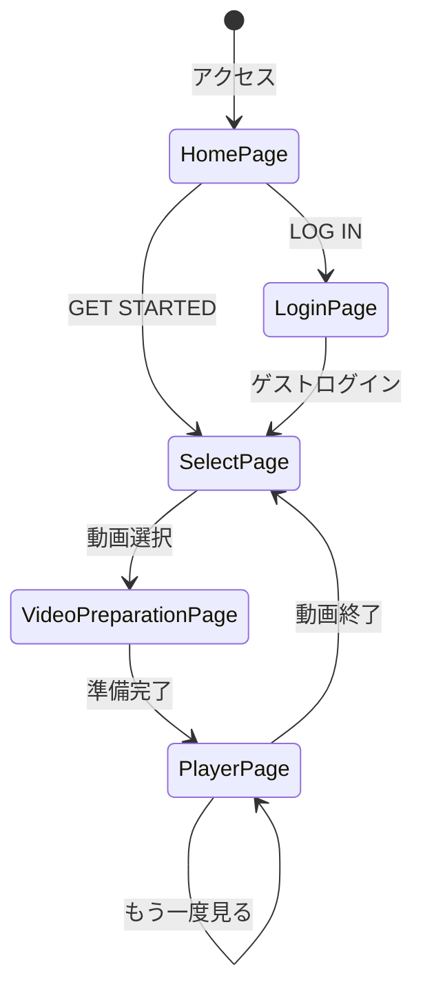
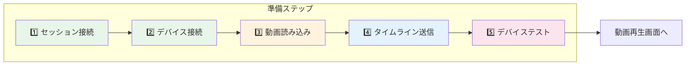
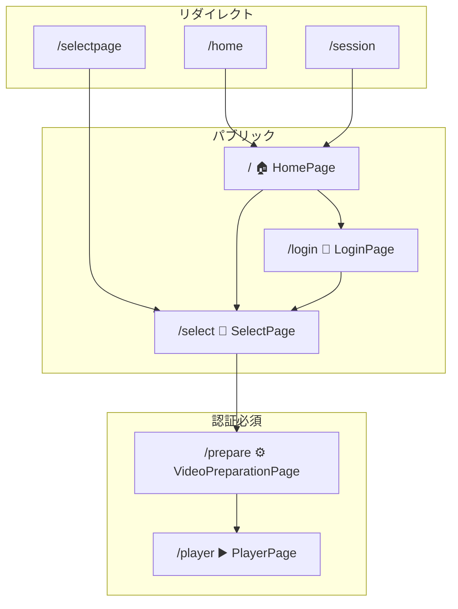
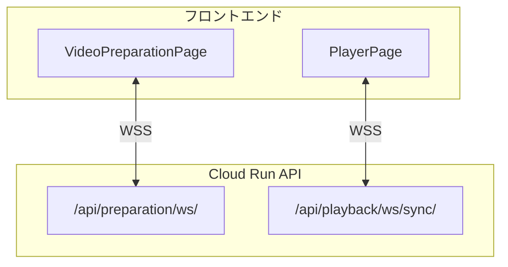
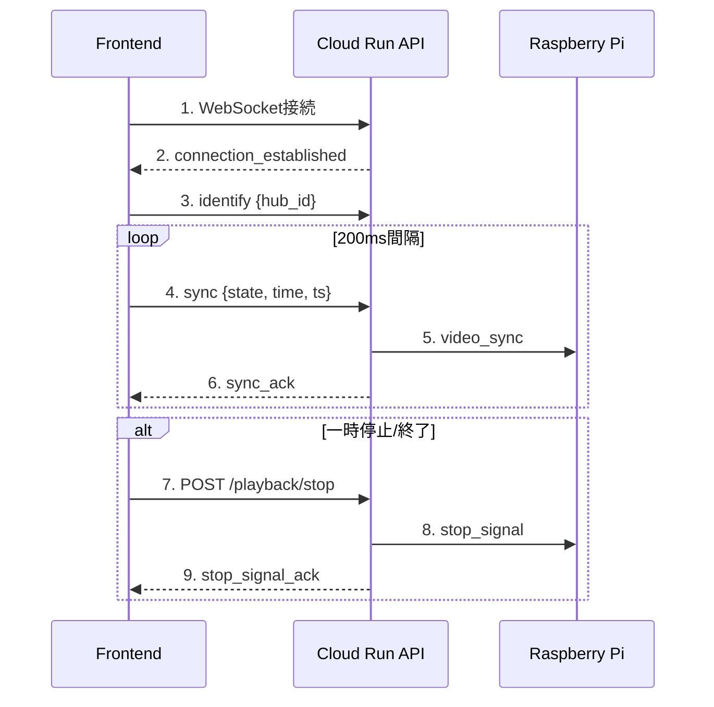

# 4DX@HOME フロントエンド仕様書 (AwardDay版)

**バージョン**: 2.0.0  
**作成日**: 2025年11月14日  
**対象イベント**: JPHACKS 2025 Award Day (2025年11月9日開催)  
**システム**: Render + Cloud Run統合版

---

## 概要

4DX@HOME フロントエンドは、Render上にデプロイされたReact + TypeScript + ViteベースのSPA（シングルページアプリケーション）です。Cloud Run APIと通信し、動画再生と4Dエフェクトの同期体験を提供します。

### システム構成



---

## 技術スタック

### コアライブラリ
- **React** 18.3.1 - UIライブラリ
- **React Router DOM** 6.30.1 - SPA ルーティング
- **TypeScript** 5.9.3 - 型安全性

### ビルド・開発ツール
- **Vite** 7.1.9 - 高速ビルド・開発サーバー
- **@vitejs/plugin-react** 4.7.0 - React統合
- **TailwindCSS** 4.1.14 - ユーティリティCSSフレームワーク

### HTTP通信
- **Fetch API** (ネイティブ) - REST APIクライアント
- **カスタムapiClient** - `services/apiClient.ts` で実装

### WebSocket通信
- **WebSocket API** (ネイティブ) - リアルタイム同期
- **カスタムWebSocketClient** - `services/websocketClient.ts` で実装

---

## デプロイ情報

### Render構成

```yaml
サービス名: kz-2504
タイプ: Static Site
ビルドコマンド: npm install && npm run build
公開ディレクトリ: dist
URL: https://kz-2504.onrender.com
```

### 環境変数 (.env)

```env
# === Cloud Run API URLs ===
VITE_BACKEND_API_URL=https://fdx-home-backend-api-xxxxxxxxxxxx.asia-northeast1.run.app
VITE_BACKEND_WS_URL=wss://fdx-home-backend-api-xxxxxxxxxxxx.asia-northeast1.run.app

# === 同期間隔設定 ===
VITE_SYNC_INTERVAL_MS=200
VITE_SEEK_SYNC_INTERVAL_MS=100

# === 本番フロー用セッションID ===
VITE_PRODUCTION_SESSION_ID=demo1

# === デフォルトセッションID (デモ用) ===
VITE_DEFAULT_SESSION_ID=demo_session
```

**重要**: Viteは `VITE_` プレフィックスの環境変数のみクライアントに公開します。

---

## 画面構成

### 画面遷移フロー



### 1. HomePage - ホーム画面（ランディング）

**パス**: `/` (ルート)

**目的**: サービスの第一印象を伝えるランディングページ

**主要機能**:
- **背景動画自動再生**: `/hero/main.mp4` がページ読み込み時に自動再生
  - 再生中はフルスクリーンで動画が前面表示
  - 再生終了後、フェードアウトして静止画 (`/home.jpeg`) を表示
- **キャッチコピー表示**: 「おうち映画の常識を変える」
- **サブコピー**: 「どこでも、誰とでも、特別な映画体験を」
- **2つのボタン**:
  - **「LOG IN」**: `/login` へ遷移（将来のユーザー認証用）
  - **「GET STARTED」**: `/select` へ直接遷移（ゲストとして開始）
- **レスポンシブデザイン**: モバイル・デスクトップ対応
- **アニメーション**: 動画再生中はUIフェードアウト、終了後フェードイン

**実装例**:
```typescript
const handleLogin = () => {
  if (busy) return;
  setBusy(true);
  navigate("/login");
};

const handleGetStarted = () => {
  if (busy) return;
  setBusy(true);
  // GET STARTEDは/selectへ直接遷移（SelectPage側でauth自動セット）
  navigate("/select");
};

const handleEnded = () => {
  setPlaying(false); // フェードアウト
  setTimeout(() => setShowVideo(false), 200); // アンマウント
};
```

**特徴**:
- 背景動画 + 静止画のハイブリッド構成
- CSS transitionによるスムーズなフェード効果
- 連打防止機構
- 自動再生失敗時のエラーハンドリング

---

### 2. LoginPage - ログイン画面

**パス**: `/login`

**目的**: ユーザー認証（現在はゲストログインのみ）

**主要機能**:
- **ユーザー名・パスワード入力フィールド** (将来実装予定)
- **「ログイン」ボタン** (現在は未実装メッセージ表示)
- **「ゲストとして続ける」ボタン** → `/select` へ遷移
  - `sessionStorage.setItem("auth", "guest")` で認証状態を保存
- **背景画像**: `/PairingPage.jpeg`
- **ロゴ表示**: レスポンシブデザイン

**実装例**:
```typescript
const handleGuestLogin = () => {
  try { sessionStorage.setItem("auth", "guest"); } catch {}
  navigate("/select", { replace: true });
};
```

**注意**: 現在の実装では、HomePageの"GET STARTED"ボタンから直接SelectPageへ行けるため、この画面は使われないケースが多い。

---

### 3. SelectPage - 動画選択画面

**パス**: `/select`

**目的**: 視聴可能動画の一覧表示・選択

**主要機能**:
- **自動認証**: ページアクセス時に `sessionStorage.setItem("auth", "1")` を自動実行
- **ヘッダー固定**: ロゴ、ナビゲーション、アイコン（検索・通知・プロフィール）
- **背景**: `/hero/main.gif` をグラデーション重ねで表示
- **セクション構成**:
  - **今熱い！**: `demo2` のみ（サムネイル存在時のみ表示）
  - **アクション映画**: action-1 ～ action-4
  - **ホラー映画**: horror-1 ～ horror-4
- **サムネイル表示**: `/thumbs/{videoId}.jpeg`
  - 画像が存在しない場合はセクションを非表示
- **動画選択**: クリックで選択 → `/prepare?content={videoId}` へ遷移
- **選択状態の保持**: `sessionStorage` に動画情報を保存

**実装例**:
```typescript
// 自動認証
if (typeof window !== "undefined") {
  try { sessionStorage.setItem("auth", "1"); } catch {}
}

const goPlayer = (id: string, title?: string, thumb?: string) => {
  // 動画情報をsessionStorageに保存
  const selectedVideo = {
    id,
    title: title || id.toUpperCase(),
    thumbnailUrl: thumb || `/thumbs/${id}.jpeg`,
  };
  try {
    sessionStorage.setItem("selectedVideo", JSON.stringify(selectedVideo));
  } catch (e) {
    console.error("Failed to save selectedVideo:", e);
  }
  navigate(`/prepare?content=${encodeURIComponent(id)}`);
};
```

**UI特徴**:
- Netflix風のグリッドレイアウト
- ホバー時のスケールアップアニメーション
- ランキングバッジ表示
- レスポンシブデザイン

---

### 4. VideoPreparationPage - 動画準備画面

**パス**: `/prepare`

**目的**: 5つのステップで動画再生の準備を行う



**主要機能**:

#### ステップ1: セッション接続確認 (session)
- **セッションID入力**: デバイスハブコード（例: `demo1`, `demo2`, `main`）
- **履歴機能**: localStorageに最近5件を保存・表示
- **接続確認**: `/api/session/status/{sessionId}` で状態確認
- **進行**: 手動実行・成功後自動進行

#### ステップ2: デバイス接続確認 (device)
- **デバイスID入力**: Raspberry PiのデバイスハブID
- **履歴機能**: localStorageに最近5件を保存・表示
- **接続確認**: `/api/device/capabilities` でデバイス情報取得
- **進行**: 手動実行・成功後自動進行

#### ステップ3: 動画読み込み確認 (videoLoad)
- **自動実行**: 前ステップ完了後、自動的に実行
- **動画パス**: `public/video/{videoId}.mp4`
- **進行**: 1秒待機後自動進行

#### ステップ4: タイムライン送信 (timeline)
- **タイムラインファイル**: `public/json/{videoId}.json` を読み込み
- **アップロード**: `/api/preparation/upload-timeline/{sessionId}` へPOST
- **進行**: 手動実行（「タイムライン送信」ボタン）

#### ステップ5: デバイステスト (deviceTest)
- **WebSocket接続**: `wss://.../api/preparation/ws/{sessionId}`
- **テスト開始**: 手動実行（「デバイステスト開始」ボタン）
- **テスト結果受信**: 各エフェクトの動作確認結果を表示
- **完了**: 「動画再生画面へ」ボタンで `/player` へ遷移

**実装例**:
```typescript
// ステップ1: セッション接続
const handleSessionConnect = async () => {
  setStepStatus("session", "loading");
  try {
    const status = await fetchSessionStatus(sessionId);
    if (status.exists) {
      setStepStatus("session", "done");
      pushRecent("recent_sessions", sessionId);
    }
  } catch (error) {
    console.error("セッション接続失敗:", error);
  }
};

// ステップ4: タイムライン送信
const handleTimelineUpload = async () => {
  setStepStatus("timeline", "loading");
  try {
    const fileId = resolveTimelineFileId(selectedVideo.id);
    const response = await fetch(`/json/${fileId}.json`);
    const timelineData = await response.json();
    
    await preparationApi.uploadTimeline(sessionId, timelineData);
    setStepStatus("timeline", "done");
  } catch (error) {
    console.error("タイムライン送信失敗:", error);
  }
};

// ステップ5: デバイステスト
const handleDeviceTest = () => {
  if (!wsRef.current) return;
  
  const testMessage = {
    type: "device_test",
    session_id: sessionId,
    test_type: "basic",
  };
  
  wsRef.current.send(JSON.stringify(testMessage));
  setStepStatus("deviceTest", "loading");
};
```

**WebSocketメッセージ**:
```json
// デバイステスト開始
{
  "type": "device_test",
  "session_id": "demo1",
  "test_type": "basic"
}

// デバイステスト結果
{
  "type": "device_test_result",
  "session_id": "demo1",
  "success": true,
  "results": {
    "VIBRATION": "OK",
    "WIND": "OK",
    "WATER": "OK",
    "FLASH": "OK",
    "COLOR": "OK"
  }
}
```

**UI特徴**:
- 各ステップに状態アイコン（赤ドーナツリング → 緑チェックマーク）
- 自動進行ステップと手動実行ステップの区別
- 履歴機能によるUX向上
- レスポンシブデザイン

---

### 4. PlayerPage - 動画再生画面

**パス**: `/player`

**目的**: 4Dエフェクトと同期した動画再生

**主要機能**:

#### 動画再生機能
- **動画パス**: `?content={videoId}` パラメータから `/video/{videoId}.mp4` を読み込み
- **自動再生開始**: ページ読み込み時に自動再生開始
- **ミュート解除**: 再生開始後に音量を自動的に有効化
- **再生コントロール**: 再生/一時停止、シークバー、ミュートボタン
- **コントロールUIの自動隠れ**: 操作後3秒間操作がないとコントロールがフェードアウト
- **エフェクトパネル表示/非表示**: ボタンでエフェクト情報を切り替え

#### WebSocket同期機能
- **接続先**: `wss://.../api/playback/ws/sync/{sessionId}?hub={hubId}`
- **同期間隔**: 環境変数 `VITE_SYNC_INTERVAL_MS` (デフォルト200ms)
- **シーク中同期**: 環境変数 `VITE_SEEK_SYNC_INTERVAL_MS` (デフォルト100ms)
- **送信メッセージ**:
  - `start_continuous_sync`: 再生開始時に1回送信
  - `sync`: 再生位置・状態を定期送信 (`{type, state, time, duration, ts}`)
  - `identify`: ハブIDをサーバーへ通知
- **受信メッセージ**:
  - `connection_established`: 接続確認
  - `sync_ack`: 同期受信確認

#### ストップ処理 (AwardDay新機能)
- **一時停止時**: `/api/playback/stop/{sessionId}` へPOSTでストップ信号送信
- **動画終了時**: 自動的にストップ信号送信 + 「もう一度見る」ボタン表示
- **一度だけ送信**: `stopSentRef` で重複送信を防止
- **Raspberry Pi連携**: ストップ信号がデバイスに伝播され、全アクチュエータが停止

#### エフェクトステータスパネル
- **タイムライン読み込み**: `/json/{videoId}.json` からエフェクトデータ取得
- **リアルタイム表示**: 再生位置に合わせて現在のエフェクトをハイライト
- **エフェクトタイプ**: 風・水・振動・光などをアイコンと強度で表示

#### 再接続ロジック
- **自動再接続**: 接続失敗時に最大5回まで再試行
- **エクスポネンシャルバックオフ**: 1秒 → 2秒 → 4秒...と間隔を増やす
- **エラー表示**: 接続失敗時にエラーメッセージ表示

**実装例**:
```typescript
// 環境変数から同期間隔を取得（ミリ秒）、デフォルトは200ms
const SYNC_INTERVAL_MS = Number(import.meta.env.VITE_SYNC_INTERVAL_MS) || 200;
// シーク中の同期間隔（デフォルトは同期間隔と同じ）
const SEEK_SYNC_INTERVAL_MS = Number(import.meta.env.VITE_SEEK_SYNC_INTERVAL_MS) || SYNC_INTERVAL_MS;

// 同期メッセージ送信
const sendSync = (state: SyncState) => {
  const ws = wsRef.current;
  const v = videoRef.current;
  if (!ws || ws.readyState !== WebSocket.OPEN || !v) return;
  
  const msg: OutMsg = {
    type: "sync",
    state,
    time: v.currentTime,
    duration: v.duration,
    ts: Date.now(),
  };
  ws.send(JSON.stringify(msg));
};

// ストップ信号送信（一度だけ）
const sendStopSignal = async () => {
  if (stopSentRef.current) return;
  stopSentRef.current = true;
  
  try {
    await playbackApi.sendStopSignal(sessionId);
    console.log("[player] stop signal sent", { sessionId });
  } catch (err) {
    console.error("[player] stop signal failed", err);
  }
};

// 一時停止処理
const handlePause = () => {
  console.log("[player] video paused");
  sendStopSignal(); // ストップ信号送信
  sendSync("pause"); // パーズ状態同期
};

// 動画終了処理
const handleEnded = () => {
  console.log("[player] video ended");
  setVideoEnded(true);
  sendStopSignal(); // ストップ信号送信
};
```

**特徴**:
- 200ms間隔の高頻度同期（カスタマイズ可能）
- WebSocketバッファ管理で送信失敗を防止
- ストップ信号で安全な停止処理
- 再接続ロジックで接続安定性確保

---

## ルーティング構成



```typescript
import { Routes, Route, Navigate } from "react-router-dom";
import HomePage from "./pages/HomePage";
import LoginPage from "./pages/LoginPage";
import SelectPage from "./pages/SelectPage";
import PlayerPage from "./pages/PlayerPage";
import VideoPreparationPage from "./pages/VideoPreparationPage";
import ProtectedRoute from "./components/ProtectedRoute";

export default function App() {
  return (
    <Routes>
      {/* 1. 初期表示はHomePage（ランディング） */}
      <Route path="/" element={<HomePage />} />
      <Route path="/login" element={<LoginPage />} />
      
      {/* 2. 動画選択画面 */}
      <Route path="/select" element={<SelectPage />} />

      {/* 3. 準備（認証/接続/テスト）画面 */}
      <Route 
        path="/prepare" 
        element={
          <ProtectedRoute>
            <VideoPreparationPage />
          </ProtectedRoute>
        } 
      />
      
      {/* 4. プレイヤー画面（準備済みでアクセス） */}
      <Route 
        path="/player" 
        element={
          <ProtectedRoute>
            <PlayerPage />
          </ProtectedRoute>
        } 
      />
      
      {/* 旧ページ（互換性のためリダイレクト） */}
      <Route path="/home" element={<Navigate to="/" replace />} />
      <Route path="/session" element={<Navigate to="/" replace />} />
      <Route path="/selectpage" element={<Navigate to="/select" replace />} />
    </Routes>
  );
}
```

**ルート一覧**:

| パス | コンポーネント | 認証 | 説明 |
|------|------------|------|------|
| `/` | HomePage | - | ランディングページ |
| `/login` | LoginPage | - | ログイン画面 |
| `/select` | SelectPage | - | 動画選択（自動認証） |
| `/prepare` | VideoPreparationPage | ○ | 動画準備 |
| `/player` | PlayerPage | ○ | 動画再生 |

**互換性リダイレクト**:
- `/home` → `/`
- `/session` → `/`
- `/selectpage` → `/select`

**ProtectedRoute実装**:
```typescript
import { Navigate } from 'react-router-dom';

export default function ProtectedRoute({ children }: { children: React.ReactNode }) {
  const isAuthenticated = sessionStorage.getItem('auth') === 'guest';
  
  if (!isAuthenticated) {
    return <Navigate to="/" replace />;
  }
  
  return <>{children}</>;
}
```

---

## WebSocket通信プロトコル

### エンドポイント



#### 1. 準備画面用WebSocket

```
wss://fdx-home-backend-api-xxxxxxxxxxxx.asia-northeast1.run.app/api/preparation/ws/{sessionId}
```

**用途**: デバイステスト実行・結果受信

#### 2. 再生画面用WebSocket

```
wss://fdx-home-backend-api-xxxxxxxxxxxx.asia-northeast1.run.app/api/playback/ws/sync/{sessionId}
```

**用途**: 動画再生同期・リアルタイム通信

### 接続フロー



1. **接続確立**: WebSocketコンストラクタでURL指定
2. **接続成功**: `onopen` イベント発火
3. **同期開始**: 200ms間隔で `sync` メッセージ送信
4. **ACK受信**: サーバーから `sync_ack` 受信
5. **切断**: `onclose` イベント → 自動再接続 (リトライ3回)

### メッセージ形式

#### Client → Server (同期メッセージ)

```json
{
  "type": "sync",
  "state": "play",
  "time": 45.2,
  "currentTime": 45.2,
  "duration": 120.0,
  "ts": 1731571200000
}
```

**フィールド説明**:
- `type`: メッセージタイプ (固定値: `"sync"`)
- `state`: 再生状態 (`"play"` | `"pause"` | `"seeking"` | `"seeked"`)
- `time`: 現在の再生位置 (秒、小数点以下2桁)
- `currentTime`: 同上 (互換性のため)
- `duration`: 動画総尺 (秒)
- `ts`: 送信時刻 (UNIXタイムスタンプ、ミリ秒)

#### Server → Client (同期ACK)

```json
{
  "type": "sync_ack",
  "session_id": "demo1",
  "received_state": "play",
  "server_time": "2025-11-14T12:00:00.789Z",
  "relayed_to_devices": true
}
```

#### Client → Server (ストップ信号) **[NEW]**

```json
{
  "type": "stop_signal",
  "session_id": "demo1",
  "timestamp": 1731571200000
}
```

#### Server → Client (ストップACK) **[NEW]**

```json
{
  "type": "stop_signal_ack",
  "session_id": "demo1",
  "success": true,
  "sent_to_devices": 2,
  "message": "ストップ信号を2台のデバイスに送信しました"
}
```

---

## REST API統合

### APIクライアント構成

**実装ファイル**: `src/services/apiClient.ts`, `src/services/endpoints.ts`

**特徴**: Axiosを使わず、ネイティブFetch APIをベースにした軽量な実装

```typescript
// src/services/apiClient.ts
import { BACKEND_API_URL } from '../config/backend';

export async function apiCall<T = any>(
  endpoint: string,
  options: RequestInit = {}
): Promise<T> {
  const url = `${BACKEND_API_URL}${endpoint}`;
  
  const response = await fetch(url, {
    ...options,
    headers: {
      'Content-Type': 'application/json',
      ...options.headers,
    },
  });
  
  if (!response.ok) {
    const error = await response.json().catch(() => ({}));
    throw new Error(error.detail || `HTTP ${response.status}`);
  }
  
  return response.json();
}

// src/services/endpoints.ts
import { apiCall } from './apiClient';

export const preparationApi = {
  uploadTimeline: (sessionId: string, timeline: any) =>
    apiCall(`/api/preparation/upload-timeline/${sessionId}`, {
      method: 'POST',
      body: JSON.stringify(timeline),
    }),
};

export const playbackApi = {
  sendStopSignal: (sessionId: string) =>
    apiCall(`/api/playback/stop/${sessionId}`, {
      method: 'POST',
    }),
};
```

---

## セッションID・デバイスID管理

### 2種類のID

4DX@HOMEシステムでは、以下2種類のIDを管理します:

#### 1. セッションID

**用途**: WebSocket接続・タイムライン管理・動画再生セッション識別

**形式**: `demo1`, `demo2`, `main` 等（小文字）

**使用箇所**:
- VideoPreparationPage - ステップ1で入力
- `/api/session/status/{sessionId}` エンドポイント
- `/api/preparation/ws/{sessionId}` WebSocket接続
- `/api/playback/ws/sync/{sessionId}` WebSocket接続
- `/api/preparation/upload-timeline/{sessionId}` エンドポイント

**履歴管理**: `localStorage` に最近使用した5件を保存

#### 2. デバイスID（デバイスハブコード）

**用途**: 物理的なRaspberry Piデバイスハブを識別

**形式**: `FDX001`, `TestHub-001` 等（任意の文字列）

**使用箇所**:
- VideoPreparationPage - ステップ2で入力
- `/api/device/capabilities` エンドポイント

**履歴管理**: `localStorage` に最近使用した5件を保存

### ID取得・保存の実装例

```typescript
// セッションID履歴保存
function pushRecent(key: string, value: string, max = 5) {
  const trimmed = value.trim();
  if (!trimmed) return;
  
  try {
    const raw = localStorage.getItem(key);
    const list: string[] = raw ? JSON.parse(raw) : [];
    const withoutDup = list.filter((v) => v !== trimmed);
    const updated = [trimmed, ...withoutDup].slice(0, max);
    localStorage.setItem(key, JSON.stringify(updated));
  } catch {
    // 失敗時は無視
  }
}

// セッションID履歴読み込み
function loadRecent(key: string): string[] {
  try {
    const raw = localStorage.getItem(key);
    return raw ? JSON.parse(raw) : [];
  } catch {
    return [];
  }
}

// 使用例
const recentSessions = loadRecent('recent_sessions');
const recentDevices = loadRecent('recent_devices');
```

---

## エラーハンドリング

### ネットワークエラー

```typescript
try {
  const response = await axios.post('/api/device/register', data);
} catch (error) {
  if (axios.isAxiosError(error)) {
    if (error.response) {
      // サーバーエラー (4xx, 5xx)
      console.error('サーバーエラー:', error.response.status, error.response.data);
      alert(`エラー: ${error.response.data.detail || error.response.data.message}`);
    } else if (error.request) {
      // ネットワークエラー (タイムアウト等)
      console.error('ネットワークエラー:', error.message);
      alert('サーバーに接続できません。ネットワーク接続を確認してください。');
    }
  }
}
```

### WebSocketエラー

```typescript
wsClient.on('error', (error) => {
  console.error('WebSocketエラー:', error);
  setWsStatus('error');
});

wsClient.on('close', (code, reason) => {
  console.warn(`WebSocket切断: code=${code}, reason=${reason}`);
  setWsStatus('disconnected');
  
  // 自動再接続 (最大3回)
  if (reconnectAttempts < 3) {
    setTimeout(() => {
      reconnectWebSocket();
    }, 2000 * (reconnectAttempts + 1)); // 指数バックオフ
  }
});
```

---

## パフォーマンス最適化

### 1. WebSocket送信間隔

**目標**: 200ms固定（シーク中）、再生中はカスタマイズ可能

**実装**:
```typescript
useEffect(() => {
  if (isPlaying) {
    const interval = setInterval(() => {
      sendSyncMessage();
    }, 200); // 200ms固定（シーク中）
    
    return () => clearInterval(interval);
  }
}, [isPlaying, currentTime]);
```

### 2. 動画プリロード

```typescript
<video
  ref={videoRef}
  preload="metadata" // メタデータのみプリロード
  onCanPlay={() => setVideoReady(true)}
>
  <source src={videoUrl} type="video/mp4" />
</video>
```

### 3. 状態管理最適化

```typescript
// React.memoでコンポーネント再レンダリング抑制
const VideoControls = React.memo(({ isPlaying, onPlayPause }) => {
  return (
    <button onClick={onPlayPause}>
      {isPlaying ? '⏸️ 一時停止' : '▶️ 再生'}
    </button>
  );
});

// useMemoで計算結果をキャッシュ
const formattedTime = useMemo(() => {
  return formatTime(currentTime);
}, [currentTime]);
```

---

## ビルド・デプロイ

### ローカル開発

```bash
# 依存関係インストール
npm install

# 開発サーバー起動
npm run dev
# http://localhost:5173 でアクセス
```

### プロダクションビルド

```bash
# ビルド実行
npm run build
# dist/ ディレクトリに成果物生成

# プレビュー
npm run preview
# http://localhost:4173 でプレビュー
```

### Renderデプロイ

**自動デプロイ**: GitHub連携でmainブランチへのpushで自動ビルド・デプロイ

**手動デプロイ**: Renderダッシュボードから「Manual Deploy」実行

**環境変数設定**: Renderダッシュボード → Environment → 環境変数追加

---

## デバッグツール

### debug_frontend

**URL**: http://localhost:5173 (ローカル起動時)

**用途**: Cloud Run API動作確認・WebSocketテスト

**主要機能**:
- **動画選択画面**: サンプル動画一覧表示
- **動画準備画面**: 4ステップ準備プロセス
  1. デバイス接続 (製品コード入力)
  2. 動画読み込み (自動)
  3. タイムライン送信 (JSON読み込み→API送信)
  4. デバイステスト (アクチュエーター動作確認)
- **再生画面**: WebSocket同期テスト

**起動方法**:
```bash
cd debug_frontend
npm install
npm run dev
```

---

## トラブルシューティング

### 1. 動画再生されない

**症状**: 黒い画面のまま

**原因**: 動画ファイル未配置

**解決策**:
```bash
# FFmpegでテスト動画生成
ffmpeg -f lavfi -i color=c=black:s=1920x1080:d=120 \
  -c:v libx264 -pix_fmt yuv420p public/videos/demo1.mp4
```

### 2. WebSocket接続失敗

**症状**: `WebSocket: ❌ 未接続`

**原因**: セッションID不一致、Cloud Run未起動

**確認項目**:
- `.env`の`VITE_PRODUCTION_SESSION_ID`が設定されているか
- Cloud Run APIが稼働しているか (`/health` にアクセス)
- ブラウザコンソールでWebSocketエラーログを確認

### 3. デバイス登録失敗

**症状**: `デバイス接続失敗: 404`

**原因**: 製品コード間違い、API未起動

**解決策**:
- 製品コードを確認 (`DH001`, `DH002`, `DH003`)
- Cloud Run APIの `/api/device/register` エンドポイントが有効か確認

### 4. CORS エラー

**症状**: `Access to fetch at '...' has been blocked by CORS policy`

**原因**: Cloud Run側のCORS設定にフロントエンドURLが未登録

**解決策**:
1. `backend/app/config/settings.py` の `cors_origins` を確認
2. `.env` に `https://kz-2504.onrender.com` を追加
3. Cloud Runを再デプロイ

---

## Award Day以降の変更点

### 追加機能

1. **ストップ処理統合**
   - 一時停止時: REST API + WebSocket で二重送信
   - 動画終了時: 全アクチュエーター自動停止
   - 2秒待機後、動画選択画面へ自動遷移

2. **セッションID分離管理**
   - デバイスハブ製品コード (大文字)
   - 本番フロー用セッションID (小文字)
   - `.env`ファイルで設定可能

3. **エラーハンドリング強化**
   - ネットワークエラー検出・表示
   - WebSocket自動再接続 (最大3回)
   - ユーザーフレンドリーなエラーメッセージ

### 改善点

- WebSocket再接続ロジック: 指数バックオフ採用
- 動画終了時の自動遷移: UX向上
- デバッグログ: コンソール出力強化

---

## 今後の拡張予定

- [ ] ユーザー認証 (JWT)
- [ ] 視聴履歴・お気に入り
- [ ] レスポンシブデザイン (モバイル最適化)
- [ ] 動画評価・コメント機能
- [ ] 検索機能 (タイトル・カテゴリ)
- [ ] 倍速再生対応
- [ ] ストリーミング再生 (HLS/DASH)
- [ ] PWA対応 (オフライン視聴)

---

## 関連ドキュメント

- [バックエンド仕様書](./backend-specification-awardday.md)
- [ハードウェア仕様書](./hardware-specification-awardday.md)
- [本番フロー仕様](../debug_frontend/PRODUCTION_FLOW_SETUP.md)
- [ストップ処理仕様](../debug_frontend/STOP_SIGNAL_SPEC.md)

---

**変更履歴**:

| 日付 | バージョン | 変更内容 |
|-----|----------|---------|
| 2025-11-14 | 2.0.0 | Award Day後の実装を反映した仕様書作成 |
