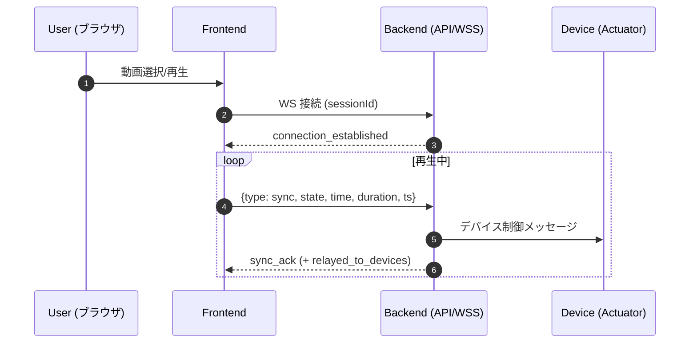

## 1. 概要

4DX@HOME の Web フロントエンドは、動画の再生状態・時刻情報をリアルタイムに送信し、バックエンド経由で物理デバイスへ同期させることを目的としています。直感的な UI と軽量なクライアント構成（Vite）を採用しています。

* プロジェクト名: 4DX@HOME
* コンセプト: 映像解析で得た同期データをサーバ経由でデバイスへ配信し、動画と物理フィードバックをフレーム近傍で同期

---

## 2. 目次

1. 概要
2. 目次
3. スクリーンショット & UI（各ページ）
4. 技術スタック
5. アーキテクチャ
6. 主要機能
7. アプリケーション状態
8. プロトコル/データ構造
9. データフロー
10. ローカル開発
11. 環境変数
12. ビルド & デプロイ
13. トラブルシュート
14. 今後の拡張予定
15. ライセンス

---

## 3. スクリーンショット & UI（各ページ）

**配置規則**

* ベースパス: `docs/images/`
* 命名: `<page>[-variant][-device].<ext>` 例: `home.png`, `player-mobile.png`, `session-error.png`

**最小セット（必須）**

* `docs/images/home.png`
* `docs/images/session.png`
* `docs/images/select.png`
* `docs/images/player.png`

**任意の追加（推奨）**

* `*-mobile.png` / `*-desktop.png`（レスポンシブ差分）
* `session-success.png` / `session-error.png`（接続状態差分）
* `player-fullscreen.png`（フルスクリーン時）

| ページ                          | 説明                     | 画像例                                 |
| ---------------------------- | ---------------------- | ----------------------------------- |
| ホーム (`HomePage`)             | キャッチコピー、開始導線           |        |
| セッション（ペアリング） (`PairingPage`) | セッションコード入力、接続状態        |  |
| 動画選択 (`SelectPage`)          | 一覧/カテゴリ/ランキング          |    |
| 動画視聴（プレイヤー） (`PlayerPage`)   | 再生/一時停止・シーク・音量・フルスクリーン |    |

---

## 4. 技術スタック

### 4.1 主要フレームワーク・ライブラリ

* React 18.3.1（UI）
* TypeScript 5.9.3（型安全）
* React Router DOM 6.30.1（SPA ルーティング）

### 4.2 開発・ビルドツール

* Vite 7.1.9（高速ビルド）
* PostCSS 8.5.6（CSS 処理）
* Tailwind CSS 4.1.14（ユーティリティファースト）

### 4.3 開発環境

* @vitejs/plugin-react 4.7.0
* @types/react, @types/react-dom

---

## 5. アーキテクチャ

### 5.1 ディレクトリ構造

```
frontend/4dathome-app/
├── index.html
├── package.json
├── tsconfig.json
├── vite.config.ts
├── postcss.config.(js|ts)
├── tailwind.config.ts
└── src/
    ├── App.tsx              # メインアプリ
    ├── main.tsx             # エントリポイント
    ├── components/          # 再利用 UI
    │   └── AppHeader.tsx
    ├── pages/
    │   ├── HomePage.tsx
    │   ├── PairingPage.tsx
    │   ├── SelectPage.tsx
    │   └── PlayerPage.tsx
    ├── hooks/
    ├── types/
    ├── utils/
    └── assets/
```

### 5.2 ルーティング構成

| パス            | コンポーネント       | 用途                   |
| ------------- | ------------- | -------------------- |
| `/`           | `HomePage`    | メインページ               |
| `/session`    | `PairingPage` | セッションコード入力・デバイスペアリング |
| `/selectpage` | `SelectPage`  | 動画選択・ランキング閲覧         |
| `/player`     | `PlayerPage`  | 動画再生・デバイス同期          |

---

## 6. 主要機能

### 6.1 セッション管理

* 6 桁コードによるペアリング
* デバイス接続状態の監視と UI 反映
* WebSocket の自動接続/再接続

### 6.2 動画管理

* 一覧/カテゴリ/ランキング表示
* メタデータ・サムネイル
* 選択 → プレイヤー遷移

### 6.3 動画再生制御

* HTML5 Video（ネイティブ）
* 再生/一時停止・シーク・音量
* フルスクリーン対応（モバイル/デスクトップ）
* タイムスタンプ送信による同期

### 6.4 WebSocket 通信

* 双方向リアルタイム通信（JSON）
* 接続断時の自動復旧
* 再生状態（`play/pause/seeking/seeked`）と時刻の共有

---

## 7. アプリケーション状態

```ts
interface AppState {
  sessionId: string | null;
  deviceConnected: boolean;
  selectedVideo: VideoInfo | null;
  playbackState: PlaybackState;
  websocketConnection: WebSocket | null;
}

interface PlaybackState {
  isPlaying: boolean;
  currentTime: number;
  duration: number;
  volume: number;
}
```

---

## 8. プロトコル/データ構造

> 実際のバックエンド仕様に合わせて調整してください。

```ts
// 受信（サーバ → クライアント）
type SyncState = "play" | "pause" | "seeking" | "seeked";

type InMsg =
  | {
      type: "connection_established";
      connection_id: string;
      session_id: string;
      server_time: string; // ISO8601
      message: string;
    }
  | {
      type: "sync_ack";
      session_id: string;
      received_time: number; // epoch ms
      received_state: SyncState;
      server_time: string; // ISO8601
      relayed_to_devices?: boolean;
    }
  | { type: string; [k: string]: any };

// 送信（クライアント → サーバ）
type OutMsg = {
  type: "sync";
  state: SyncState; // 再生状態
  time: number;     // 現在位置(秒)
  duration: number; // 総再生時間(秒)
  ts: number;       // 送信時刻 epoch ms
};
```

固定セッション（例: `demo_session`）を用いる場合:
`wss://<origin>/api/playback/ws/sync/demo_session`

---

## 9. データフロー

1. セッション作成 → セッションコード生成 → デバイス待機
2. 動画選択 → メタデータ取得 → 4DX 効果データ準備
3. 再生開始 → WebSocket 接続 → リアルタイム同期開始
4. 再生制御 → タイムスタンプ送信 → デバイス効果発動

**シーケンス図（Mermaid）**



---

## 10. ローカル開発

ルート例: `frontend/4dathome-app`

```bash
pnpm i          # 依存関係の導入（npm/yarn でも可）
pnpm dev        # http://localhost:5173
pnpm build      # 本番ビルド
pnpm preview    # http://localhost:4173
```

* Tailwind 4 を利用しているため、`postcss.config.*` / `tailwind.config.*` は既存設定に従ってください。
* ルート配下に `frontend/4dathome-app/` がある構成でも、CI/CD 側でビルドコマンドと公開ディレクトリを調整することで対応可能です。

---

## 11. 環境変数

`.env`（開発） / `.env.production`（本番）等に設定します。

```env
# HTTP API のベース URL（例）
VITE_API_ORIGIN=https://fourdk-backend-xxxxxxxx-asia-northeast1.run.app

# 再生同期用 WebSocket エンドポイント（例）
VITE_WS_SYNC=wss://fourdk-backend-xxxxxxxx-asia-northeast1.run.app/api/playback/ws/sync/demo_session
```

アプリ内では `import.meta.env.VITE_*` で参照します。

---

## 12. ビルド & デプロイ

### 12.1 静的ホスティング（Render / Vercel / Firebase Hosting 等）

1. `pnpm build` で `dist/` を生成
2. `dist/` をホスティング先にデプロイ
3. SPA ルーティングのため、404 を `/index.html` にフォールバックする設定を有効化

### 12.2 Cloud Run / 任意サーバ利用時の留意点

* WebSocket は TLS 化された `wss://` を利用
* CORS: 別オリジンからの API 呼び出し時は `Access-Control-Allow-Origin` を適切に設定
* PORT: コンテナは環境変数 `PORT`（例: 8080）で待受け
* ヘルスチェックのタイムアウトは十分に確保

---

## 13. トラブルシュート

### 13.1 CORS エラー

* 現象: `No 'Access-Control-Allow-Origin' header is present ...`
* 対策: バックエンドで許可オリジン（例: `https://<frontend-host>`）を設定。`OPTIONS` も許可。

### 13.2 WebSocket 接続失敗

* `wss://` で公開しているか（証明書/プロキシ設定）
* リバースプロキシで `Upgrade` ヘッダが維持されているか
* サーバの待受ポートとパスがクライアント URL と一致しているか

### 13.3 Cloud Run 起動失敗

* ログに `failed to start and listen on PORT=8080` → 待受ポートを確認
* タイムアウト/メモリ不足 → サービス設定を見直し
* `PERMISSION_DENIED` → デプロイアカウントに Cloud Run Admin 等の権限を付与

### 13.4 TypeScript ビルドエラー例

* `TS2554: Expected 0 arguments, but got 1.` → 関数シグネチャの不一致
* `BlobPart` 関連 → `Uint8Array.buffer` を渡す等、型の不一致を解消

---

## 14. 今後の拡張予定

* 多言語対応（i18n）
* ユーザー設定（強度・頻度等のカスタマイズ）
* 視聴履歴・お気に入り
* レスポンシブ最適化（モバイル優先）
* アクセシビリティ改善（キーボード操作・スクリーンリーダ）

---

## 15. ライセンス

本リポジトリ内のライセンスファイル（例: MIT）に準拠します。`LICENSE` を参照してください。
