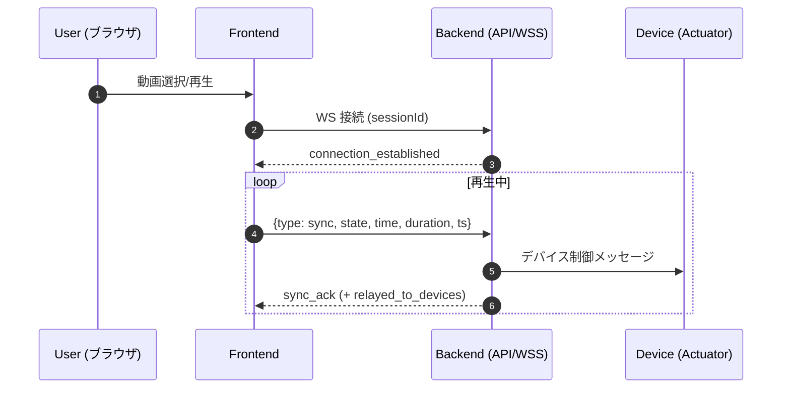

# 4DX@HOME フロントエンド仕様書

## 概要

4DX@HOMEのWebアプリケーションフロントエンドは、React + TypeScriptで構築されたSPA（Single Page Application）です。動画再生とデバイス制御の同期を管理し、直感的なユーザーインターフェースを提供します。

## 技術スタック

### 主要フレームワーク・ライブラリ
- **React** 18.3.1 - UIライブラリ
- **TypeScript** 5.9.3 - 型安全なJavaScript
- **React Router DOM** 6.30.1 - SPA ルーティング

### 開発・ビルドツール
- **Vite** 7.1.9 - 高速ビルドツール
- **PostCSS** 8.5.6 - CSS処理
- **Tailwind CSS** 4.1.14 - ユーティリティファーストCSS

### 開発環境
- **@vitejs/plugin-react** 4.7.0 - Vite React プラグイン
- **@types/react** & **@types/react-dom** - React型定義

## アーキテクチャ

### ディレクトリ構造
```
frontend/4dathome-app/src/
├── App.tsx              # メインアプリケーションコンポーネント
├── main.tsx             # エントリーポイント
├── components/          # 再利用可能なUIコンポーネント
│   └── AppHeader.tsx    # アプリケーションヘッダー
├── pages/               # ページコンポーネント
│   ├── HomePage.tsx     # ホームページ
│   ├── PairingPage.tsx  # デバイスペアリング
│   ├── SelectPage.tsx   # 動画選択
│   └── PlayerPage.tsx   # 動画再生・制御
├── hooks/               # カスタムReactフック
├── types/               # TypeScript型定義
├── utils/               # ユーティリティ関数
└── assets/              # 静的アセット
```

### ルーティング構成
| パス | コンポーネント | 用途 |
|------|---------------|------|
| `/` | HomePage | メインページ |
| `/session` | PairingPage | セッションコード入力・デバイスペアリング |
| `/selectpage` | SelectPage | 動画選択・ランキング閲覧 |
| `/player` | PlayerPage | 動画再生・デバイス同期 |

## 主要機能

### 1. セッション管理
- **セッションコード生成・入力**: 6桁のセッションコードによるデバイスペアリング
- **状態管理**: デバイス接続状態の監視とUI反映
- **自動接続**: WebSocket接続の確立と維持

### 2. 動画管理
- **動画一覧表示**: 利用可能な動画コンテンツの表示
- **カテゴリ分類**: ジャンル別動画表示
- **ランキング**: ランキング表示
- **動画詳細**: メタデータ、サムネイル表示
- **動画選択**: 再生する動画の選択機能

### 3. 動画再生制御
- **HTML5 Video Player**: ブラウザネイティブ動画再生
- **再生制御**: 再生/一時停止、シーク、音量調整
- **タイムスタンプ同期**: リアルタイムでのタイムスタンプ送信
- **フルスクリーン対応**: モバイル・デスクトップ両対応

### 4. WebSocket通信
- **リアルタイム通信**: バックエンドとの双方向通信
- **自動再接続**: 接続断絶時の自動復旧
- **同期制御**: 動画再生とデバイスの同期


### アプリケーション状態
```typescript
interface AppState {
  sessionId: string | null;
  deviceConnected: boolean;
  selectedVideo: VideoInfo | null;
  playbackState: PlaybackState;
  websocketConnection: WebSocket | null;
}

interface PlaybackState {
  isPlaying: boolean;
  currentTime: number;
  duration: number;
  volume: number;
}
```

### データフロー
1. **セッション作成** → セッションコード生成 → デバイス待機
2. **動画選択** → メタデータ取得 → 4DX効果データ準備
3. **再生開始** → WebSocket接続 → リアルタイム同期開始
4. **再生制御** → タイムスタンプ送信 → デバイス効果発動


## 今後の拡張予定


### 機能拡張
- **多言語対応**: i18n実装
- **ユーザー設定**: カスタマイズ可能な設定
- **再生履歴**: 視聴履歴の保存・表示
- **レスポンシブ対応**: スマートフォンやタブレットに対応する
- **お気に入り**: 動画ブックマーク機能


# 4DX@HOME — フロントエンド (JPHACKS 2025)

> スマホ動画を、全身で“浴びる”体験へ。

React + TypeScript 製の SPA。**動画再生**と**デバイス制御（振動・香り等）**を WebSocket 経由で同期させ、映像と物理フィードバックを組み合わせた没入体験を提供します。

---

## 📸 スクリーンショット

> 画像ファイルは本リポジトリに同梱済み（想定）です。パス名は必要に応じて置き換えてください。

| 画面           | プレビュー                                         |
| ------------ | --------------------------------------------- |
| ホーム          |                  |
| セッション（ペアリング） |  |
| 動画選択         |              |
| 動画視聴（プレイヤー）  |              |

---

## 🧭 目次

* [概要](#-概要)
* [技術スタック](#-技術スタック)
* [アーキテクチャ](#-アーキテクチャ)

  * [ディレクトリ構造](#ディレクトリ構造)
  * [ルーティング](#ルーティング)
* [主要機能](#-主要機能)
* [アプリケーション状態](#-アプリケーション状態)
* [プロトコル/データ構造](#-プロトコルデータ構造)
* [データフロー](#-データフロー)
* [ローカル開発](#-ローカル開発)
* [環境変数](#-環境変数)
* [ビルド & デプロイ](#-ビルド--デプロイ)
* [トラブルシュート](#-トラブルシュート)
* [今後の拡張予定](#-今後の拡張予定)
* [ライセンス](#-ライセンス)

---

## 📖 概要

4DX@HOME の Web アプリケーション・フロントエンドは **React + TypeScript** で構築された SPA（Single Page Application）です。動画再生とデバイス効果（振動・香り等）を**リアルタイム同期**し、直感的な UI を提供します。

* プロジェクト名: **4DX@HOME**
* キャッチコピー: **スマホ動画を、全身で“浴びる”体験へ。**
* コンセプト: 映像解析で生成された同期データをサーバ経由で物理デバイスへ送り、動画再生と物理フィードバックを**フレーム近傍で同期**。

---

## 🛠 技術スタック

### 主要フレームワーク・ライブラリ

* **React** 18.3.1 — UI ライブラリ
* **TypeScript** 5.9.3 — 型安全な JavaScript
* **React Router DOM** 6.30.1 — SPA ルーティング

### 開発・ビルドツール

* **Vite** 7.1.9 — 高速ビルドツール
* **PostCSS** 8.5.6 — CSS 処理
* **Tailwind CSS** 4.1.14 — ユーティリティファースト CSS

### 開発環境

* **@vitejs/plugin-react** 4.7.0 — Vite React プラグイン
* **@types/react** & **@types/react-dom** — React 型定義

> **メモ:** ルート構成例は `frontend/4dathome-app` を想定。異なる場合はパスを読み替えてください。

---

## 🧩 アーキテクチャ

### ディレクトリ構造

```
frontend/4dathome-app/
├── index.html
├── package.json
├── tsconfig.json
├── vite.config.ts
├── postcss.config.js | postcss.config.ts
├── tailwind.config.ts
└── src/
    ├── App.tsx              # メインアプリケーションコンポーネント
    ├── main.tsx             # エントリーポイント
    ├── components/          # 再利用可能な UI コンポーネント
    │   └── AppHeader.tsx    # アプリケーションヘッダー
    ├── pages/               # ページコンポーネント
    │   ├── HomePage.tsx     # ホームページ
    │   ├── PairingPage.tsx  # デバイスペアリング
    │   ├── SelectPage.tsx   # 動画選択
    │   └── PlayerPage.tsx   # 動画再生・制御
    ├── hooks/               # カスタム React フック
    ├── types/               # TypeScript 型定義
    ├── utils/               # ユーティリティ関数
    └── assets/              # 静的アセット
```

### ルーティング

| パス            | コンポーネント       | 用途                   |
| ------------- | ------------- | -------------------- |
| `/`           | `HomePage`    | メインページ               |
| `/session`    | `PairingPage` | セッションコード入力・デバイスペアリング |
| `/selectpage` | `SelectPage`  | 動画選択・ランキング閲覧         |
| `/player`     | `PlayerPage`  | 動画再生・デバイス同期          |

---

## ✨ 主要機能

### 1. セッション管理

* **セッションコード生成・入力:** 6 桁コードでペアリング
* **状態管理:** デバイス接続状態の監視と UI 反映
* **自動接続:** WebSocket 接続の確立と維持（切断時の自動再接続含む）

### 2. 動画管理

* **動画一覧表示 / カテゴリ / ランキング**
* **メタデータ & サムネイル表示**
* **動画選択 → プレイヤー遷移**

### 3. 動画再生制御

* **HTML5 Video Player（ネイティブ）**
* **再生/一時停止・シーク・音量調整**
* **フルスクリーン対応（SP/PC）**
* **タイムスタンプ同期:** 再生状態と時刻を送信し、物理デバイス側で効果発動

### 4. WebSocket 通信

* **双方向リアルタイム通信:** バックエンドとのシンプルな JSON メッセージ交換
* **自動再接続:** ネットワーク断に強い
* **同期制御:** 再生状態 (`play/pause/seeking/seeked`) と再生時刻の共有

---

## 🧠 アプリケーション状態

```ts
interface AppState {
  sessionId: string | null;
  deviceConnected: boolean;
  selectedVideo: VideoInfo | null;
  playbackState: PlaybackState;
  websocketConnection: WebSocket | null;
}

interface PlaybackState {
  isPlaying: boolean;
  currentTime: number;
  duration: number;
  volume: number;
}
```

---

## 🔐 プロトコル/データ構造

> バックエンド実装に合わせて調整してください。以下は代表例です。

### WebSocket メッセージ (例)

```ts
// 受信（サーバ → クライアント）
type SyncState = "play" | "pause" | "seeking" | "seeked";

type InMsg =
  | {
      type: "connection_established";
      connection_id: string;
      session_id: string;
      server_time: string; // ISO8601
      message: string;
    }
  | {
      type: "sync_ack";
      session_id: string;
      received_time: number; // epoch ms
      received_state: SyncState;
      server_time: string; // ISO8601
      relayed_to_devices?: boolean;
    }
  | { type: string; [k: string]: any };

// 送信（クライアント → サーバ）
type OutMsg = {
  type: "sync";
  state: SyncState; // 再生状態
  time: number;     // 現在位置(秒)
  duration: number; // 総再生時間(秒)
  ts: number;       // 送信時刻 epoch ms
};
```

> 固定セッション（例: `demo_session`）を使う場合、`wss://.../api/playback/ws/sync/demo_session` のようにエンドポイントで指定可能。

---

## 🔁 データフロー

1. **セッション作成** → セッションコード生成 → デバイス待機
2. **動画選択** → メタデータ取得 → 4DX 効果データ準備
3. **再生開始** → WebSocket 接続 → リアルタイム同期開始
4. **再生制御** → タイムスタンプ送信 → デバイス効果発動

### シーケンス図（Mermaid）



---

## 🧪 ローカル開発

> ルート例: `frontend/4dathome-app`

```bash
# 依存関係
pnpm i         # あるいは npm i / yarn

# 開発サーバ
pnpm dev       # http://localhost:5173

# 本番ビルド
pnpm build

# 本番ビルドのプレビュー
pnpm preview   # http://localhost:4173
```

* Tailwind 4 のため、`postcss.config.*` / `tailwind.config.*` は既存設定に従ってください。
* ルート配下に `frontend/4dathome-app/` がある構成でも、CI/CD のビルドコマンド/公開ディレクトリ設定で対応可。

---

## 🔧 環境変数

`.env`（開発） / `.env.production`（本番）等に設定。

```env
# HTTP API のベース URL（例）
VITE_API_ORIGIN=https://fourdk-backend-xxxxxxxx-asia-northeast1.run.app

# 再生同期用 WebSocket エンドポイント（例）
# 固定セッションを使う場合の例\ nVITE_WS_SYNC=wss://fourdk-backend-xxxxxxxx-asia-northeast1.run.app/api/playback/ws/sync/demo_session
```

アプリ内では `import.meta.env.VITE_*` で参照します。

---

## 🚀 ビルド & デプロイ

### 静的ホスティング（Render / Vercel / Firebase Hosting など）

1. `pnpm build` で `dist/` を生成
2. ホスティングに `dist/` を配信
3. ルーティングが SPA のため **404 を `/index.html` にフォールバック** する設定を有効化

### Cloud Run / 任意サーバでの注意

* WebSocket は **WSS (TLS)** 推奨。`wss://` で公開ドメインを利用
* **CORS**: 別オリジンから API を呼ぶ場合は `Access-Control-Allow-Origin` を適切に設定
* **PORT**: コンテナは必ず環境変数 `PORT`（例: 8080）でリッスン
* ヘルスチェックのタイムアウトが短いと起動失敗扱いになるため、適宜延長

---

## 🧯 トラブルシュート

### CORS エラー（例）

* 症状: `No 'Access-Control-Allow-Origin' header is present on the requested resource.`
* 対応: バックエンド側で **Allow-Origin** にフロントのオリジン（例: `https://<frontend-host>`）を設定。プリフライト（`OPTIONS`）も許可。

### WebSocket が繋がらない

* `wss://` で公開しているか、証明書/プロキシ設定を確認
* ファイアウォール/リバースプロキシで **Upgrade** ヘッダが維持されているか
* サーバが `PORT` にバインドし、**パス** がクライアントの URL と一致しているか

### Cloud Run 起動失敗

* ログに `failed to start and listen on PORT=8080` → アプリが **正しいポート** を Listen しているか
* タイムアウト/メモリ不足 → サービス設定を見直し
* `PERMISSION_DENIED` → デプロイ用アカウントの権限（`Cloud Run Admin` など）を付与

### TypeScript ビルドエラー例

* `TS2554: Expected 0 arguments, but got 1.` → 関数シグネチャと呼び出し箇所の不一致を修正
* `BlobPart 型` エラー → `new Blob([...Uint8Array])` の要素は `ArrayBufferView` も許容だが、`ArrayBufferLike` の不一致に注意。`Uint8Array.buffer` を渡すなど安全化。

---

## 🗺 今後の拡張予定

* **多言語対応 (i18n)**
* **ユーザー設定**（強度や香り頻度などのカスタマイズ）
* **再生履歴** / **お気に入り**
* **レスポンシブ最適化**（モバイル最優先）
* **アクセシビリティ改善**（キーボード操作・スクリーンリーダ対応）

---

## 📜 ライセンス

本リポジトリ内のライセンスファイルに準拠（例: MIT）。`LICENSE` を参照してください。


