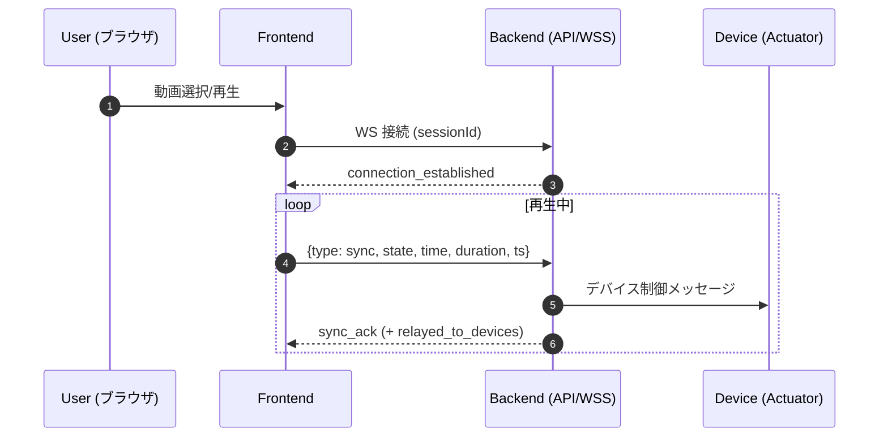

# 4DX@HOME フロントエンド仕様書

## 1. 概要

4DX@HOME の Web フロントエンドは、動画の再生状態・時刻情報をリアルタイムに送信し、バックエンド経由で物理デバイスへ同期させることを目的としています。直感的な UI と軽量なクライアント構成（Vite）を採用しています。

* プロジェクト名: 4DX@HOME
* コンセプト: 映像解析で得た同期データをサーバ経由でデバイスへ配信し、動画と物理フィードバックをフレーム近傍で同期


---

## 2. スクリーンショット & UI（各ページ）

**配置規則**

* ベースパス: `docs/images/`
* 命名: `<page>[-variant][-device].<ext>` 例: `home.png`, `player-mobile.png`, `session-error.png`

**最小セット（必須）**

* `docs/images/home.png`
* `docs/images/session.png`
* `docs/images/select.png`
* `docs/images/player.png`

**任意の追加（推奨）**

* `*-mobile.png` / `*-desktop.png`（レスポンシブ差分）
* `session-success.png` / `session-error.png`（接続状態差分）
* `player-fullscreen.png`（フルスクリーン時）

| ページ                          | 説明                     | 画像例                               |
| ---------------------------- | ---------------------- | ---------------------------------- |
| ホーム (`HomePage`)             | キャッチコピー、開始導線           |        |
| セッション（ペアリング） (`PairingPage`) | セッションコード入力、接続状態        |  |
| 動画選択 (`SelectPage`)          | 一覧/カテゴリ/ランキング          |    |
| 動画視聴（プレイヤー） (`PlayerPage`)   | 再生/一時停止・シーク・音量・フルスクリーン |    |

---

## 3. 技術スタック

### 3.1 主要フレームワーク・ライブラリ

* React 18.3.1（UI）
* TypeScript 5.9.3（型安全）
* React Router DOM 6.30.1（SPA ルーティング）

### 3.2 開発・ビルドツール

* Vite 7.1.9（高速ビルド）
* PostCSS 8.5.6（CSS 処理）
* Tailwind CSS 4.1.14（ユーティリティファースト）

### 3.3 開発環境

* @vitejs/plugin-react 4.7.0
* @types/react, @types/react-dom

---

## 4. アーキテクチャ

### 4.1 ディレクトリ構造

```
frontend/4dathome-app/
├── index.html
├── package.json
├── tsconfig.json
├── vite.config.ts
├── postcss.config.(js|ts)
├── tailwind.config.ts
└── src/
    ├── App.tsx              # メインアプリ
    ├── main.tsx             # エントリポイント
    ├── components/          # 再利用 UI
    │   └── AppHeader.tsx
    ├── pages/
    │   ├── HomePage.tsx
    │   ├── PairingPage.tsx
    │   ├── SelectPage.tsx
    │   └── PlayerPage.tsx
    ├── hooks/
    ├── types/
    ├── utils/
    └── assets/
```

### 4.2 ルーティング構成

| パス            | コンポーネント       | 用途                   |
| ------------- | ------------- | -------------------- |
| `/`           | `HomePage`    | メインページ               |
| `/session`    | `PairingPage` | セッションコード入力・デバイスペアリング |
| `/selectpage` | `SelectPage`  | 動画選択・ランキング閲覧         |
| `/player`     | `PlayerPage`  | 動画再生・デバイス同期          |

---

## 5. 主要機能

### 5.1 セッション管理

* 6 桁コードによるペアリング
* デバイス接続状態の監視と UI 反映
* WebSocket の自動接続/再接続

### 5.2 動画管理

* 一覧/カテゴリ/ランキング表示
* メタデータ・サムネイル
* 選択 → プレイヤー遷移

### 5.3 動画再生制御

* HTML5 Video（ネイティブ）
* 再生/一時停止・シーク・音量
* フルスクリーン対応（モバイル/デスクトップ）
* タイムスタンプ送信による同期

### 5.4 WebSocket 通信

* 双方向リアルタイム通信（JSON）
* 接続断時の自動復旧
* 再生状態（`play/pause/seeking/seeked`）と時刻の共有

---


## 6. データフロー

1. セッション作成 → セッションコード生成 → デバイス待機
2. 動画選択 → メタデータ取得 → 4DX 効果データ準備
3. 再生開始 → WebSocket 接続 → リアルタイム同期開始
4. 再生制御 → タイムスタンプ送信 → デバイス効果発動

**シーケンス図（Mermaid）**



---
## 7. 今後の拡張予定

* ユーザー設定
* 視聴履歴・お気に入り
* レスポンシブ最適化
* ストリーム再生の実行

---
