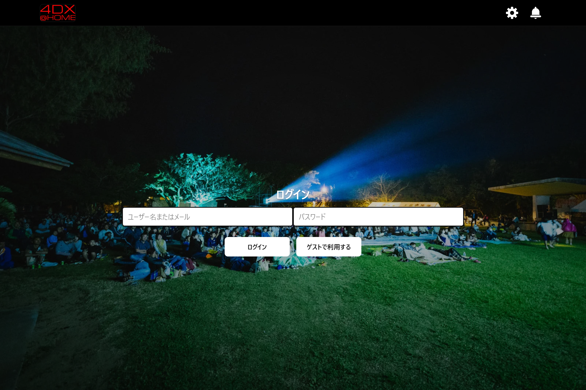
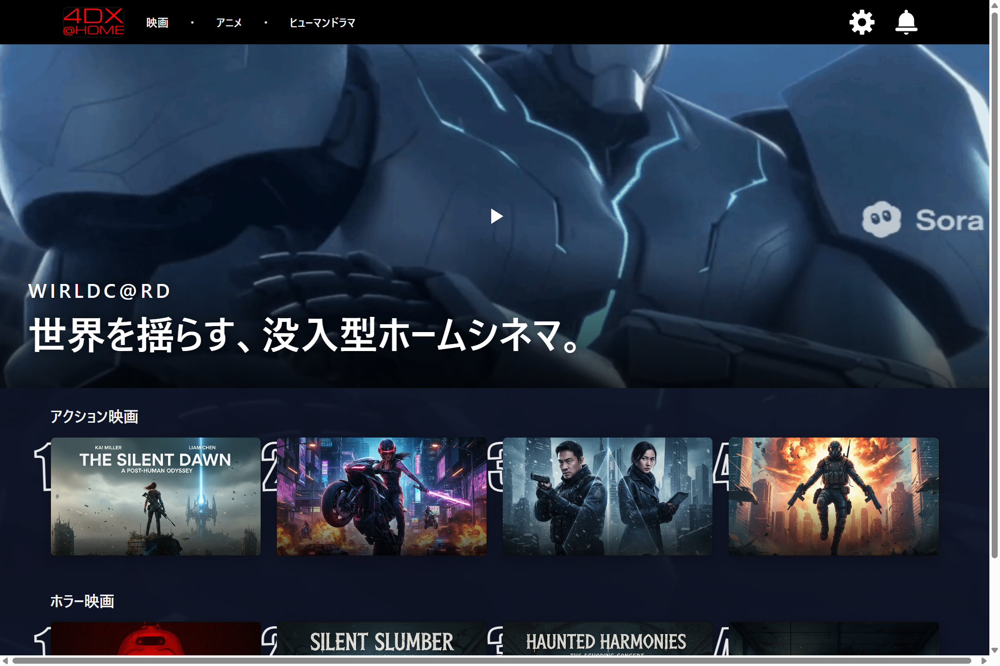
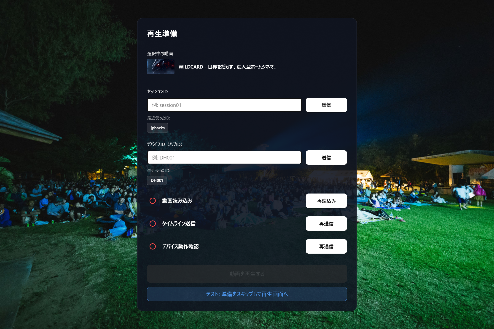
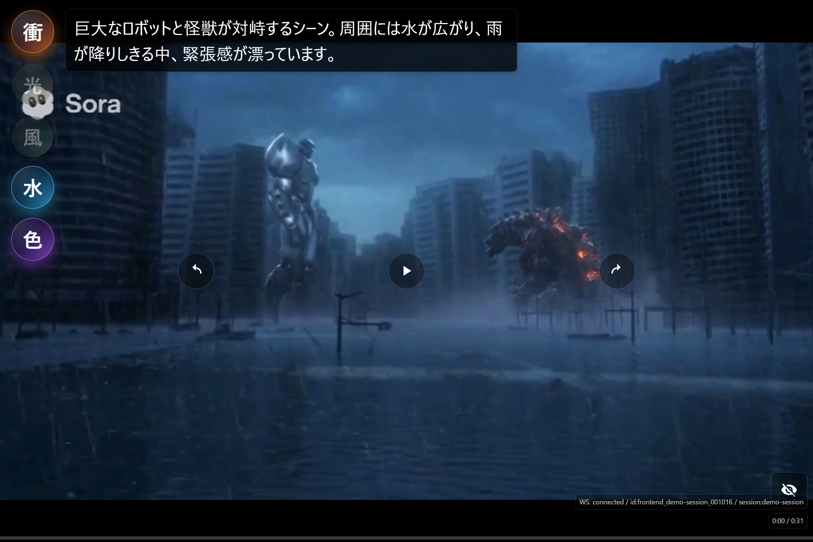
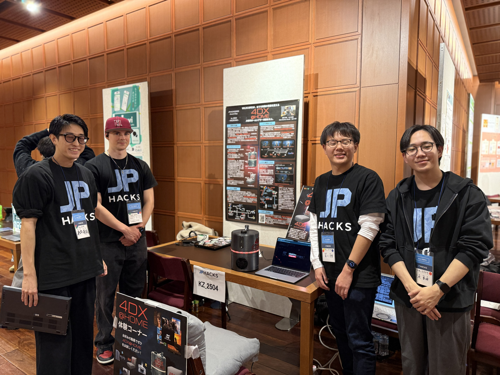
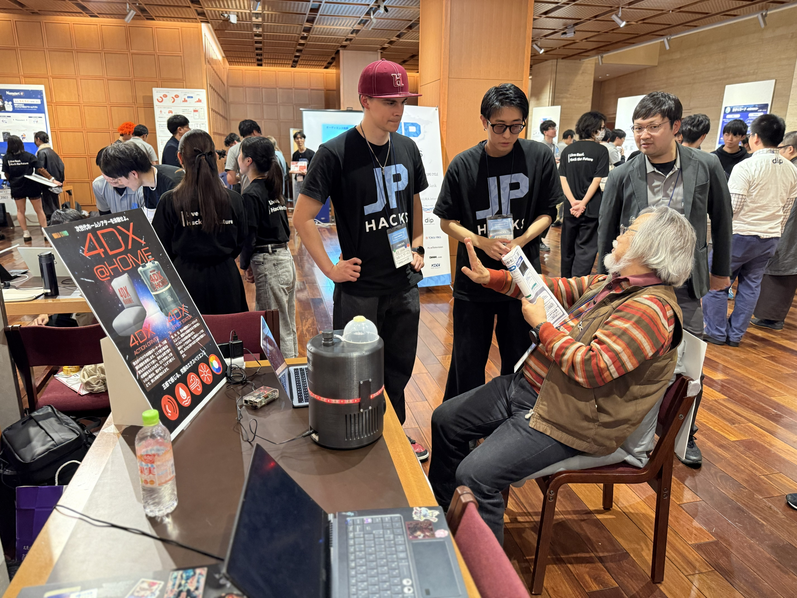

# 4DX@HOME ギャラリー

**最終更新**: 2025年12月4日

4DX@HOMEプロジェクトの写真・動画ギャラリーです。

---

## 📑 目次

- [4DX@HOME ギャラリー](#4dxhome-ギャラリー)
  - [📑 目次](#-目次)
  - [紹介動画](#紹介動画)
    - [🎬 4DX@HOME プロモーション動画](#-4dxhome-プロモーション動画)
    - [🎬 デバイス動作デモ](#-デバイス動作デモ)
      - [霧吹き動作デモ（EffectStation）](#霧吹き動作デモeffectstation)
      - [モーター動作デモ（ActionDrive）](#モーター動作デモactiondrive)
  - [デバイス](#デバイス)
    - [EffectStation](#effectstation)
    - [ActionDrive](#actiondrive)
  - [アプリ画面](#アプリ画面)
    - [画面遷移フロー](#画面遷移フロー)
    - [各画面スクリーンショット](#各画面スクリーンショット)
    - [画面説明](#画面説明)
  - [Award Day 写真](#award-day-写真)
    - [受賞の瞬間](#受賞の瞬間)
    - [ピッチタイム](#ピッチタイム)
    - [展示ブース](#展示ブース)
    - [集合写真](#集合写真)
  - [関連ドキュメント](#関連ドキュメント)

---

## 紹介動画

### 🎬 4DX@HOME プロモーション動画

<div align="center">

[](https://youtu.be/t1n5mQZU_nM)

**▶ クリックしてYouTubeで視聴**

</div>

### 🎬 デバイス動作デモ

#### 霧吹き動作デモ（EffectStation）

https://github.com/user-attachments/assets/980f8eda-1dce-4137-88e9-89016a450ba4

#### モーター動作デモ（ActionDrive）

https://github.com/user-attachments/assets/fc3d9b6a-db3d-46b6-aa8a-104bd579f367

---

## デバイス

### EffectStation

環境エフェクトデバイス（風・水・光・色）

<div align="center">
<table>
<tr>
<td align="center"><b>📷 実物写真</b></td>
<td align="center"><b>🖥️ 3Dモデル</b></td>
</tr>
<tr>
<td></td>
<td></td>
</tr>
</table>
</div>

**仕様:**
- 4種類の環境エフェクト（水・風・光・色）
- 卓上サイズ（約29cm）
- ESP-12E × 2台で制御
- 3D設計データ: [`hardware/3DModel/4dx@home-stand.stl`](../hardware/3DModel/4dx@home-stand.stl)

---

### ActionDrive

振動フィードバックデバイス（クッション型）

<div align="center">
<table>
<tr>
<td align="center"><b>📷 実物写真</b></td>
<td align="center"><b>🖥️ 3Dモデル</b></td>
<td align="center"><b>🔧 内部構造</b></td>
</tr>
<tr>
<td></td>
<td></td>
<td></td>
</tr>
</table>
</div>

**仕様:**
- 偏心モーター × 8個（16種類の振動パターン）
- 1人/2人利用モード対応
- ESP-12E × 2台で制御
- 3D設計データ: [`hardware/3DModel/Motor-Case-Ver-2.stl`](../hardware/3DModel/Motor-Case-Ver-2.stl)

---

## アプリ画面

Webアプリケーション（React + TypeScript + Vite）のスクリーンショットです。

### 画面遷移フロー

```
HomePage → LoginPage → SelectPage → VideoPreparationPage → PlayerPage
   /         /login      /select         /prepare            /player
```

### 各画面スクリーンショット

<div align="center">
<table>
<tr>
<td align="center"><b>🏠 HomePage<br/>ランディング画面</b></td>
<td align="center"><b>🔐 LoginPage<br/>ログイン画面</b></td>
</tr>
<tr>
<td></td>
<td></td>
</tr>
<tr>
<td align="center"><b>🎬 SelectPage<br/>動画選択画面</b></td>
<td align="center"><b>⚙️ VideoPreparationPage<br/>動画準備画面</b></td>
</tr>
<tr>
<td></td>
<td></td>
</tr>
<tr>
<td align="center" colspan="2"><b>▶️ PlayerPage<br/>動画再生画面</b></td>
</tr>
<tr>
<td colspan="2" align="center"></td>
</tr>
</table>
</div>

### 画面説明

| 画面名 | パス | 主な機能 |
|-------|------|---------|
| **HomePage** | `/` | ランディングページ、背景動画自動再生、GET STARTEDボタン |
| **LoginPage** | `/login` | ユーザー認証（現在はゲストログインのみ） |
| **SelectPage** | `/select` | 動画一覧表示、Netflix風グリッドレイアウト |
| **VideoPreparationPage** | `/prepare` | 5ステップ準備プロセス（セッション接続→デバイス接続→動画読込→タイムライン送信→デバイステスト） |
| **PlayerPage** | `/player` | 動画再生、WebSocket同期、エフェクトステータス表示 |

> 📝 詳細は[フロントエンド仕様書](./frontend-specification-awardday.md)を参照

---

## Award Day 写真

JPHACKS 2025 Award Day（2025年11月9日開催）での写真です。

### 受賞の瞬間

<div align="center">
<table>
<tr>
<td align="center" colspan="2"><b>🏆 審査委員特別賞</b></td>
</tr>
<tr>
<td></td>
<td></td>
</tr>
<tr>
<td align="center"><b>🏅 株式会社PLAY賞</b></td>
<td align="center"><b>🏅 株式会社東海理化賞</b></td>
</tr>
<tr>
<td></td>
<td></td>
</tr>
<tr>
<td align="center" colspan="2"><b>🏅 ULSコンサルティング株式会社賞</b></td>
</tr>
<tr>
<td colspan="2" align="center"></td>
</tr>
</table>
</div>

**受賞一覧:**
- 🏆 **審査委員特別賞**
- 🎖️ **Innovator認定**
- 🏅 **株式会社PLAY賞**
- 🏅 **株式会社東海理化賞**
- 🏅 **ULSコンサルティング株式会社賞**

---

### ピッチタイム

Award Day でのプレゼンテーションの様子です。

<div align="center">
<table>
<tr>
<td align="center"><b>📢 ピッチ発表1</b></td>
<td align="center"><b>📢 ピッチ発表2</b></td>
</tr>
<tr>
<td></td>
<td></td>
</tr>
<tr>
<td align="center"><b>📢 ピッチ発表3</b></td>
<td align="center"><b>📢 ピッチ発表4</b></td>
</tr>
<tr>
<td></td>
<td></td>
</tr>
</table>
</div>

---

### 展示ブース

体験展示ブースでの様子です。来場者の方々に実際に4DX体験をしていただきました。

<div align="center">
<table>
<tr>
<td align="center"><b>🎪 展示ブース1</b></td>
<td align="center"><b>🎪 展示ブース2</b></td>
</tr>
<tr>
<td></td>
<td></td>
</tr>
<tr>
<td align="center" colspan="2"><b>🎪 展示ブース3</b></td>
</tr>
<tr>
<td colspan="2" align="center"></td>
</tr>
</table>
</div>

---

### 集合写真

<div align="center">

</div>

---

## 関連ドキュメント

- [README（プロジェクト概要）](../README.md)
- [ハードウェア仕様書](./hardware-specification-awardday.md)
- [フロントエンド仕様書](./frontend-specification-awardday.md)
- [バックエンド仕様書](./backend-specification-awardday.md)

---

**© 2025 Team kz_2504 - 4DX@HOME Project**
