# 4DX@HOME ハードウェア仕様書 (AwardDay版)

**バージョン**: 2.0.0  
**作成日**: 2025年11月14日  
**対象イベント**: JPHACKS 2025 Award Day (2025年11月9日開催)  
**システム**: Cloud Run統合 Raspberry Pi Hub

---

## 📑 目次

1. [概要](#概要)
   - [物理デバイス構成](#物理デバイス構成)
   - [無線通信アーキテクチャ](#無線通信アーキテクチャ)
   - [システム全体構成](#システム全体構成)
2. [技術スタック](#技術スタック)
   - [Raspberry Pi Server](#raspberry-pi-server)
   - [ESP-12E Devices](#esp-12e-devices-全4台)
3. [システム構成](#システム構成)
   - [デバイスハブ (Raspberry Pi)](#デバイスハブ-raspberry-pi)
   - [ディレクトリ構造](#ディレクトリ構造)
4. [通信プロトコル](#通信プロトコル)
   - [WebSocket通信](#1-websocket通信-raspberry-pi--cloud-run-api)
   - [MQTT通信](#2-mqtt通信-raspberry-pi--esp-12e-devices)
5. [タイムライン処理](#タイムライン処理)
6. [イベント→MQTTマッピング](#イベントmqttマッピング)
7. [ストップ処理実装](#ストップ処理実装-new---awardday)
8. [起動・運用](#起動運用)
9. [デバッグ・監視](#デバッグ監視)
10. [トラブルシューティング](#トラブルシューティング)
11. [パフォーマンス指標](#パフォーマンス指標)
12. [Hack Day → Award Day 変更履歴](#hack-day--award-day-変更履歴)
13. [今後の拡張予定](#今後の拡張予定)
14. [安全機能](#安全機能)
15. [実装例集](#実装例集)

---

## 概要

4DX@HOME ハードウェアシステムは、Raspberry Pi 3 Model Bをデバイスハブとし、Cloud Run APIとWebSocket通信することで、動画再生に同期した5種類の4Dエフェクト（振動・光・風・水・色彩）を提供します。Raspberry Piは**Wi-Fi + MQTT経由で4台のESP-12Eマイコン**を無線制御し、各種アクチュエーターを駆動します。

### 物理デバイス構成

本システムは2種類の専用デバイスで構成され、すべて**Autodesk Fusionで設計した3Dプリント筐体**に収められています。

#### 3Dプリント仕様

| 項目 | 詳細 |
|-----|------|
| **設計ソフト** | Autodesk Fusion（3D CAD/CAM/CAE統合ソフトウェア） |
| **フィラメント素材** | PLA（ポリ乳酸）- 生分解性・環境配慮型プラスチック |

#### 1. EffectStation（環境エフェクトデバイス）

<div align="center">
<table>
<tr>
<td align="center"><b>📷 実物写真</b></td>
<td align="center"><b>🖥️ 3Dモデル</b></td>
</tr>
<tr>
<td>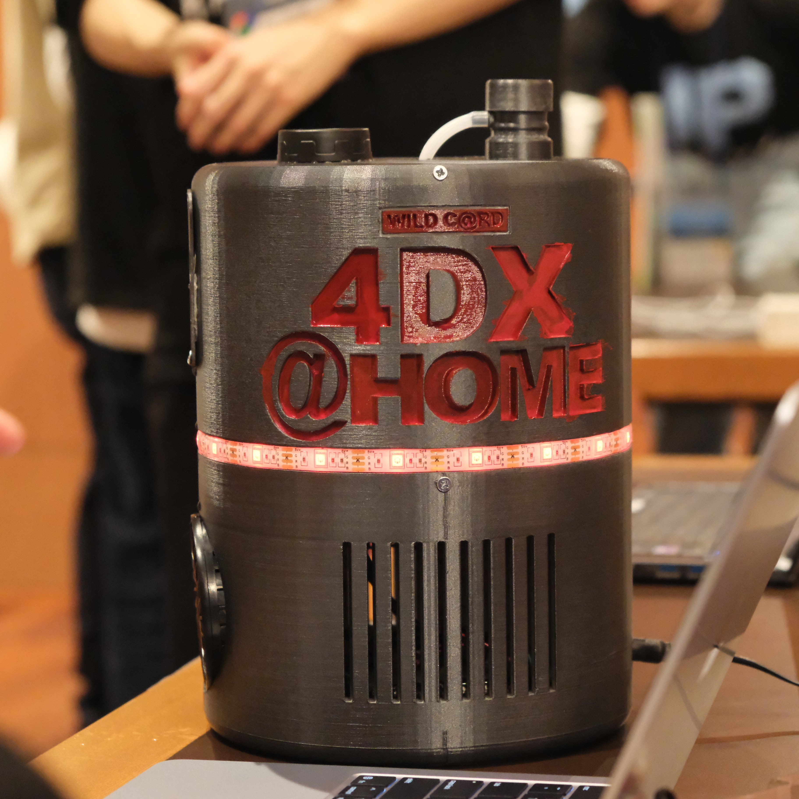</td>
<td>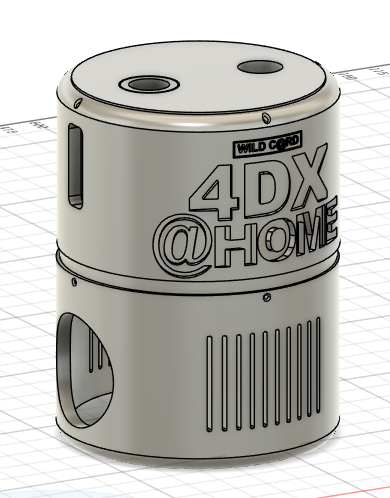</td>
</tr>
</table>
</div>

**3D設計データ**: `hardware/3DModel/4dx@home-stand.stl`（Autodesk Fusion設計）

- **機能**: 4種類の環境エフェクト（**水・風・光・色**）を提供
- **サイズ**: 卓上サイズ（約29cm）
- **制御マイコン**: ESP-12E × 2台
  - ESP-12E #1: Wind & Water Control（風・水エフェクト統合）
  - ESP-12E #2: Flash & LED Color Control（光・色エフェクト統合）
- **搭載アクチュエーター**:
  - ESP#1: 給水口・水噴射ノズル（サーボモーター制御）、DC扇風機（PWM制御）
  - ESP#2: 高輝度LED（フラッシュエフェクト）、RGB LEDテープ（色彩エフェクト）
- **通信方式**: Wi-Fi (802.11n) + MQTT

#### 2. ActionDrive（振動フィードバックデバイス）

<div align="center">
<table>
<tr>
<td align="center"><b>📷 実物写真</b></td>
<td align="center"><b>🖥️ 3Dモデル</b></td>
<td align="center"><b>🔧 内部構造</b></td>
</tr>
<tr>
<td></td>
<td>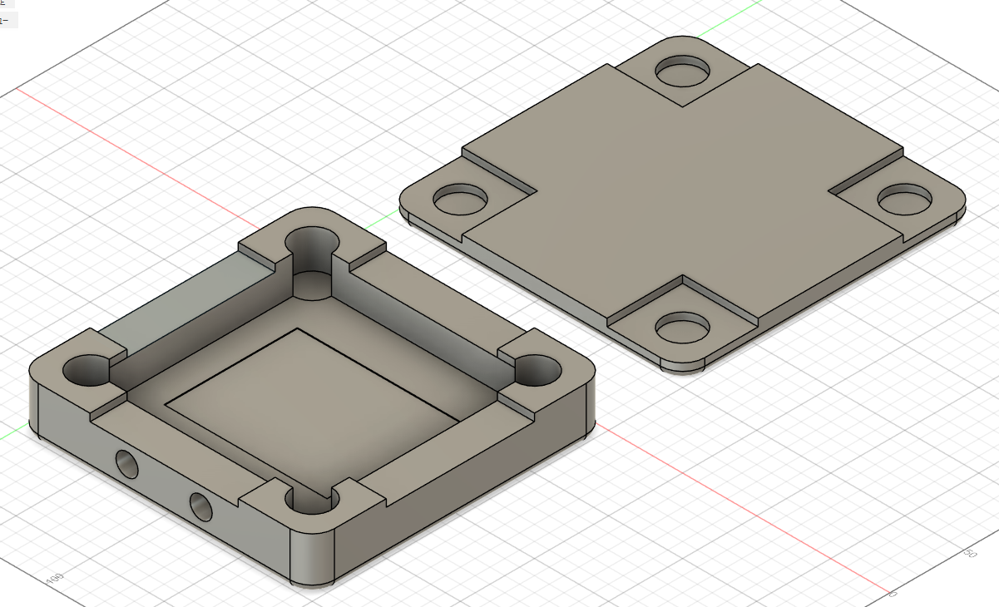</td>
<td></td>
</tr>
</table>

<b>🎬 動作デモ動画</b>

<!-- TODO: 動画埋め込み - YouTube URLまたはGIF画像を追加 -->
<!-- 例: [](https://www.youtube.com/watch?v=VIDEO_ID) -->
<!-- 例:  -->
<p><i>🚧 動画準備中 - 振動動作のデモ映像をここに埋め込み予定</i></p>

</div>

**3D設計データ**: `hardware/3DModel/Motor Case Ver 2.stl`（Autodesk Fusion設計）

- **機能**: **振動**によるフィードバックを提供するクッション型デバイス
- **制御マイコン**: ESP-12E × 2台（Motor Case Ver 2に格納）
  - ESP-12E #3: Motor1 Control（4つの偏心モーター制御）
  - ESP-12E #4: Motor2 Control（4つの偏心モーター制御）
- **搭載アクチュエーター**:
  - 偏心モーター × 8個（強度別4ピン制御）
  - 強度レベル: STRONG, MEDIUM_STRONG, MEDIUM_WEAK, WEAK
- **使用モード**:
  - **1人利用**: 背中とお尻の2点で異なる振動を制御
  - **2人利用**: 横に並べて2人で振動体験を共有
- **通信方式**: Wi-Fi (802.11n) + MQTT

### 無線通信アーキテクチャ

本システムは**完全無線通信**を採用しており、配線の取り回しを最小化しています。

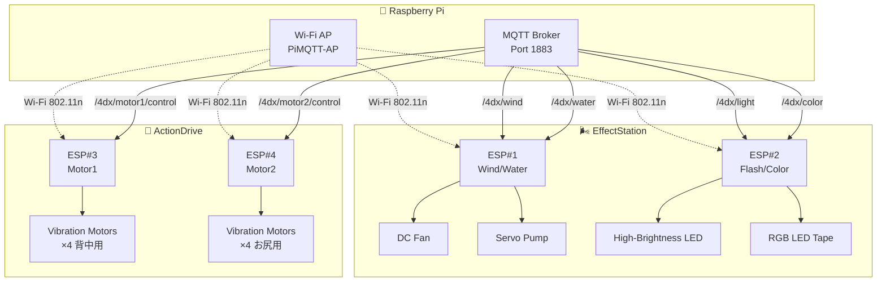

**Wi-Fi設定**:
- SSID: `PiMQTT-AP`
- IP: `192.168.4.1` (Raspberry Pi)
- Protocol: MQTT over TCP/IP (Port 1883)

### システム全体構成

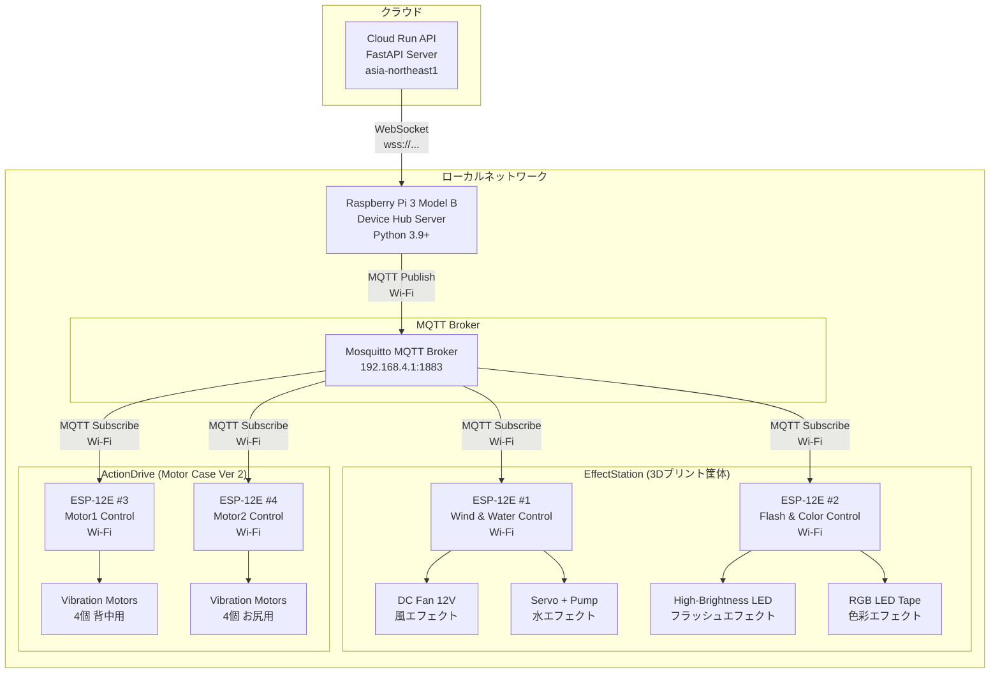

---

## 技術スタック

### Raspberry Pi Server

#### ハードウェア
- **Raspberry Pi 3 Model B**
  - CPU: ARM Cortex-A53 (4コア 1.2GHz)
  - RAM: 1GB
  - Storage: microSD 32GB以上 (Class 10推奨)
  - Wi-Fi: 802.11n
  - Ethernet: 10/100 Mbps

#### OS・環境
- **Raspberry Pi OS** (Debian 11 Bullseye)
- **Python** 3.9+
- **systemd** サービス管理

#### 依存ライブラリ
```txt
Flask==3.0.0                 # Webサーバー
flask-cors==4.0.0            # CORSサポート
flask-socketio==5.3.5        # Socket.IO統合
python-socketio==5.10.0      # Socket.IOクライアント
websockets==12.0             # WebSocket通信（非同期版）
paho-mqtt==1.6.1             # MQTT通信
python-dotenv==1.0.0         # 環境変数管理
aiofiles==23.2.1             # 非同期IO
coloredlogs==15.0.1          # カラーログ出力
python-json-logger==2.0.7    # JSONログ
python-dateutil==2.8.2       # 日付処理
pytest==7.4.3                # テストフレームワーク
pytest-asyncio==0.21.1       # 非同期テスト
asyncio                      # 非同期処理
```

### ESP-12E Devices (全4台)

#### ハードウェア
- **ESP-12E** (ESP8266ベース) × 4台
  - CPU: Tensilica L106 32-bit (80MHz)
  - RAM: 50KB
  - Flash: 4MB
  - Wi-Fi: 802.11 b/g/n (2.4GHz)
  - GPIO: 11ピン使用可能
  - 電源: 3.3V (各ESP独立電源供給)

#### 開発環境
- **Arduino IDE** 1.8.19+
- **ESP8266 Arduino Core** 3.0.2+
- **スケッチファイル**:
  - `hardware/actuators/4DX_WATER_WIND.ino` (ESP#1: 風・水統合制御)
  - `hardware/actuators/4DX_LIGHTS.ino` (ESP#2: 光・色統合制御)
  - `hardware/actuators/4DX_MOTOR_MQTT.ino` (ESP#3, #4: 振動制御)

#### 依存ライブラリ
```cpp
#include <ESP8266WiFi.h>     // Wi-Fi接続
#include <PubSubClient.h>    // MQTTクライアント
#include <Servo.h>           // サーボモーター制御（水エフェクト用）
```

#### Wi-Fi接続設定

全てのESP-12EはRaspberry Piが提供するWi-Fiアクセスポイントに接続します。

```cpp
const char* WIFI_SSID     = "PiMQTT-AP";
const char* WIFI_PASSWORD = "AtHome1234";
const char* MQTT_HOST     = "192.168.4.1";  // Raspberry Pi IP
const uint16_t MQTT_PORT  = 1883;
```

#### デバイス別設定

| ESP# | デバイスID | MQTTクライアントID | Subscribeトピック | 制御対象 |
|------|-----------|-------------------|------------------|----------|
| #1 | ESP-WindWater | ESP8266_4DX_Client | `/4dx/wind`<br/>`/4dx/water` | DC Fan + Servo Pump |
| #2 | ESP-FlashColor | ESP8266_LED_Controller | `/4dx/light`<br/>`/4dx/color` | High-Brightness LED + RGB LED Tape |
| #3 | ESP-Motor1 | ESP8266_Motor_1 | `/4dx/motor1/control` | Vibration Motors (4個・背中) |
| #4 | ESP-Motor2 | ESP8266_Motor_2 | `/4dx/motor2/control` | Vibration Motors (4個・お尻) |

#### ハートビート機能

各ESP-12Eは10秒ごとにハートビートメッセージを送信し、接続状態を監視します。

```cpp
const unsigned long HEARTBEAT_MS = 10000; // 10秒間隔
```

---

## システム構成

### デバイスハブ (Raspberry Pi)

#### モジュール構成図

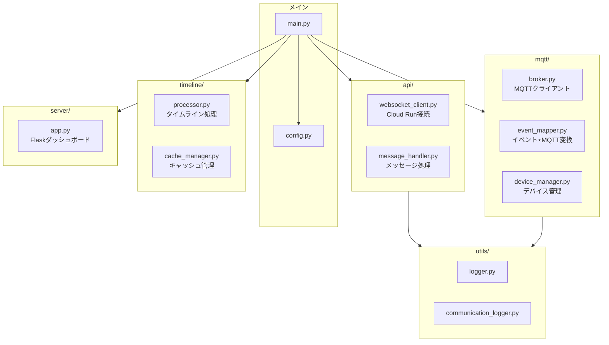

#### ディレクトリ構造

```
hardware/rpi_server/
├── main.py                     # メインアプリケーション
├── config.py                   # 設定管理
├── requirements.txt            # Python依存関係
├── .env.example                # 環境変数テンプレート
├── .env                        # 環境変数 (実ファイル)
│
├── src/
│   ├── api/
│   │   ├── websocket_client.py      # Cloud Run WebSocketクライアント
│   │   └── message_handler.py       # WebSocketメッセージハンドラー
│   │
│   ├── mqtt/
│   │   ├── broker.py                # MQTTブローカークライアント
│   │   ├── event_mapper.py          # イベント→MQTTコマンド変換
│   │   └── device_manager.py        # デバイス管理
│   │
│   ├── timeline/
│   │   ├── processor.py             # タイムライン処理エンジン
│   │   └── cache_manager.py         # タイムラインキャッシュ
│   │
│   ├── server/
│   │   └── app.py                   # Flask監視サーバー
│   │
│   └── utils/
│       ├── logger.py                # ロガー設定
│       ├── timing.py                # タイムスタンプ処理
│       └── communication_logger.py  # 通信ログ記録
│
├── data/
│   ├── communication_logs/          # 通信ログファイル
│   └── timeline_cache/              # タイムラインキャッシュ
│
├── templates/
│   └── index.html                   # 監視ダッシュボード
│
└── static/
    ├── css/
    └── js/
```

#### 環境変数 (.env)

```env
# === デバイス情報 ===
DEVICE_HUB_ID=FDX001
DEVICE_HUB_NAME=TestHub-001
SESSION_ID=demo1

# === サーバー設定 ===
FLASK_HOST=0.0.0.0
FLASK_PORT=5000
FLASK_DEBUG=False

# === Cloud Run接続 ===
CLOUD_RUN_API_URL=https://fdx-home-backend-api-xxxxxxxxxxxx.asia-northeast1.run.app
CLOUD_RUN_WS_URL=wss://fdx-home-backend-api-xxxxxxxxxxxx.asia-northeast1.run.app

# === MQTT設定 ===
MQTT_BROKER_HOST=192.168.4.1
MQTT_BROKER_PORT=1883
MQTT_CLIENT_ID=raspberrypi_controller
MQTT_KEEPALIVE=60
MQTT_QOS=1

# === Wi-Fi AP設定 (Raspberry Pi) ===
WIFI_SSID=PiMQTT-AP
WIFI_PASSWORD=AtHome1234
WIFI_CHANNEL=6
WIFI_IP=192.168.4.1

# === ログ設定 ===
LOG_LEVEL=DEBUG
LOG_FILE=data/communication_logs/device_hub.log
COMMUNICATION_LOG_FILE=data/communication_logs/api_communication.log
ENABLE_DETAILED_LOGGING=true

# === 同期精度 ===
SYNC_TOLERANCE_MS=100
TIME_LOOKUP_BUFFER_MS=50
```

---

## 通信プロトコル

### 1. WebSocket通信 (Raspberry Pi ↔ Cloud Run API)

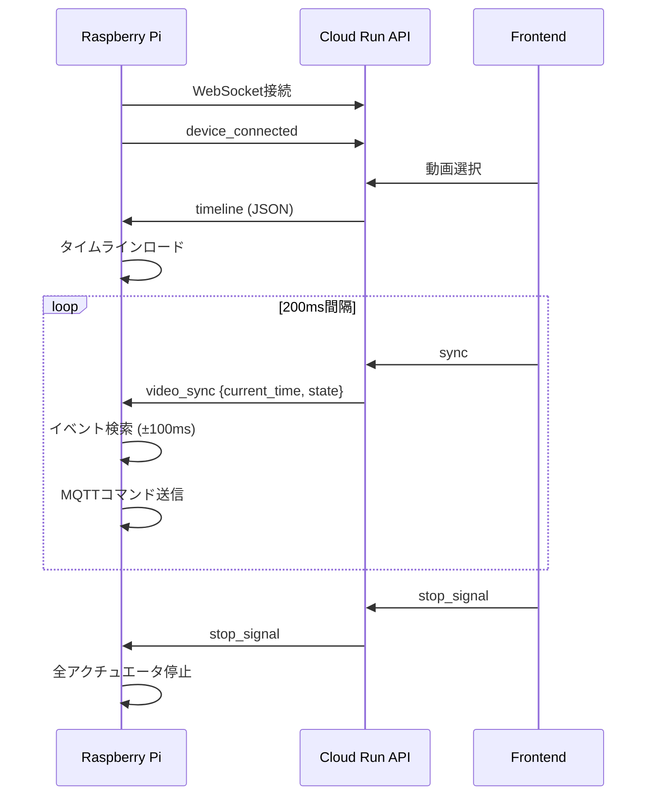

#### 接続先

```
wss://fdx-home-backend-api-xxxxxxxxxxxx.asia-northeast1.run.app/api/playback/ws/device/{session_id}
```

#### メッセージタイプ

##### デバイス接続通知 (Raspberry Pi → Server)

```json
{
  "type": "device_connected",
  "device_hub_id": "FDX001",
  "session_id": "demo1",
  "timestamp": "2025-11-14T12:00:00Z"
}
```

##### タイムライン受信 (Server → Raspberry Pi)

```json
{
  "type": "timeline",
  "session_id": "demo1",
  "timeline": {
    "video_id": "demo1",
    "duration": 120.0,
    "events": [
      {
        "t": 15.5,
        "action": "start",
        "effect": "vibration",
        "mode": "strong",
        "intensity": 0.8
      },
      {
        "t": 17.0,
        "action": "stop",
        "effect": "vibration"
      }
    ]
  }
}
```

##### 動画同期 (Server → Raspberry Pi)

```json
{
  "type": "video_sync",
  "session_id": "demo1",
  "current_time": 45.2,
  "state": "play",
  "timestamp": "2025-11-14T12:00:00Z"
}
```

##### ストップ信号 (Server → Raspberry Pi) **[NEW - AwardDay]**

```json
{
  "type": "stop_signal",
  "session_id": "demo1",
  "timestamp": 1731571200.000,
  "message": "stop_all_actuators",
  "action": "stop_all",
  "source": "websocket"
}
```

##### デバイステスト (Server → Raspberry Pi)

```json
{
  "type": "device_test",
  "session_id": "demo1",
  "test_type": "basic"
}
```

##### デバイステスト結果 (Raspberry Pi → Server)

```json
{
  "type": "device_test_result",
  "session_id": "demo1",
  "success": true,
  "results": {
    "VIBRATION": "OK",
    "WIND": "OK",
    "WATER": "OK",
    "FLASH": "OK",
    "COLOR": "OK"
  }
}
```

---

### 2. MQTT通信 (Raspberry Pi ↔ ESP-12E Devices)

#### MQTTトピック構成図

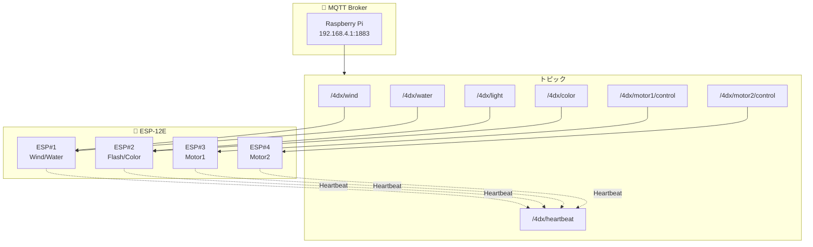

#### MQTTトピック構成

| エフェクト | MQTTトピック | ペイロード例 | 説明 |
|---------|------------|----------|------|
| **Wind** | `/4dx/wind` | `ON` / `OFF` | 風エフェクト開始/停止 |
| **Flash/Light** | `/4dx/light` | `ON` / `OFF` / `FLASH 15` | フラッシュ・ライト制御 |
| **LED Color** | `/4dx/color` | `RED` / `GREEN` / `BLUE` / `OFF` | LED色指定 |
| **Motor1** | `/4dx/motor1/control` | `ON` / `OFF` / `HEART` | 振動モーター1制御 |
| **Motor2** | `/4dx/motor2/control` | `ON` / `OFF` / `HEART` | 振動モーター2制御 |

#### MQTT設定

```python
MQTT_BROKER_HOST = "172.18.28.55"
MQTT_BROKER_PORT = 1883
MQTT_CLIENT_ID = "raspberrypi_controller"
MQTT_QOS = 1  # At least once
MQTT_KEEPALIVE = 60
```

---

## タイムライン処理

### 処理フロー

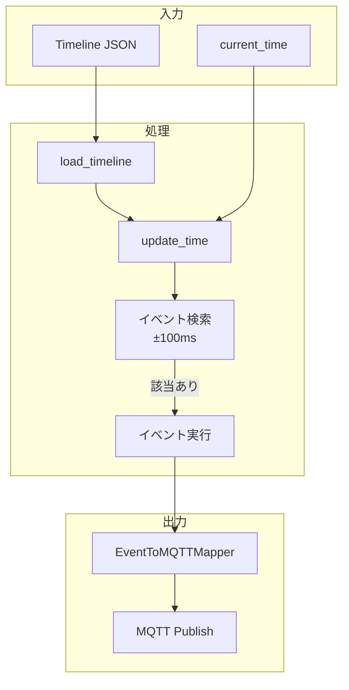

### イベント構造

```json
{
  "t": 15.5,           // タイムスタンプ (秒)
  "action": "start",   // "start" | "stop" | "shot"
  "effect": "vibration", // エフェクトタイプ
  "mode": "strong",    // モード
  "intensity": 0.8     // 強度 (0.0-1.0)
}
```

### エフェクトタイプ一覧

| エフェクト | 説明 | モード例 |
|---------|------|---------|
| `vibration` | 振動 | `strong`, `weak`, `heart` |
| `wind` | 風 | `burst`, `long` |
| `water` | 水 | `splash` |
| `flash` | フラッシュ | `strobe`, `burst` |
| `color` | 色彩 | `red`, `green`, `blue`, `orange` |

### タイムライン処理ロジック

```python
class TimelineProcessor:
    """タイムライン処理エンジン"""
    
    def __init__(self, on_event_callback):
        self.events = []
        self.current_time = 0.0
        self.is_playing = False
        self.on_event_callback = on_event_callback
        self.tolerance_ms = 100  # ±100ms許容
    
    def load_timeline(self, timeline_data: dict):
        """タイムラインJSONを読み込み"""
        self.events = timeline_data.get("events", [])
        logger.info(f"タイムライン読み込み完了: {len(self.events)}イベント")
    
    def update_time(self, current_time: float):
        """現在時刻を更新し、該当イベントを検索"""
        self.current_time = current_time
        
        # 時刻範囲内のイベントを検索 (±100ms)
        tolerance_sec = self.tolerance_ms / 1000.0
        start_time = current_time - tolerance_sec
        end_time = current_time + tolerance_sec
        
        matching_events = [
            event for event in self.events
            if start_time <= event["t"] <= end_time
        ]
        
        # イベント発火
        for event in matching_events:
            self.on_event_callback(event)
            logger.debug(f"イベント発火: t={event['t']}, effect={event['effect']}")
    
    def stop_playback(self):
        """再生停止"""
        self.is_playing = False
        logger.info("タイムライン再生停止")
```

---

## イベント→MQTTマッピング

> 📝 EventToMQTTMapperの詳細な実装例は[実装例集 - EventToMQTTMapper](#eventtomqttmapper-実装例)を参照

### 対応エフェクト一覧

| エフェクト | MQTTトピック | startコマンド | stopコマンド |
|---------|------------|-------------|------------|
| Wind | `/4dx/wind` | `ON` | `OFF` |
| Flash (strobe) | `/4dx/light` | `FLASH 15` | `OFF` |
| Flash (burst) | `/4dx/light` | `FLASH 10` | `OFF` |
| Vibration | `/4dx/motor1/control`, `/4dx/motor2/control` | `ON` | `OFF` |
| Vibration (heart) | `/4dx/motor1/control`, `/4dx/motor2/control` | `HEART` | `OFF` |
| Color | `/4dx/color` | `RED`, `GREEN`, `BLUE` etc. | - |

### 全アクチュエータ停止コマンド

ストップ信号受信時、以下の5つのMQTTコマンドが送信されます:

1. `/4dx/wind` → `OFF` (風停止)
2. `/4dx/light` → `OFF` (フラッシュ/ライト消灯)
3. `/4dx/color` → `RED` (LED色を赤に戻す)
4. `/4dx/motor1/control` → `OFF` (振動モーター1停止)
5. `/4dx/motor2/control` → `OFF` (振動モーター2停止)

**注意**: LED色は完全OFFにせず、赤色に戻します（暗闇での視認性確保）。

---

## ストップ処理実装 **[NEW - AwardDay]**

### ストップ処理フロー

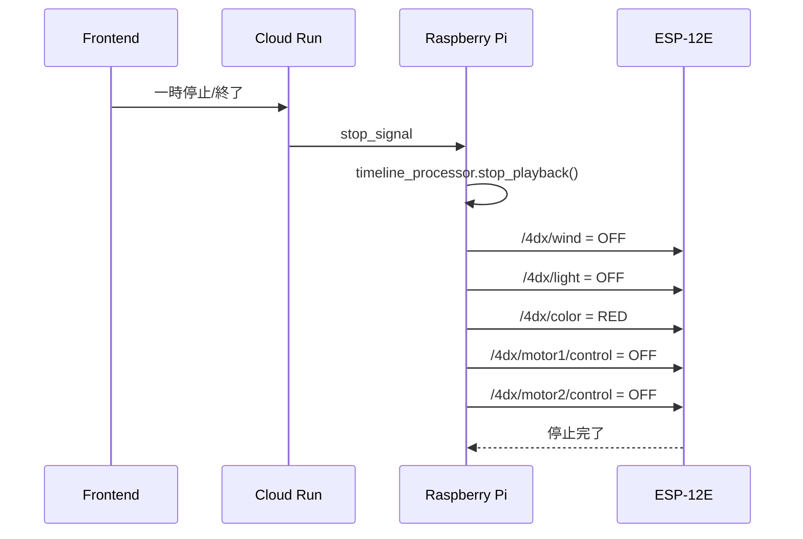

> 📝 Raspberry Pi側のストップ処理実装例は[実装例集 - ストップ処理](#ストップ処理-実装例)を参照

---

## 起動・運用

### 起動フロー

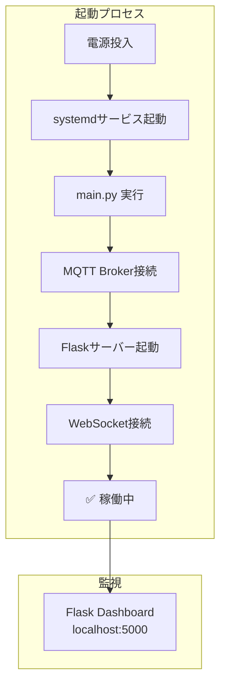

### Raspberry Pi起動方法

#### 1. 依存パッケージインストール

```bash
cd hardware/rpi_server
pip3 install -r requirements.txt
```

#### 2. 環境変数設定

```bash
cp .env.example .env
nano .env
# SESSION_ID, MQTT_BROKER_HOST 等を編集
```

#### 3. サーバー起動

```bash
python3 main.py
```

**起動ログ例**:
```
============================================================
4DX@HOME Raspberry Pi Server 起動
============================================================
Device Hub ID: FDX001
Session ID: demo1
Cloud Run API: https://fdx-home-backend-api-xxxxxxxxxxxx.asia-northeast1.run.app
============================================================
✓ MQTT接続完了
✓ Flaskサーバー起動完了
WebSocket接続開始...
🌐 [WebSocket] 接続成功: wss://...
✅ [WebSocket] device_connected メッセージ送信完了
```

#### 4. 監視ダッシュボードアクセス

```
http://<Raspberry_Pi_IP>:5000
```

**表示内容**:
- WebSocket接続状態
- タイムライン情報 (イベント数、エフェクト統計)
- 現在の再生時刻とイベント発生状況
- 通信ログ (リアルタイム更新)

---

### systemdサービス化 (自動起動)

#### サービスファイル作成

```bash
sudo nano /etc/systemd/system/4dx-home.service
```

```ini
[Unit]
Description=4DX@HOME Raspberry Pi Server
After=network.target

[Service]
Type=simple
User=pi
WorkingDirectory=/home/pi/kz_2504/hardware/rpi_server
ExecStart=/usr/bin/python3 main.py
Restart=always
RestartSec=10
Environment=PYTHONUNBUFFERED=1

[Install]
WantedBy=multi-user.target
```

#### サービス有効化・起動

```bash
sudo systemctl daemon-reload
sudo systemctl enable 4dx-home.service
sudo systemctl start 4dx-home.service

# ステータス確認
sudo systemctl status 4dx-home.service

# ログ確認
sudo journalctl -u 4dx-home.service -f
```

---

## デバッグ・監視

### debug_hardware (PC上シミュレーター)

**URL**: http://localhost:5000

**用途**: Raspberry Pi動作のPC上シミュレーション

**主要機能**:
- Cloud Run WebSocket接続テスト
- タイムライン処理確認
- MQTT送信ログ確認
- 通信ログ記録

**起動方法**:
```powershell
cd debug_hardware
pip install -r requirements.txt
python app.py
```

### ログファイル

- **デバイスハブログ**: `data/communication_logs/device_hub.log`
- **通信ログ (JSON)**: `data/communication_logs/api_communication.log`

---

## トラブルシューティング

### 1. WebSocket接続失敗

**症状**: `WebSocketエラー: Connection refused`

**原因**: Cloud Run API未起動、セッションID不一致

**解決策**:
- Cloud Run APIの`/health`エンドポイントにアクセス確認
- `.env`の`SESSION_ID`が正しいか確認
- ネットワーク接続確認

### 2. MQTT接続失敗

**症状**: `MQTT接続失敗: Connection refused`

**原因**: Mosquitto未起動、ホスト名/ポート間違い

**解決策**:
```bash
# Mosquittoインストール・起動
sudo apt install mosquitto mosquitto-clients
sudo systemctl start mosquitto
sudo systemctl enable mosquitto

# 接続テスト
mosquitto_pub -h 172.18.28.55 -t /test -m "Hello"
```

### 3. タイムライン処理されない

**症状**: イベントが発火しない

**原因**: タイムライン未ロード、時刻同期ずれ

**確認項目**:
- タイムラインが正しくロードされているか (`/health`エンドポイント確認)
- `SYNC_TOLERANCE_MS`設定 (デフォルト: 100ms)
- ログでcurrentTimeの値を確認

### 4. ESP-12E応答なし

**症状**: MQTTメッセージを送っても動作しない

**原因**: ESP-12Eプログラム未書き込み、Wi-Fi未接続

**解決策**:
- Arduino IDEでシリアルモニター確認 (115200 baud)
- Wi-Fi接続状態確認 (`WiFi.status()`)
- MQTTサブスクリプション確認 (`client.subscribe()`)

---

## パフォーマンス指標

### レイテンシ

| 区間 | 目標 | 実測 |
|-----|-----|-----|
| **Cloud Run → Raspberry Pi** | < 200ms | ~150ms |
| **Raspberry Pi → ESP-12E** | < 100ms | ~50ms |
| **合計レイテンシ** | < 300ms | ~200ms |

### 同期精度

- **タイムライン検索許容範囲**: ±100ms
- **MQTT送信遅延**: ~50ms
- **合計同期精度**: ±150ms以内

---

## Hack Day → Award Day 変更履歴

### 前提: Hack Day時点の状態

- **アーキテクチャ**: 3層構成（Frontend ↔ Cloud Run ↔ Raspberry Pi）は完成
- **デプロイ**: Cloud Runデプロイ済み
- **制約**:
  - セッションID決め打ち
  - タイムラインJSONラズパイ側固定配置
  - スタート信号のみ（タイミング制御はラズパイローカル）
  - デバイス認証なし
  - **ハードウェア構成**: Arduino Uno R3 × 2台 + ESP-12E × 1台（シリアル通信 + MQTT混在）

### Award Dayでの主要変更

#### 1. ハードウェア統一化 **[重要]**
- ✅ **Arduino全廃**: Arduino Uno R3 × 2台を撤廃
- ✅ **ESP-12E統一**: ESP-12E × 4台に統一（全てMQTT通信）
- ✅ **通信プロトコル統一**: シリアル通信廃止、完全Wi-Fi + MQTT化
- ✅ **配線簡素化**: Raspberry Pi ↔ ESP間の物理配線が不要に

#### 2. 機体刷新
- ✅ **3Dプリント筐体設計**:
  - `4dx@home-stand.stl` (EffectStation筐体)
  - `Motor Case Ver 2.stl` (ActionDrive筐体)
- ✅ **2デバイス構成**:
  - **EffectStation**: 風・水・光・色（ESP-12E × 2台）
  - **ActionDrive**: 振動×8モーター（ESP-12E × 2台）

#### 3. 自動起動システム
- ✅ **systemdサービス化**: `/etc/systemd/system/4dx-home.service`
- ✅ **電源投入時自動起動**: Raspberry Pi起動と同時にサーバー稼働
- ✅ **再起動耐性**: 異常終了時の自動再起動（RestartSec=10）

#### 4. エンドツーエンド連携完全実装
- ✅ **デバイス認証**: 製品コード（DH001/DH002/DH003）による認証
- ✅ **タイムラインJSON動的送信**: Cloud Run → Raspberry Pi経由配信
- ✅ **時間同期制御**: 200ms間隔連続同期（Hack Day: スタート信号のみ）
- ✅ **ストップ処理**: WebSocket `stop_signal`による全アクチュエータ安全停止
- ✅ **デバイステスト**: 5デバイス個別動作確認

#### 5. ソフトウェア強化
- ✅ **WebSocket自動再接続**: `CloudRunWebSocketClient`（指数バックオフ）
- ✅ **動的タイムライン処理**: `TimelineProcessor` + `TimelineCacheManager`
- ✅ **モジュール構造化**: 5モジュール（api/, mqtt/, timeline/, server/, utils/）
- ✅ **通信ログシステム**: `CommunicationLogger` 全通信トレース
- ✅ **Flask監視ダッシュボード**: localhost:5000

---

## 今後の拡張予定

- [ ] 水エフェクト (小型ポンプ制御)
- [ ] 香りエフェクト (ペルチェ素子加熱)
- [ ] 複数Raspberry Pi対応 (Redis/Pub/Sub)
- [ ] ハードウェアヘルスモニタリング (温度・電流センサー)
- [ ] OTAファームウェア更新 (ESP-12E)
- [ ] 緊急停止ボタン (物理スイッチ)

---

## 安全機能

### 電気的安全

- **過電流保護**: ヒューズ・ブレーカー設置
- **絶縁保護**: 電源部完全分離
- **サージ保護**: バリスタ・フィルター使用

### 物理的安全

- **温度監視**: 過熱時自動停止 (予定)
- **動作時間制限**: 連続運転時間制約
- **緊急停止**: 手動停止スイッチ (予定)

### ソフトウェア安全

```python
# 安全制約例
MAX_VIBRATION_TIME = 30.0      # 振動最大継続時間 (秒)
MAX_FLASH_DURATION = 5.0       # フラッシュ最大継続時間 (秒)
OVERHEAT_THRESHOLD = 70.0      # 過熱しきい値 (℃)
WATCHDOG_TIMEOUT = 5.0         # ウォッチドッグタイムアウト (秒)
```

---

## 関連ドキュメント

- [バックエンド仕様書](./backend-specification-awardday.md)
- [フロントエンド仕様書](./frontend-specification-awardday.md)
- [ストップ処理仕様](../debug_frontend/STOP_SIGNAL_SPEC.md)
- [Raspberry Pi設定ガイド](../hardware/rpi_server/README.md)
- [debug_hardware アーキテクチャ](../debug_hardware/ARCHITECTURE.md)

---

## 実装例集

以下は各機能の詳細な実装例です。

### TimelineProcessor 実装例

```python
class TimelineProcessor:
    """タイムライン処理エンジン"""
    
    def __init__(self, on_event_callback):
        self.events = []
        self.current_time = 0.0
        self.is_playing = False
        self.on_event_callback = on_event_callback
        self.tolerance_ms = 100  # ±100ms許容
    
    def load_timeline(self, timeline_data: dict):
        """タイムラインJSONを読み込み"""
        self.events = timeline_data.get("events", [])
        logger.info(f"タイムライン読み込み完了: {len(self.events)}イベント")
    
    def update_time(self, current_time: float):
        """現在時刻を更新し、該当イベントを検索"""
        self.current_time = current_time
        
        # 時刻範囲内のイベントを検索 (±100ms)
        tolerance_sec = self.tolerance_ms / 1000.0
        start_time = current_time - tolerance_sec
        end_time = current_time + tolerance_sec
        
        matching_events = [
            event for event in self.events
            if start_time <= event["t"] <= end_time
        ]
        
        # イベント発火
        for event in matching_events:
            self.on_event_callback(event)
            logger.debug(f"イベント発火: t={event['t']}, effect={event['effect']}")
    
    def stop_playback(self):
        """再生停止"""
        self.is_playing = False
        logger.info("タイムライン再生停止")
```

### EventToMQTTMapper 実装例

```python
class EventToMQTTMapper:
    """タイムラインイベントをMQTTコマンドに変換"""
    
    @classmethod
    def map_event_to_mqtt(cls, event: Dict) -> List[Tuple[str, str]]:
        """イベント→MQTTコマンド変換
        
        Returns:
            [(topic, payload), ...] のリスト
        """
        effect = event.get("effect", "").lower()
        action = event.get("action", "start")
        mode = event.get("mode", "default")
        
        commands = []
        
        # Wind エフェクト
        if effect == "wind":
            if action == "start":
                commands.append(("/4dx/wind", "ON"))
            elif action == "stop":
                commands.append(("/4dx/wind", "OFF"))
        
        # Flash エフェクト
        elif effect == "flash":
            if action == "start":
                if mode == "strobe":
                    commands.append(("/4dx/light", "FLASH 15"))
                elif mode == "burst":
                    commands.append(("/4dx/light", "FLASH 10"))
                else:
                    commands.append(("/4dx/light", "ON"))
            elif action == "stop":
                commands.append(("/4dx/light", "OFF"))
        
        # Vibration エフェクト
        elif effect == "vibration":
            if action == "start":
                if mode == "heart":
                    commands.append(("/4dx/motor1/control", "HEART"))
                    commands.append(("/4dx/motor2/control", "HEART"))
                else:
                    commands.append(("/4dx/motor1/control", "ON"))
                    commands.append(("/4dx/motor2/control", "ON"))
            elif action == "stop":
                commands.append(("/4dx/motor1/control", "OFF"))
                commands.append(("/4dx/motor2/control", "OFF"))
        
        # Color エフェクト
        elif effect == "color":
            color = mode.upper()  # "RED", "GREEN", "BLUE", etc.
            commands.append(("/4dx/color", color))
        
        return commands
    
    @classmethod
    def get_stop_all_commands(cls) -> List[Tuple[str, str]]:
        """全アクチュエータ停止コマンド生成 [NEW - AwardDay]
        
        一時停止・動画終了時に呼び出される
        """
        stop_commands = [
            ("/4dx/wind", "OFF"),
            ("/4dx/light", "OFF"),
            ("/4dx/color", "RED"),  # 完全OFFにはせず赤に戻す
            ("/4dx/motor1/control", "OFF"),
            ("/4dx/motor2/control", "OFF"),
        ]
        
        logger.info(f"🛑 全停止MQTTコマンド生成: {len(stop_commands)}件")
        
        return stop_commands
```

### ストップ処理 実装例

```python
def _on_stop_signal_received(self, stop_data: Dict) -> None:
    """ストップ信号受信時の処理（全アクチュエータ停止）
    
    Args:
        stop_data: ストップ信号データ（session_id, action, timestamp, sourceを含む）
    """
    session_id = stop_data.get("session_id")
    action = stop_data.get("action", "stop_all")
    source = stop_data.get("source", "unknown")
    
    logger.info(
        f"🛑 ストップ信号処理開始: session_id={session_id}, "
        f"action={action}, source={source}"
    )
    
    try:
        # タイムライン再生を停止
        if self.timeline_processor.is_playing:
            self.timeline_processor.stop_playback()
            logger.info("⏸️  タイムライン再生停止")
        
        # 全アクチュエータ停止MQTTコマンドを取得
        stop_commands = EventToMQTTMapper.get_stop_all_commands()
        
        # MQTTコマンドを送信
        for topic, payload in stop_commands:
            self.mqtt_client.publish(topic, payload)
            logger.debug(f"📤 MQTT送信: {topic} = {payload}")
        
        logger.info(
            f"✅ 全アクチュエータ停止完了: {len(stop_commands)}個のコマンド送信"
        )
    
    except Exception as e:
        logger.error(f"❌ ストップ信号処理エラー: {e}", exc_info=True)
```

### ESP-12E Wind Control 実装例

```cpp
#include <ESP8266WiFi.h>
#include <PubSubClient.h>

// Wi-Fi設定
const char* ssid = "YOUR_WIFI_SSID";
const char* password = "YOUR_WIFI_PASSWORD";

// MQTT設定
const char* mqtt_server = "172.18.28.55";
const int mqtt_port = 1883;
const char* mqtt_topic = "/4dx/wind";

// GPIO設定
const int FAN_PIN = 5; // D1ピン

WiFiClient espClient;
PubSubClient client(espClient);

void setup() {
  Serial.begin(115200);
  pinMode(FAN_PIN, OUTPUT);
  digitalWrite(FAN_PIN, LOW);
  
  // Wi-Fi接続
  WiFi.begin(ssid, password);
  while (WiFi.status() != WL_CONNECTED) {
    delay(500);
    Serial.print(".");
  }
  Serial.println("\nWi-Fi接続成功");
  
  // MQTT接続
  client.setServer(mqtt_server, mqtt_port);
  client.setCallback(callback);
  
  reconnect();
}

void callback(char* topic, byte* payload, unsigned int length) {
  String message = "";
  for (int i = 0; i < length; i++) {
    message += (char)payload[i];
  }
  
  if (message == "ON") {
    digitalWrite(FAN_PIN, HIGH);
  } else if (message == "OFF") {
    digitalWrite(FAN_PIN, LOW);
  }
}

void reconnect() {
  while (!client.connected()) {
    if (client.connect("ESP_Wind")) {
      client.subscribe(mqtt_topic);
    } else {
      delay(5000);
    }
  }
}

void loop() {
  if (!client.connected()) {
    reconnect();
  }
  client.loop();
}
```

### ESP-12E Motor Control 実装例

```cpp
#include <ESP8266WiFi.h>
#include <PubSubClient.h>

const char* ssid = "YOUR_WIFI_SSID";
const char* password = "YOUR_WIFI_PASSWORD";
const char* mqtt_server = "172.18.28.55";
const int mqtt_port = 1883;
const char* mqtt_topic = "/4dx/motor1/control";
const int MOTOR_PIN = 4;

WiFiClient espClient;
PubSubClient client(espClient);

void callback(char* topic, byte* payload, unsigned int length) {
  String message = "";
  for (int i = 0; i < length; i++) {
    message += (char)payload[i];
  }
  
  if (message == "ON") {
    digitalWrite(MOTOR_PIN, HIGH);
  } else if (message == "OFF") {
    digitalWrite(MOTOR_PIN, LOW);
  } else if (message == "HEART") {
    // ハートビートパターン: ドクドク
    for (int i = 0; i < 5; i++) {
      digitalWrite(MOTOR_PIN, HIGH);
      delay(100);
      digitalWrite(MOTOR_PIN, LOW);
      delay(50);
      digitalWrite(MOTOR_PIN, HIGH);
      delay(100);
      digitalWrite(MOTOR_PIN, LOW);
      delay(500);
    }
  }
}

void setup() {
  Serial.begin(115200);
  pinMode(MOTOR_PIN, OUTPUT);
  digitalWrite(MOTOR_PIN, LOW);
  
  WiFi.begin(ssid, password);
  while (WiFi.status() != WL_CONNECTED) {
    delay(500);
  }
  
  client.setServer(mqtt_server, mqtt_port);
  client.setCallback(callback);
}

void reconnect() {
  while (!client.connected()) {
    if (client.connect("ESP_Motor1")) {
      client.subscribe(mqtt_topic);
    } else {
      delay(5000);
    }
  }
}

void loop() {
  if (!client.connected()) {
    reconnect();
  }
  client.loop();
}
```

---

**変更履歴**:

| 日付 | バージョン | 変更内容 |
|-----|----------|---------|
| 2025-11-14 | 2.0.0 | Award Day後の実装を反映した仕様書作成 |
