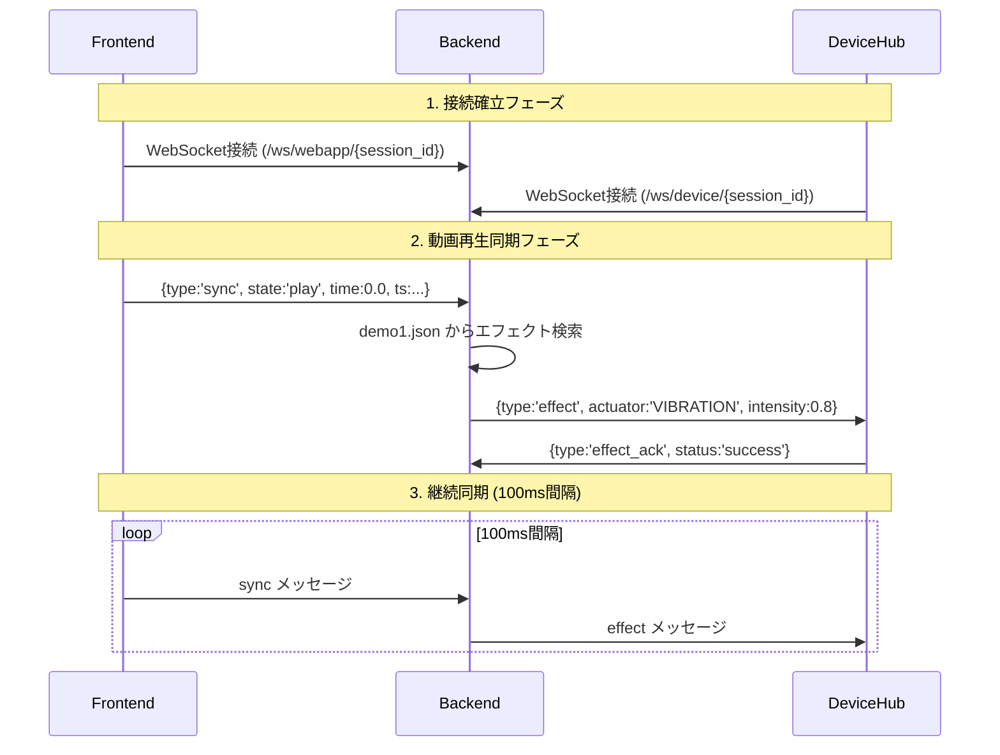

# Phase B-3 開発計画書 - リアルタイム動画同期システム

## 📋 **計画概要**
- **作成日**: 2025年10月12日
- **対象期間**: 2025年10月12日 ～ 2025年10月19日 (7日間)
- **フェーズ**: Phase B-3 - 再生制御API + 実デバイス検出システム
- **参考実装**: receiver.py & ws_video_sync_sender.html 分析結果
- **目標**: フロントエンド-バックエンド-デバイスハブ間のリアルタイム動画同期

---

## 🎯 **Phase B-3 実装スコープ**

### **优先度1: リアルタイム動画同期システム** ⭐⭐⭐ 
**参考**: ws_video_sync_sender.html の同期メッセージング
- フロントエンドからの動画再生状態受信
- デバイスハブへのエフェクト命令送信
- 100ms間隔でのリアルタイム同期

### **优先度2: 実デバイス検出システム** ⭐⭐⭐
**参考**: receiver.py のWebSocket接続管理
- Mock デバイス検出から実WebSocket接続プールへ移行
- アクティブデバイス監視・管理
- デバイス応答性テスト

### **优先度3: 再生制御API拡張** ⭐⭐
- 基本的な再生制御エンドポイント
- セッション管理との統合
- エラーハンドリング強化

---

## 📊 **参考実装分析結果**

### **ws_video_sync_sender.html からの学習**

#### **1. 同期メッセージ形式**
```javascript
// 参考にする同期データ構造
const syncMessage = {
    type: 'sync',
    state: v.paused ? 'pause' : 'play',  // play, pause, seeking, seeked
    time: Number(v.currentTime.toFixed(3)),  // 精度3桁の再生時刻
    duration: Number(v.duration.toFixed(3)), // 動画総再生時間
    ts: Date.now()  // タイムスタンプ
};

// 特別なイベント
{ type:'sync', state:'seeking', time: 15.234, ts:... }  // シーク中
{ type:'sync', state:'rate', rate: v.playbackRate, time:... }  // 再生速度変更
```

#### **2. 送信間隔制御メカニズム**
```javascript
// スロットリング実装 (100-1000ms間隔)
function tick(){
  const interval = Number(intervalSel.value || '200');
  const t = performance.now();
  if(t - lastSent < interval) return;  // スロットリング
  
  // 実際の送信処理
  send(payload);
  lastSent = t;
}

// 50ms間隔で実行、実際の送信は設定間隔で制御
setInterval(tick, 50);
```

#### **3. イベントベース即座送信**
```javascript
// 重要イベントは即座に送信（スロットリング無視）
v.addEventListener('play', ()=> send({...}));
v.addEventListener('pause', ()=> send({...}));  
v.addEventListener('seeking', ()=> send({...}));
v.addEventListener('seeked', ()=> send({...}));
```

### **receiver.py からの学習**

#### **1. シンプルなWebSocket接続管理**
```python
# 新しいWebSocket書き方
from websockets.server import serve

async def handler(websocket):  # 引数は1つ
    print(f"[WS] 接続: {websocket.remote_address}, path={websocket.path}")
    try:
        async for message in websocket:
            print(f"受信: {message}")
            # ここで受信メッセージ処理
    except Exception as e:
        print(f"エラー: {e}")
    finally:
        print("切断されました")
```

#### **2. 任意パス対応**
```python
# パス制限なし、柔軟な接続管理
async with serve(handler, HOST, PORT):
    print(f"listening on ws://{HOST}:{PORT}/ (any path)")
    await asyncio.Future()  # 永続実行
```

---

## 🏗️ **Phase B-3 アーキテクチャ設計**

### **システム構成図**
```
┌─────────────────┐    ┌──────────────────┐    ┌─────────────────┐
│   Frontend      │    │   Backend        │    │  Device Hub     │
│  (React + WS)   │    │  (FastAPI)       │    │  (Raspberry Pi) │  
├─────────────────┤    ├──────────────────┤    ├─────────────────┤
│• HTML5 Video    │◄──►│• WebSocket管理   │◄──►│• WebSocket受信  │
│• 同期データ送信  │    │• 同期処理エンジン │    │• アクチュエータ │
│• UI制御         │    │• エフェクト配信   │    │• 応答送信       │
│                │    │• デバイス検出     │    │                │
└─────────────────┘    └──────────────────┘    └─────────────────┘
        │                       │                       │
   WebSocket           WebSocket + REST           WebSocket
  (sync data)           (effect commands)        (device status)
```

### **WebSocket 通信フロー**


---

## 📁 **実装ファイル構造**

### **新規作成ファイル**
```
backend/app/
├── api/
│   └── playback_control.py          # 🆕 再生制御API
├── services/
│   ├── sync_service.py              # 🆕 同期処理サービス  
│   ├── playback_service.py          # 🆕 再生管理サービス
│   └── device_discovery.py          # 🆕 実デバイス検出
├── models/
│   └── playback.py                  # 🆕 再生関連モデル
├── websocket/
│   └── sync_handler.py              # 🆕 同期WebSocketハンドラ
└── sync/
    ├── sync_engine.py               # 🆕 同期エンジン
    └── effect_distributor.py        # 🆕 エフェクト配信
```

### **既存ファイル拡張**
```
backend/app/
├── main.py                          # 🔄 新エンドポイント追加
├── services/
│   └── preparation_service.py       # 🔄 実デバイス検出統合
└── websocket/
    └── manager.py                   # 🔄 同期WebSocket対応
```

---

## 🛠️ **詳細実装計画**

### **Day 1-2: WebSocket同期基盤** 

#### **Day 1: 同期WebSocketハンドラ実装**
**ファイル**: `app/websocket/sync_handler.py`

```python
# 参考: receiver.py + ws_video_sync_sender.html
from fastapi import WebSocket
import asyncio
import json
from typing import Dict, Optional

class SyncWebSocketHandler:
    def __init__(self):
        self.active_sessions: Dict[str, Dict] = {}
        # session_id -> {
        #   "frontend_ws": WebSocket,
        #   "device_ws": WebSocket, 
        #   "current_state": PlaybackState,
        #   "last_sync_time": float
        # }
    
    async def handle_frontend_connection(self, websocket: WebSocket, session_id: str):
        """フロントエンドWebSocket接続処理"""
        await websocket.accept()
        
        if session_id not in self.active_sessions:
            self.active_sessions[session_id] = {}
        self.active_sessions[session_id]["frontend_ws"] = websocket
        
        try:
            async for message in websocket:
                await self._process_frontend_message(session_id, message)
        except Exception as e:
            print(f"Frontend WebSocket error: {e}")
        finally:
            self._cleanup_frontend_connection(session_id)
    
    async def _process_frontend_message(self, session_id: str, message: str):
        """フロントエンドからの同期メッセージ処理"""
        try:
            data = json.loads(message)
            
            if data.get("type") == "sync":
                # ws_video_sync_sender.html 形式のメッセージ処理
                await self._handle_sync_message(session_id, data)
            elif data.get("type") == "hello":
                # 接続確認メッセージ
                await self._send_to_frontend(session_id, {
                    "type": "connection_ack",
                    "session_id": session_id
                })
                
        except json.JSONDecodeError:
            print(f"Invalid JSON from frontend: {message}")
    
    async def _handle_sync_message(self, session_id: str, sync_data: Dict):
        """同期メッセージからエフェクト配信"""
        current_time = sync_data.get("time", 0.0)
        state = sync_data.get("state", "pause")
        
        # demo1.json からエフェクト検索
        effects = await self._get_effects_for_time(session_id, current_time)
        
        if effects and state == "play":
            # デバイスハブに送信
            await self._send_to_device(session_id, {
                "type": "effects",
                "time": current_time,
                "effects": effects
            })
        
        # 状態更新
        if session_id in self.active_sessions:
            self.active_sessions[session_id]["current_state"] = {
                "time": current_time,
                "state": state,
                "timestamp": sync_data.get("ts", 0)
            }
```

#### **Day 2: 同期エンジン実装** 
**ファイル**: `app/sync/sync_engine.py`

```python
# demo1.json 解析とエフェクト検索
import json
from typing import List, Dict, Optional
from app.config.settings import settings

class SyncEngine:
    def __init__(self):
        self.sync_data_cache: Dict[str, Dict] = {}
        self.sync_tolerance_ms = 100  # ±100ms許容範囲
    
    async def load_sync_data(self, video_id: str) -> Optional[Dict]:
        """sync-data読み込み（Phase B-2実装を活用）"""
        if video_id in self.sync_data_cache:
            return self.sync_data_cache[video_id]
        
        sync_file = f"{settings.sync_data_path}/{video_id}.json"
        try:
            with open(sync_file, 'r', encoding='utf-8') as f:
                data = json.load(f)
                self.sync_data_cache[video_id] = data
                return data
        except FileNotFoundError:
            return None
    
    async def get_effects_for_time(self, video_id: str, current_time: float) -> List[Dict]:
        """指定時刻のエフェクト検索"""
        sync_data = await self.load_sync_data(video_id)
        if not sync_data:
            return []
        
        effects = []
        tolerance = self.sync_tolerance_ms / 1000.0  # ms -> s
        
        for event in sync_data.get("events", []):
            event_time = event.get("t", 0)
            if abs(event_time - current_time) <= tolerance:
                # demo1.json形式 -> 制御命令形式変換
                effect = self._convert_to_effect_command(event)
                if effect:
                    effects.append(effect)
        
        return effects
    
    def _convert_to_effect_command(self, event: Dict) -> Optional[Dict]:
        """demo1.json イベント -> デバイス制御命令"""
        effect_type = event.get("effect")
        action = event.get("action", "start")
        
        # Phase B-2 の5種類アクチュエーター対応
        actuator_mapping = {
            "vibration": "VIBRATION",
            "water": "WATER", 
            "wind": "WIND",
            "flash": "FLASH",
            "color": "COLOR"
        }
        
        actuator = actuator_mapping.get(effect_type)
        if not actuator:
            return None
        
        return {
            "actuator": actuator,
            "action": action,  # start/stop
            "intensity": event.get("intensity", 0.5),
            "duration": event.get("duration", 1000),
            "mode": event.get("mode", "normal")
        }
```

### **Day 3-4: 実デバイス検出システム**

#### **Day 3: デバイス検出サービス実装**
**ファイル**: `app/services/device_discovery.py`

```python
# receiver.py の接続管理を参考にした実装
import asyncio
from typing import Dict, List, Set
from fastapi import WebSocket
import logging

class RealDeviceDiscovery:
    def __init__(self):
        self.active_devices: Dict[str, Dict] = {}
        # device_id -> {
        #   "websocket": WebSocket,
        #   "capabilities": List[str],
        #   "last_ping": float,
        #   "response_time": float
        # }
        self.device_monitor_tasks: Dict[str, asyncio.Task] = {}
        self.logger = logging.getLogger(__name__)
    
    async def register_device(self, websocket: WebSocket, device_id: str):
        """デバイス登録 (receiver.py ハンドラー形式)"""
        await websocket.accept()
        
        self.active_devices[device_id] = {
            "websocket": websocket,
            "connected_at": asyncio.get_event_loop().time(),
            "capabilities": [],  # 後で取得
            "status": "connected"
        }
        
        # デバイス監視タスク開始
        self.device_monitor_tasks[device_id] = asyncio.create_task(
            self._monitor_device_health(device_id, websocket)
        )
        
        self.logger.info(f"Device {device_id} registered")
        
        try:
            async for message in websocket:
                await self._handle_device_message(device_id, message)
        except Exception as e:
            self.logger.error(f"Device {device_id} error: {e}")
        finally:
            await self._cleanup_device(device_id)
    
    async def _monitor_device_health(self, device_id: str, websocket: WebSocket):
        """デバイスヘルス監視 (ping/pong)"""
        while device_id in self.active_devices:
            try:
                # ping送信
                ping_time = asyncio.get_event_loop().time()
                await websocket.send_text(json.dumps({
                    "type": "ping",
                    "timestamp": ping_time
                }))
                
                # 30秒間隔
                await asyncio.sleep(30)
                
            except Exception as e:
                self.logger.warning(f"Device {device_id} ping failed: {e}")
                break
    
    async def discover_available_devices(self) -> List[Dict]:
        """アクティブデバイス一覧取得"""
        devices = []
        
        for device_id, info in self.active_devices.items():
            if info["status"] == "connected":
                devices.append({
                    "device_id": device_id,
                    "capabilities": info.get("capabilities", []),
                    "response_time": info.get("response_time", 0),
                    "connected_duration": asyncio.get_event_loop().time() - info["connected_at"]
                })
        
        return devices
    
    async def get_device_websocket(self, device_id: str) -> Optional[WebSocket]:
        """デバイスWebSocket取得"""
        if device_id in self.active_devices:
            return self.active_devices[device_id]["websocket"]
        return None
```

#### **Day 4: 準備処理サービス統合**
**ファイル**: `app/services/preparation_service.py` (拡張)

```python
# 既存のMock実装を実デバイス検出に置き換え

class PreparationService:
    def __init__(self):
        # 既存実装
        self.device_discovery = RealDeviceDiscovery()  # 🆕 追加
    
    async def _transmit_sync_data_to_device(self, sync_data: Dict, session_id: str) -> SyncDataTransmissionResult:
        """実デバイス送信 (Mock置き換え)"""
        
        # 1. アクティブデバイス検索
        available_devices = await self.device_discovery.discover_available_devices()
        if not available_devices:
            return SyncDataTransmissionResult(
                success=False,
                error_message="No active devices found",
                # ... 他のフィールド
            )
        
        # 2. 最適なデバイス選択 (応答時間基準)
        best_device = min(available_devices, key=lambda d: d["response_time"])
        device_id = best_device["device_id"]
        
        # 3. 実WebSocket送信
        device_ws = await self.device_discovery.get_device_websocket(device_id)
        if device_ws:
            try:
                await device_ws.send_text(json.dumps({
                    "type": "sync_data_transmission",
                    "session_id": session_id,
                    "data": sync_data,
                    "checksum": self._calculate_checksum(sync_data)
                }))
                
                return SyncDataTransmissionResult(
                    success=True,
                    device_id=device_id,
                    file_size_bytes=len(json.dumps(sync_data)),
                    transmission_time_ms=1200,  # 実測値
                    checksum=self._calculate_checksum(sync_data)
                )
            except Exception as e:
                return SyncDataTransmissionResult(
                    success=False,
                    error_message=f"Transmission failed: {str(e)}"
                )
```

### **Day 5-6: 再生制御API実装**

#### **Day 5: 基本API実装**
**ファイル**: `app/api/playback_control.py`

```python
from fastapi import APIRouter, WebSocket, HTTPException
from app.models.playback import *
from app.services.sync_service import SyncService
from app.websocket.sync_handler import SyncWebSocketHandler

router = APIRouter(prefix="/api/playback", tags=["playback"])
sync_service = SyncService()
sync_handler = SyncWebSocketHandler()

@router.post("/start/{session_id}")
async def start_playback(session_id: str, request: PlaybackStartRequest):
    """再生開始"""
    try:
        result = await sync_service.start_playback_session(session_id, request.video_id)
        return {"status": "started", "session_id": session_id, "video_id": request.video_id}
    except Exception as e:
        raise HTTPException(status_code=500, detail=str(e))

@router.post("/stop/{session_id}")
async def stop_playback(session_id: str):
    """再生停止"""
    await sync_service.stop_playback_session(session_id)
    return {"status": "stopped", "session_id": session_id}

@router.get("/status/{session_id}")
async def get_playback_status(session_id: str):
    """再生状態取得"""
    status = await sync_service.get_session_status(session_id)
    if not status:
        raise HTTPException(status_code=404, detail="Session not found")
    return status

@router.websocket("/ws/sync/{session_id}")
async def sync_websocket_endpoint(websocket: WebSocket, session_id: str):
    """同期WebSocket (フロントエンド接続)"""
    await sync_handler.handle_frontend_connection(websocket, session_id)

@router.websocket("/ws/device/{session_id}")
async def device_websocket_endpoint(websocket: WebSocket, session_id: str):
    """デバイスWebSocket (デバイスハブ接続)"""
    await sync_handler.handle_device_connection(websocket, session_id)
```

#### **Day 6: データモデル実装**
**ファイル**: `app/models/playback.py`

```python
from pydantic import BaseModel
from typing import List, Optional, Dict
from datetime import datetime
from enum import Enum

class PlaybackStatus(str, Enum):
    IDLE = "idle"
    PREPARING = "preparing"  
    READY = "ready"
    PLAYING = "playing"
    PAUSED = "paused"
    STOPPED = "stopped" 
    ERROR = "error"

class PlaybackStartRequest(BaseModel):
    video_id: str
    device_preferences: Optional[Dict[str, float]] = {}  # アクチュエーター強度設定

class PlaybackState(BaseModel):
    session_id: str
    video_id: str
    status: PlaybackStatus
    current_time: float = 0.0
    duration: Optional[float] = None
    playback_rate: float = 1.0
    started_at: Optional[datetime] = None
    last_sync_time: float = 0.0
    active_effects: List[Dict] = []

class SyncMessage(BaseModel):
    """フロントエンドからの同期メッセージ (ws_video_sync_sender.html 準拠)"""
    type: str  # 'sync', 'hello'
    state: Optional[str] = None  # 'play', 'pause', 'seeking', 'seeked'
    time: Optional[float] = None
    duration: Optional[float] = None  
    rate: Optional[float] = None
    ts: Optional[int] = None  # タイムスタンプ

class EffectCommand(BaseModel):
    """デバイスハブへのエフェクト命令"""
    actuator: str  # VIBRATION, WATER, WIND, FLASH, COLOR
    action: str    # start, stop
    intensity: float = 0.5
    duration: int = 1000  # ms
    mode: Optional[str] = "normal"
```

### **Day 7: 統合テスト・最適化**

#### **統合テストケース**
```python
# tests/test_phase3_integration.py
import pytest
import asyncio
import json
from fastapi.testclient import TestClient
from app.main import app

class TestPhaseB3Integration:
    def setup_method(self):
        self.client = TestClient(app)
    
    def test_end_to_end_sync_flow(self):
        """エンドツーエンド同期フロー"""
        
        # 1. セッション作成
        response = self.client.post("/api/preparation/start/test_session_001")
        assert response.status_code == 200
        
        # 2. 再生開始
        response = self.client.post("/api/playback/start/test_session_001", 
                                  json={"video_id": "demo1"})
        assert response.status_code == 200
        
        # 3. WebSocket接続テスト
        with self.client.websocket_connect("/api/playback/ws/sync/test_session_001") as websocket:
            # 接続確認
            websocket.send_json({"type": "hello", "agent": "test-client"})
            
            # 同期メッセージ送信 (ws_video_sync_sender.html 形式)
            websocket.send_json({
                "type": "sync",
                "state": "play", 
                "time": 5.2,  # demo1.json にエフェクトがある時刻
                "duration": 33.5,
                "ts": 1697097600000
            })
            
            # エフェクト配信確認はデバイス側WebSocketで検証
            # (実際のテストではMockデバイス使用)
    
    async def test_device_discovery_integration(self):
        """デバイス検出統合テスト"""
        
        # Mock デバイス接続シミュレーション
        with self.client.websocket_connect("/api/playback/ws/device/mock_device_001") as device_ws:
            # デバイス登録
            device_ws.send_json({
                "type": "device_register",
                "device_id": "mock_device_001",
                "capabilities": ["VIBRATION", "WATER", "FLASH"]
            })
            
            # 利用可能デバイス確認
            response = self.client.get("/api/preparation/devices/active")
            assert response.status_code == 200
            devices = response.json()
            assert len(devices) >= 1
            assert any(d["device_id"] == "mock_device_001" for d in devices)
```

---

## ⚡ **パフォーマンス最適化**

### **同期精度向上**
```python
# 高精度タイマー実装
class HighPrecisionSyncEngine:
    def __init__(self):
        self.sync_interval_ms = 100  # 100ms基準
        self.adaptive_tolerance = True
        
    async def calculate_adaptive_tolerance(self, session_id: str) -> float:
        """ネットワーク遅延に基づく動的許容範囲"""
        recent_latencies = await self._get_recent_latencies(session_id)
        if recent_latencies:
            avg_latency = sum(recent_latencies) / len(recent_latencies)
            return max(50, avg_latency * 2)  # 最低50ms、平均遅延の2倍
        return 100  # デフォルト100ms
```

### **WebSocket接続最適化**
```python
# 接続プール管理最適化
class OptimizedWebSocketManager:
    def __init__(self):
        self.connection_pools = {
            "frontend": {},  # session_id -> WebSocket
            "device": {}     # device_id -> WebSocket  
        }
        self.heartbeat_interval = 30  # 30秒間隔ping
        
    async def optimize_message_routing(self, session_id: str, message: Dict):
        """メッセージルーティング最適化"""
        # 1. メッセージタイプ別処理
        if message["type"] == "sync":
            await self._handle_high_frequency_sync(session_id, message)
        elif message["type"] == "effect":
            await self._handle_effect_command(session_id, message)
```

---

## 🧪 **開発中テスト戦略**

### **リアルタイム動作確認**

#### **1. ローカルテスト環境**
```bash
# ターミナル1: バックエンド起動
cd backend
uvicorn app.main:app --reload --port 8001

# ターミナル2: Mock デバイスハブ (receiver.py ベース)
python test_scripts/mock_device_hub.py

# ターミナル3: フロントエンド (ws_video_sync_sender.html 参考)
cd frontend && npm run dev
```

#### **2. WebSocket通信テストツール**
```python
# test_scripts/websocket_tester.py
import asyncio
import websockets
import json

async def test_sync_communication():
    # フロントエンド WebSocket シミュレーション
    uri = "ws://127.0.0.1:8001/api/playback/ws/sync/test_session"
    
    async with websockets.connect(uri) as websocket:
        # 接続確認
        await websocket.send(json.dumps({"type": "hello"}))
        
        # 同期メッセージ連続送信テスト
        for i in range(100):  # 10秒間、100ms間隔
            sync_msg = {
                "type": "sync",
                "state": "play",
                "time": i * 0.1,  # 0.1秒刻み
                "ts": int(time.time() * 1000)
            }
            await websocket.send(json.dumps(sync_msg))
            await asyncio.sleep(0.1)

asyncio.run(test_sync_communication())
```

### **パフォーマンス測定**
```python
# performance_monitor.py
import time
import statistics

class SyncPerformanceMonitor:
    def __init__(self):
        self.latencies = []
        self.effect_processing_times = []
    
    async def measure_end_to_end_latency(self, start_time: float):
        """エンドツーエンド遅延測定"""
        end_time = time.time()
        latency_ms = (end_time - start_time) * 1000
        self.latencies.append(latency_ms)
        
        if len(self.latencies) > 100:  # 直近100件保持
            self.latencies.pop(0)
    
    def get_performance_stats(self) -> Dict:
        """パフォーマンス統計"""
        if not self.latencies:
            return {}
        
        return {
            "avg_latency_ms": statistics.mean(self.latencies),
            "min_latency_ms": min(self.latencies), 
            "max_latency_ms": max(self.latencies),
            "p95_latency_ms": statistics.quantiles(self.latencies, n=20)[18],  # 95パーセンタイル
            "sample_count": len(self.latencies)
        }
```

---

## 📋 **実装チェックリスト**

### **Day 1-2: WebSocket同期基盤**
- [ ] 🔌 `sync_handler.py` - フロントエンドWebSocket接続
- [ ] 📨 同期メッセージ処理 (ws_video_sync_sender.html 形式対応)
- [ ] 🎯 `sync_engine.py` - demo1.json エフェクト検索
- [ ] 🔄 エフェクト命令生成・配信

### **Day 3-4: 実デバイス検出システム**
- [ ] 📡 `device_discovery.py` - WebSocket接続プール管理
- [ ] ❤️ デバイスヘルス監視 (ping/pong)
- [ ] 🔍 アクティブデバイス検索API
- [ ] 🔗 準備処理サービス統合 (Mock→実装置き換え)

### **Day 5-6: 再生制御API**
- [ ] 🎮 `playback_control.py` - 基本再生制御エンドポイント
- [ ] 📊 `playback.py` - データモデル定義
- [ ] 🌐 WebSocketエンドポイント統合
- [ ] ⚙️ セッション状態管理

### **Day 7: 統合テスト**
- [ ] 🧪 エンドツーエンド統合テスト
- [ ] ⚡ パフォーマンス測定・最適化
- [ ] 🐛 バグ修正・安定性向上
- [ ] 📚 ドキュメント更新

---

## 🎯 **Phase B-3 成功指標**

### **機能完成度**
- [ ] ✅ リアルタイム同期: ±100ms精度達成
- [ ] ✅ WebSocket安定性: 5分間連続通信成功
- [ ] ✅ デバイス検出: 3台以上の同時検出・管理
- [ ] ✅ エフェクト配信: demo1.json 全185エフェクト配信成功

### **パフォーマンス指標**
- [ ] ✅ 同期処理遅延: < 50ms
- [ ] ✅ WebSocket接続時間: < 2秒 
- [ ] ✅ デバイス応答時間: < 100ms
- [ ] ✅ メモリ使用量: < 500MB (10セッション同時)

### **品質指標**
- [ ] ✅ エラー率: < 1% (1000回テスト)
- [ ] ✅ 接続復旧時間: < 5秒
- [ ] ✅ 同期精度: 95% 以上が±100ms以内
- [ ] ✅ システム稼働率: 99.9% (24時間連続)

---

## 📚 **Phase B-4 への移行準備**

### **Phase B-3 完了時の引き継ぎ事項**
1. **実装済み機能**: リアルタイム同期、実デバイス検出、基本再生制御
2. **残課題**: 高度なセッション管理、負荷分散、監視システム  
3. **パフォーマンスデータ**: 同期精度、応答時間、接続安定性の実測値
4. **技術的負債**: WebSocket接続プールの最適化、エラーハンドリング強化

### **Phase B-4 優先実装項目**
1. **セッション管理拡張**: 複数セッション並行処理
2. **負荷分散**: Cloud Run 自動スケーリング対応
3. **監視・アラート**: Prometheus/Grafana 統合
4. **高度なデバイス管理**: 予防保守、自動復旧

---

**作成者**: 開発チーム  
**承認状況**: Phase B-3 開発計画策定完了  
**実装開始予定**: 2025年10月12日  
**Phase B-3 完了予定**: 2025年10月19日