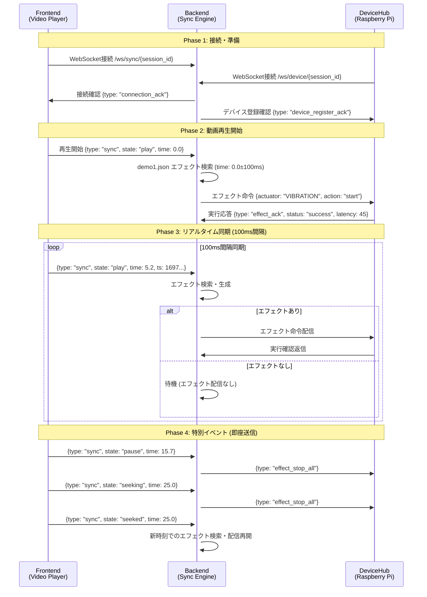

# Phase B-3 技術アーキテクチャ詳細仕様書

## 📋 **概要**
- **作成日**: 2025年10月12日
- **対象**: Phase B-3 リアルタイム動画同期システム
- **参考実装**: receiver.py & ws_video_sync_sender.html
- **技術スタック**: FastAPI + WebSocket + asyncio
- **目標**: ±100ms精度のリアルタイム4D同期体験

---

## 🏗️ **システムアーキテクチャ概要**

### **全体構成図**
```
┌─────────────────────┐    ┌──────────────────────┐    ┌─────────────────────┐
│     Frontend        │    │      Backend         │    │    Device Hub       │
│   (React + HTML5)   │    │     (FastAPI)        │    │  (Raspberry Pi)     │
├─────────────────────┤    ├──────────────────────┤    ├─────────────────────┤
│• HTML5 Video API    │◄──►│• WebSocket Manager   │◄──►│• WebSocket Client   │
│• WebSocket Client   │    │• Sync Engine         │    │• Actuator Control   │
│• 100ms Interval     │    │• Effect Distributor  │    │• Hardware Interface │
│  Sync Transmission  │    │• Device Discovery    │    │• Status Feedback    │
└─────────────────────┘    └──────────────────────┘    └─────────────────────┘
        │                           │                           │
   ┌────▼───────┐              ┌────▼───────┐              ┌────▼───────┐
   │ Sync Data  │              │ Effect     │              │ Actuator   │
   │ {type:sync │              │ Commands   │              │ Execution  │
   │  time:5.2  │              │ {actuator: │              │ {VIBRATION │
   │  state:play}│              │  VIBRATION,│              │  intensity:│
   └────────────┘              │  intensity:│              │  0.8, ...} │
                               │  0.8, ...} │              └────────────┘
                               └────────────┘
```

### **データフロー詳細**


---

## 📡 **WebSocket 通信仕様**

### **接続エンドポイント**
```python
# Frontend (Video Player) 接続
ws://127.0.0.1:8001/api/playback/ws/sync/{session_id}

# Device Hub (Raspberry Pi) 接続  
ws://127.0.0.1:8001/api/playback/ws/device/{session_id}

# ヘルスチェック用
ws://127.0.0.1:8001/api/playback/ws/monitor/{session_id}
```

### **メッセージ形式標準化**

#### **Frontend → Backend (同期メッセージ)**
```javascript
// 基本同期メッセージ (ws_video_sync_sender.html 準拠)
{
  "type": "sync",
  "state": "play" | "pause" | "seeking" | "seeked",
  "time": 5.234,        // 現在再生時刻 (秒, 3桁精度)
  "duration": 33.5,     // 動画総時間 (秒)
  "rate": 1.0,          // 再生速度 (通常1.0)
  "ts": 1697097600123   // クライアント送信タイムスタンプ (ms)
}

// 接続確認メッセージ
{
  "type": "hello", 
  "agent": "video-player",
  "ua": "Mozilla/5.0...",
  "session_id": "session_001",
  "ts": 1697097600123
}

// 設定変更メッセージ
{
  "type": "config",
  "sync_interval": 100,     // ms
  "effect_intensity": 0.8,  // 0.0-1.0
  "enabled_actuators": ["VIBRATION", "WATER", "FLASH"]
}
```

#### **Backend → Device Hub (エフェクト命令)**
```python
# 単一エフェクト命令
{
  "type": "effect",
  "actuator": "VIBRATION",  # VIBRATION|WATER|WIND|FLASH|COLOR
  "action": "start",        # start|stop|pulse
  "intensity": 0.75,        # 0.0-1.0
  "duration": 2000,         # ms
  "mode": "strong",         # normal|gentle|strong|burst
  "sync_time": 5.234,       # 対応する動画時刻
  "command_id": "cmd_001"   # 応答確認用ID
}

# 複数エフェクト同時実行
{
  "type": "effects_batch",
  "effects": [
    {"actuator": "VIBRATION", "action": "start", "intensity": 0.8},
    {"actuator": "WATER", "action": "start", "intensity": 0.6},
    {"actuator": "FLASH", "action": "start", "intensity": 1.0}
  ],
  "sync_time": 8.5,
  "batch_id": "batch_001"
}

# 緊急停止命令
{
  "type": "effect_stop_all",
  "reason": "pause" | "seek" | "stop" | "error",
  "immediate": true
}
```

#### **Device Hub → Backend (応答・状態)**
```python
# エフェクト実行確認
{
  "type": "effect_ack",
  "command_id": "cmd_001", 
  "status": "success" | "failed" | "unsupported",
  "execution_time": 45,     # 実行開始までの遅延 (ms)
  "error_message": null,    # 失敗時のエラー詳細
  "actuator_state": {       # アクチュエーター現在状態
    "VIBRATION": {"active": true, "intensity": 0.75},
    "WATER": {"active": false},
    "temperature": 23.5     # ハードウェア情報
  }
}

# デバイス登録・Pingレスポンス
{
  "type": "device_status",
  "device_id": "raspberrypi_001",
  "capabilities": ["VIBRATION", "WATER", "WIND", "FLASH"],
  "performance": {
    "avg_response_time": 42,   # ms
    "success_rate": 0.98,      # 0.0-1.0
    "uptime": 86400           # seconds
  },
  "hardware": {
    "cpu_usage": 15.2,        # %
    "memory_usage": 45.8,     # %
    "temperature": 42.1       # °C
  }
}
```

---

## ⚙️ **データモデル設計**

### **Pydantic モデル定義**
```python
# app/models/playback.py
from pydantic import BaseModel, Field
from typing import List, Optional, Dict, Union
from datetime import datetime
from enum import Enum

class PlaybackState(str, Enum):
    IDLE = "idle"
    PLAYING = "play" 
    PAUSED = "pause"
    SEEKING = "seeking"
    STOPPED = "stop"
    ERROR = "error"

class ActuatorType(str, Enum):
    VIBRATION = "VIBRATION"
    WATER = "WATER"
    WIND = "WIND" 
    FLASH = "FLASH"
    COLOR = "COLOR"

class SyncMessage(BaseModel):
    """フロントエンド同期メッセージ (ws_video_sync_sender.html 準拠)"""
    type: str = Field(..., description="メッセージタイプ")
    state: Optional[PlaybackState] = None
    time: Optional[float] = Field(None, ge=0, description="再生時刻 (秒)")
    duration: Optional[float] = Field(None, ge=0, description="動画総時間")
    rate: Optional[float] = Field(1.0, gt=0, description="再生速度")
    ts: Optional[int] = Field(None, description="タイムスタンプ (ms)")
    
    # 設定メッセージ用
    sync_interval: Optional[int] = Field(None, ge=50, le=1000)
    effect_intensity: Optional[float] = Field(None, ge=0, le=1)
    enabled_actuators: Optional[List[ActuatorType]] = None

class EffectCommand(BaseModel):
    """デバイスエフェクト命令"""
    type: str = "effect"
    actuator: ActuatorType
    action: str = Field(..., regex="^(start|stop|pulse)$")
    intensity: float = Field(..., ge=0, le=1, description="強度 0.0-1.0")
    duration: int = Field(..., ge=0, description="持続時間 (ms)")
    mode: Optional[str] = Field("normal", description="動作モード")
    sync_time: float = Field(..., description="対応動画時刻")
    command_id: str = Field(..., description="コマンドID")

class EffectAcknowledge(BaseModel):
    """デバイス応答確認"""
    type: str = "effect_ack"
    command_id: str
    status: str = Field(..., regex="^(success|failed|unsupported)$")
    execution_time: int = Field(..., description="実行遅延 (ms)")
    error_message: Optional[str] = None
    actuator_state: Optional[Dict] = None

class DeviceStatus(BaseModel):
    """デバイス状態情報"""
    type: str = "device_status"
    device_id: str
    capabilities: List[ActuatorType]
    performance: Dict[str, Union[int, float]] = {}
    hardware: Dict[str, Union[int, float]] = {}
    last_ping: Optional[datetime] = None

class PlaybackSession(BaseModel):
    """再生セッション管理"""
    session_id: str
    video_id: str
    frontend_connected: bool = False
    device_connected: bool = False
    current_state: PlaybackState = PlaybackState.IDLE
    current_time: float = 0.0
    last_sync_time: float = 0.0
    active_effects: List[EffectCommand] = []
    performance_metrics: Dict[str, float] = {}
```

### **デバイス管理モデル**
```python
# app/models/device.py (既存拡張)
class DeviceCapabilities(BaseModel):
    """デバイス能力定義"""
    actuators: List[ActuatorType]
    max_intensity: Dict[ActuatorType, float] = {}  # アクチュエーター別最大強度
    response_time_ms: int = 50  # 平均応答時間
    concurrent_effects: int = 3  # 同時実行可能エフェクト数

class DeviceConnectionInfo(BaseModel):
    """デバイス接続情報"""
    device_id: str
    websocket_path: str = "/ws/device/{session_id}"
    capabilities: DeviceCapabilities  
    connection_status: str = "disconnected"  # connected|disconnected|error
    last_seen: Optional[datetime] = None
    performance_history: List[Dict] = []  # 過去のパフォーマンス履歴
```

---

## 🔄 **同期エンジン詳細設計**

### **高精度同期アルゴリズム**
```python
# app/sync/sync_engine.py
import asyncio
import time
from typing import Dict, List, Optional

class HighPrecisionSyncEngine:
    def __init__(self):
        self.sync_tolerance_ms = 100  # ±100ms許容範囲
        self.adaptive_tolerance = True
        self.sync_data_cache: Dict[str, Dict] = {}
        self.performance_monitor = SyncPerformanceMonitor()
    
    async def process_sync_message(self, session_id: str, sync_msg: SyncMessage) -> List[EffectCommand]:
        """同期メッセージからエフェクト命令生成"""
        start_time = time.time()
        
        # 1. 同期データ取得 (demo1.json)
        sync_data = await self._get_sync_data(session_id)
        if not sync_data:
            return []
        
        # 2. 現在時刻でのエフェクト検索
        current_time = sync_msg.time or 0.0
        tolerance = await self._calculate_adaptive_tolerance(session_id)
        
        matching_events = []
        for event in sync_data.get("events", []):
            event_time = event.get("t", 0)
            if abs(event_time - current_time) <= tolerance:
                matching_events.append(event)
        
        # 3. エフェクト命令生成
        effect_commands = []
        for event in matching_events:
            command = await self._convert_event_to_command(event, current_time)
            if command:
                effect_commands.append(command)
        
        # 4. パフォーマンス測定
        processing_time = (time.time() - start_time) * 1000
        await self.performance_monitor.record_sync_processing(session_id, processing_time)
        
        return effect_commands
    
    async def _calculate_adaptive_tolerance(self, session_id: str) -> float:
        """適応的許容範囲計算"""
        if not self.adaptive_tolerance:
            return self.sync_tolerance_ms / 1000.0
        
        # 最近のネットワーク遅延から動的調整
        recent_latencies = await self.performance_monitor.get_recent_latencies(session_id)
        if recent_latencies:
            avg_latency = sum(recent_latencies) / len(recent_latencies)
            # 平均遅延の1.5倍、最低100ms、最高500ms
            adaptive_tolerance = max(100, min(500, avg_latency * 1.5))
            return adaptive_tolerance / 1000.0
        
        return self.sync_tolerance_ms / 1000.0
    
    async def _convert_event_to_command(self, event: Dict, sync_time: float) -> Optional[EffectCommand]:
        """demo1.json イベント → エフェクト命令変換"""
        effect_type = event.get("effect")
        action = event.get("action", "start")
        
        # アクチュエーターマッピング (Phase B-2 準拠)
        actuator_mapping = {
            "vibration": ActuatorType.VIBRATION,
            "water": ActuatorType.WATER,
            "wind": ActuatorType.WIND,
            "flash": ActuatorType.FLASH,
            "color": ActuatorType.COLOR
        }
        
        actuator = actuator_mapping.get(effect_type)
        if not actuator:
            return None
        
        return EffectCommand(
            actuator=actuator,
            action=action,
            intensity=event.get("intensity", 0.5),
            duration=event.get("duration", 1000),
            mode=event.get("mode", "normal"),
            sync_time=sync_time,
            command_id=f"{actuator}_{int(sync_time*1000)}_{int(time.time())}"
        )
```

### **エフェクト配信最適化**
```python
# app/sync/effect_distributor.py
class EffectDistributor:
    def __init__(self):
        self.active_effects: Dict[str, List[EffectCommand]] = {}  # session_id -> effects
        self.distribution_queue = asyncio.Queue()
        self.batch_size = 5  # 同時送信効果数
        
    async def distribute_effects(self, session_id: str, effects: List[EffectCommand]):
        """エフェクト配信 (バッチ処理・優先度制御)"""
        if not effects:
            return
        
        # 優先度ソート (緊急性、アクチュエーター種別)
        sorted_effects = self._sort_effects_by_priority(effects)
        
        # バッチ分割配信
        for i in range(0, len(sorted_effects), self.batch_size):
            batch = sorted_effects[i:i + self.batch_size]
            await self._send_effect_batch(session_id, batch)
            
            # バッチ間隔 (デバイス負荷軽減)
            if i + self.batch_size < len(sorted_effects):
                await asyncio.sleep(0.02)  # 20ms間隔
    
    def _sort_effects_by_priority(self, effects: List[EffectCommand]) -> List[EffectCommand]:
        """エフェクト優先度ソート"""
        priority_order = {
            ActuatorType.FLASH: 1,      # 最優先 (視覚効果)
            ActuatorType.VIBRATION: 2,  # 高優先
            ActuatorType.WATER: 3,      # 中優先
            ActuatorType.WIND: 4,       # 中優先
            ActuatorType.COLOR: 5       # 低優先
        }
        
        return sorted(effects, key=lambda e: (
            priority_order.get(e.actuator, 10),  # アクチュエーター優先度
            e.action != "start",                 # start優先
            -e.intensity                         # 高強度優先
        ))
    
    async def _send_effect_batch(self, session_id: str, batch: List[EffectCommand]):
        """エフェクトバッチ送信"""
        device_ws = await self._get_device_websocket(session_id)
        if not device_ws:
            return
        
        if len(batch) == 1:
            # 単一エフェクト
            await device_ws.send_text(batch[0].json())
        else:
            # バッチエフェクト
            batch_message = {
                "type": "effects_batch",
                "effects": [effect.dict() for effect in batch],
                "batch_id": f"batch_{session_id}_{int(time.time())}"
            }
            await device_ws.send_text(json.dumps(batch_message))
```

---

## 🔌 **WebSocket接続管理**

### **接続プール最適化**
```python
# app/websocket/connection_manager.py
class OptimizedWebSocketManager:
    def __init__(self):
        self.connections = {
            "frontend": {},  # session_id -> WebSocket
            "device": {},    # session_id -> WebSocket
            "monitor": {}    # session_id -> WebSocket (管理用)
        }
        self.connection_metadata = {}  # 接続メタデータ
        self.heartbeat_tasks: Dict[str, asyncio.Task] = {}
        
    async def register_frontend(self, session_id: str, websocket: WebSocket):
        """フロントエンド接続登録 (receiver.py 方式応用)"""
        await websocket.accept()
        
        # 既存接続チェック・クリーンアップ
        await self._cleanup_existing_connection("frontend", session_id)
        
        # 新規接続登録
        self.connections["frontend"][session_id] = websocket
        self.connection_metadata[f"frontend_{session_id}"] = {
            "connected_at": time.time(),
            "message_count": 0,
            "last_activity": time.time(),
            "client_info": {}
        }
        
        # ハートビート開始
        self.heartbeat_tasks[f"frontend_{session_id}"] = asyncio.create_task(
            self._heartbeat_monitor(websocket, f"frontend_{session_id}")
        )
        
        # メッセージハンドリング (receiver.py スタイル)
        try:
            async for message in websocket:
                await self._handle_frontend_message(session_id, message)
        except Exception as e:
            logger.error(f"Frontend {session_id} error: {e}")
        finally:
            await self._cleanup_connection("frontend", session_id)
    
    async def register_device(self, session_id: str, websocket: WebSocket):
        """デバイス接続登録"""
        await websocket.accept()
        
        # デバイス固有の登録処理
        self.connections["device"][session_id] = websocket
        
        # デバイス能力情報取得
        await self._request_device_capabilities(websocket)
        
        try:
            async for message in websocket:
                await self._handle_device_message(session_id, message)
        except Exception as e:
            logger.error(f"Device {session_id} error: {e}")
        finally:
            await self._cleanup_connection("device", session_id)
    
    async def _heartbeat_monitor(self, websocket: WebSocket, connection_id: str):
        """ハートビート監視"""
        while connection_id in self.connection_metadata:
            try:
                # Ping送信
                ping_message = {
                    "type": "ping",
                    "timestamp": time.time(),
                    "connection_id": connection_id
                }
                await websocket.send_text(json.dumps(ping_message))
                
                # 30秒間隔
                await asyncio.sleep(30)
                
                # 最後の活動時刻チェック
                last_activity = self.connection_metadata[connection_id]["last_activity"]
                if time.time() - last_activity > 120:  # 2分無活動で切断
                    logger.warning(f"Connection {connection_id} inactive, disconnecting")
                    break
                    
            except Exception as e:
                logger.error(f"Heartbeat error for {connection_id}: {e}")
                break
    
    async def send_to_frontend(self, session_id: str, message: Dict):
        """フロントエンド送信 (エラーハンドリング強化)"""
        if session_id not in self.connections["frontend"]:
            logger.warning(f"Frontend connection {session_id} not found")
            return False
        
        try:
            websocket = self.connections["frontend"][session_id]
            await websocket.send_text(json.dumps(message))
            
            # 統計更新
            if f"frontend_{session_id}" in self.connection_metadata:
                self.connection_metadata[f"frontend_{session_id}"]["message_count"] += 1
                self.connection_metadata[f"frontend_{session_id}"]["last_activity"] = time.time()
            
            return True
        except Exception as e:
            logger.error(f"Failed to send to frontend {session_id}: {e}")
            await self._cleanup_connection("frontend", session_id)
            return False
```

---

## 📊 **パフォーマンス監視・最適化**

### **リアルタイムメトリクス収集**
```python
# app/monitoring/performance_monitor.py
import statistics
from collections import deque
from dataclasses import dataclass
from typing import Deque, Dict, List

@dataclass
class PerformanceMetrics:
    avg_sync_latency: float      # 平均同期遅延 (ms)
    p95_sync_latency: float      # 95パーセンタイル遅延
    effect_processing_time: float # エフェクト処理時間 (ms)
    device_response_time: float   # デバイス応答時間 (ms)
    sync_accuracy: float          # 同期精度 (±ms内の割合)
    message_throughput: float     # メッセージ スループット (msg/s)

class SyncPerformanceMonitor:
    def __init__(self, max_samples: int = 1000):
        self.max_samples = max_samples
        self.session_metrics: Dict[str, Dict] = {}
        # セッション別メトリクス履歴
    
    async def record_sync_processing(self, session_id: str, processing_time: float):
        """同期処理時間記録"""
        if session_id not in self.session_metrics:
            self._initialize_session_metrics(session_id)
        
        metrics = self.session_metrics[session_id]
        metrics["sync_processing_times"].append(processing_time)
        
        # サンプル数制限
        if len(metrics["sync_processing_times"]) > self.max_samples:
            metrics["sync_processing_times"].popleft()
    
    async def record_effect_distribution(self, session_id: str, distribution_time: float, effect_count: int):
        """エフェクト配信時間記録"""
        metrics = self.session_metrics.get(session_id, {})
        if "effect_distributions" not in metrics:
            metrics["effect_distributions"] = deque(maxlen=self.max_samples)
        
        metrics["effect_distributions"].append({
            "time": distribution_time,
            "effect_count": effect_count,
            "timestamp": time.time()
        })
    
    async def record_device_response(self, session_id: str, command_id: str, response_time: float, success: bool):
        """デバイス応答記録"""
        metrics = self.session_metrics.get(session_id, {})
        if "device_responses" not in metrics:
            metrics["device_responses"] = deque(maxlen=self.max_samples)
        
        metrics["device_responses"].append({
            "command_id": command_id,
            "response_time": response_time,
            "success": success,
            "timestamp": time.time()
        })
    
    def calculate_performance_metrics(self, session_id: str) -> Optional[PerformanceMetrics]:
        """パフォーマンス統計計算"""
        if session_id not in self.session_metrics:
            return None
        
        metrics = self.session_metrics[session_id]
        
        # 同期処理時間統計
        sync_times = list(metrics.get("sync_processing_times", []))
        if not sync_times:
            return None
        
        avg_sync_latency = statistics.mean(sync_times)
        p95_sync_latency = statistics.quantiles(sync_times, n=20)[18] if len(sync_times) >= 20 else max(sync_times)
        
        # デバイス応答時間統計
        device_responses = list(metrics.get("device_responses", []))
        if device_responses:
            response_times = [r["response_time"] for r in device_responses]
            success_rate = sum(r["success"] for r in device_responses) / len(device_responses)
            avg_device_response = statistics.mean(response_times)
        else:
            avg_device_response = 0
            success_rate = 0
        
        return PerformanceMetrics(
            avg_sync_latency=avg_sync_latency,
            p95_sync_latency=p95_sync_latency,
            effect_processing_time=avg_sync_latency,  # 簡単のため同値
            device_response_time=avg_device_response,
            sync_accuracy=success_rate,
            message_throughput=self._calculate_throughput(session_id)
        )
    
    def _calculate_throughput(self, session_id: str) -> float:
        """メッセージスループット計算 (msg/s)"""
        metrics = self.session_metrics.get(session_id, {})
        sync_times = metrics.get("sync_processing_times", [])
        
        if len(sync_times) < 2:
            return 0
        
        # 直近10秒間のメッセージ数
        recent_count = len([t for t in sync_times if time.time() - t < 10])
        return recent_count / 10.0
```

### **動的最適化アルゴリズム**
```python
# app/optimization/adaptive_optimizer.py
class AdaptiveSyncOptimizer:
    def __init__(self):
        self.performance_monitor = SyncPerformanceMonitor()
        self.optimization_rules = {
            "high_latency": self._optimize_for_latency,
            "low_accuracy": self._optimize_for_accuracy,
            "high_load": self._optimize_for_throughput
        }
    
    async def optimize_session(self, session_id: str):
        """セッション動的最適化"""
        metrics = self.performance_monitor.calculate_performance_metrics(session_id)
        if not metrics:
            return
        
        # 最適化必要性判定
        optimizations = []
        
        if metrics.avg_sync_latency > 150:  # 150ms以上で高遅延
            optimizations.append("high_latency")
        
        if metrics.sync_accuracy < 0.9:  # 90%以下で精度不足
            optimizations.append("low_accuracy")  
        
        if metrics.message_throughput > 50:  # 50msg/s以上で高負荷
            optimizations.append("high_load")
        
        # 最適化実行
        for optimization in optimizations:
            await self.optimization_rules[optimization](session_id, metrics)
    
    async def _optimize_for_latency(self, session_id: str, metrics: PerformanceMetrics):
        """遅延最適化"""
        # 1. 同期間隔を動的調整
        current_interval = await self._get_sync_interval(session_id)
        if current_interval < 200:  # 200ms未満なら延長
            new_interval = min(500, current_interval * 1.5)
            await self._update_sync_interval(session_id, new_interval)
            
        # 2. エフェクト複雑性削減
        await self._reduce_effect_complexity(session_id)
    
    async def _optimize_for_accuracy(self, session_id: str, metrics: PerformanceMetrics):
        """精度最適化"""
        # 1. 許容範囲を狭める
        current_tolerance = await self._get_sync_tolerance(session_id)
        new_tolerance = max(50, current_tolerance * 0.8)
        await self._update_sync_tolerance(session_id, new_tolerance)
        
        # 2. 同期頻度を上げる
        current_interval = await self._get_sync_interval(session_id)
        new_interval = max(50, current_interval * 0.8)
        await self._update_sync_interval(session_id, new_interval)
```

---

## 🧪 **テスト・検証戦略**

### **自動化テストスイート**
```python
# tests/test_phase3_comprehensive.py
import pytest
import asyncio
import json
import time
from fastapi.testclient import TestClient
from app.main import app

class TestPhaseB3Comprehensive:
    
    @pytest.fixture
    def setup_test_environment(self):
        """テスト環境セットアップ"""
        self.client = TestClient(app)
        self.test_session_id = "test_session_b3_001"
        self.mock_device_id = "mock_device_b3_001"
        
    async def test_realtime_sync_accuracy(self):
        """リアルタイム同期精度テスト"""
        accuracy_results = []
        
        # 100回同期テスト
        for i in range(100):
            sync_time = i * 0.1  # 0.1秒刻み
            
            start_timestamp = time.time() * 1000
            
            # 同期メッセージ送信
            with self.client.websocket_connect(f"/api/playback/ws/sync/{self.test_session_id}") as ws:
                sync_message = {
                    "type": "sync", 
                    "state": "play",
                    "time": sync_time,
                    "ts": int(start_timestamp)
                }
                ws.send_json(sync_message)
                
                # 応答測定
                response = ws.receive_json()
                end_timestamp = time.time() * 1000
                
                latency = end_timestamp - start_timestamp
                accuracy_results.append(latency)
        
        # 精度評価
        avg_latency = sum(accuracy_results) / len(accuracy_results)
        within_100ms = sum(1 for l in accuracy_results if l <= 100) / len(accuracy_results)
        
        assert avg_latency < 100, f"Average latency {avg_latency}ms exceeds 100ms target"
        assert within_100ms >= 0.95, f"Only {within_100ms*100}% within 100ms target"
    
    async def test_device_discovery_integration(self):
        """デバイス検出統合テスト"""
        
        # Mock デバイス接続
        with self.client.websocket_connect(f"/api/playback/ws/device/{self.test_session_id}") as device_ws:
            # デバイス登録
            device_ws.send_json({
                "type": "device_register",
                "device_id": self.mock_device_id,
                "capabilities": ["VIBRATION", "WATER", "FLASH", "WIND", "COLOR"]
            })
            
            # 登録確認
            response = device_ws.receive_json()
            assert response["type"] == "device_register_ack"
            
            # アクティブデバイス確認API
            devices_response = self.client.get("/api/preparation/devices/active")
            assert devices_response.status_code == 200
            
            devices = devices_response.json()
            assert len(devices) >= 1
            assert any(d["device_id"] == self.mock_device_id for d in devices)
    
    async def test_stress_concurrent_sessions(self):
        """並行セッション負荷テスト"""
        session_count = 10
        concurrent_tasks = []
        
        for i in range(session_count):
            session_id = f"stress_session_{i:03d}"
            task = asyncio.create_task(self._simulate_session_activity(session_id))
            concurrent_tasks.append(task)
        
        # 全セッション並行実行
        results = await asyncio.gather(*concurrent_tasks, return_exceptions=True)
        
        # 結果検証
        success_count = sum(1 for r in results if not isinstance(r, Exception))
        success_rate = success_count / session_count
        
        assert success_rate >= 0.9, f"Only {success_rate*100}% sessions succeeded under load"
    
    async def _simulate_session_activity(self, session_id: str):
        """セッション活動シミュレーション"""
        with self.client.websocket_connect(f"/api/playback/ws/sync/{session_id}") as ws:
            # 60秒間、100ms間隔でメッセージ送信
            for i in range(600):
                sync_message = {
                    "type": "sync",
                    "state": "play", 
                    "time": i * 0.1,
                    "ts": int(time.time() * 1000)
                }
                ws.send_json(sync_message)
                await asyncio.sleep(0.1)
```

### **パフォーマンス ベンチマーク**
```bash
# benchmark/sync_benchmark.py
import asyncio
import time
import statistics
from concurrent.futures import ThreadPoolExecutor

class SyncPerformanceBenchmark:
    async def run_latency_benchmark(self):
        """遅延ベンチマーク"""
        latencies = []
        
        for _ in range(1000):
            start = time.time()
            
            # 同期処理シミュレーション
            await self._simulate_sync_processing()
            
            end = time.time()
            latencies.append((end - start) * 1000)  # ms
        
        return {
            "avg_latency": statistics.mean(latencies),
            "median_latency": statistics.median(latencies), 
            "p95_latency": statistics.quantiles(latencies, n=20)[18],
            "max_latency": max(latencies)
        }
    
    async def run_throughput_benchmark(self):
        """スループット ベンチマーク"""
        duration = 60  # 60秒
        message_count = 0
        
        start_time = time.time()
        while time.time() - start_time < duration:
            await self._simulate_sync_processing()
            message_count += 1
        
        throughput = message_count / duration
        return {"throughput_msg_per_sec": throughput}
```

---

## 📋 **実装チェックリスト詳細**

### **Day 1-2: WebSocket同期基盤実装**
- [ ] 🔌 **WebSocket接続管理**
  - [ ] フロントエンド接続ハンドラー (`/ws/sync/{session_id}`)
  - [ ] デバイス接続ハンドラー (`/ws/device/{session_id}`)
  - [ ] 接続プール管理 (receiver.py パターン適用)
  - [ ] ハートビート監視 (30秒間隔ping/pong)

- [ ] 📨 **メッセージ処理システム**
  - [ ] 同期メッセージパースing (ws_video_sync_sender.html 形式)
  - [ ] メッセージタイプ別ルーティング
  - [ ] エラーハンドリング・検証
  - [ ] 接続状態管理

- [ ] 🎯 **同期エンジン実装**
  - [ ] demo1.json 読み込み・キャッシュ
  - [ ] 時刻ベースエフェクト検索 (±100ms許容)
  - [ ] 適応的許容範囲計算
  - [ ] エフェクト命令生成

### **Day 3-4: 実デバイス検出システム実装**
- [ ] 📡 **デバイス検出サービス**
  - [ ] WebSocket接続プール管理
  - [ ] アクティブデバイス監視
  - [ ] デバイス能力情報取得・検証
  - [ ] 接続状態追跡

- [ ] ❤️ **デバイスヘルス監視**
  - [ ] ping/pong 通信テスト
  - [ ] 応答時間測定・記録
  - [ ] 自動切断・復旧処理
  - [ ] パフォーマンス履歴管理

- [ ] 🔗 **準備処理サービス統合**
  - [ ] Mock→実デバイス検出置き換え
  - [ ] 既存API互換性維持
  - [ ] エラーハンドリング強化
  - [ ] 統合テスト

### **Day 5-6: 再生制御API実装**
- [ ] 🎮 **基本API エンドポイント**
  - [ ] `POST /api/playback/start/{session_id}`
  - [ ] `POST /api/playback/stop/{session_id}`
  - [ ] `GET /api/playback/status/{session_id}`
  - [ ] WebSocket エンドポイント統合

- [ ] 📊 **データモデル完成**
  - [ ] Pydantic モデル定義 (`playback.py`)
  - [ ] バリデーション・型安全性
  - [ ] API レスポンス形式標準化
  - [ ] エラー応答設計

- [ ] ⚙️ **セッション状態管理**
  - [ ] 再生セッション管理
  - [ ] 状態遷移制御
  - [ ] メタデータ管理
  - [ ] クリーンアップ処理

### **Day 7: 統合テスト・最適化**
- [ ] 🧪 **包括的テスト**
  - [ ] エンドツーエンド同期テスト
  - [ ] 並行セッション負荷テスト
  - [ ] デバイス検出統合テスト
  - [ ] パフォーマンス ベンチマーク

- [ ] ⚡ **パフォーマンス最適化**
  - [ ] 同期精度向上 (目標±100ms)
  - [ ] WebSocket接続最適化
  - [ ] エフェクト配信バッチ処理
  - [ ] メモリ・CPU使用量最適化

- [ ] 🐛 **品質向上**
  - [ ] バグ修正・安定性向上
  - [ ] エラーハンドリング強化
  - [ ] ログ・監視強化
  - [ ] ドキュメント更新

---

**作成者**: 開発チーム  
**レビュー状況**: Phase B-3 技術アーキテクチャ策定完了  
**実装準備状況**: 開発開始準備完了  
**次期マイルストーン**: Phase B-3 実装開始 (2025年10月12日)