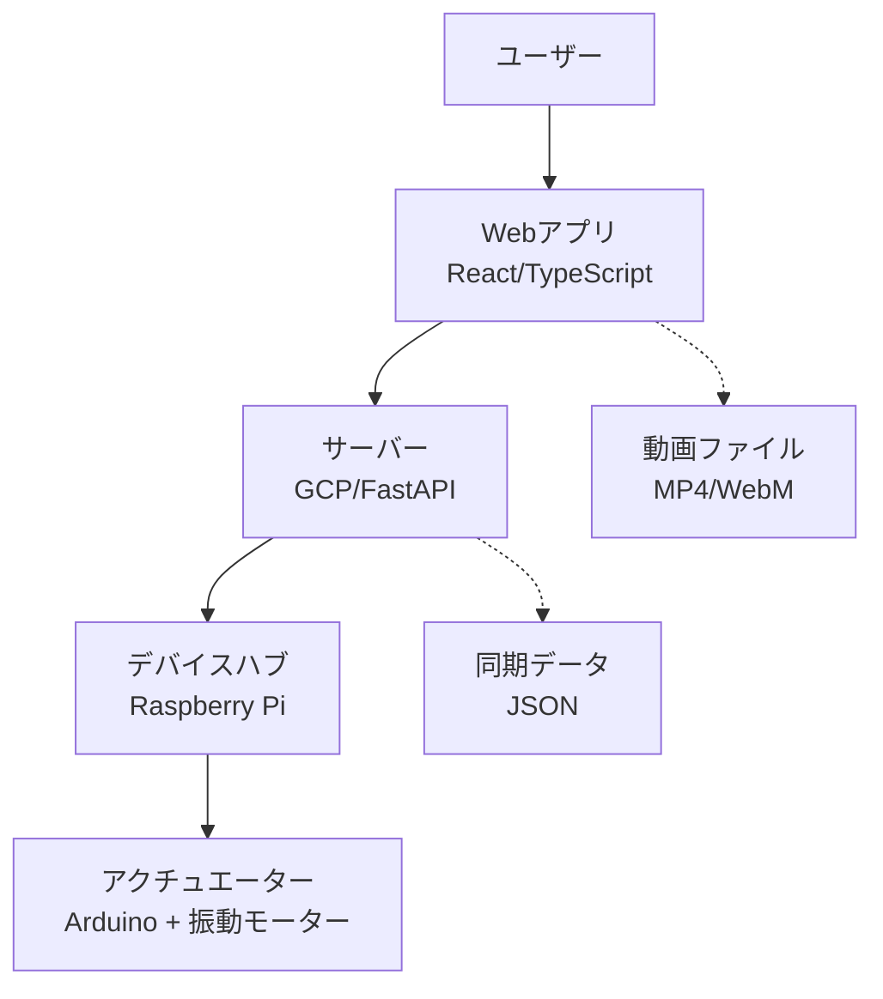

# 4DX@HOME プロジェクト概要仕様書

## 1. プロジェクト基本情報

### 1.1 プロジェクト名
**4DX@HOME** - 手のひらサイズの4DXシアター

### 1.2 開発コンテキスト
- **イベント**: JPHACKS 2025 ハッカソン
- **テーマ**: "X-Tech 2025" ~ Live Real. Hack the Future ~
- **技術領域**: スマホ視聴体験 × リアルタイム触覚技術

### 1.3 プロジェクト期間
- **開発期間**: 2025年10月-11月
- **最終発表**: JPHACKS 2025本選

## 2. プロジェクトコンセプト

### 2.1 基本コンセプト
スマートフォンでの動画視聴体験を「観る」から「体感する」へと革新するシステム。AIが映像を解析して生成した同期データに基づき、動画と物理デバイス（振動、香りなど）をリアルタイムに連携させ、「手のひらサイズの4DXシアター」を実現する。

### 2.2 提供価値
- **没入感の創出**: スマホの小さい画面では得にくい没入感を、触覚などの物理フィードバックで補完
- **体験の個別化**: コンテンツごとに最適化された物理体験を提供し、作品の価値を最大化
- **手軽な導入**: 大掛かりな機材が置けない環境でも、Bluetoothイヤホンのような手軽さで導入可能

### 2.3 革新性
- **リアルタイム同期**: 動画再生と物理デバイスのミリ秒単位での高精度同期
- **コンパクト設計**: 従来の4DXシアターを手のひらサイズに凝縮
- **AI連携**: 将来的には映像解析AIによる自動同期データ生成

## 3. ターゲットユーザー

### 3.1 ペルソナ
**佐藤 結衣（22歳、大学生）**
- 視聴デバイス: スマホがメイン
- 興味: アニメ、アーティストのライブ映像、「推し活」
- ニーズ: 自室で手軽に、好きなコンテンツへの没入感を最大化したい

### 3.2 解決する課題
1. **体験の限界**: スマホの小さい画面では得にくい没入感
2. **体験の画一化**: コンテンツに関係なく同じ視聴体験
3. **機材の制約**: 大掛かりな機材が置けない環境

## 4. システム全体概要

### 4.1 システム構成

### 4.2 通信方式
- **全通信**: WSS (WebSocket Secure) による暗号化通信
- **認証**: セッションコード方式（ユーザー認証なし）
- **同期**: Webアプリからの継続的なタイムスタンプ送信

### 4.3 セッション管理フロー
1. **デバイス起動**: ラズパイがサーバーに接続、セッションコード発行
2. **ペアリング**: ユーザーがWebアプリでコード入力
3. **体験設定**: ユーザーが体験種類（振動、香りなど）を選択
4. **同期開始**: 動画再生と同時にリアルタイム同期開始

## 5. 技術スタック

### 5.1 フロントエンド
- **フレームワーク**: React 18 + TypeScript
- **ビルドツール**: Vite
- **通信**: WebSocket API
- **動画再生**: HTML5 Video API

### 5.2 バックエンド
- **フレームワーク**: FastAPI (Python)
- **インフラ**: Google Cloud Platform (Cloud Run)
- **通信**: WebSocket (websockets library)
- **データ**: JSON形式の同期データ

### 5.3 ハードウェア
- **デバイスハブ**: Raspberry Pi 4 + Python
- **アクチュエーター**: Arduino Uno + 振動モーター
- **通信**: USB Serial (ラズパイ ↔ Arduino)

## 6. 開発フェーズ

### 6.1 MVP（最小実行可能製品）
- **対象**: 1つの動画 + 振動体験のみ
- **デバイス**: 1台のラズパイ + Arduino構成
- **機能**: 基本的なセッション管理と同期再生

### 6.2 将来拡張
- **多体験対応**: 香り、温度、風などの複数体験
- **AI連携**: 映像解析による自動同期データ生成
- **マルチデバイス**: 複数デバイスの同時制御
- **コンテンツ拡張**: 映画、ゲーム、VR等への対応

## 7. 成功指標（KPI）

### 7.1 技術指標
- **同期精度**: ±50ms以内での同期実現
- **レスポンス時間**: セッション確立 < 3秒
- **安定性**: 10分間の連続動作（エラー率 < 1%）

### 7.2 体験指標
- **没入感向上**: ユーザーテストでの体験評価 4.0/5.0以上
- **使いやすさ**: セッション開始から再生まで < 30秒
- **デバイス認識**: セッションコード入力成功率 > 95%

## 8. リスクと対策

### 8.1 技術リスク
| リスク | 影響度 | 対策 |
|--------|--------|------|
| WebSocket接続不安定 | 高 | 自動再接続機能、接続状態監視 |
| 同期ズレ | 高 | タイムスタンプベースの補正機能 |
| ハードウェア故障 | 中 | 予備機材準備、モジュール化設計 |

### 8.2 スケジュールリスク
| リスク | 影響度 | 対策 |
|--------|--------|------|
| 開発遅延 | 高 | MVP優先、機能の段階的実装 |
| 機材調達遅れ | 中 | 早期発注、代替部品リスト準備 |
| 統合テスト問題 | 中 | 各コンポーネントの単体テスト徹底 |

## 9. プロジェクト体制

### 9.1 開発チーム構成
- **フロントエンド**: React/TypeScript開発者
- **バックエンド**: Python/FastAPI開発者
- **ハードウェア**: ラズパイ/Arduino開発者
- **システム設計**: 全体アーキテクチャ設計者

### 9.2 コミュニケーション
- **開発管理**: GitHub Issues & Projects
- **コードレビュー**: Pull Request必須
- **進捗共有**: 週次スタンドアップミーティング

## 10. 次ステップ

### 10.1 即時対応項目
1. **環境構築**: 各開発環境のセットアップ
2. **プロトタイプ**: 基本通信フローの実装
3. **ハードウェア調達**: 必要部品の発注

### 10.2 週次マイルストーン
- **Week 1**: 基本システム構築
- **Week 2**: 通信・同期機能実装
- **Week 3**: ハードウェア統合
- **Week 4**: テスト・デバッグ・デモ準備

---

**更新日**: 2025年10月11日  
**バージョン**: 1.0  
**作成者**: 4DX@HOME開発チーム