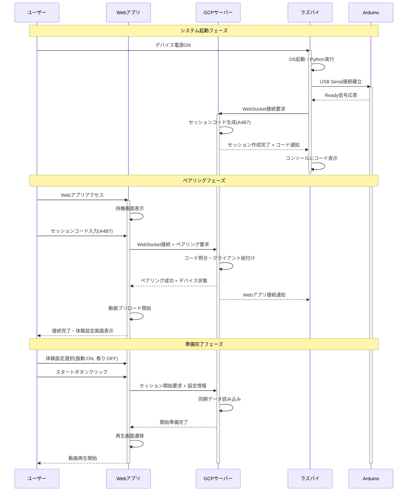
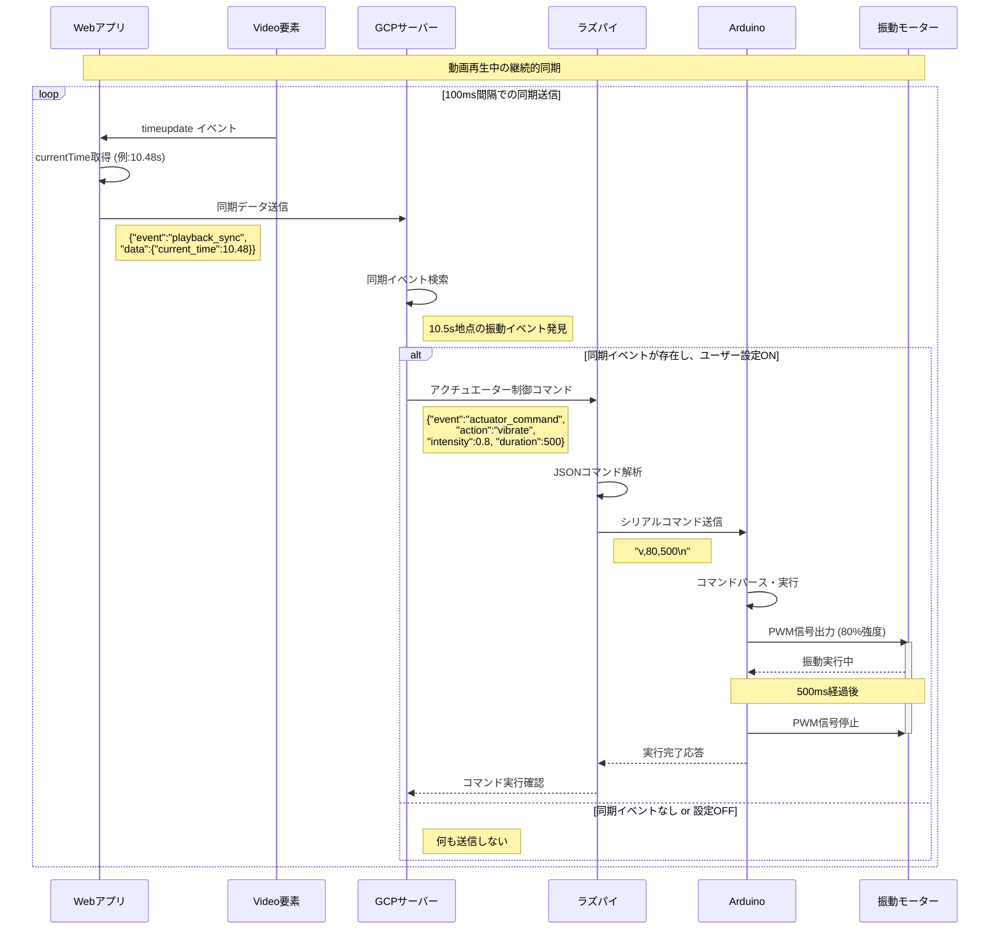
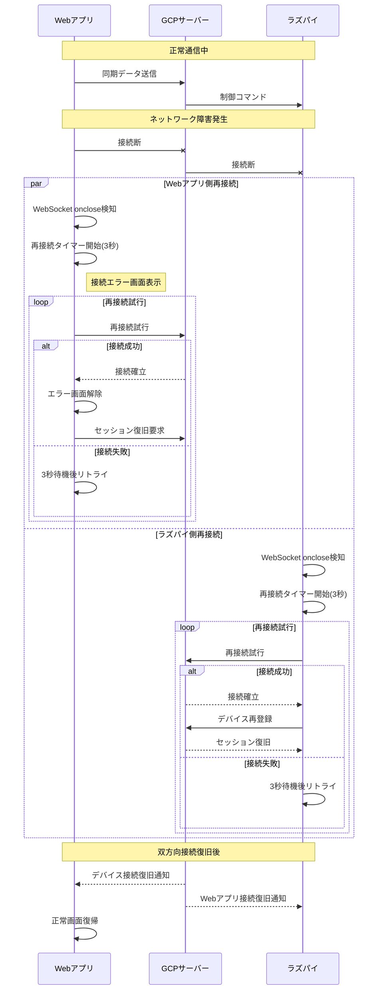
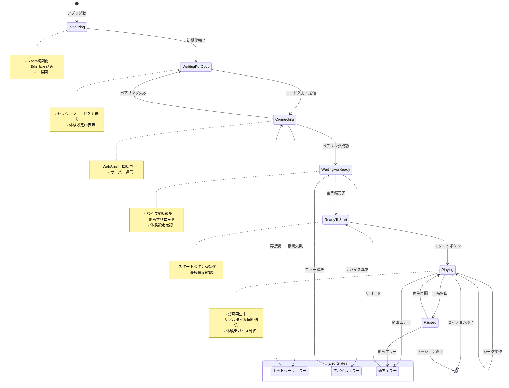
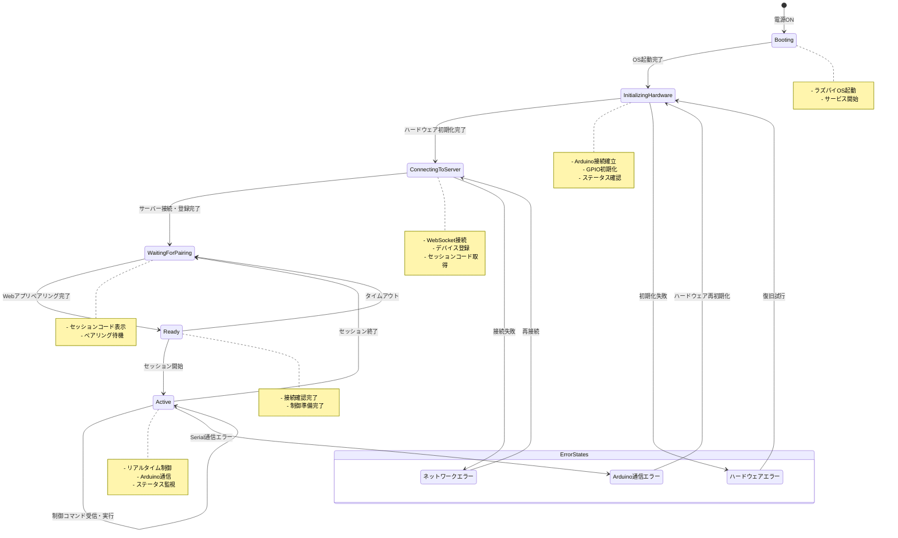
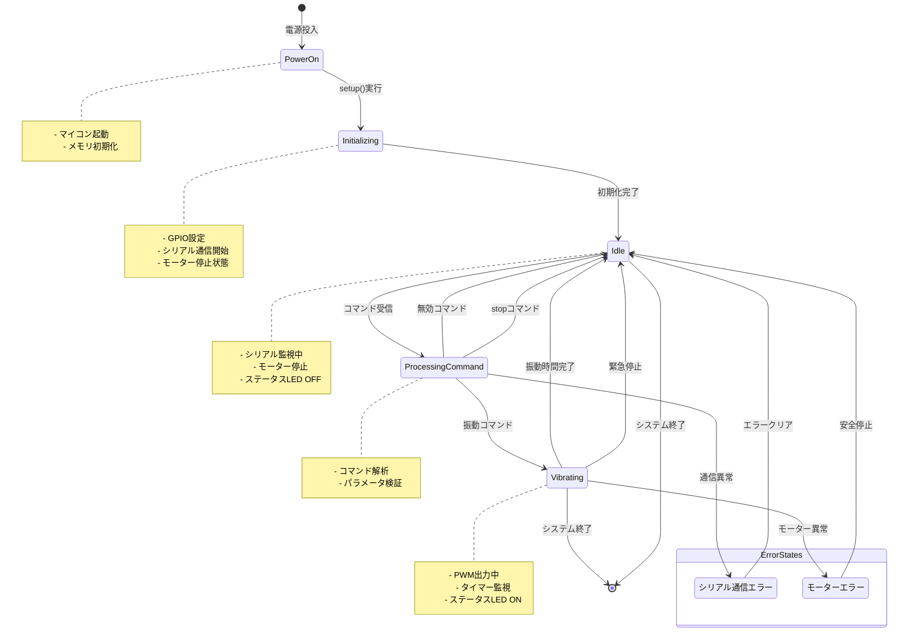
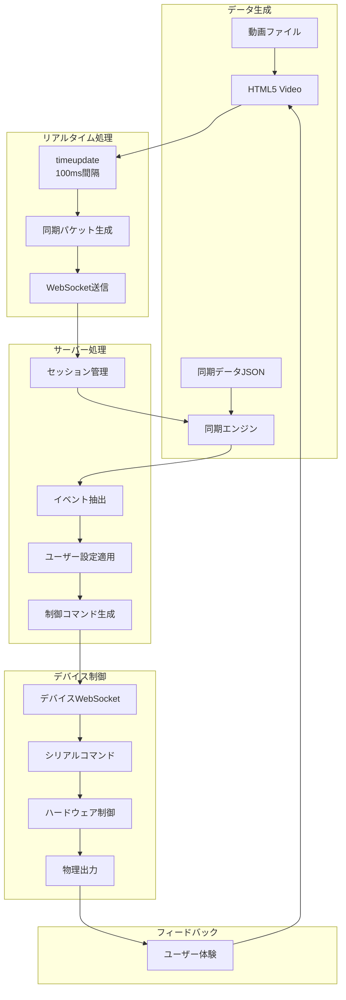
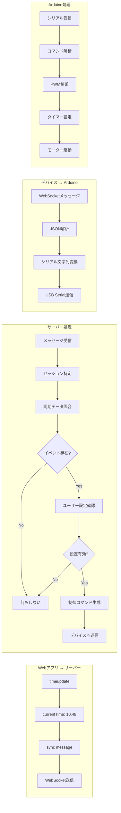
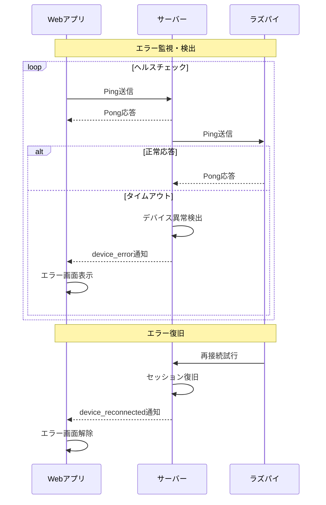

# 4DX@HOME システム設計書

## 1. システム設計概要

### 1.1 アーキテクチャ概要
4DX@HOMEは、Webアプリ、GCPサーバー、デバイスハブ（ラズパイ）、アクチュエーター（Arduino）の4層構成で、WebSocket通信によるリアルタイム同期システムを実現します。

### 1.2 設計原則
- **低遅延**: 50ms以内での同期精度実現
- **可用性**: 自動再接続機能による高可用性
- **拡張性**: モジュラー設計による機能追加容易性
- **セキュリティ**: WSS通信による安全な通信経路
- **運用性**: ログ・監視機能による運用支援

## 2. システム全体構成図

```mermaid
graph TB
    subgraph "User Environment"
        User[ユーザー]
        WebApp[Webアプリ<br/>React/TypeScript]
        Device[4DX@HOMEデバイス]
    end
    
    subgraph "Cloud Infrastructure"
        GCP[GCPサーバー<br/>FastAPI/WebSocket]
        LB[Load Balancer]
        Monitor[監視・ログ]
    end
    
    subgraph "Device Hardware"
        RaspberryPi[ラズパイ<br/>デバイスハブ]
        Arduino[Arduino<br/>制御基板]
        Actuators[アクチュエーター<br/>振動・香り等]
    end
    
    User --> WebApp
    WebApp -.WSS.-> LB
    LB --> GCP
    GCP --> Monitor
    GCP -.WSS.-> RaspberryPi
    RaspberryPi -.USB Serial.-> Arduino
    Arduino --> Actuators
    Actuators -.物理フィードバック.-> User
```

## 3. 詳細シーケンス図

### 3.1 システム初期化・セッション確立



### 3.2 リアルタイム同期処理



### 3.3 エラー処理・再接続シーケンス



## 4. 状態遷移図

### 4.1 Webアプリケーション状態遷移



### 4.2 デバイスハブ（ラズパイ）状態遷移



### 4.3 Arduino制御装置状態遷移



## 5. データフロー図

### 5.1 同期データフロー



### 5.2 メッセージフロー詳細



## 6. エラーハンドリング設計

### 6.1 エラー分類と対応戦略

| エラーレベル | エラー種別 | 検出方法 | 対応戦略 | 復旧方法 |
|--------------|------------|----------|----------|----------|
| Critical | サーバーダウン | WebSocket接続失敗 | 即座にエラー表示 | 自動再接続 |
| High | デバイス切断 | ハートビート応答なし | デバイスエラー表示 | 手動再接続 |
| Medium | 同期ずれ | タイムスタンプ比較 | 警告表示・補正 | 自動補正 |
| Low | 一時的通信遅延 | レスポンス遅延 | 内部で吸収 | 自動リトライ |

### 6.2 エラー検出・通知フロー



## 7. パフォーマンス設計

### 7.1 レスポンス時間要件

| 処理項目 | 目標時間 | 計測ポイント | 最大許容時間 |
|----------|----------|--------------|--------------|
| セッション確立 | < 2秒 | コード入力〜ペアリング完了 | 5秒 |
| 同期精度 | ± 50ms | 動画時刻〜物理出力 | ± 100ms |
| 制御応答 | < 100ms | コマンド送信〜実行開始 | 200ms |
| 再接続時間 | < 3秒 | 切断検出〜再接続完了 | 10秒 |

### 7.2 スループット設計

```
通信頻度設計:
├── Webアプリ → サーバー
│   ├── 同期メッセージ: 10 msg/sec (100ms間隔)
│   ├── 制御イベント: 5 msg/sec (ユーザー操作)
│   └── ヘルスチェック: 0.033 msg/sec (30秒間隔)
├── サーバー → デバイス  
│   ├── 制御コマンド: 最大 5 cmd/sec
│   ├── ステータス要求: 1 req/sec
│   └── ヘルスチェック: 0.033 msg/sec
└── デバイス内部
    ├── Serial通信: 9600 bps
    ├── PWM更新: 1000 Hz
    └── タイマー精度: 1ms
```

## 8. セキュリティ設計

### 8.1 セキュリティ脅威と対策

| 脅威 | リスクレベル | 対策 | 実装方法 |
|------|--------------|------|----------|
| 通信傍受 | High | 暗号化通信 | WSS (TLS 1.3) |
| セッション乗っ取り | Medium | セッションコード | ランダム生成・有効期限 |
| DDoS攻撃 | Medium | レート制限 | API Gateway制限 |
| 物理デバイス悪用 | Low | 緊急停止機能 | ハードウェア安全装置 |

### 8.2 セキュリティ実装詳細

```python
# セッションコード生成（セキュリティ考慮）
import secrets
import string

def generate_session_code(length: int = 4) -> str:
    # 暗号学的に安全な乱数生成
    alphabet = string.ascii_uppercase + string.digits
    # 紛らわしい文字を除外 (0, O, I, 1など)
    alphabet = alphabet.replace('0', '').replace('O', '').replace('I', '').replace('1', '')
    return ''.join(secrets.choice(alphabet) for _ in range(length))

# レート制限実装
from collections import defaultdict
import time

class RateLimiter:
    def __init__(self, max_requests: int, window_seconds: int):
        self.max_requests = max_requests
        self.window_seconds = window_seconds
        self.requests = defaultdict(list)
    
    def is_allowed(self, client_id: str) -> bool:
        now = time.time()
        client_requests = self.requests[client_id]
        
        # 古いリクエスト削除
        while client_requests and client_requests[0] < now - self.window_seconds:
            client_requests.pop(0)
        
        # レート制限チェック
        if len(client_requests) >= self.max_requests:
            return False
        
        client_requests.append(now)
        return True
```

## 9. 監視・運用設計

### 9.1 監視項目

```yaml
監視カテゴリ:
  システムメトリクス:
    - CPU使用率 (ラズパイ)
    - メモリ使用率
    - ネットワーク遅延
    - WebSocket接続数
  
  アプリケーションメトリクス:
    - セッション成功率
    - 同期精度 (遅延分布)
    - エラー発生率
    - デバイス稼働率
  
  ビジネスメトリクス:
    - アクティブセッション数
    - 平均セッション時間
    - ユーザー体験満足度
    - デバイス利用率
```

### 9.2 ログ設計

```json
// 構造化ログ形式
{
  "timestamp": "2025-10-11T10:30:00.123Z",
  "level": "INFO",
  "service": "device-hub",
  "session_id": "ses_1234567890",
  "event": "actuator_command_executed",
  "data": {
    "command": "vibrate",
    "intensity": 80,
    "duration": 500,
    "execution_time_ms": 23,
    "success": true
  },
  "trace_id": "trace_abcd1234"
}
```

---

**更新日**: 2025年10月11日  
**バージョン**: 1.0  
**システム設計責任者**: 4DX@HOME開発チーム